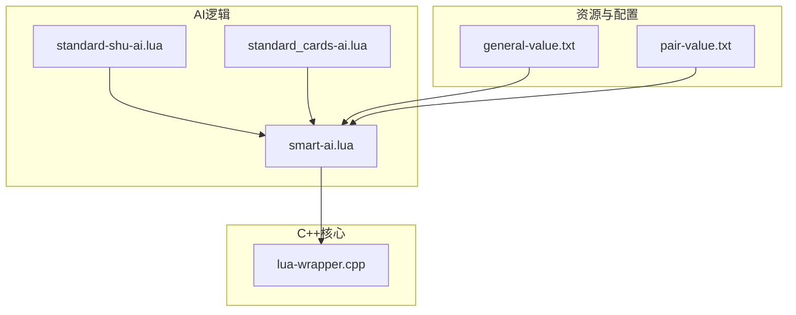
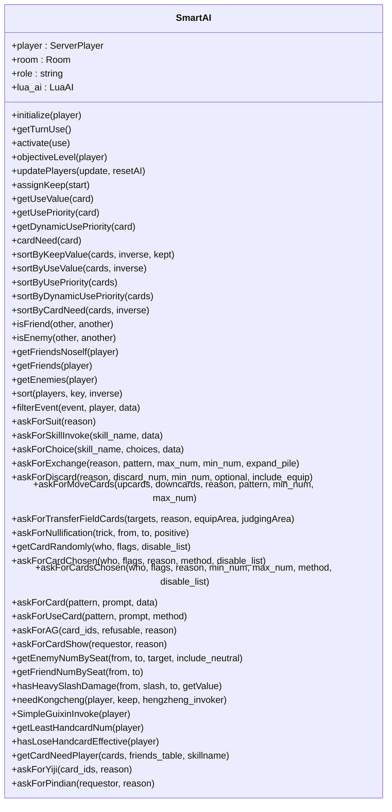
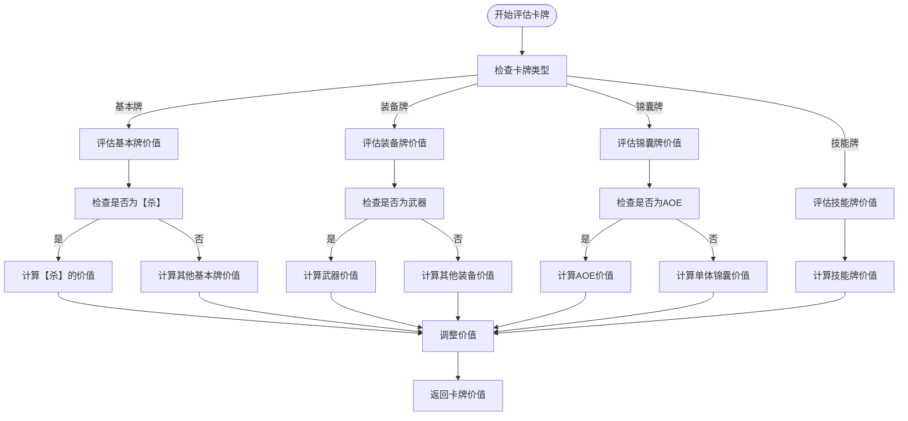
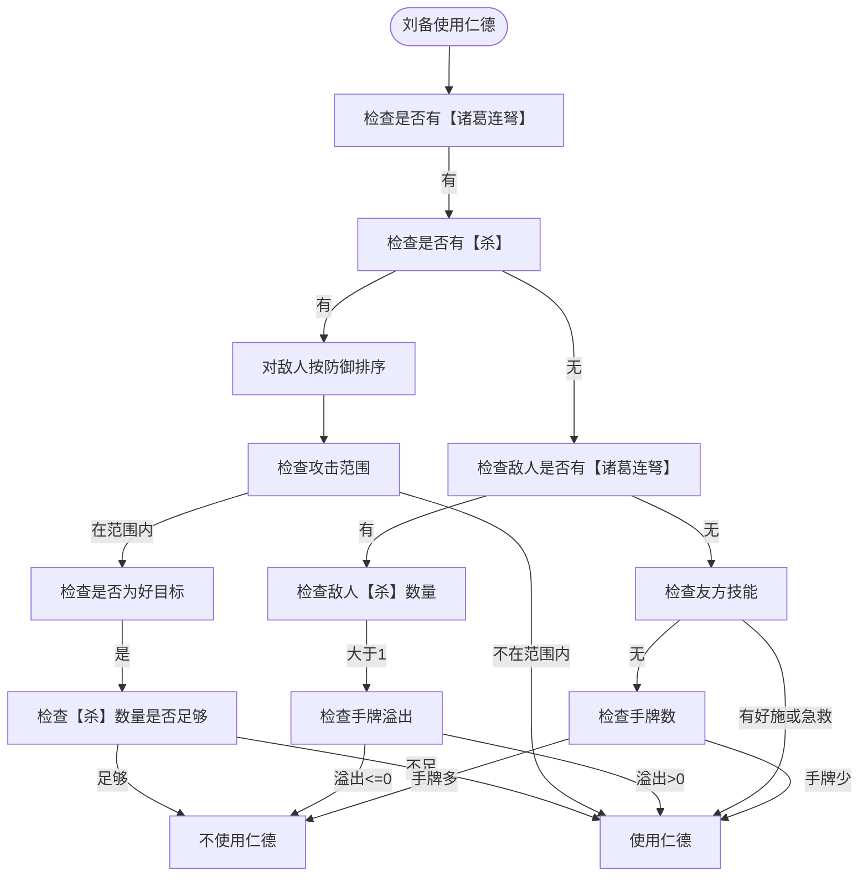
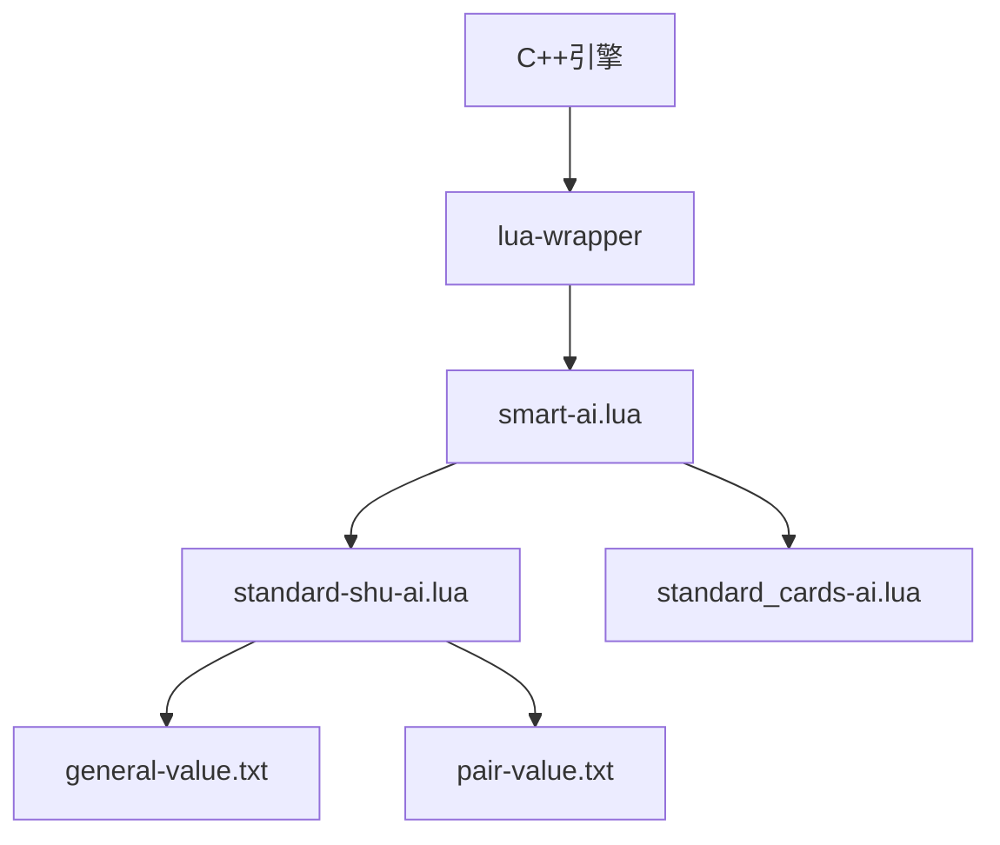

# AI决策逻辑

<cite>
**本文档引用文件**   
- [smart-ai.lua](file://lua/ai/smart-ai.lua)
- [standard-shu-ai.lua](file://lua/ai/standard-shu-ai.lua)
- [standard_cards-ai.lua](file://lua/ai/standard_cards-ai.lua)
- [lua-wrapper.cpp](file://src/core/lua-wrapper.cpp)
</cite>

## 目录
1. [引言](#引言)
2. [项目结构](#项目结构)
3. [核心组件](#核心组件)
4. [架构概述](#架构概述)
5. [详细组件分析](#详细组件分析)
6. [依赖分析](#依赖分析)
7. [性能考量](#性能考量)
8. [故障排除指南](#故障排除指南)
9. [结论](#结论)

## 引言
本文档深入解析了《三国杀》游戏中AI决策逻辑的实现机制。以`smart-ai.lua`为核心，分析AI如何通过Lua脚本评估卡牌使用价值、技能优先级和目标选择。详细说明`standard-shu-ai.lua`等模式化AI脚本的结构设计，解释AI如何调用`getCardsNeed()`、`isCardEffect()`等辅助函数进行决策。结合具体场景（如AI使用【杀】或发动【观星】）展示从C++触发Lua接口到返回决策结果的完整调用链。文档提供决策树示例、卡牌价值评估算法说明，并对比不同武将AI的行为差异。同时说明Lua与C++通过`lua-wrapper`交互的数据序列化方式。

## 项目结构
项目结构清晰地分为多个模块，包括AI逻辑、扩展包、核心C++代码、Lua脚本、资源文件等。AI相关的Lua脚本主要位于`lua/ai/`目录下，而核心的C++与Lua交互代码位于`src/core/`目录。



**图示来源**
- [smart-ai.lua](file://lua/ai/smart-ai.lua)
- [standard-shu-ai.lua](file://lua/ai/standard-shu-ai.lua)
- [standard_cards-ai.lua](file://lua/ai/standard_cards-ai.lua)
- [lua-wrapper.cpp](file://src/core/lua-wrapper.cpp)
- [general-value.txt](file://ai-selector/general-value.txt)
- [pair-value.txt](file://ai-selector/pair-value.txt)

## 核心组件
核心组件包括`SmartAI`类，它是所有特定AI的基类。`SmartAI`类负责初始化AI实例，管理玩家状态，评估卡牌价值，以及处理各种游戏事件。`CloneAI`函数是暴露给宿主程序的唯一接口，用于根据武将名称克隆AI实例。

**组件来源**
- [smart-ai.lua](file://lua/ai/smart-ai.lua)

## 架构概述
系统架构采用C++作为底层引擎，Lua作为上层AI逻辑脚本。C++通过`lua-wrapper`模块与Lua脚本进行交互，实现数据的序列化和反序列化。AI决策流程包括卡牌评估、技能调用、目标选择等步骤。

```mermaid
sequenceDiagram
participant C++ as C++引擎
participant LuaWrapper as Lua包装器
participant LuaAI as Lua AI脚本
C++->>LuaWrapper : 触发AI决策事件
LuaWrapper->>LuaAI : 调用Lua函数
LuaAI->>LuaAI : 评估卡牌价值
LuaAI->>LuaAI : 选择技能和目标
LuaAI-->>LuaWrapper : 返回决策结果
LuaWrapper-->>C++ : 执行游戏动作
```

**图示来源**
- [lua-wrapper.cpp](file://src/core/lua-wrapper.cpp)
- [smart-ai.lua](file://lua/ai/smart-ai.lua)

## 详细组件分析
### SmartAI类分析
`SmartAI`类是AI决策的核心，负责管理AI的状态和决策过程。

#### 类图


**图示来源**
- [smart-ai.lua](file://lua/ai/smart-ai.lua)

### 卡牌价值评估算法
AI通过`getUseValue`、`getUsePriority`、`getDynamicUsePriority`等函数评估卡牌的使用价值。这些函数考虑了卡牌类型、玩家状态、敌人和友方情况等因素。



**图示来源**
- [smart-ai.lua](file://lua/ai/smart-ai.lua)

### 武将AI行为差异
不同武将的AI行为通过`standard-shu-ai.lua`等文件中的特定函数实现。例如，刘备的`rende`技能、关羽的`wusheng`技能等。

#### 刘备仁德技能决策


**图示来源**
- [standard-shu-ai.lua](file://lua/ai/standard-shu-ai.lua)

## 依赖分析
AI系统依赖于C++核心引擎提供的玩家、房间、卡牌等对象，以及Lua脚本提供的决策逻辑。`lua-wrapper`模块负责在C++和Lua之间传递数据。



**图示来源**
- [lua-wrapper.cpp](file://src/core/lua-wrapper.cpp)
- [smart-ai.lua](file://lua/ai/smart-ai.lua)
- [standard-shu-ai.lua](file://lua/ai/standard-shu-ai.lua)
- [general-value.txt](file://ai-selector/general-value.txt)
- [pair-value.txt](file://ai-selector/pair-value.txt)

## 性能考量
AI决策的性能主要受Lua脚本执行效率和C++与Lua交互开销的影响。优化建议包括减少不必要的函数调用、缓存常用计算结果、优化卡牌价值评估算法等。

## 故障排除指南
常见问题包括AI决策延迟、卡牌价值评估不准确、技能调用错误等。解决方法包括检查Lua脚本语法、验证C++与Lua接口、调试决策逻辑等。

**组件来源**
- [smart-ai.lua](file://lua/ai/smart-ai.lua)
- [standard-shu-ai.lua](file://lua/ai/standard-shu-ai.lua)
- [lua-wrapper.cpp](file://src/core/lua-wrapper.cpp)

## 结论
本文档详细解析了《三国杀》AI决策逻辑的实现机制，涵盖了从C++底层到Lua上层的完整技术栈。通过深入分析核心组件、架构设计、决策算法和行为差异，为开发者提供了全面的技术参考。未来工作可进一步优化AI决策效率，增强AI的智能水平。