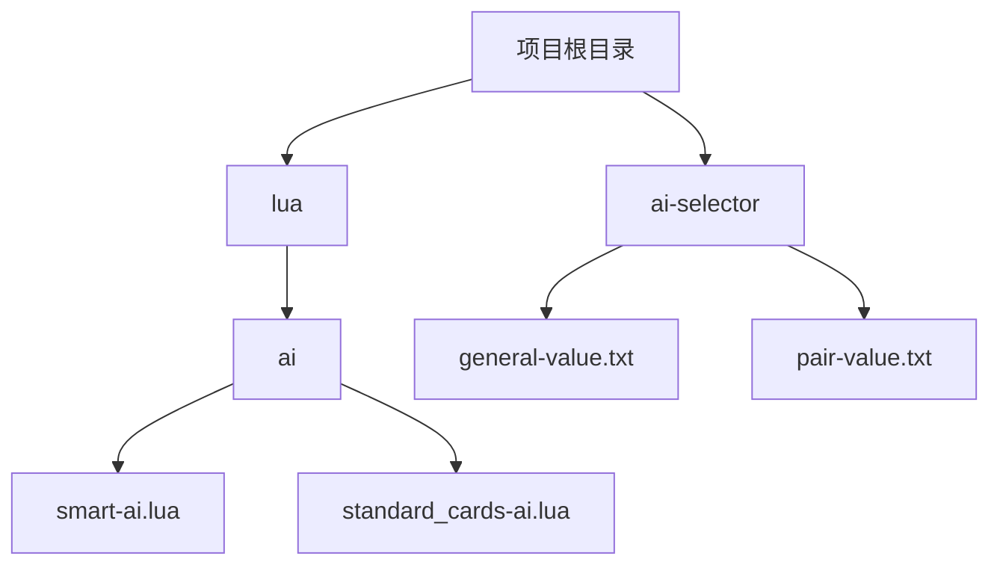
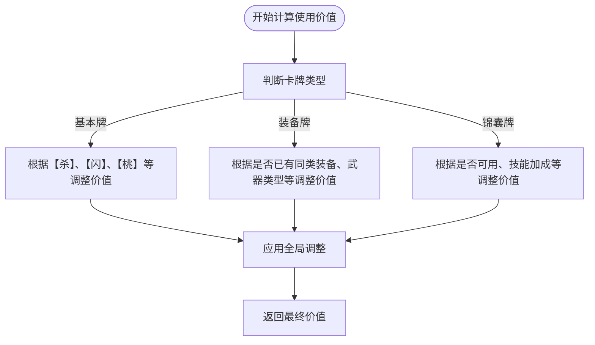
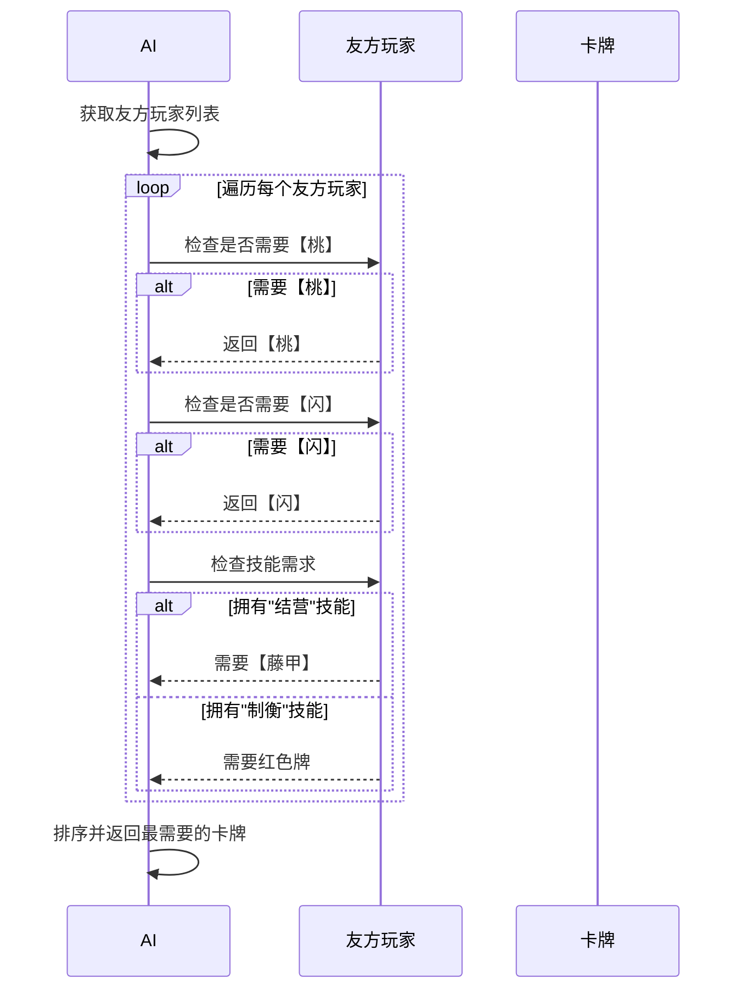

# 卡牌价值评估

<cite>
**本文档引用的文件**   
- [smart-ai.lua](file://lua\ai\smart-ai.lua)
- [general-value.txt](file://ai-selector\general-value.txt)
- [pair-value.txt](file://ai-selector\pair-value.txt)
- [standard_cards-ai.lua](file://lua\ai\standard_cards-ai.lua)
</cite>

## 目录
1. [引言](#引言)
2. [项目结构分析](#项目结构分析)
3. [核心组件分析](#核心组件分析)
4. [卡牌价值计算机制](#卡牌价值计算机制)
5. [卡牌需求度评估](#卡牌需求度评估)
6. [典型场景决策路径](#典型场景决策路径)
7. [结论](#结论)

## 引言
本文档深入分析了AI对卡牌使用价值的评估机制。以`smart-ai.lua`中的卡牌评分函数为核心，解析AI如何根据当前局势、手牌构成、装备需求等因素动态计算每张卡牌的使用优先级。详细说明`general-value.txt`和`pair-value.txt`中定义的基础价值与组合价值在决策中的应用方式。结合`standard_cards-ai.lua`中的具体实现，展示【杀】、【闪】、【桃】等基本牌及装备牌的评估逻辑差异。提供卡牌价值计算的伪代码示例，并说明AI如何通过`getCardsNeed()`等辅助函数判断卡牌需求度。文档包含典型场景下的卡牌选择决策路径分析。

## 项目结构分析
项目结构清晰地组织了AI相关的逻辑和配置文件。核心AI逻辑位于`lua/ai/`目录下，其中`smart-ai.lua`是智能AI的主文件，定义了AI的基础类和核心评估函数。`ai-selector/`目录包含`general-value.txt`和`pair-value.txt`两个关键配置文件，分别存储了武将的基础价值和组合价值。`standard_cards-ai.lua`文件则包含了对标准卡牌的具体使用逻辑实现。



**图示来源**
- [smart-ai.lua](file://lua\ai\smart-ai.lua)
- [general-value.txt](file://ai-selector\general-value.txt)
- [pair-value.txt](file://ai-selector\pair-value.txt)
- [standard_cards-ai.lua](file://lua\ai\standard_cards-ai.lua)

## 核心组件分析
### SmartAI 类
`SmartAI`类是所有特定AI的基类，它继承自`middleclass`库。该类封装了AI的所有决策逻辑，其核心是通过一系列函数来评估卡牌价值、判断使用意图和做出决策。

#### 初始化与状态管理
`initialize`函数负责初始化AI实例，设置玩家、房间、角色等属性，并调用`SetInitialTables`函数加载武将价值数据。

```lua
function SmartAI:initialize(player)
    self.player = player
    self.room = player:getRoom()
    self.role = player:getRole()
    self.lua_ai = sgs.LuaAI(player)
    -- ... 其他初始化逻辑
    SetInitialTables()
end
```

**图示来源**
- [smart-ai.lua](file://lua\ai\smart-ai.lua#L150-L180)

### 价值数据加载
`SetInitialTables`函数是加载外部价值配置的核心。它通过`sgs.readGeneralValuefromtxt()`和`sgs.readGeneralPairValuefromtxt()`从`general-value.txt`和`pair-value.txt`文件中读取数据，并将其存储在全局表`sgs.general_value`和`sgs.general_pair_value`中。

```lua
function SetInitialTables()
    sgs.general_value = sgs.readGeneralValuefromtxt()
    assert(sgs.general_value)
    sgs.general_pair_value = sgs.readGeneralPairValuefromtxt()
    assert(sgs.general_pair_value)
    -- ... 其他初始化逻辑
end
```

**图示来源**
- [smart-ai.lua](file://lua\ai\smart-ai.lua#L100-L130)

## 卡牌价值计算机制
AI对卡牌的评估是一个多层次、动态的过程，主要通过`getUseValue`、`getUsePriority`和`getDynamicUsePriority`三个函数实现。

### 基础使用价值 (getUseValue)
`getUseValue`函数计算卡牌的基础使用价值。该价值根据卡牌类型、玩家状态和当前局势进行调整。



**图示来源**
- [smart-ai.lua](file://lua\ai\smart-ai.lua#L1600-L1700)

### 使用优先级 (getUsePriority)
`getUsePriority`函数在`getUseValue`的基础上，进一步计算卡牌的使用优先级。它考虑了装备的稀缺性（如无防具时优先级更高）和花色偏好。

```lua
function SmartAI:getUsePriority(card)
    local v = sgs.ai_use_priority[card:getClassName()] or 0
    if card:isKindOf("Armor") and not self.player:getArmor() then
        v = v + 5.2 -- 无防具时，防具优先级大幅提升
    end
    return self:adjustUsePriority(card, v)
end
```

**图示来源**
- [smart-ai.lua](file://lua\ai\smart-ai.lua#L1700-L1750)

### 动态使用优先级 (getDynamicUsePriority)
`getDynamicUsePriority`是最终的排序依据，它综合了所有因素，包括玩家的技能、装备、手牌数量和当前敌人情况。

```lua
function SmartAI:getDynamicUsePriority(card)
    local value = self:getUsePriority(card)
    -- 根据技能动态调整
    if self.player:hasSkill("shuangxiong") and card:isKindOf("Duel") then
        value = value + 6.3
    end
    -- 根据装备情况动态调整
    if card:isKindOf("Weapon") and #self.enemies > 0 then
        self:sort(self.enemies)
        local enemy = self.enemies[1]
        local v, inAttackRange = self:evaluateWeapon(card, self.player, enemy)
        value = value + v / 20
        if inAttackRange then value = value + 0.5 end
    end
    return value
end
```

**图示来源**
- [smart-ai.lua](file://lua\ai\smart-ai.lua#L1750-L1850)

### 伪代码示例
```plaintext
函数 计算卡牌动态优先级(卡牌):
    基础优先级 = 获取基础使用优先级(卡牌)
    
    // 技能加成
    如果 玩家拥有"双雄"技能 且 卡牌为【决斗】:
        基础优先级 += 6.3
    
    // 装备评估
    如果 卡牌为武器:
        对敌人按防御力排序
        目标敌人 = 防御力最低的敌人
        武器评估值, 是否在攻击范围内 = 评估武器(卡牌, 玩家, 目标敌人)
        基础优先级 += 武器评估值 / 20
        如果 在攻击范围内:
            基础优先级 += 0.5
    
    返回 基础优先级
```

## 卡牌需求度评估
AI通过`cardNeed`函数来评估一张卡牌的需求度，这主要用于判断是否应该保留某张牌或将其交给队友。

### getCardsNeed 函数
`getCardsNeed`函数是评估卡牌需求的核心。它会遍历所有友方玩家，根据他们的技能和当前状态来判断他们最需要的卡牌。



**图示来源**
- [smart-ai.lua](file://lua\ai\smart-ai.lua#L2200-L2300)

### 需求度计算逻辑
`cardNeed`函数的逻辑如下：
1.  **生命值需求**：如果友方玩家生命值低于2，对【桃】的需求度为10。
2.  **防御需求**：如果AI自身较弱且【闪】不足，对【闪】的需求度为12。
3.  **技能需求**：遍历玩家技能，查找`ai_cardneed`表中定义的需求函数。
4.  **通用需求**：如果没有特殊需求，则根据卡牌类型返回基础需求度。

```lua
function SmartAI:cardNeed(card)
    if card:isKindOf("Peach") then
        self:sort(self.friends,"hp")
        if self.friends[1]:getHp() < 2 then return 10 end
        -- ... 其他逻辑
    end
    -- ... 其他卡牌类型
    return self:getUseValue(card)
end
```

**图示来源**
- [smart-ai.lua](file://lua\ai\smart-ai.lua#L2200-L2300)

## 典型场景决策路径
### 场景一：回合开始，手牌为【杀】x2、【闪】、【桃】、【酒】
AI的决策路径如下：
1.  **计算每张牌的动态优先级**：
    *   【杀】：基础值3.6，因可用且有敌人，+5，优先级约8.6。
    *   【闪】：基础值5.2，因只有一张，-6，优先级约-0.8。
    *   【桃】：基础值7，因玩家受伤，+6，优先级约13。
    *   【酒】：基础值4.1，因玩家生命值为1，+6，优先级约10.1。
2.  **排序**：按优先级从高到低排序为【桃】(13) > 【酒】(10.1) > 【杀】(8.6) > 【闪】(-0.8)。
3.  **决策**：AI会优先使用【桃】或【酒】回复生命值，然后使用【杀】攻击敌人，最后保留【闪】。

### 场景二：面对【南蛮入侵】，手牌为【杀】x3
1.  **判断AOE有效性**：调用`canAvoidAOE`函数。
2.  **检查响应能力**：`getCardsNum("Slash") > 0`为真。
3.  **决策**：AI判断可以响应，因此不会使用【无懈可击】来抵消，而是准备打出【杀】。

## 结论
AI的卡牌价值评估机制是一个复杂而精密的系统。它通过`general-value.txt`和`pair-value.txt`提供基础价值参考，再通过`smart-ai.lua`中的`getUseValue`、`getUsePriority`和`getDynamicUsePriority`三个函数进行多层次的动态计算，最终确定卡牌的使用顺序。`getCardsNeed`等辅助函数则帮助AI判断卡牌的保留和传递策略。整个系统充分考虑了玩家技能、装备、手牌、生命值和敌人情况，实现了高度智能化的决策。