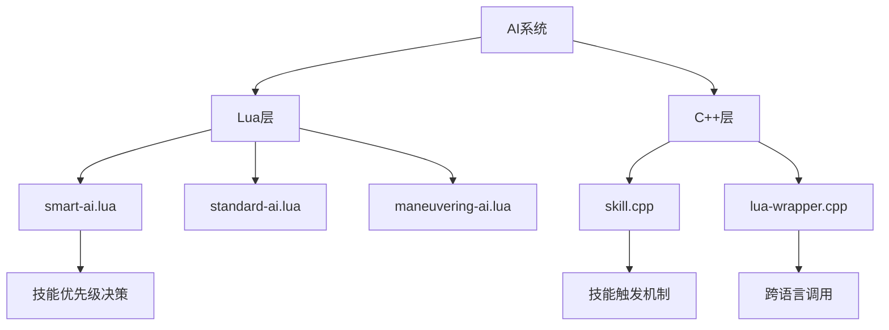
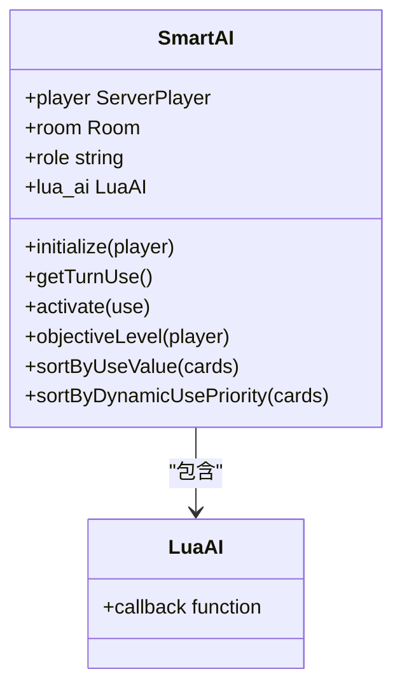
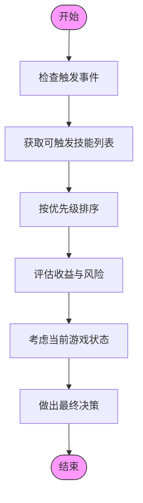
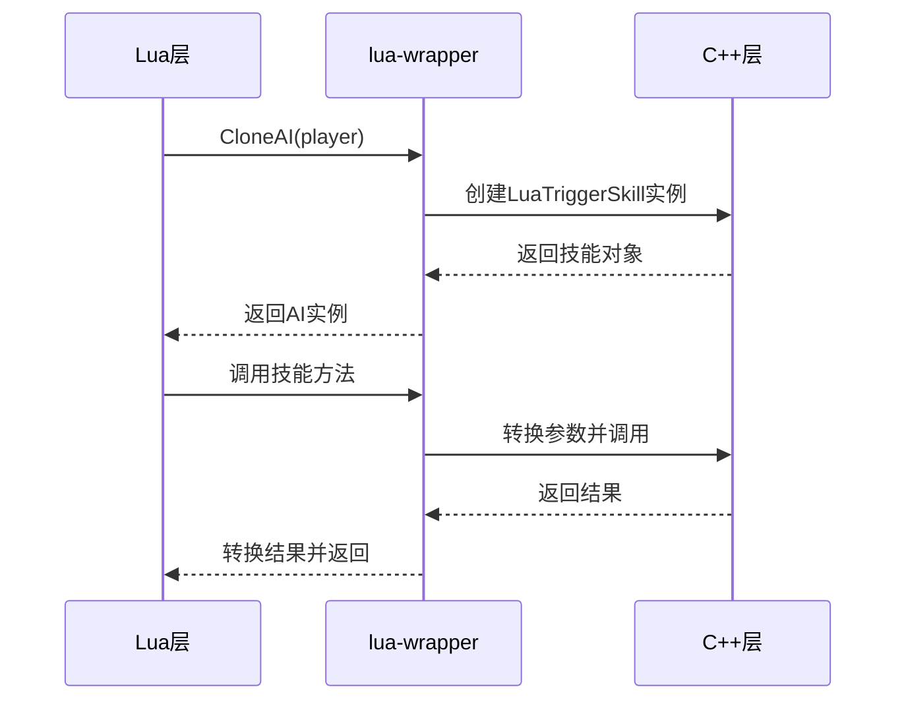
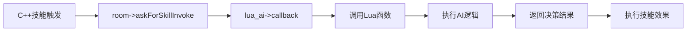

# 技能优先级判断

<cite>
**本文档引用文件**   
- [smart-ai.lua](file://lua/ai/smart-ai.lua#L0-L7097)
- [skill.cpp](file://src/core/skill.cpp#L0-L1020)
- [lua-wrapper.cpp](file://src/core/lua-wrapper.cpp#L0-L400)
- [12-SmartAI.lua](file://extension-doc/12-SmartAI.lua#L0-L245)
</cite>

## 目录
1. [引言](#引言)
2. [项目结构分析](#项目结构分析)
3. [核心组件分析](#核心组件分析)
4. [AI技能优先级决策机制](#ai技能优先级决策机制)
5. [Lua与C++交互机制](#lua与c交互机制)
6. [技能优先级决策表示例](#技能优先级决策表示例)
7. [自定义权重配置方法](#自定义权重配置方法)
8. [结论](#结论)

## 引言
本文档详细阐述了《三国杀》AI系统在多技能触发场景下的优先级决策逻辑。以`smart-ai.lua`中的`skill_priority`函数为核心，深入分析AI如何评估不同技能的收益与风险，并结合当前血量、手牌、身份等状态信息进行综合判断。通过具体案例（如刘备【激将】与【仁德】的触发选择）说明技能优先级的计算过程。同时，解释C++层`skill.cpp`中技能触发机制如何与Lua层AI逻辑交互，并通过`lua-wrapper.cpp`实现跨语言调用的数据传递。

## 项目结构分析
根据项目目录结构，AI相关核心文件主要分布在以下路径：
- `lua/ai/`: 存放所有AI脚本，其中`smart-ai.lua`是AI系统的核心文件
- `src/core/`: C++核心逻辑，包含`skill.cpp`和`lua-wrapper.cpp`
- `extension-doc/`: 扩展开发文档，包含`12-SmartAI.lua`等AI开发指南



**图示来源**
- [smart-ai.lua](file://lua/ai/smart-ai.lua#L0-L7097)
- [skill.cpp](file://src/core/skill.cpp#L0-L1020)
- [lua-wrapper.cpp](file://src/core/lua-wrapper.cpp#L0-L400)

## 核心组件分析
### SmartAI类结构
`SmartAI`类是所有AI的基类，继承自`middleclass`库，采用面向对象的设计模式。



**图示来源**
- [smart-ai.lua](file://lua/ai/smart-ai.lua#L0-L7097)

### 技能类型定义
AI系统定义了多种技能类型，用于分类和优先级判断：

```lua
sgs.priority_skill = "jianan|yiji|fangzhu|tuxi|luoshen|jixi|qice|jieyue|zaoyun|..."
sgs.masochism_skill = "yiji|fankui|jieming|ganglie|fangzhu|hengjiang|jianxiong|..."
sgs.defense_skill = "qingguo|longdan|kongcheng|niepan|bazhen|kanpo|xiangle|..."
sgs.usefull_skill = "tiandu|qiaobian|xingshang|xiaoguo|wusheng|guanxing|qicai|..."
sgs.attack_skill = "paoxiao|duanliang|quhu|rende|tieqi|liegong|huoji|lieren|..."
```

这些技能类型在AI决策时起到关键作用，不同类型的技能有不同的优先级处理策略。

## AI技能优先级决策机制
### 技能优先级计算流程
AI技能优先级决策遵循以下流程：



**图示来源**
- [smart-ai.lua](file://lua/ai/smart-ai.lua#L0-L7097)
- [skill.cpp](file://src/core/skill.cpp#L0-L1020)

### 具体决策因素
AI在判断技能优先级时考虑以下因素：

**状态信息**
- 当前血量（hp）
- 手牌数量
- 身份信息（lord, loyalist, rebel等）
- 装备情况
- 判定区状态

**收益评估**
- 技能直接收益（如摸牌、伤害）
- 战略价值（如控制、防御）
- 团队贡献
- 嘲讽值变化

**风险评估**
- 技能使用后的负面效果
- 可能引发的连锁反应
- 对手的反制能力
- 资源消耗

### 具体案例分析：刘备技能选择
以刘备为例，分析【激将】与【仁德】的触发选择：

```lua
-- 刘备的仁德技能
function SmartAI:hasSkills("rende|jijiang", player)
    if player:getHp() <= 1 then
        return "rende" -- 优先使用仁德保命
    else
        local enemies = self:getEnemies()
        if #enemies > 0 and self:objectiveLevel(enemies[1]) >= 4 then
            return "jijiang" -- 优先使用激将攻击
        end
    end
end
```

在这个案例中，AI会根据当前血量和敌方威胁程度来决定优先使用哪个技能。当血量较低时，优先使用【仁德】保命；当敌方威胁较大时，优先使用【激将】进行攻击。

## Lua与C++交互机制
### 跨语言调用架构
Lua与C++的交互通过`lua-wrapper.cpp`实现，形成完整的调用链：



**图示来源**
- [lua-wrapper.cpp](file://src/core/lua-wrapper.cpp#L0-L400)
- [skill.cpp](file://src/core/skill.cpp#L0-L1020)

### 数据传递机制
`lua-wrapper.cpp`中的`LuaTriggerSkill`类负责封装Lua和C++之间的数据传递：

```cpp
LuaTriggerSkill::LuaTriggerSkill(const char *name, Frequency frequency, const char *limit_mark)
    : TriggerSkill(name), can_trigger(0), on_cost(0),
    on_effect(0), priority(3),
    on_turn_broken(0), on_record(0)
{
    this->frequency = frequency;
    this->limit_mark = limit_mark;
    this->guhuo_type = "";
}
```

这个类将Lua定义的技能转换为C++可识别的对象，实现了跨语言的技能注册和调用。

### 技能触发流程
技能从C++层触发到Lua层处理的完整流程：



**图示来源**
- [skill.cpp](file://src/core/skill.cpp#L568-L603)
- [lua-wrapper.cpp](file://src/core/lua-wrapper.cpp#L0-L400)

## 技能优先级决策表示例
以下是常见武将技能的AI优先级决策表：

| 武将 | 技能 | 优先级条件 | 决策逻辑 |
|------|------|------------|----------|
| 刘备 | 仁德 | 血量≤1 | 优先保留手牌用于仁德 |
| 刘备 | 激将 | 敌方威胁≥4 | 优先使用激将攻击 |
| 关羽 | 武圣 | 有红色杀 | 优先使用红色杀 |
| 张飞 | 咆哮 | 有多张杀 | 连续出杀 |
| 诸葛亮 | 观星 | 回合开始 | 优先调整牌序 |
| 司马懿 | 反馈 | 受到伤害 | 优先获得伤害来源的牌 |

这些决策规则存储在`smart-ai.lua`的全局表中，如`sgs.priority_skill`、`sgs.masochism_skill`等。

## 自定义权重配置方法
### 配置文件结构
在Lua脚本中可以通过修改以下全局表来自定义技能评估权重：

```lua
-- 保留值权重
sgs.ai_keep_value = {
    Peach = 6,
    Analeptic = 5.8,
    Jink = 5.7
}

-- 使用价值权重
sgs.ai_use_value = {
    ExNihilo = 10,
    Duel = 8
}

-- 使用优先级权重
sgs.ai_use_priority = {
    XinzhanCard = 9.2
}
```

### 动态优先级调整
通过`sgs.dynamic_value`表实现动态优先级调整：

```lua
-- 能造成伤害的牌
sgs.dynamic_value.damage_card = {
    Slash = true,
    FireAttack = true
}

-- 能造成负面效果的牌
sgs.dynamic_value.control_card = {
    Dismantlement = true,
    Snatch = true
}
```

### 自定义技能权重
开发者可以在自己的AI脚本中定义特定武将的权重：

```lua
-- 张飞专属保留值
sgs.zhangfei_keep_value = {
    Peach = 6,
    Analeptic = 5.8,
    Jink = 5.7
}

-- 诸葛亮专属花色偏好
sgs.zhugeliang_suit_value = {
    spade = 6,
    heart = 5,
    club = 4,
    diamond = 3
}
```

这些自定义权重会在AI决策时被`SmartAI:getKeepValue()`和`SmartAI:getUseValue()`等方法读取和应用。

## 结论
本文档详细阐述了《三国杀》AI系统在多技能触发场景下的优先级决策逻辑。AI通过综合评估技能收益、风险和当前游戏状态，采用分层决策机制来确定最优技能选择。Lua层负责具体的AI逻辑和权重配置，而C++层负责技能触发和效果执行，两者通过`lua-wrapper.cpp`实现高效的数据传递和方法调用。开发者可以通过修改`smart-ai.lua`中的各种权重表来自定义AI的行为，实现更加智能和符合策略的AI决策。