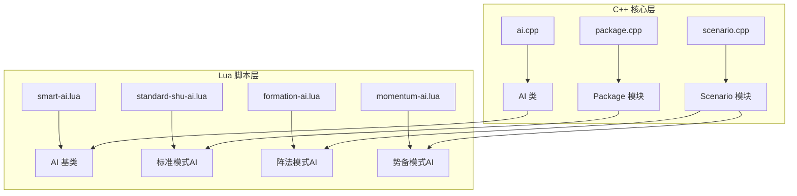
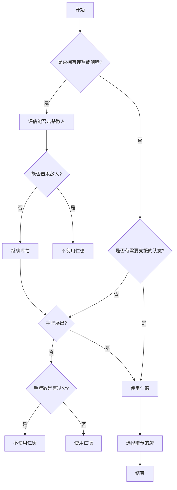

# 模式化AI行为

<cite>
**本文档中引用的文件**   
- [standard-shu-ai.lua](file://lua/ai/standard-shu-ai.lua)
- [formation-ai.lua](file://lua/ai/formation-ai.lua)
- [momentum-ai.lua](file://lua/ai/momentum-ai.lua)
- [smart-ai.lua](file://lua/ai/smart-ai.lua)
- [ai.cpp](file://src/server/ai.cpp)
- [ai.h](file://src/server/ai.h)
- [package.cpp](file://src/package/package.cpp)
- [scenario.cpp](file://src/scenario/scenario.cpp)
</cite>

## 目录
1. [简介](#简介)
2. [项目结构](#项目结构)
3. [核心组件](#核心组件)
4. [架构概述](#架构概述)
5. [详细组件分析](#详细组件分析)
6. [依赖分析](#依赖分析)
7. [性能考量](#性能考量)
8. [故障排除指南](#故障排除指南)
9. [结论](#结论)

## 简介
本文档旨在深入探讨《三国杀》游戏中针对不同游戏模式（如标准模式、阵法模式、势备模式）的AI行为定制策略。通过分析`standard-shu-ai.lua`、`formation-ai.lua`和`momentum-ai.lua`等模式专属AI脚本，揭示AI如何根据当前游戏模式动态调整其卡牌使用偏好、技能释放策略和团队协作行为。文档将结合C++层的`package`和`scenario`模块，解释游戏模式信息如何从底层传递至Lua层的AI逻辑。此外，文档还将对比同一武将在不同模式下的行为差异，并为开发者提供自定义模式AI的开发指引。

## 项目结构
项目采用分层架构，主要分为C++核心逻辑层和Lua脚本层。C++层负责游戏引擎、网络通信和基础数据结构，而Lua层则专注于游戏规则、武将技能和AI行为的实现。AI系统的核心位于`lua/ai`目录下，其中`smart-ai.lua`是所有AI的基类，定义了AI的基本行为框架。各模式专属的AI脚本（如`standard-shu-ai.lua`）继承并扩展了此基类，以实现模式特定的逻辑。C++的`src/server/ai.cpp`和`src/package`、`src/scenario`模块负责初始化AI并传递游戏模式信息。



**图示来源**
- [ai.cpp](file://src/server/ai.cpp#L1-L50)
- [package.cpp](file://src/package/package.cpp#L1-L20)
- [scenario.cpp](file://src/scenario/scenario.cpp#L1-L20)
- [smart-ai.lua](file://lua/ai/smart-ai.lua#L1-L35)
- [standard-shu-ai.lua](file://lua/ai/standard-shu-ai.lua#L1-L10)
- [formation-ai.lua](file://lua/ai/formation-ai.lua#L1-L10)
- [momentum-ai.lua](file://lua/ai/momentum-ai.lua#L1-L10)

**本节来源**
- [ai.cpp](file://src/server/ai.cpp#L1-L50)
- [package.cpp](file://src/package/package.cpp#L1-L20)
- [scenario.cpp](file://src/scenario/scenario.cpp#L1-L20)
- [smart-ai.lua](file://lua/ai/smart-ai.lua#L1-L35)
- [standard-shu-ai.lua](file://lua/ai/standard-shu-ai.lua#L1-L10)
- [formation-ai.lua](file://lua/ai/formation-ai.lua#L1-L10)
- [momentum-ai.lua](file://lua/ai/momentum-ai.lua#L1-L10)

## 核心组件
AI系统的核心组件包括AI基类`SmartAI`、模式专属AI脚本和C++的AI管理器。`SmartAI`类（定义于`smart-ai.lua`）通过`CloneAI`函数暴露给宿主程序，为每个玩家实例化一个AI对象。该类定义了AI的通用方法，如卡牌评估（`getKeepValue`）、技能调用（`ai_skill_invoke`）和意图计算（`ai_card_intention`）。模式专属AI脚本通过覆盖这些方法来实现特定行为。C++的`AI`类（定义于`ai.h`和`ai.cpp`）作为桥梁，将游戏状态和玩家信息传递给Lua层。

**本节来源**
- [smart-ai.lua](file://lua/ai/smart-ai.lua#L33-L76)
- [ai.h](file://src/server/ai.h#L1-L50)
- [ai.cpp](file://src/server/ai.cpp#L1-L43)

## 架构概述
整个AI系统的架构是一个典型的C++与Lua混合架构。C++层负责高性能计算和系统集成，而Lua层提供灵活的脚本化逻辑。游戏启动时，C++的`Scenario`模块根据当前模式加载相应的Lua脚本。`AI`类的构造函数接收`ServerPlayer`对象，并通过Lua绑定机制，将玩家和房间信息暴露给Lua环境。Lua脚本中的`SmartAI`实例通过回调机制与C++层交互，当需要决策时，C++层调用Lua函数，Lua函数返回决策结果。

```mermaid
sequenceDiagram
participant C++ as C++ 层
participant Lua as Lua 层
participant Player as 玩家
C++->>C++ : Scenario : : onTagSet("GameMode")
C++->>C++ : 加载对应模式的AI脚本 (e.g., formation-ai.lua)
C++->>C++ : new AI(player)
C++->>Lua : 调用 CloneAI(player)
Lua->>Lua : SmartAI(player)
Lua->>Lua : 初始化AI实例
Lua-->>C++ : 返回 lua_ai 对象
Player->>C++ : 需要AI决策
C++->>Lua : 调用 lua_ai.callback("getTurnUseCard")
Lua->>Lua : 执行模式专属逻辑 (e.g., formation-ai.lua中的getTurnUseCard)
Lua-->>C++ : 返回卡牌决策
C++-->>Player : 执行决策
```

**图示来源**
- [scenario.cpp](file://src/scenario/scenario.cpp#L1-L20)
- [ai.cpp](file://src/server/ai.cpp#L1-L43)
- [smart-ai.lua](file://lua/ai/smart-ai.lua#L263-L312)

**本节来源**
- [scenario.cpp](file://src/scenario/scenario.cpp#L1-L20)
- [ai.cpp](file://src/server/ai.cpp#L1-L43)
- [smart-ai.lua](file://lua/ai/smart-ai.lua#L263-L312)

## 详细组件分析
### 标准模式AI分析 (以刘备为例)
在标准模式下，AI的行为主要围绕武将技能展开。以`standard-shu-ai.lua`中的刘备为例，其`rende`（仁德）技能的AI逻辑非常复杂。`shouldUseRende`函数会综合考虑多个因素：是否拥有连弩或咆哮技能以确保后续输出、是否有队友需要支援（如好施、急救）、当前手牌数与体力值的关系等。如果判断使用仁德利大于弊，AI会通过`sgs.ai_skill_use_func.RendeCard`函数选择一张合适的牌赠予队友，优先选择对敌人有威胁的牌（如杀、决斗），但会避免赠予关键防御牌（如闪）给可能被集火的队友。



**图示来源**
- [standard-shu-ai.lua](file://lua/ai/standard-shu-ai.lua#L1-L100)

**本节来源**
- [standard-shu-ai.lua](file://lua/ai/standard-shu-ai.lua#L1-L100)

### 阵法模式AI分析 (以邓艾为例)
阵法模式AI (`formation-ai.lua`) 的行为与标准模式有显著不同，更侧重于团队协作和阵法效果。以邓艾的`jixi`（急袭）技能为例，AI会优先考虑将田中的牌作为【顺手牵羊】使用。`jixi_skill.getTurnUseCard`函数会遍历邓艾的“田”牌堆，检查是否有牌可以对距离1以内的敌人使用【顺手牵羊】。这体现了阵法模式AI对特定游戏机制（如“田”）的深度利用，其决策逻辑紧密围绕模式规则构建。

**本节来源**
- [formation-ai.lua](file://lua/ai/formation-ai.lua#L1-L50)

### 势备模式AI分析 (以马岱为例)
势备模式AI (`momentum-ai.lua`) 的行为则更加动态，强调对局势的即时反应。以马岱的`qianxi`（潜袭）技能为例，AI在选择弃牌时，会根据后续的攻击目标来决定。`sgs.ai_skill_cardask["@qianxi-discard"]`函数会优先选择一张黑色牌，但如果下一张是红色牌且不是桃，则可能选择红色牌以增加对特定敌人（如拥有“倾国”技能的敌人）的威胁。这表明势备模式AI的决策是链式的，前一个决策会影响后一个决策。

**本节来源**
- [momentum-ai.lua](file://lua/ai/momentum-ai.lua#L1-L50)

## 依赖分析
AI系统依赖于多个核心模块。C++的`AI`类依赖于`ServerPlayer`和`Room`类来获取游戏状态。Lua的`SmartAI`类依赖于`middleclass`库实现面向对象编程。各模式AI脚本依赖于`smart-ai.lua`提供的基础功能表（如`sgs.ai_use_value`、`sgs.ai_skill_invoke`）。这种依赖关系确保了AI行为的可扩展性和一致性。

```mermaid
graph TD
A[AI (C++)] --> B[ServerPlayer]
A --> C[Room]
D[SmartAI (Lua)] --> E[middleclass]
F[standard-shu-ai.lua] --> D
G[formation-ai.lua] --> D
H[momentum-ai.lua] --> D
D --> I[sgs.ai_use_value]
D --> J[sgs.ai_skill_invoke]
```

**图示来源**
- [ai.h](file://src/server/ai.h#L1-L50)
- [smart-ai.lua](file://lua/ai/smart-ai.lua#L33-L76)

**本节来源**
- [ai.h](file://src/server/ai.h#L1-L50)
- [smart-ai.lua](file://lua/ai/smart-ai.lua#L33-L76)

## 性能考量
AI的决策效率至关重要。Lua脚本通过预计算和缓存（如`keepValue`表）来优化性能。C++层通过高效的回调机制减少跨语言调用的开销。对于复杂的决策（如`shouldUseRende`），AI会进行多轮评估，这可能成为性能瓶颈。未来优化方向包括引入更高效的算法和减少不必要的状态查询。

## 故障排除指南
常见的AI行为问题包括决策迟缓和逻辑错误。若AI反应过慢，应检查Lua脚本中是否存在复杂的循环或递归。若AI行为不符合预期，可通过`room:writeToConsole`在Lua脚本中输出调试信息，或在C++的`ai.cpp`中设置断点，检查传递给Lua的数据是否正确。

**本节来源**
- [smart-ai.lua](file://lua/ai/smart-ai.lua#L263-L312)
- [ai.cpp](file://src/server/ai.cpp#L1-L43)

## 结论
本文档详细分析了《三国杀》中不同游戏模式下的AI行为定制策略。通过对比标准、阵法和势备模式的AI脚本，可以看出AI行为从武将技能中心化向模式规则中心化的转变。C++与Lua的混合架构为这种灵活性提供了坚实的基础。开发者在创建自定义模式AI时，应首先在C++的`scenario`模块中定义模式，然后在Lua中创建对应的AI脚本，覆盖`SmartAI`的相应方法，即可实现高度定制化的AI行为。