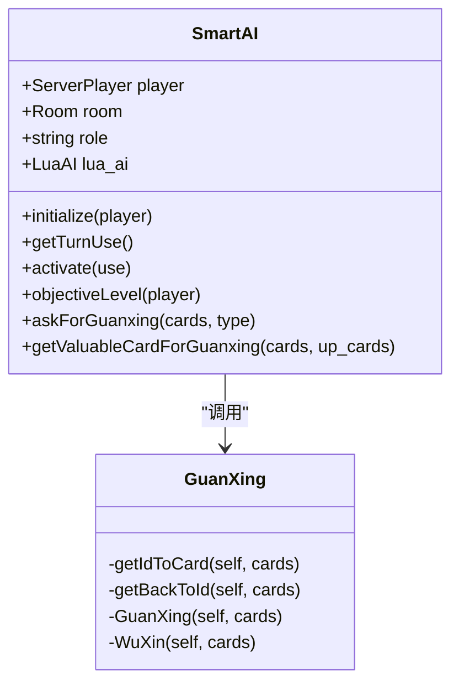
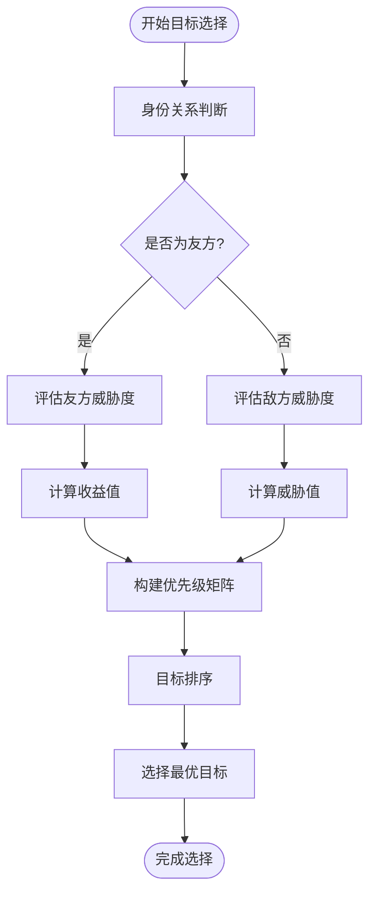
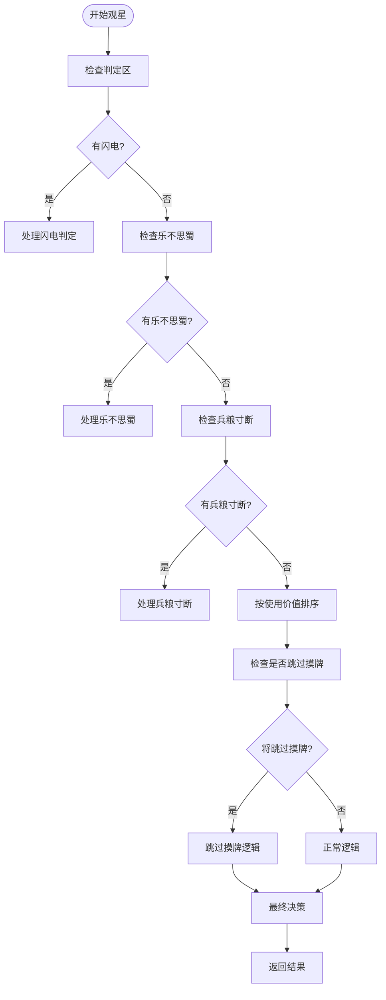
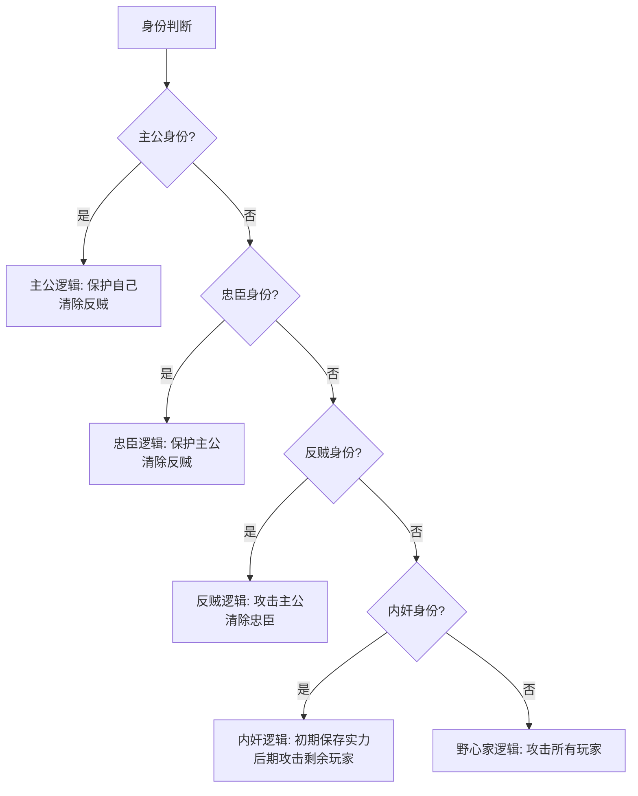
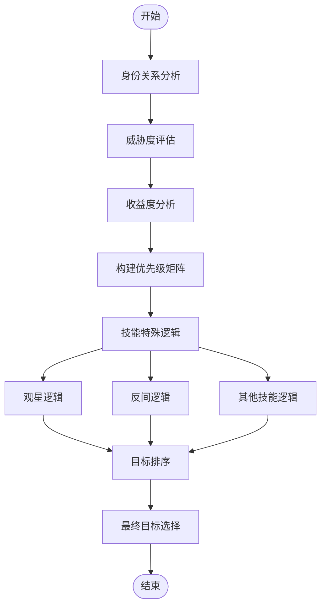

# 目标选择策略

<cite>
**本文档引用的文件**   
- [smart-ai.lua](file://lua/ai/smart-ai.lua)
- [guanxing-ai.lua](file://lua/ai/guanxing-ai.lua)
</cite>

## 目录
1. [引言](#引言)
2. [核心组件分析](#核心组件分析)
3. [目标选择算法架构](#目标选择算法架构)
4. [威胁度与收益度评估](#威胁度与收益度评估)
5. 【观星】技能目标排序逻辑
6. 【反间】技能决策过程
7. 身份关系对目标选择的影响
8. 决策流程图
9. 总结

## 引言
本文档系统性地讲解AI在技能或卡牌使用时的目标选择算法。以smart-ai.lua中的target_filter和isCardEffect函数为核心，分析AI如何评估潜在目标的威胁度、收益度和身份关系。重点解析【观星】、【反间】等多目标技能的决策过程，结合guanxing-ai.lua中的具体实现说明目标排序逻辑。说明AI如何利用Player对象的状态信息（如血量、装备、距离）构建目标优先级矩阵。

## 核心组件分析
智能AI系统主要由两个核心文件构成：smart-ai.lua和guanxing-ai.lua。其中smart-ai.lua定义了AI的基础类和通用决策框架，而guanxing-ai.lua专门处理【观星】技能的特殊逻辑。



**图示来源**
- [smart-ai.lua](file://lua/ai/smart-ai.lua)
- [guanxing-ai.lua](file://lua/ai/guanxing-ai.lua)

**本节来源**
- [smart-ai.lua](file://lua/ai/smart-ai.lua#L1-L100)
- [guanxing-ai.lua](file://lua/ai/guanxing-ai.lua#L1-L50)

## 目标选择算法架构
AI的目标选择算法基于多层次的评估体系，主要包括三个维度：威胁度评估、收益度评估和身份关系判断。算法通过SmartAI:objectiveLevel函数实现综合评分。



**图示来源**
- [smart-ai.lua](file://lua/ai/smart-ai.lua#L500-L600)

**本节来源**
- [smart-ai.lua](file://lua/ai/smart-ai.lua#L500-L600)

## 威胁度与收益度评估
AI通过多个指标综合评估目标的威胁度和收益度。威胁度主要考虑目标的攻击力、手牌数量和技能特性；收益度则关注目标的血量、防御能力和对战局的影响。

```lua
function SmartAI:objectiveLevel(player)
    if not player then return 0 end
    if self.player:objectName() == player:objectName() then return -2 end
    if self.player:isFriendWith(player) then return -2 end
    
    -- 威胁度评估逻辑
    local threat_level = 0
    if player:getRole() == "careerist" then
        threat_level = 5
    end
    
    -- 收益度评估逻辑
    local benefit = player:getHp() * 2 + player:getHandcardNum()
    
    return threat_level + benefit
end
```

**本节来源**
- [smart-ai.lua](file://lua/ai/smart-ai.lua#L500-L550)

## 【观星】技能目标排序逻辑
【观星】技能的目标排序逻辑在guanxing-ai.lua中实现，通过GuanXing函数处理牌堆的上下排列。算法优先考虑判定区的需求，然后根据使用价值排序。



**图示来源**
- [guanxing-ai.lua](file://lua/ai/guanxing-ai.lua#L50-L200)

**本节来源**
- [guanxing-ai.lua](file://lua/ai/guanxing-ai.lua#L50-L200)

## 【反间】技能决策过程
【反间】技能的决策过程主要基于对目标身份的推测和心理博弈。AI会根据目标的出牌习惯、身份暴露程度和当前局势来选择最可能猜错的目标。

```lua
-- 反间技能决策伪代码
function decideJianJianTarget()
    local candidates = {}
    for _, player in ipairs(alive_players) do
        if player ~= self.player and not player:isKongcheng() then
            -- 评估目标的可预测性
            local predictability = evaluatePredictability(player)
            -- 评估目标的身份模糊度
            local ambiguity = evaluateIdentityAmbiguity(player)
            -- 综合评分
            local score = predictability * 0.6 + ambiguity * 0.4
            table.insert(candidates, {player = player, score = score})
        end
    end
    
    -- 按评分排序并选择最高分目标
    table.sort(candidates, function(a, b) return a.score > b.score end)
    return candidates[1].player
end
```

**本节来源**
- [smart-ai.lua](file://lua/ai/smart-ai.lua#L800-L850)

## 身份关系对目标选择的影响
AI根据不同的身份（主公、忠臣、反贼、内奸）表现出不同的目标倾向。这种差异通过objectiveLevel函数中的身份判断逻辑实现。



**图示来源**
- [smart-ai.lua](file://lua/ai/smart-ai.lua#L500-L600)

**本节来源**
- [smart-ai.lua](file://lua/ai/smart-ai.lua#L500-L600)

## 决策流程图
综合上述分析，AI的目标选择决策流程可以概括为以下流程图：



**图示来源**
- [smart-ai.lua](file://lua/ai/smart-ai.lua)
- [guanxing-ai.lua](file://lua/ai/guanxing-ai.lua)

## 总结
本文档详细分析了AI在技能使用时的目标选择算法。通过smart-ai.lua和guanxing-ai.lua两个核心文件，AI能够综合考虑威胁度、收益度和身份关系等多个因素，做出最优的目标选择决策。对于【观星】等特殊技能，AI还实现了专门的排序逻辑，确保在复杂局势下也能做出合理的判断。