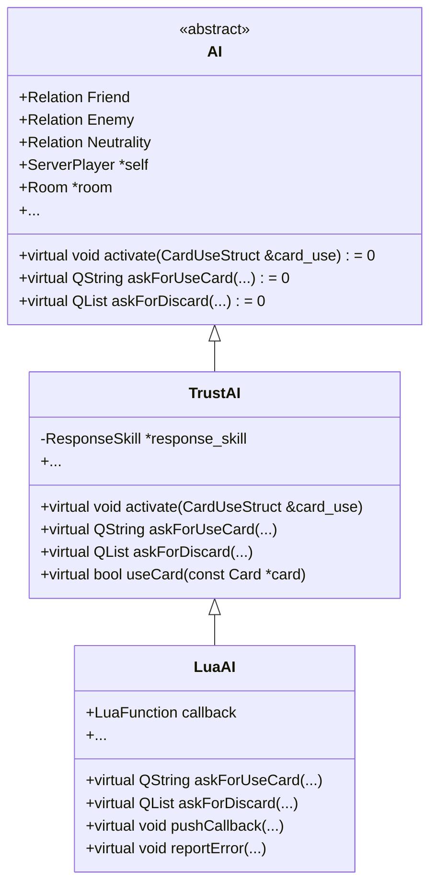
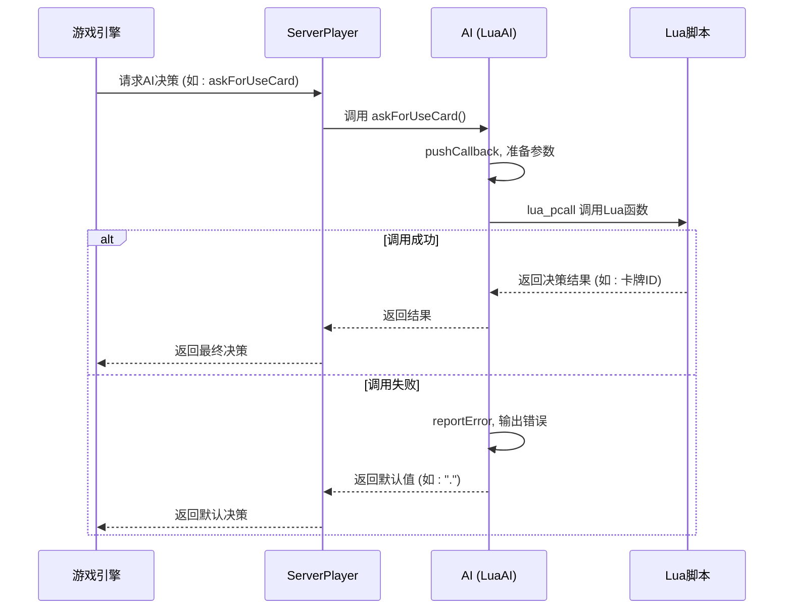

# AI架构设计

<cite>
**本文档引用的文件**   
- [ai.cpp](file://src/server/ai.cpp#L1-L552)
- [ai.h](file://src/server/ai.h#L1-L166)
- [serverplayer.h](file://src/server/serverplayer.h#L1-L299)
- [engine.h](file://src/core/engine.h#L1-L285)
- [roomstate.h](file://src/core/roomstate.h#L1-L101)
</cite>

## 目录
1. [项目结构](#项目结构)
2. [核心组件](#核心组件)
3. [AI模块架构概述](#ai模块架构概述)
4. [详细组件分析](#详细组件分析)
5. [AI决策流程与状态机](#ai决策流程与状态机)
6. [AI与游戏引擎的交互](#ai与游戏引擎的交互)
7. [性能考量与优化建议](#性能考量与优化建议)

## 项目结构

该项目是一个基于C++和Lua的三国杀游戏服务器端实现，采用模块化设计。核心AI逻辑位于`src/server/ai.cpp`中，AI行为由C++基础逻辑与Lua脚本共同驱动。`lua/ai`目录下存放了多种模式的AI行为脚本（如`smart-ai.lua`、`standard-wu-ai.lua`等），实现了AI策略的可配置性。核心类如`AI`、`TrustAI`和`LuaAI`构成了AI决策的继承体系，而`ServerPlayer`类则作为AI的宿主，负责与游戏房间和引擎的通信。

```mermaid
graph TD
subgraph "AI决策层"
AI["AI (抽象基类)"]
TrustAI["TrustAI (基础实现)"]
LuaAI["LuaAI (脚本扩展)"]
end
subgraph "游戏实体层"
ServerPlayer["ServerPlayer (玩家实体)"]
Room["Room (游戏房间)"]
Engine["Engine (游戏引擎)"]
end
subgraph "数据与配置层"
LuaScripts["lua/ai/*.lua (AI行为脚本)"]
ConfigFiles["配置文件 (general-value.txt等)"]
end
AI --> TrustAI
TrustAI --> LuaAI
LuaAI --> LuaScripts
ServerPlayer --> AI : "包含"
ServerPlayer --> Room : "属于"
Room --> Engine : "使用"
LuaAI --> Engine : "通过LuaState交互"
```

**图示来源**
- [ai.h](file://src/server/ai.h#L1-L166)
- [serverplayer.h](file://src/server/serverplayer.h#L1-L299)
- [engine.h](file://src/core/engine.h#L1-L285)

**本节来源**
- [project_structure](file://#L1-L200)

## 核心组件

AI系统的核心是`AI`类及其派生类，它们定义了AI与游戏世界交互的接口。`ServerPlayer`类通过聚合`AI`对象来获得智能行为。`Engine`类作为全局单例，提供了游戏规则、卡牌、武将等所有核心数据的访问接口。`RoomState`则维护了当前游戏房间的动态状态，如当前玩家、出牌模式等，是AI决策的重要上下文。

**本节来源**
- [ai.h](file://src/server/ai.h#L1-L166)
- [serverplayer.h](file://src/server/serverplayer.h#L1-L299)
- [engine.h](file://src/core/engine.h#L1-L285)
- [roomstate.h](file://src/core/roomstate.h#L1-L101)

## AI模块架构概述

AI模块采用分层继承架构，从抽象到具体分为三层：
1.  **`AI`抽象基类**：定义了所有AI必须实现的纯虚函数，如`askForUseCard`、`askForDiscard`等，构成了AI行为的契约。
2.  **`TrustAI`基础实现类**：继承自`AI`，提供了大部分AI请求的默认实现。其策略偏向保守和随机，例如在`askForChoice`中优先选择"cancel"或"no"，在`askForDiscard`中调用`ServerPlayer`的强制弃牌方法。
3.  **`LuaAI`脚本扩展类**：继承自`TrustAI`，是AI智能的核心。它通过`callback`成员变量指向Lua中的函数，将AI决策委托给Lua脚本执行。当C++中的`askForUseCard`等方法被调用时，`LuaAI`会通过`lua_pcall`调用Lua函数，实现了AI策略的热更新和灵活配置。



**图示来源**
- [ai.h](file://src/server/ai.h#L1-L166)
- [ai.cpp](file://src/server/ai.cpp#L1-L552)

**本节来源**
- [ai.h](file://src/server/ai.h#L1-L166)
- [ai.cpp](file://src/server/ai.cpp#L1-L552)

## 详细组件分析

### AI决策调度器实现

`src/server/ai.cpp`中的`activate`方法是AI决策的入口点之一。`TrustAI::activate`会遍历玩家手牌，对于目标固定的可用卡牌（如装备牌），调用`useCard`方法判断是否使用。`useCard`方法实现了简单的装备替换逻辑，例如，如果新武器的攻击范围大于旧武器，则返回`true`表示可以使用。

```cpp
void TrustAI::activate(CardUseStruct &card_use)
{
    QList<const Card *> cards = self->getHandcards();
    foreach (const Card *card, cards) {
        if (card->targetFixed() && card->isAvailable(self)) {
            if (useCard(card)) {
                card_use.card = card;
                card_use.from = self;
                return;
            }
        }
    }
}
```

**本节来源**
- [ai.cpp](file://src/server/ai.cpp#L100-L120)

### ServerPlayer与AI的集成

`ServerPlayer`类通过`setAI`和`getAI`方法与`AI`对象进行绑定。当游戏需要AI做出决策时（例如，询问是否使用某张牌），`ServerPlayer`会调用其`AI`对象的相应`askForXxx`方法。`ServerPlayer`还提供了`forceToDiscard`等方法，供`TrustAI`等基础AI实现直接调用，以执行确定性的操作。



**图示来源**
- [ai.cpp](file://src/server/ai.cpp#L300-L400)
- [serverplayer.h](file://src/server/serverplayer.h#L1-L299)

**本节来源**
- [ai.cpp](file://src/server/ai.cpp#L1-L552)
- [serverplayer.h](file://src/server/serverplayer.h#L1-L299)

## AI决策流程与状态机

AI的决策流程并非一个显式的有限状态机，而是由游戏事件驱动的。当游戏引擎触发一个需要AI响应的事件（如轮到AI出牌、需要响应锦囊等）时，会调用`ServerPlayer`的相应方法，进而调用其`AI`对象的`askForXxx`系列方法。AI状态主要体现在`RoomState`中，如当前阶段（`Player::Phase`）、当前出牌模式（`m_currentCardUsePattern`）等。AI根据这些状态信息做出决策。

```mermaid
flowchart TD
A[等待决策] --> B{游戏事件触发?}
B --> |是| C[获取当前房间状态]
C --> D[调用AI::askForXxx方法]
D --> E{LuaAI?}
E --> |是| F[通过lua_pcall调用Lua脚本]
E --> |否| G[执行C++默认逻辑 (TrustAI)]
F --> H[获取Lua返回结果]
G --> I[计算并返回结果]
H --> I
I --> J[返回决策给游戏引擎]
J --> K[执行游戏动作]
K --> A
```

**图示来源**
- [ai.cpp](file://src/server/ai.cpp#L1-L552)
- [roomstate.h](file://src/core/roomstate.h#L1-L101)

**本节来源**
- [ai.cpp](file://src/server/ai.cpp#L1-L552)
- [roomstate.h](file://src/core/roomstate.h#L1-L101)

## AI与游戏引擎的交互

AI与`Engine`和`RoomState`的交互主要通过`ServerPlayer`间接完成。`AI`类持有`ServerPlayer *self`和`Room *room`的指针，从而可以访问游戏的全局状态。

*   **与Engine交互**：`LuaAI`通过`room->getLuaState()`获取Lua虚拟机状态，进而调用注册在Lua中的函数。`Engine`单例`Sanguosha`被用于查询武将、卡牌等静态数据，例如在`GetRelationHegemony`中通过`Sanguosha->getGeneral()`获取武将的势力。
*   **与RoomState交互**：`RoomState`存储了当前房间的动态信息。`AI`可以通过`room->getOtherPlayers()`获取其他玩家列表，并结合`relationTo`方法判断敌友关系。`RoomState`中的`m_currentCardUsePattern`等字段为AI提供了当前决策的上下文。

信号与槽机制在此处主要用于`ServerPlayer`与网络套接字之间的通信，而非直接用于AI决策。AI决策是同步的函数调用，当`askForUseCard`被调用时，必须立即返回一个结果，因此不涉及异步的信号与槽。

**本节来源**
- [ai.cpp](file://src/server/ai.cpp#L50-L80)
- [engine.h](file://src/core/engine.h#L1-L285)
- [roomstate.h](file://src/core/roomstate.h#L1-L101)

## 性能考量与优化建议

*   **关键性能瓶颈**：
    1.  **Lua-C++交互开销**：`LuaAI`的每次决策都需要进行`lua_pcall`调用，这涉及栈操作、参数压栈和函数查找，是主要的性能瓶颈，尤其是在高频决策场景下。
    2.  **随机数生成**：`TrustAI`大量使用`qrand()`，其性能和随机性质量可能影响AI行为的效率和公平性。
    3.  **遍历操作**：`activate`和`useCard`等方法中对卡牌列表的遍历，在手牌较多时会产生线性时间复杂度。

*   **优化建议**：
    1.  **减少Lua调用频率**：可以设计更高级的AI策略，让Lua脚本一次性返回一个决策序列，而不是对每个小决策都进行一次调用。
    2.  **优化Lua代码**：确保Lua脚本本身是高效的，避免在脚本中进行复杂的循环或递归。
    3.  **使用更高效的随机数生成器**：考虑使用C++11的`<random>`库替代`qrand()`。
    4.  **缓存常用数据**：AI可以缓存一些不常变化的游戏数据（如玩家位置、已知武将），避免每次决策都重新查询。
    5.  **异步决策（高级）**：对于复杂的AI，可以考虑在后台线程进行决策计算，但需注意与主游戏线程的同步，避免状态不一致。

**本节来源**
- [ai.cpp](file://src/server/ai.cpp#L1-L552)
- [serverplayer.h](file://src/server/serverplayer.h#L1-L299)