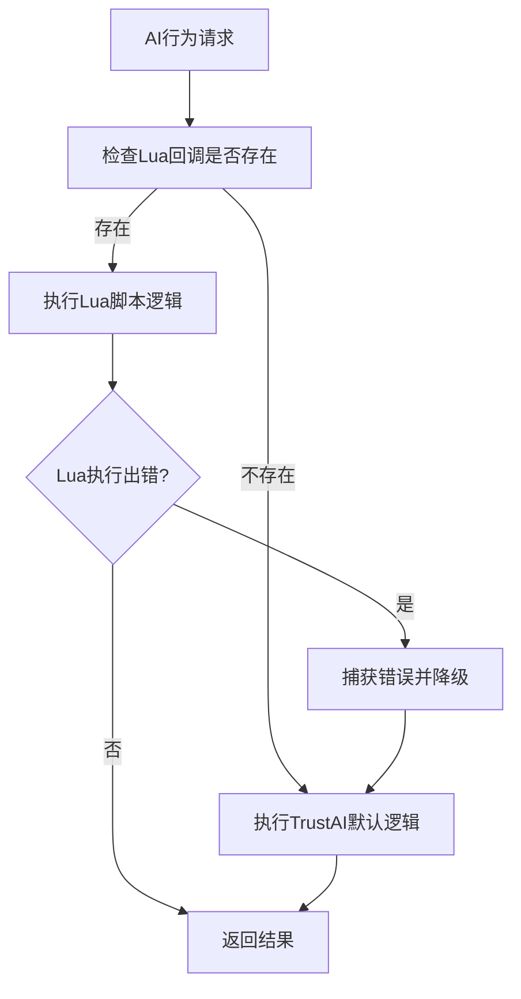
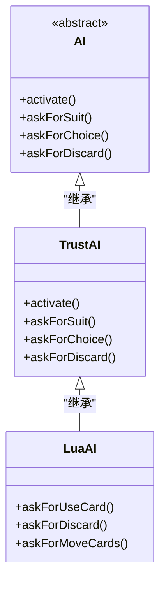

# AI异常恢复与容错

<cite>
**本文档引用文件**   
- [ai.h](file://src/server/ai.h#L1-L166)
- [ai.cpp](file://src/server/ai.cpp#L1-L552)
- [smart-ai.lua](file://lua/ai/smart-ai.lua#L1-L2500)
</cite>

## 目录
1. [引言](#引言)
2. [AI异常检测机制](#ai异常检测机制)
3. [容错策略与恢复机制](#容错策略与恢复机制)
4. [备用逻辑实现分析](#备用逻辑实现分析)
5. [调试模式下的异常追踪](#调试模式下的异常追踪)
6. [结论](#结论)

## 引言
本文件系统阐述《三国杀：霸业》游戏中AI在遭遇非法操作请求、状态不一致或逻辑冲突等异常情况时的恢复与容错机制。通过分析C++核心代码与Lua脚本的交互逻辑，揭示AI系统如何保障游戏流程的稳定性。文档涵盖错误检测方式、容错策略、备用逻辑实现原理及调试方法，为开发者提供完整的异常处理参考。

## AI异常检测机制

### 状态与操作校验
AI系统通过`isValid()`校验和`action-phase`匹配检查确保操作合法性。在`LuaAI`类中，所有AI行为均需通过Lua回调函数执行，若回调函数未设置（`callback == 0`），则直接降级至默认行为。



**图示来源**
- [ai.cpp](file://src/server/ai.cpp#L300-L320)
- [ai.h](file://src/server/ai.h#L120-L140)

### 关键校验点
- **回调函数存在性**：`LuaAI::askForUseCard`等方法首先检查`callback`是否为0
- **数据类型验证**：`getTable()`函数检查Lua返回值是否为table类型
- **游戏状态同步**：`AI::relationTo()`依赖`room->getTag()`确保角色身份信息准确

**本节来源**
- [ai.cpp](file://src/server/ai.cpp#L300-L350)
- [ai.h](file://src/server/ai.h#L120-L140)

## 容错策略与恢复机制

### 默认动作执行
当AI无法确定最优策略时，采用随机或保守策略作为默认动作。例如：
- `askForSuit()`随机返回四种花色之一
- `askForChoice()`优先选择"cancel"或"no"选项
- `askForDiscard()`在非强制情况下返回空列表

### 状态重置与降级
系统采用继承式AI架构实现状态降级：
- `AI`为基类，定义纯虚函数
- `TrustAI`提供基础实现
- `LuaAI`封装Lua脚本逻辑

当Lua脚本执行失败时，自动调用`TrustAI`的同名方法作为后备方案。



**图示来源**
- [ai.h](file://src/server/ai.h#L30-L150)
- [ai.cpp](file://src/server/ai.cpp#L200-L250)

### 日志记录与错误报告
`reportError()`函数捕获Lua执行异常并输出错误信息：
```cpp
void LuaAI::reportError(lua_State *L) {
    const char *error_msg = lua_tostring(L, -1);
    room->output(error_msg);
    lua_pop(L, 1);
}
```
该机制确保所有脚本错误均被记录，便于后续分析。

**本节来源**
- [ai.cpp](file://src/server/ai.cpp#L500-L510)

## 备用逻辑实现分析

### fallbackPlay()机制解析
虽然代码中未直接命名`fallbackPlay()`，但`LuaAI`类实现了等效的备用逻辑。以`askForDiscard`为例：

```cpp
QList<int> LuaAI::askForDiscard(const QString &reason, int discard_num, int min_num, bool optional, bool include_equip) {
    // ... Lua调用逻辑
    if (error) {
        reportError(L);
        return TrustAI::askForDiscard(reason, discard_num, min_num, optional, include_equip); // 降级调用
    }
    // ... 结果处理
}
```

#### 执行流程
1. 准备Lua调用参数
2. 通过`lua_pcall`执行脚本
3. 检查执行结果
4. 失败时调用父类方法并记录日志
5. 成功时解析返回值

### 数据转换保护
`getTable()`函数提供数据类型保护：
```cpp
bool LuaAI::getTable(lua_State *L, QList<int> &table) {
    if (!lua_istable(L, -1)) { // 类型检查
        lua_pop(L, 1);
        return false;
    }
    // ... 数据提取
}
```
防止非table类型数据导致程序崩溃。

**本节来源**
- [ai.cpp](file://src/server/ai.cpp#L350-L400)

## 调试模式下的异常追踪

### 日志输出格式
调试模式下，系统输出详细的错误追踪信息：
```lua
if not success then
    self.room:writeToConsole(result1)
    self.room:writeToConsole(method_name)
    self.room:writeToConsole(debug.traceback())
    self.room:outputEventStack()
end
```
包含错误信息、方法名、调用栈和事件堆栈。

### 断点设置建议
1. **Lua回调入口**：`LuaAI::pushCallback`
2. **错误处理点**：`LuaAI::reportError`
3. **降级调用处**：各`askFor*`方法中的`TrustAI::`调用
4. **数据转换点**：`getTable()`和`StringListgetTable()`

### 常见错误码含义
| 错误类型 | 含义 | 处理建议 |
|---------|------|---------|
| LUA_ERRRUN | 运行时错误 | 检查Lua脚本语法 |
| LUA_ERRMEM | 内存分配失败 | 优化数据结构 |
| LUA_ERRERR | 错误处理函数出错 | 检查异常处理逻辑 |
| -1 | 无效选择 | 采用默认策略 |

**本节来源**
- [smart-ai.lua](file://lua/ai/smart-ai.lua#L263-L312)
- [ai.cpp](file://src/server/ai.cpp#L500-L510)

## 结论
AI异常恢复系统通过分层架构实现稳健的容错能力。C++层提供基础保障，Lua层实现智能决策，两者通过安全的接口绑定。当高级逻辑失败时，系统能无缝降级至基础策略，确保游戏流程不中断。完善的日志机制为问题定位提供有力支持，建议开发者充分利用调试输出快速排查异常。