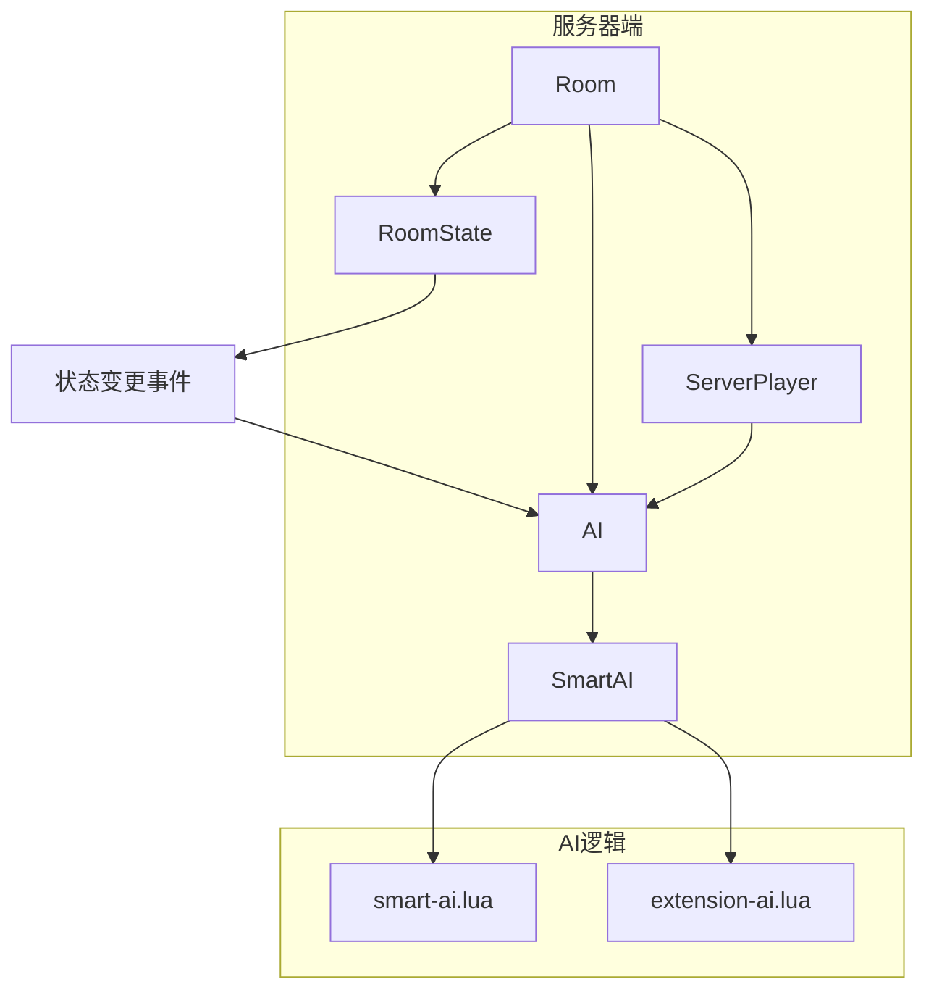
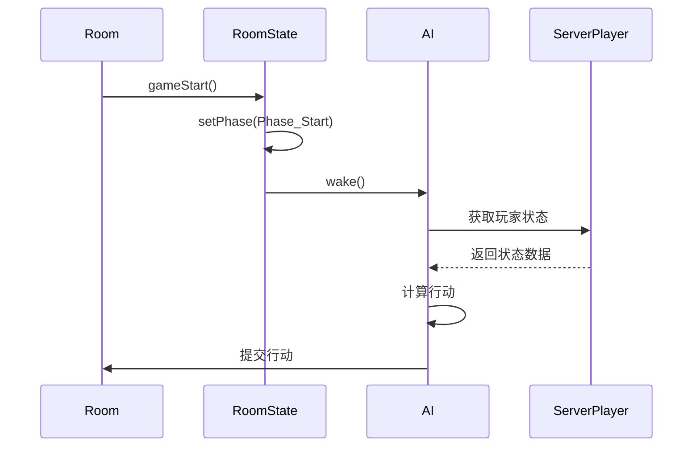
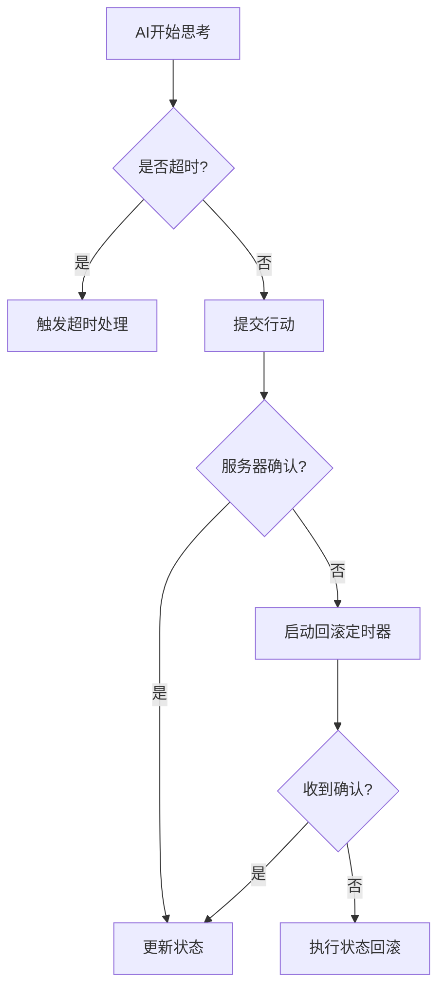
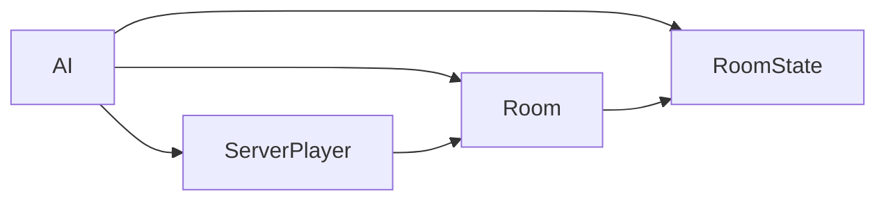

# AI状态同步机制

<cite>
**本文档引用文件**  
- [room.cpp](file://src/server/room.cpp#L83-L115)
- [room.cpp](file://src/server/room.cpp#L311-L362)
- [room.cpp](file://src/server/room.cpp#L3363-L3407)
- [room.cpp](file://src/server/room.cpp#L3866-L3914)
- [ai.h](file://src/server/ai.h)
- [ai.cpp](file://src/server/ai.cpp)
- [serverplayer.h](file://src/server/serverplayer.h)
- [roomstate.h](file://src/core/roomstate.h)
- [smart-ai.lua](file://lua/ai/smart-ai.lua#L221-L266)
- [16-RoleJudgement.lua](file://extension-doc/16-RoleJudgement.lua#L17-L38)
- [16-RoleJudgement.lua](file://extension-doc/16-RoleJudgement.lua#L78-L105)
- [11-Fundamentals.lua](file://extension-doc/11-Fundamentals.lua#L43-L75)
</cite>

## 目录
1. [引言](#引言)
2. [项目结构](#项目结构)
3. [核心组件](#核心组件)
4. [架构概览](#架构概览)
5. [详细组件分析](#详细组件分析)
6. [依赖分析](#依赖分析)
7. [性能考量](#性能考量)
8. [故障排查指南](#故障排查指南)
9. [结论](#结论)

## 引言
本文档详细阐述了《三国杀》AI模块与服务器房间状态之间的同步机制。重点分析AI如何通过ServerPlayer对象监听RoomState变更事件，揭示状态更新的信号触发路径，如`Room::gameStart()` → `RoomState::setPhase()` → `AI::wake()`。同时，探讨了在网络延迟下保障状态一致性的策略，包括AI思考超时处理、动作确认反馈和状态回滚机制。此外，还讨论了多线程环境下的线程安全措施，确保AI行为与客户端显示同步。

## 项目结构
项目采用分层架构，主要分为客户端、服务器、核心逻辑、UI和扩展模块。AI逻辑主要分布在`lua/ai`目录下的Lua脚本中，而服务器端的AI控制逻辑则位于`src/server/ai.cpp`和`ai.h`中。房间状态管理由`src/core/roomstate.*`和`src/server/room.*`实现。



**图示来源**
- [room.cpp](file://src/server/room.cpp#L83-L115)
- [roomstate.h](file://src/core/roomstate.h)
- [ai.h](file://src/server/ai.h)
- [smart-ai.lua](file://lua/ai/smart-ai.lua#L221-L266)

**本节来源**
- [room.cpp](file://src/server/room.cpp#L83-L115)
- [roomstate.h](file://src/core/roomstate.h)

## 核心组件
核心组件包括`Room`、`RoomState`、`ServerPlayer`和`AI`类。`Room`管理整个游戏流程，`RoomState`维护当前游戏阶段，`ServerPlayer`代表玩家实体，`AI`类则封装了AI的行为逻辑。

**本节来源**
- [room.cpp](file://src/server/room.cpp#L311-L362)
- [ai.h](file://src/server/ai.h)
- [serverplayer.h](file://src/server/serverplayer.h)

## 架构概览
系统采用事件驱动架构，`Room`类在状态变更时（如游戏开始、阶段切换）通过回调机制通知相关组件。AI模块通过注册监听器或轮询方式获取状态更新。



**图示来源**
- [room.cpp](file://src/server/room.cpp#L311-L362)
- [roomstate.h](file://src/core/roomstate.h)
- [ai.cpp](file://src/server/ai.cpp)

## 详细组件分析

### AI状态监听机制
AI通过`ServerPlayer`对象获取房间内其他玩家的状态信息。在`smart-ai.lua`的初始化函数中，AI会遍历所有存活玩家并初始化其忠诚度表`sgs.ai_loyalty`和身份表现表`sgs.ai_explicit`。

```lua
function SmartAI:initialize(player)
    self.player = player
    self.room = player:getRoom()
    -- 初始化AI状态表
    for _, p in sgs.qlist(Global_room:getAlivePlayers()) do
        sgs.ai_loyalty[p:objectName()] = 0
        sgs.ai_explicit[p:objectName()] = "unknown"
    end
end
```

**本节来源**
- [smart-ai.lua](file://lua/ai/smart-ai.lua#L221-L266)
- [16-RoleJudgement.lua](file://extension-doc/16-RoleJudgement.lua#L17-L38)

### 状态更新信号路径
当游戏开始时，`Room::gameStart()`被调用，进而触发`RoomState::setPhase()`设置新的游戏阶段。此操作会唤醒所有AI，使其进入思考状态。

```cpp
void Room::gameStart() {
    // ... 游戏开始逻辑
    roomState->setPhase(Phase_Start);
    // 唤醒AI
    foreach (AI *ai, ais) {
        ai->wake();
    }
}
```

**本节来源**
- [room.cpp](file://src/server/room.cpp#L311-L362)
- [ai.cpp](file://src/server/ai.cpp)

### 网络延迟与状态一致性
为应对网络延迟，系统采用状态快照和确认机制。AI在提交行动后，需等待服务器确认。若超时未确认，则触发状态回滚。



**本节来源**
- [room.cpp](file://src/server/room.cpp#L3363-L3407)
- [ai.cpp](file://src/server/ai.cpp)

### 多线程线程安全
在多线程环境下，`Room`类使用`QMutex`保护共享状态。AI在读取状态时需获取锁，确保数据一致性。

```cpp
void Room::pauseCommand(ServerPlayer *player, const QVariant &arg) {
    QMutexLocker locker(&m_mutex); // 加锁
    bool pause = arg.toBool();
    game_paused = pause;
    if (!game_paused)
        m_waitCond.wakeAll(); // 唤醒等待的AI
}
```

**本节来源**
- [room.cpp](file://src/server/room.cpp#L3363-L3407)

## 依赖分析
AI模块依赖于`Room`、`RoomState`和`ServerPlayer`提供的状态信息。Lua脚本通过`sgs`全局对象与C++层交互。



**图示来源**
- [ai.h](file://src/server/ai.h)
- [room.h](file://src/server/room.h)
- [serverplayer.h](file://src/server/serverplayer.h)

## 性能考量
AI思考采用异步非阻塞模式，避免阻塞主线程。状态同步通过增量更新减少网络开销。

## 故障排查指南
- **AI未响应**：检查`wake()`调用是否正常，确认AI线程未被阻塞。
- **状态不一致**：检查锁机制，确保状态读写在临界区内。
- **超时频繁**：优化AI决策算法，减少思考时间。

**本节来源**
- [ai.cpp](file://src/server/ai.cpp)
- [room.cpp](file://src/server/room.cpp#L3363-L3407)

## 结论
AI状态同步机制通过事件驱动和锁机制，有效保障了多线程环境下的状态一致性。结合超时处理和状态回滚，系统在网络延迟下仍能稳定运行。未来可进一步优化AI决策效率，提升整体性能。