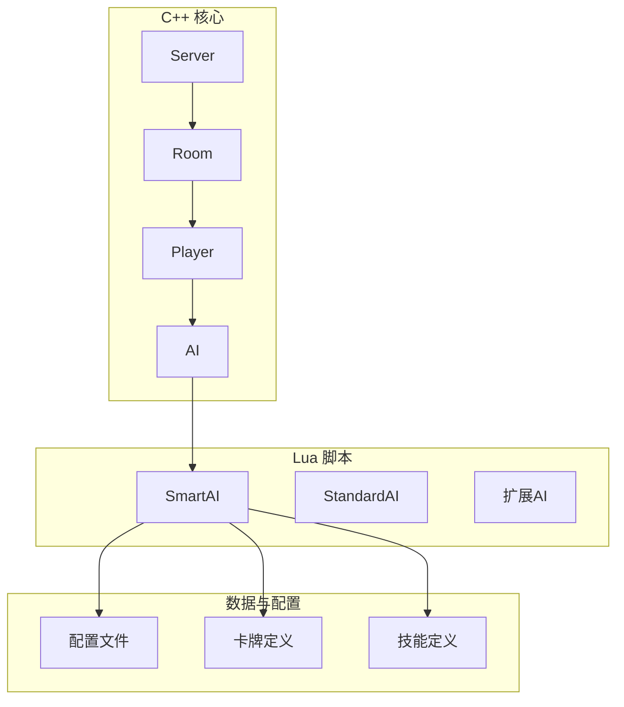
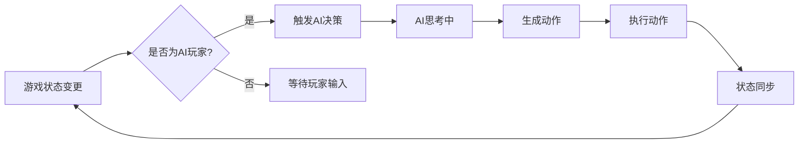
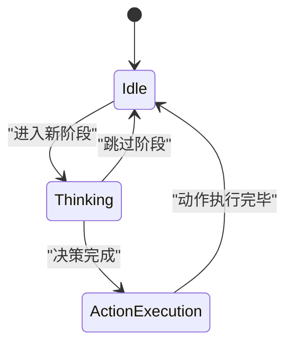
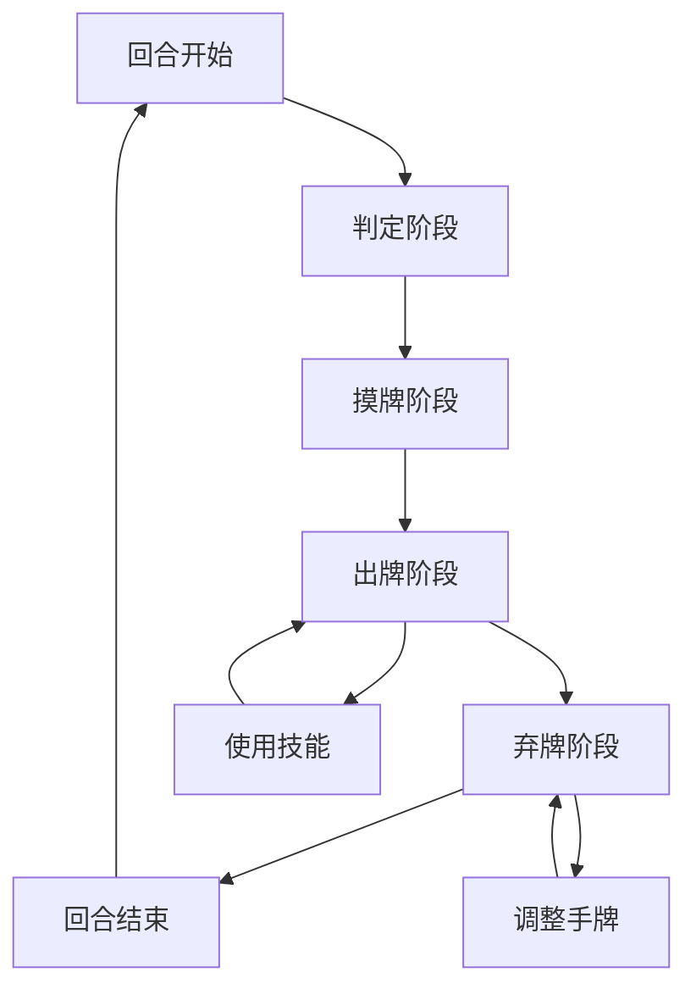
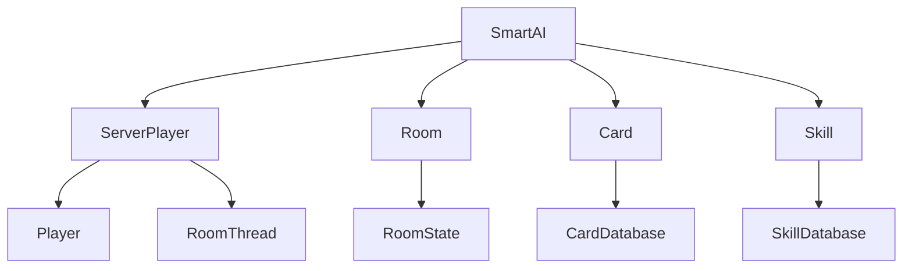

# AI状态管理

<cite>
**本文档引用的文件**   
- [serverplayer.cpp](file://src/server/serverplayer.cpp#L1076-L1212)
- [serverplayer.h](file://src/server/serverplayer.h#L0-L299)
- [smart-ai.lua](file://lua/ai/smart-ai.lua#L263-L1085)
- [roomstate.cpp](file://src/core/roomstate.cpp)
- [roomstate.h](file://src/core/roomstate.h)
- [ai.cpp](file://src/server/ai.cpp)
- [ai.h](file://src/server/ai.h)
</cite>

## 目录
1. [引言](#引言)
2. [项目结构](#项目结构)
3. [核心组件](#核心组件)
4. [架构概述](#架构概述)
5. [详细组件分析](#详细组件分析)
6. [依赖分析](#依赖分析)
7. [性能考量](#性能考量)
8. [故障排除指南](#故障排除指南)
9. [结论](#结论)

## 引言
本文档详细阐述了《三国杀》游戏中AI在游戏状态变迁中的行为响应机制。重点分析AI如何监听RoomState中的currentPhase、currentPlayer等状态变量，说明ServerPlayer::isAI()与AI模块的状态判断逻辑，并描述AI在不同游戏阶段（如判定、出牌、弃牌）的状态迁移路径。通过UML状态图展示AI状态机的“空闲”、“思考中”、“动作执行”等状态转换条件，结合实际代码说明状态同步与网络延迟的处理方式，确保AI行为与游戏节奏一致。

## 项目结构
本项目采用分层架构设计，主要分为客户端、服务端、核心逻辑、Lua脚本和资源文件等模块。AI相关逻辑分布在C++服务端代码和Lua脚本中，形成混合编程架构。



**图示来源**
- [serverplayer.h](file://src/server/serverplayer.h#L0-L299)
- [smart-ai.lua](file://lua/ai/smart-ai.lua)

**本节来源**
- [src/server/serverplayer.h](file://src/server/serverplayer.h#L0-L299)
- [lua/ai/smart-ai.lua](file://lua/ai/smart-ai.lua)

## 核心组件
AI系统由C++服务端的ServerPlayer类和Lua脚本中的SmartAI类共同构成。ServerPlayer负责管理玩家状态和游戏流程，SmartAI负责具体决策逻辑。

**本节来源**
- [serverplayer.cpp](file://src/server/serverplayer.cpp#L1076-L1212)
- [smart-ai.lua](file://lua/ai/smart-ai.lua#L263-L1085)

## 架构概述
AI状态管理系统采用事件驱动架构，通过监听游戏状态变化来触发AI决策流程。



**图示来源**
- [serverplayer.cpp](file://src/server/serverplayer.cpp#L1076-L1212)
- [smart-ai.lua](file://lua/ai/smart-ai.lua#L263-L1085)

## 详细组件分析

### AI状态监听机制分析
AI通过ServerPlayer类的phase机制监听游戏状态变化。当玩家进入不同游戏阶段时，系统会触发相应的事件处理流程。



**图示来源**
- [serverplayer.cpp](file://src/server/serverplayer.cpp#L1076-L1170)

#### AI状态判断逻辑
ServerPlayer类提供了isAI()方法来判断玩家是否为AI控制。在C++代码中，AI状态通过setAI()方法设置，getAI()方法获取。

```cpp
void ServerPlayer::play(QList<Player::Phase> set_phases)
{
    if (!set_phases.isEmpty()) {
        if (!set_phases.contains(NotActive))
            set_phases << NotActive;
    } else
        set_phases << RoundStart << Start << Judge << Draw << Play
        << Discard << Finish << NotActive;

    phases = set_phases;
    _m_phases_state.clear();
    for (int i = 0; i < phases.size(); i++) {
        PhaseStruct _phase;
        _phase.phase = phases[i];
        _m_phases_state << _phase;
    }

    for (int i = 0; i < _m_phases_state.size(); i++) {
        if (isDead()) {
            changePhase(getPhase(), NotActive);
            break;
        }

        _m_phases_index = i;
        PhaseChangeStruct phase_change;
        phase_change.from = getPhase();
        phase_change.to = phases[i];

        RoomThread *thread = room->getThread();
        setPhase(PhaseNone);
        QVariant data = QVariant::fromValue(phase_change);

        bool skip = thread->trigger(EventPhaseChanging, room, this, data);
        room->freeChain();
        phase_change = data.value<PhaseChangeStruct>();
        _m_phases_state[i].phase = phases[i] = phase_change.to;

        setPhase(phases[i]);
        room->broadcastProperty(this, "phase");
```

**图示来源**
- [serverplayer.cpp](file://src/server/serverplayer.cpp#L1076-L1120)

**本节来源**
- [serverplayer.cpp](file://src/server/serverplayer.cpp#L1076-L1120)

#### AI决策流程分析
Lua脚本中的SmartAI类实现了具体的AI决策逻辑。当AI玩家进入新阶段时，系统会调用相应的处理函数。

```lua
function SmartAI:updatePlayers(update, resetAI)
	if not resetAI and self.player:isDead() then return end
	if update ~= false then update = true end

	self.friends = {}
	self.enemies = {}
	self.friends_noself = {}

	sgs.updateAlivePlayerRoles()
	self.role = self.player:getRole()

	if update then
		sgs.gameProcess(true)
	end

	if sgs.isRoleExpose() then
		self.friends = {}
		self.friends_noself = {}
		local friends = sgs.QList2Table(self.lua_ai:getFriends())
		for i = 1, #friends, 1 do
			if friends[i]:isAlive() and friends[i]:objectName() ~= self.player:objectName() then
				table.insert(self.friends, friends[i])
				table.insert(self.friends_noself, friends[i])
			end
		end
		table.insert(self.friends, self.player)

		local enemies = sgs.QList2Table(self.lua_ai:getEnemies())
		for i = 1, #enemies, 1 do
			if enemies[i]:isDead() or enemies[i]:objectName() == self.player:objectName() then table.remove(enemies, i) end
		end
		self.enemies = enemies
```

**图示来源**
- [smart-ai.lua](file://lua/ai/smart-ai.lua#L1041-L1085)

**本节来源**
- [smart-ai.lua](file://lua/ai/smart-ai.lua#L1041-L1085)

### AI状态迁移路径
AI在不同游戏阶段的状态迁移遵循预定义的流程，每个阶段都有相应的处理逻辑。



**图示来源**
- [serverplayer.cpp](file://src/server/serverplayer.cpp#L1076-L1212)

**本节来源**
- [serverplayer.cpp](file://src/server/serverplayer.cpp#L1076-L1212)

## 依赖分析
AI系统依赖于多个核心组件，形成复杂的依赖关系网络。



**图示来源**
- [serverplayer.h](file://src/server/serverplayer.h#L0-L299)
- [smart-ai.lua](file://lua/ai/smart-ai.lua)

**本节来源**
- [serverplayer.h](file://src/server/serverplayer.h#L0-L299)
- [smart-ai.lua](file://lua/ai/smart-ai.lua)

## 性能考量
AI系统的性能主要受决策算法复杂度和网络延迟影响。系统通过异步处理和状态同步机制来优化性能。

**本节来源**
- [serverplayer.cpp](file://src/server/serverplayer.cpp#L1076-L1212)
- [smart-ai.lua](file://lua/ai/smart-ai.lua#L263-L1085)

## 故障排除指南
当AI行为异常时，可检查以下方面：
1. 确认ServerPlayer的AI指针是否正确设置
2. 检查Lua脚本是否正确加载
3. 验证游戏状态同步是否正常
4. 查看日志输出是否有错误信息

**本节来源**
- [serverplayer.cpp](file://src/server/serverplayer.cpp#L1076-L1212)
- [smart-ai.lua](file://lua/ai/smart-ai.lua#L263-L1085)

## 结论
AI状态管理系统通过C++和Lua的混合架构实现了灵活的AI行为控制。ServerPlayer类负责管理游戏状态和流程控制，SmartAI类负责具体决策逻辑。系统采用事件驱动架构，通过监听游戏状态变化来触发AI决策流程，确保AI行为与游戏节奏一致。