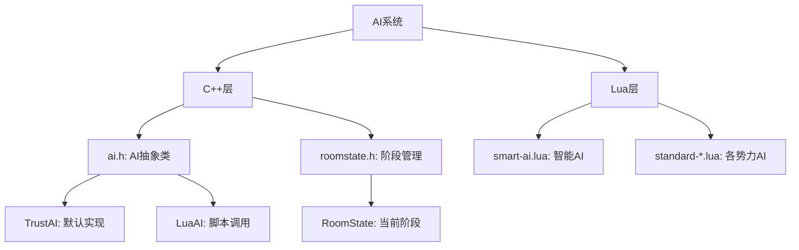
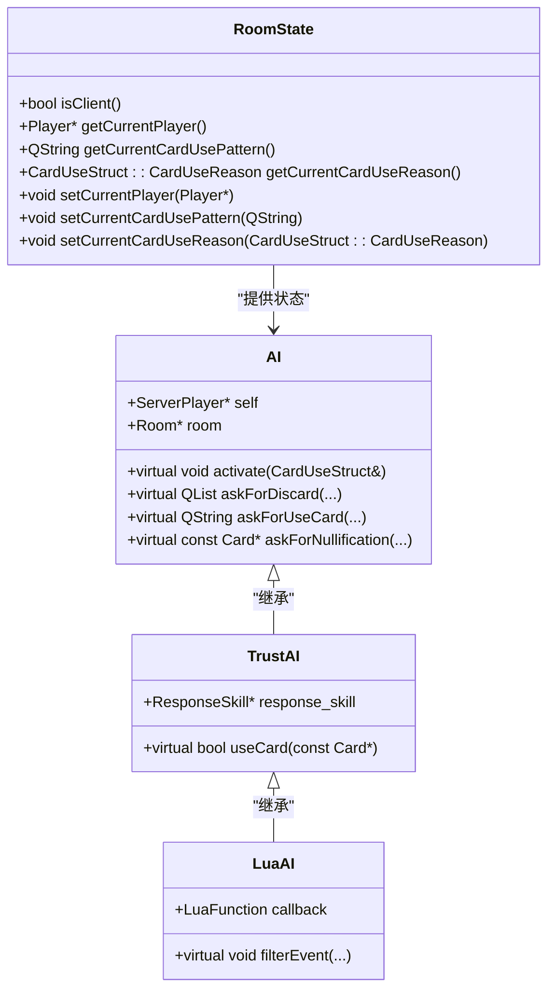
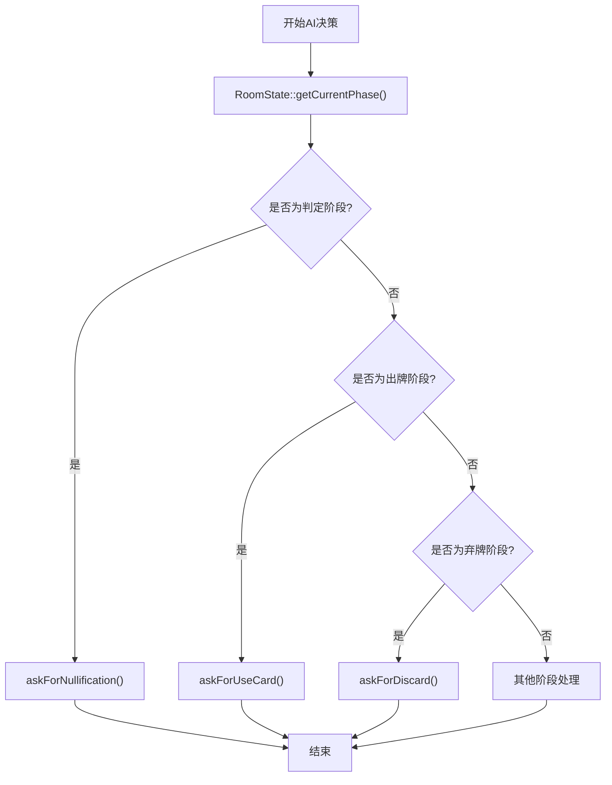
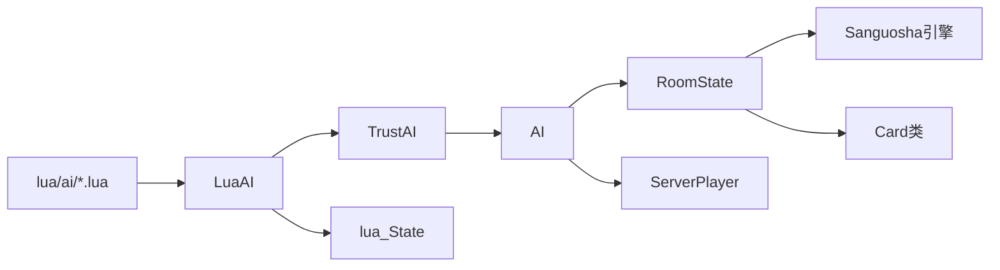

# AI阶段行为响应

<cite>
**本文档引用文件**   
- [ai.h](file://src/server/ai.h#L1-L166)
- [roomstate.h](file://src/core/roomstate.h#L1-L101)
- [roomstate.cpp](file://src/core/roomstate.cpp#L1-L65)
</cite>

## 目录
1. [项目结构](#项目结构)
2. [核心组件](#核心组件)
3. [架构概览](#架构概览)
4. [详细组件分析](#详细组件分析)
5. [依赖分析](#依赖分析)

## 项目结构

本项目为《三国杀》的扩展版本，主要包含客户端、服务端、核心逻辑、Lua脚本、资源文件等模块。AI行为逻辑主要集中在`src/server`和`lua/ai`目录下，其中C++部分定义了AI接口与基础实现，Lua部分实现了具体策略。

关键目录结构如下：
- `src/server/ai.h`：定义AI抽象基类及TrustAI、LuaAI实现
- `src/core/roomstate.h`：房间状态管理，包含当前阶段信息
- `lua/ai/`：各模式AI策略脚本
- `src/core/`：核心数据结构与游戏逻辑



**图示来源**
- [ai.h](file://src/server/ai.h#L1-L166)
- [roomstate.h](file://src/core/roomstate.h#L1-L101)

## 核心组件

AI系统通过`RoomState::getCurrentPhase()`获取当前游戏阶段，并调用相应处理函数。核心组件包括：
- `AI` 抽象类：定义所有AI决策接口
- `RoomState` 类：维护当前游戏状态与阶段
- `LuaAI` 类：连接C++与Lua脚本的桥梁

AI根据当前阶段调用不同方法：
- 判定阶段：`askForCardShow`, `askForNullification`
- 摸牌阶段：无直接接口，由`play()`隐式处理
- 出牌阶段：`askForUseCard`, `activate`
- 弃牌阶段：`askForDiscard`

```cpp
// 伪代码示例：AI阶段响应流程
void AI::play() {
    Phase current = room->getRoomState()->getCurrentPhase();
    switch (current) {
        case Judge:
            handleJudgePhase();
            break;
        case Draw:
            handleDrawPhase();
            break;
        case Play:
            handlePlayPhase();
            break;
        case Discard:
            handleDiscardPhase();
            break;
    }
}
```

**本节来源**
- [ai.h](file://src/server/ai.h#L50-L150)
- [roomstate.h](file://src/core/roomstate.h#L30-L50)

## 架构概览

AI系统采用C++与Lua混合架构，C++层提供稳定接口，Lua层实现灵活策略。`RoomState`作为全局状态管理器，存储当前阶段、当前玩家、卡牌使用模式等信息。



**图示来源**
- [roomstate.h](file://src/core/roomstate.h#L1-L101)
- [ai.h](file://src/server/ai.h#L1-L166)

## 详细组件分析

### AI抽象类分析

`AI`类定义了所有AI决策的纯虚函数，强制子类实现。关键方法包括：

**: askForUseCard**
- 用途：出牌阶段询问AI使用何种卡牌
- 参数：pattern（卡牌模式）、prompt（提示）、method（处理方式）
- 返回：卡牌ID字符串，空字符串表示跳过

**: askForDiscard**
- 用途：弃牌阶段要求AI选择弃牌
- 参数：reason（原因）、discard_num（需弃数量）、min_num（最少数量）、optional（是否可选）、include_equip（是否包含装备）
- 返回：整数列表，表示要弃置的卡牌ID

**: askForNullification**
- 用途：询问是否使用【无懈可击】
- 参数：trick（锦囊牌）、from（来源）、to（目标）、positive（是否正向响应）
- 返回：指向【无懈可击】卡牌的指针，NULL表示不使用



**图示来源**
- [ai.h](file://src/server/ai.h#L70-L140)
- [roomstate.h](file://src/core/roomstate.h#L40-L50)

### RoomState状态管理

`RoomState`类负责维护房间内所有动态对象的状态，包括卡牌、当前玩家、当前阶段等。其核心功能是提供统一的状态查询接口。

**: resetCard**
- 功能：重置指定ID的卡牌状态
- 实现：从引擎获取原始卡牌，复制属性到包装卡牌

**: reset**
- 功能：重置整个房间状态
- 实现：清空所有卡牌，重新从引擎加载

该类确保AI在决策时能访问到最新的游戏状态，避免因状态不一致导致错误决策。

**本节来源**
- [roomstate.cpp](file://src/core/roomstate.cpp#L1-L65)
- [roomstate.h](file://src/core/roomstate.h#L1-L101)

## 依赖分析

AI系统依赖于多个核心组件，形成清晰的依赖链：



主要依赖关系：
- `LuaAI` 依赖于 `TrustAI` 提供基础实现
- 所有AI依赖 `RoomState` 获取当前游戏状态
- `RoomState` 依赖 `Engine` 获取卡牌原型
- `AI` 依赖 `ServerPlayer` 表示自身身份

这种分层设计实现了逻辑与策略的分离，便于维护与扩展。

**图示来源**
- [ai.h](file://src/server/ai.h#L1-L166)
- [roomstate.h](file://src/core/roomstate.h#L1-L101)
- [roomstate.cpp](file://src/core/roomstate.cpp#L1-L65)