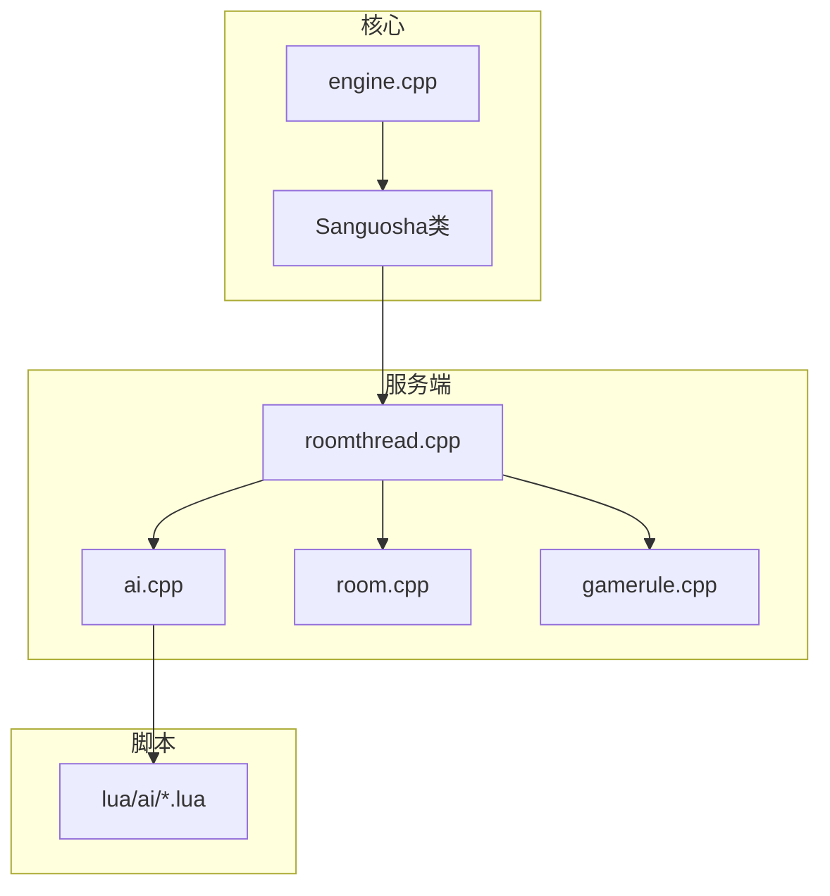
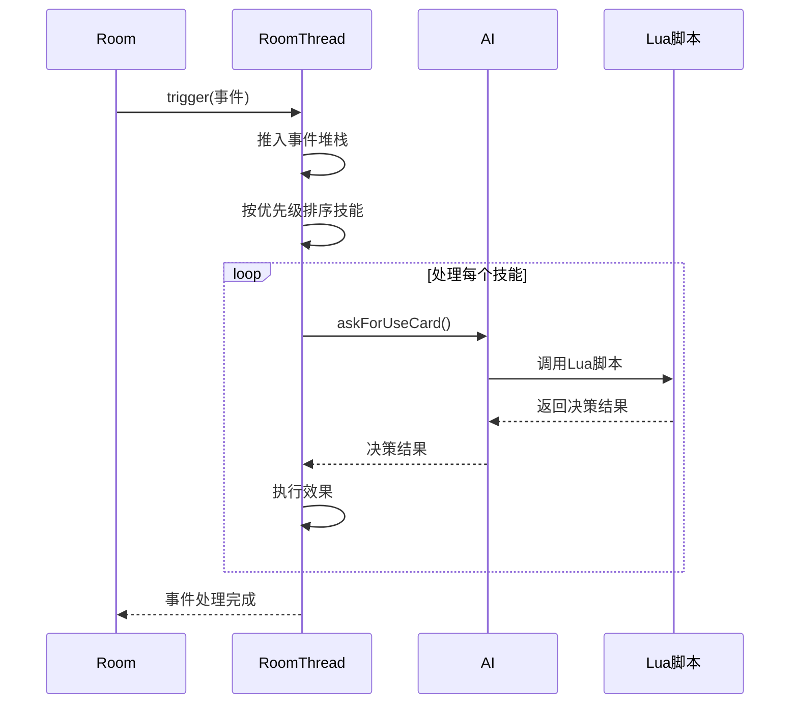
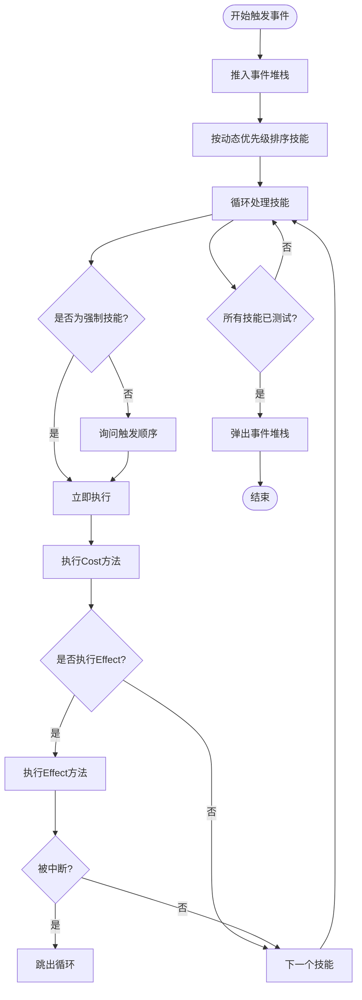
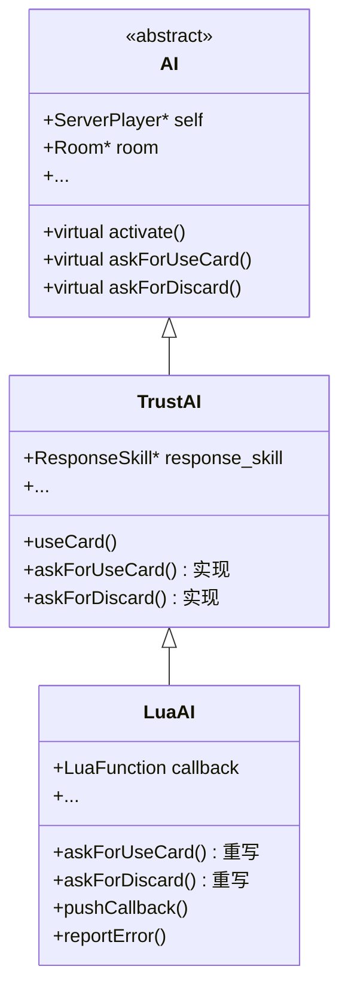
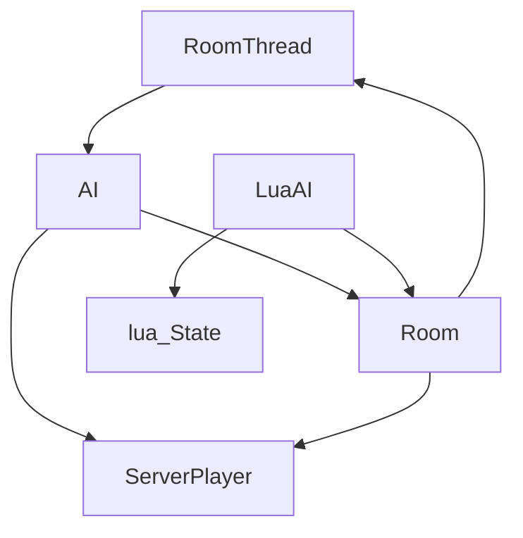

# AI任务调度与事件集成

<cite>
**本文档引用的文件**   
- [roomthread.cpp](file://src/server/roomthread.cpp)
- [roomthread.h](file://src/server/roomthread.h)
- [ai.cpp](file://src/server/ai.cpp)
- [ai.h](file://src/server/ai.h)
- [room.cpp](file://src/server/room.cpp)
</cite>

## 目录
1. [引言](#引言)
2. [项目结构](#项目结构)
3. [核心组件](#核心组件)
4. [架构概述](#架构概述)
5. [详细组件分析](#详细组件分析)
6. [依赖分析](#依赖分析)
7. [性能考虑](#性能考虑)
8. [故障排除指南](#故障排除指南)
9. [结论](#结论)

## 引言
本文档深入解析了《三国杀》游戏中AI任务在事件循环中的调度机制。重点分析了`roomthread`如何将AI决策请求加入任务队列，并与Qt事件循环协同工作，确保AI响应不阻塞主UI线程。文档详细说明了`roomthread.cpp`中通过定时器或信号触发AI计算的实现方式，涵盖了任务优先级管理、超时处理和中断机制。同时，结合具体游戏阶段（如出牌阶段、响应阶段）说明了AI任务的生成与执行流程，并提供了扩展自定义AI行为调度的编程指导。

## 项目结构
项目采用分层架构，主要分为客户端、服务端、核心引擎、UI、Lua脚本和资源文件等模块。服务端核心逻辑位于`src/server`目录下，其中`roomthread.cpp`和`ai.cpp`是实现AI任务调度的关键文件。AI行为逻辑通过Lua脚本（位于`lua/ai`目录）进行配置和扩展，实现了逻辑与数据的分离。

**图示来源**
- [roomthread.cpp](file://src/server/roomthread.cpp)
- [ai.cpp](file://src/server/ai.cpp)
- [room.cpp](file://src/server/room.cpp)

**本节来源**
- [roomthread.cpp](file://src/server/roomthread.cpp)
- [ai.cpp](file://src/server/ai.cpp)

## 核心组件
核心组件包括`RoomThread`、`AI`类及其派生类（`TrustAI`和`LuaAI`）。`RoomThread`继承自`QThread`，负责管理游戏的主事件循环，确保所有游戏逻辑在独立线程中执行，避免阻塞UI。`AI`类是AI行为的抽象基类，定义了所有AI决策的接口。`TrustAI`提供了基础的AI决策实现，而`LuaAI`则通过Lua脚本实现了更智能、可配置的AI行为。

**本节来源**
- [roomthread.h](file://src/server/roomthread.h)
- [ai.h](file://src/server/ai.h)
- [ai.cpp](file://src/server/ai.cpp)

## 架构概述
系统采用事件驱动的架构，`RoomThread`作为核心调度器，管理着一个事件堆栈（`event_stack`）。当游戏事件（如`TurnStart`、`CardUsed`）发生时，`trigger`方法被调用，将事件推入堆栈，并根据预设的优先级顺序触发相应的技能和AI决策。AI决策通过`askFor*`系列方法发起，这些方法在`LuaAI`中被重写，通过调用Lua脚本进行复杂的决策计算。

**图示来源**
- [roomthread.cpp](file://src/server/roomthread.cpp#L300-L700)
- [ai.cpp](file://src/server/ai.cpp#L100-L200)

## 详细组件分析

### RoomThread分析
`RoomThread`是游戏逻辑的执行引擎，它在独立线程中运行`run()`方法，通过`forever`循环驱动游戏进程。`actionNormal`方法实现了标准的游戏回合流程，通过`trigger`方法触发`TurnStart`等事件。`trigger`方法是核心，它管理事件堆栈，按动态优先级排序并执行所有可触发的技能。

#### 触发机制

**图示来源**
- [roomthread.cpp](file://src/server/roomthread.cpp#L300-L700)

**本节来源**
- [roomthread.cpp](file://src/server/roomthread.cpp)
- [roomthread.h](file://src/server/roomthread.h)

### AI系统分析
AI系统采用分层设计，`AI`基类定义了所有决策接口，`TrustAI`提供基础实现，`LuaAI`通过Lua脚本实现高级AI。

#### AI决策流程

**图示来源**
- [ai.h](file://src/server/ai.h#L50-L150)
- [ai.cpp](file://src/server/ai.cpp#L100-L300)

**本节来源**
- [ai.h](file://src/server/ai.h)
- [ai.cpp](file://src/server/ai.cpp)

## 依赖分析
系统各组件间存在紧密的依赖关系。`RoomThread`直接依赖`AI`类来获取AI决策，`AI`类又依赖`Room`和`ServerPlayer`来获取游戏状态。`LuaAI`通过`room->getLuaState()`与Lua虚拟机交互，实现了C++与Lua脚本的深度集成。这种设计使得AI行为可以完全通过脚本配置，极大地提高了系统的灵活性和可扩展性。

**图示来源**
- [roomthread.cpp](file://src/server/roomthread.cpp)
- [ai.cpp](file://src/server/ai.cpp)
- [room.cpp](file://src/server/room.cpp)

**本节来源**
- [roomthread.cpp](file://src/server/roomthread.cpp)
- [ai.cpp](file://src/server/ai.cpp)
- [room.cpp](file://src/server/room.cpp)

## 性能考虑
AI任务调度的性能关键在于避免阻塞主线程。系统通过以下方式保证性能：
1.  **线程分离**：`RoomThread`在独立线程运行，确保UI流畅。
2.  **延迟控制**：`delay`方法（`roomthread.cpp`第698行）允许配置AI响应延迟（`Config.AIDelay`），平衡游戏节奏与性能。
3.  **高效排序**：使用`qStableSort`对触发技能进行排序，保证了事件处理的确定性和效率。
4.  **事件堆栈**：通过`event_stack`管理嵌套事件，防止无限递归。

## 故障排除指南
在开发和调试AI行为时，可能遇到以下问题：

**问题1：AI决策未生效**
- **检查点**：确认`LuaAI`的`callback`是否正确设置。
- **检查点**：检查Lua脚本中的函数名是否与C++中`pushCallback`调用的函数名一致。
- **检查点**：查看日志输出，`reportError`方法会在Lua脚本出错时输出错误信息。

**问题2：游戏逻辑阻塞**
- **检查点**：确认`RoomThread`的`run()`方法没有陷入死循环。
- **检查点**：检查`trigger`方法中是否有技能的`effect`方法返回`true`导致事件中断，但未正确处理。

**问题3：AI行为不符合预期**
- **检查点**：使用`outputEventStack()`方法输出事件堆栈，检查事件触发顺序和技能优先级。
- **检查点**：在`askFor*`方法中添加日志，确认AI决策流程。

**本节来源**
- [roomthread.cpp](file://src/server/roomthread.cpp#L698)
- [ai.cpp](file://src/server/ai.cpp#L500)
- [room.cpp](file://src/server/room.cpp#L1000)

## 结论
本文档详细解析了《三国杀》游戏中AI任务的调度与事件集成机制。`RoomThread`作为核心调度器，通过事件驱动和优先级排序，确保了游戏逻辑的有序执行。AI系统通过`AI`基类和`LuaAI`的组合，实现了灵活、可扩展的AI行为。整个系统设计精巧，通过线程分离和脚本化，既保证了性能，又提供了强大的自定义能力，为开发和扩展AI行为提供了清晰的指导。