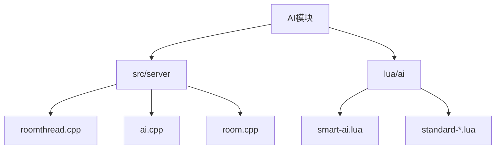
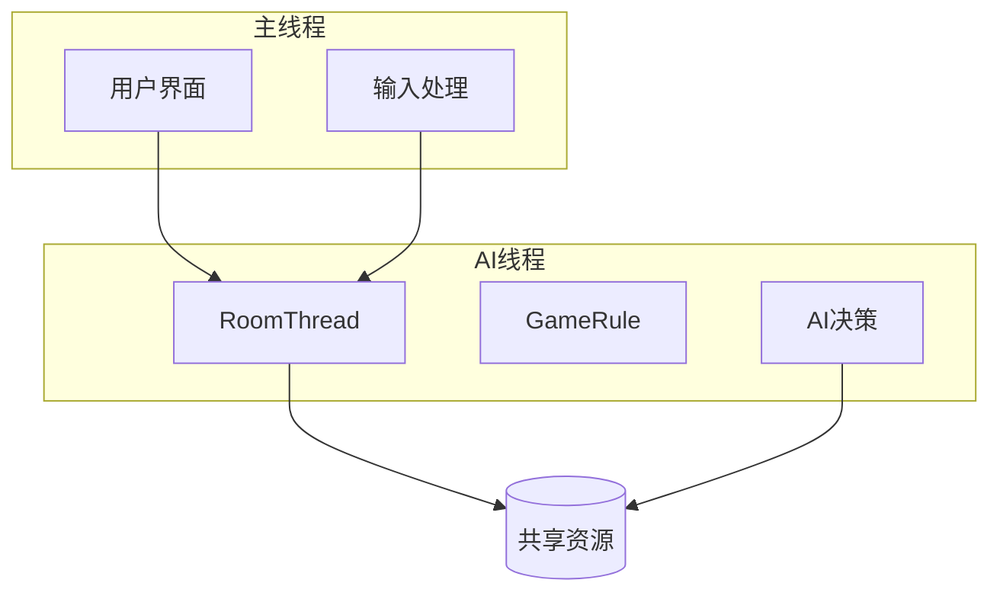
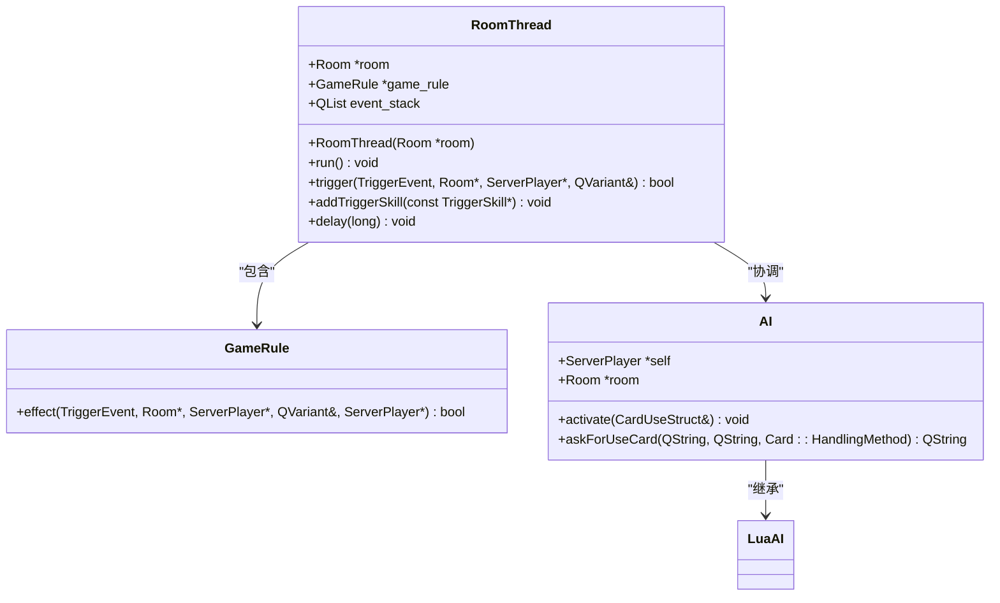
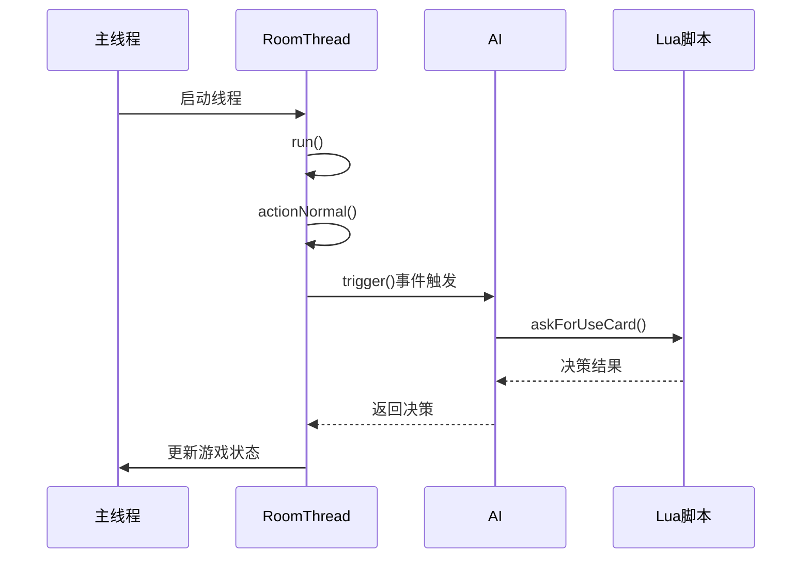
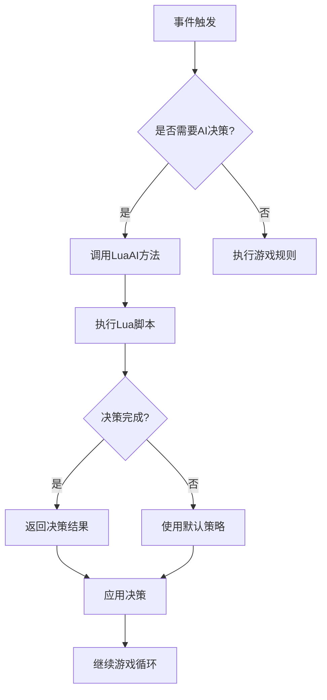
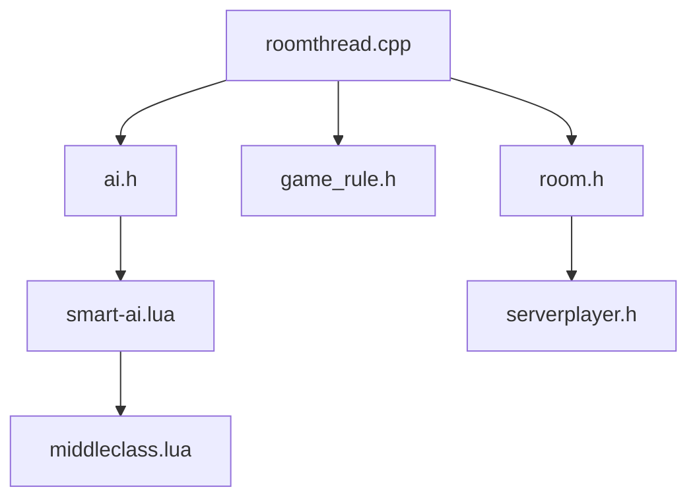

# AI线程模型

<cite>
**本文档中引用的文件**   
- [roomthread.cpp](file://src/server/roomthread.cpp)
- [roomthread.h](file://src/server/roomthread.h)
- [ai.cpp](file://src/server/ai.cpp)
- [ai.h](file://src/server/ai.h)
- [smart-ai.lua](file://lua/ai/smart-ai.lua)
</cite>

## 目录
1. [项目结构](#项目结构)
2. [核心组件](#核心组件)
3. [架构概述](#架构概述)
4. [详细组件分析](#详细组件分析)
5. [依赖分析](#依赖分析)
6. [性能考虑](#性能考虑)
7. [故障排除指南](#故障排除指南)

## 项目结构

项目结构遵循功能模块化组织方式，主要分为AI逻辑、服务器核心、Lua脚本和资源文件等部分。AI决策逻辑主要分布在`src/server`和`lua/ai`目录下。



**图源**
- [roomthread.cpp](file://src/server/roomthread.cpp#L1-L705)
- [smart-ai.lua](file://lua/ai/smart-ai.lua#L1-L799)

**本节来源**
- [roomthread.cpp](file://src/server/roomthread.cpp#L1-L705)
- [smart-ai.lua](file://lua/ai/smart-ai.lua#L1-L799)

## 核心组件

AI线程模型的核心是`RoomThread`类，它继承自`QThread`，负责管理游戏主循环和AI决策的执行。AI决策通过`LuaAI`类与Lua脚本交互，实现智能决策。

**本节来源**
- [roomthread.h](file://src/server/roomthread.h#L1-L83)
- [ai.h](file://src/server/ai.h#L1-L167)

## 架构概述

系统采用多线程架构，其中`RoomThread`作为独立线程运行游戏主循环，与主线程分离，确保游戏流畅性。



**图源**
- [roomthread.cpp](file://src/server/roomthread.cpp#L1-L705)
- [ai.cpp](file://src/server/ai.cpp#L1-L553)

## 详细组件分析

### RoomThread分析

`RoomThread`类是AI决策的核心执行环境，它通过事件驱动机制协调AI计算与游戏主循环。

#### 类图


**图源**
- [roomthread.h](file://src/server/roomthread.h#L1-L83)
- [ai.h](file://src/server/ai.h#L1-L167)

#### 执行流程


**图源**
- [roomthread.cpp](file://src/server/roomthread.cpp#L1-L705)
- [ai.cpp](file://src/server/ai.cpp#L1-L553)

**本节来源**
- [roomthread.cpp](file://src/server/roomthread.cpp#L1-L705)
- [ai.cpp](file://src/server/ai.cpp#L1-L553)

### AI决策机制分析

AI决策采用分层架构，C++层提供基础接口，Lua层实现具体智能算法。

#### 决策流程图


**图源**
- [ai.cpp](file://src/server/ai.cpp#L1-L553)
- [smart-ai.lua](file://lua/ai/smart-ai.lua#L1-L799)

**本节来源**
- [ai.cpp](file://src/server/ai.cpp#L1-L553)
- [smart-ai.lua](file://lua/ai/smart-ai.lua#L1-L799)

## 依赖分析

系统各组件间存在明确的依赖关系，确保AI决策与游戏逻辑的正确集成。



**图源**
- [roomthread.cpp](file://src/server/roomthread.cpp#L1-L705)
- [ai.h](file://src/server/ai.h#L1-L167)

**本节来源**
- [roomthread.cpp](file://src/server/roomthread.cpp#L1-L705)
- [ai.h](file://src/server/ai.h#L1-L167)

## 性能考虑

### 防卡顿策略

系统采用多种策略防止AI计算导致界面卡顿：

1. **异步处理**：AI决策在独立线程中执行，不阻塞主线程
2. **延迟控制**：通过`delay()`方法控制AI响应时间
3. **分步决策**：复杂决策分解为多个小步骤

```cpp
void RoomThread::delay(long secs)
{
    if (secs == -1) secs = Config.AIDelay;
    Q_ASSERT(secs >= 0);
    if (room->property("to_test").toString().isEmpty() && Config.AIDelay > 0)
        msleep(secs);
}
```

4. **任务队列**：使用事件堆栈管理决策请求

```cpp
QList<EventTriplet> event_stack;
```

### 高并发优化建议

1. **线程池**：为大量AI玩家创建线程池，避免线程过度创建
2. **决策缓存**：缓存常见局面的决策结果
3. **优先级调度**：为关键决策设置更高优先级
4. **资源锁定**：使用互斥锁保护共享资源访问

**本节来源**
- [roomthread.cpp](file://src/server/roomthread.cpp#L1-L705)

## 故障排除指南

### 常见问题

1. **AI响应延迟过高**
   - 检查`Config.AIDelay`配置值
   - 确认Lua脚本执行效率

2. **线程同步问题**
   - 检查共享资源访问是否使用适当同步机制
   - 验证事件堆栈操作的线程安全性

3. **决策逻辑错误**
   - 检查Lua脚本回调函数实现
   - 验证AI决策接口调用参数

### 调试方法

1. 启用调试模式查看决策过程
2. 使用`outputEventStack()`分析事件流
3. 监控线程状态和资源使用情况

**本节来源**
- [roomthread.cpp](file://src/server/roomthread.cpp#L1-L705)
- [ai.cpp](file://src/server/ai.cpp#L1-L553)