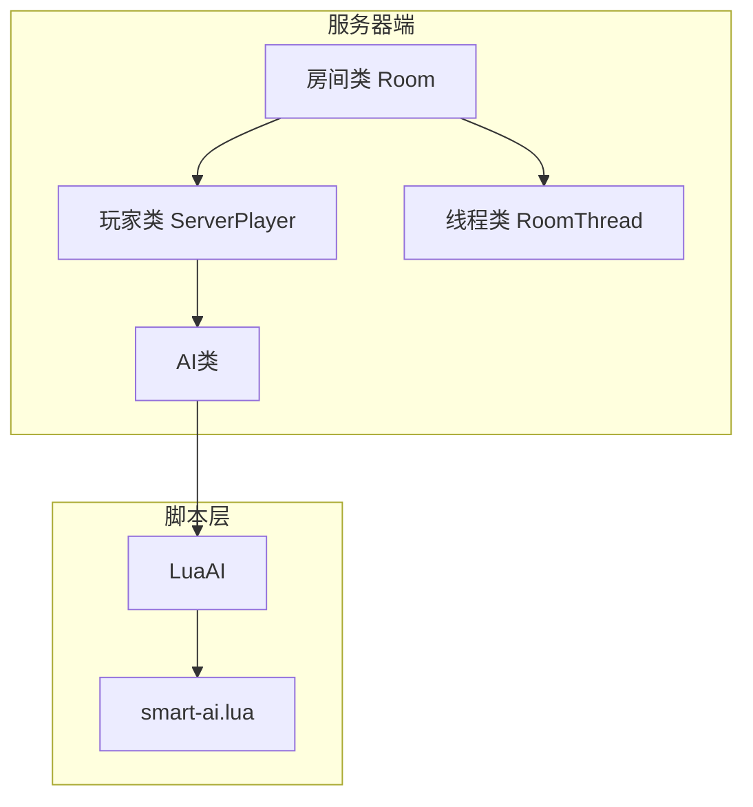
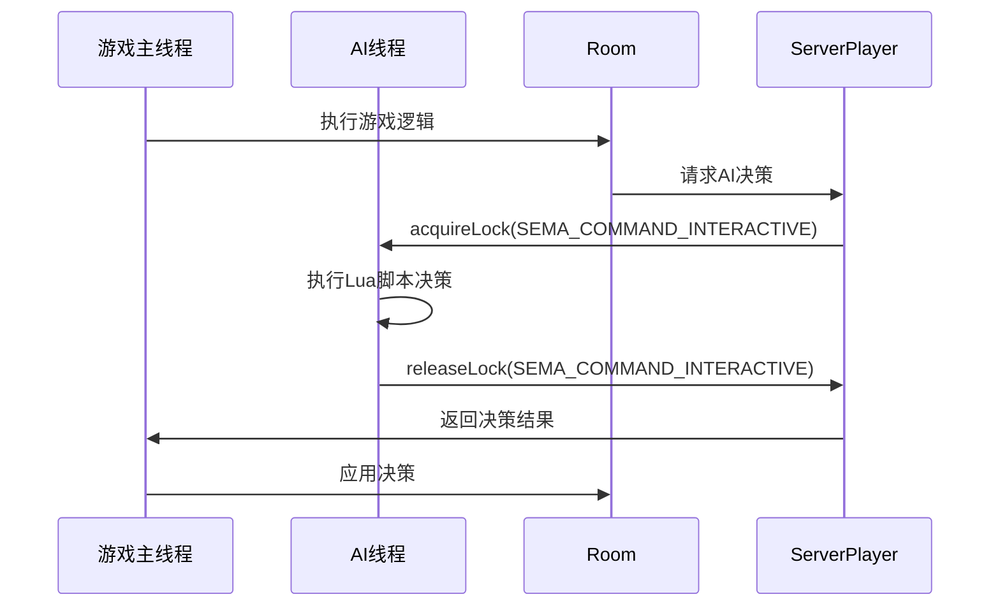
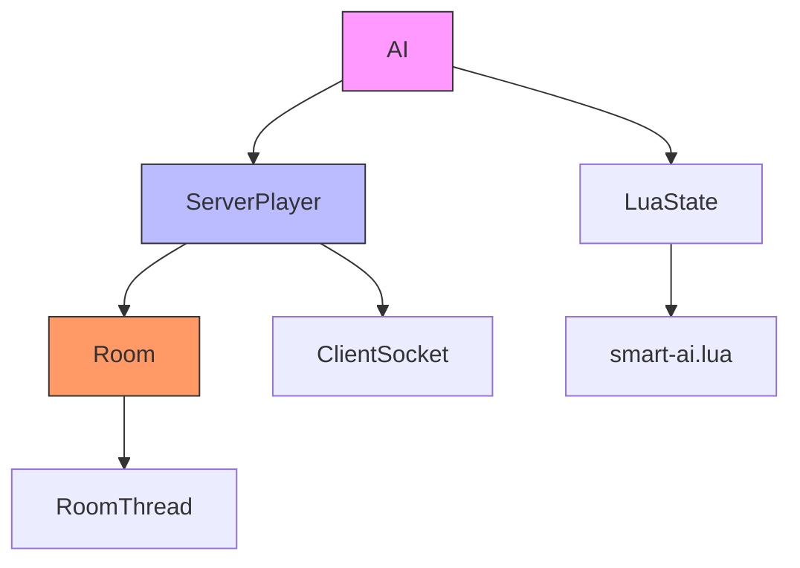

# 线程安全与同步机制

<cite>
**本文档引用文件**   
- [ai.cpp](file://src/server/ai.cpp)
- [ai.h](file://src/server/ai.h)
- [serverplayer.h](file://src/server/serverplayer.h)
- [serverplayer.cpp](file://src/server/serverplayer.cpp)
- [room.cpp](file://src/server/room.cpp)
- [smart-ai.lua](file://lua/ai/smart-ai.lua)
</cite>

## 目录
1. [引言](#引言)
2. [项目结构](#项目结构)
3. [核心组件](#核心组件)
4. [架构概述](#架构概述)
5. [详细组件分析](#详细组件分析)
6. [依赖分析](#依赖分析)
7. [性能考虑](#性能考虑)
8. [故障排除指南](#故障排除指南)
9. [结论](#结论)

## 引言
本文档详细分析了《三国杀》游戏服务器中AI线程与游戏主线程之间的资源共享与同步策略。重点阐述了在Qt多线程环境下，如何通过互斥锁（QMutex）、信号槽机制以及信号量（QSemaphore）保障玩家状态、卡牌堆、房间状态等共享数据的线程安全。文档结合了C++和Lua代码实现，深入探讨了临界区保护、死锁预防以及跨线程通信机制。

## 项目结构
项目采用分层架构，主要分为客户端、服务器、核心引擎、UI和Lua脚本等模块。服务器端是多线程设计的核心，其中`src/server`目录包含了处理游戏逻辑、玩家连接和AI决策的关键代码。



**图示来源**
- [serverplayer.h](file://src/server/serverplayer.h)
- [ai.h](file://src/server/ai.h)
- [room.cpp](file://src/server/room.cpp)

**本节来源**
- [serverplayer.h](file://src/server/serverplayer.h)
- [ai.h](file://src/server/ai.h)

## 核心组件
核心组件包括`ServerPlayer`、`Room`和`AI`类。`ServerPlayer`代表一个在线玩家，持有其状态和连接信息。`Room`类管理整个游戏房间的状态和流程。`AI`类是AI决策的基类，`LuaAI`继承自`TrustAI`，通过Lua脚本实现智能决策。

**本节来源**
- [serverplayer.h](file://src/server/serverplayer.h#L24)
- [ai.h](file://src/server/ai.h#L38)
- [room.h](file://src/server/room.h#L667)

## 架构概述
系统采用生产者-消费者模式和事件驱动架构。游戏主线程负责处理游戏逻辑和状态变更，AI线程负责执行决策。两者通过共享的`Room`和`ServerPlayer`对象进行数据交换，并通过信号量和互斥锁进行同步。



**图示来源**
- [serverplayer.h](file://src/server/serverplayer.h#L240-L250)
- [ai.cpp](file://src/server/ai.cpp#L30-L34)
- [smart-ai.lua](file://lua/ai/smart-ai.lua#L263-L312)

## 详细组件分析

### AI与游戏线程同步机制分析
AI决策与游戏主线程的同步是通过`ServerPlayer`类中的信号量（QSemaphore）实现的。当游戏需要AI做出决策时，会调用AI的相应方法，该方法会尝试获取`SEMA_COMMAND_INTERACTIVE`信号量。

#### 信号量同步机制
```mermaid
classDiagram
class ServerPlayer {
+enum SemaphoreType { SEMA_MUTEX, SEMA_COMMAND_INTERACTIVE }
+acquireLock(type)
+releaseLock(type)
+m_isWaitingReply bool
+m_clientResponse QVariant
}
class AI {
+Room *room
+ServerPlayer *self
+virtual askForUseCard(...) = 0
}
class LuaAI {
+LuaFunction callback
+askForUseCard(...)
}
ServerPlayer --> AI : "拥有"
AI <|-- LuaAI : "继承"
```

**图示来源**
- [serverplayer.h](file://src/server/serverplayer.h#L240-L290)
- [ai.h](file://src/server/ai.h#L38-L84)

**本节来源**
- [serverplayer.h](file://src/server/serverplayer.h#L240-L290)
- [ai.h](file://src/server/ai.h#L38-L84)

#### AI决策读取玩家信息实现
在`src/server/ai.cpp`中，AI的构造函数接收一个`ServerPlayer`指针，并通过该指针访问`Room`对象，从而读取游戏状态。

```cpp
AI::AI(ServerPlayer *player)
    : self(player)
{
    room = player->getRoom();
}
```
此代码片段展示了AI如何通过`self`指针安全地访问`Room`对象。由于`room`指针是在构造时获取的，且`Room`对象的生命周期长于AI对象，因此避免了悬空指针问题。

在`LuaAI`中，当调用`askForUseCard`等方法时，会通过`room->getLuaState()`获取Lua状态机，并调用注册的Lua回调函数。整个过程在获取`SEMA_COMMAND_INTERACTIVE`信号量后执行，确保了在决策期间玩家状态不会被其他线程修改。

**本节来源**
- [ai.cpp](file://src/server/ai.cpp#L30-L34)
- [ai.cpp](file://src/server/ai.cpp#L480-L495)
- [smart-ai.lua](file://lua/ai/smart-ai.lua#L263-L312)

### 临界区保护与死锁预防
临界区保护主要通过`QSemaphore`实现。`ServerPlayer`定义了两种信号量：`SEMA_MUTEX`用于保护成员变量的互斥访问，`SEMA_COMMAND_INTERACTIVE`用于等待客户端响应。

死锁预防措施包括：
1. **明确的锁获取顺序**：代码中没有发现复杂的多锁嵌套，降低了死锁风险。
2. **超时机制**：`tryAcquireLock`方法支持超时，防止无限期等待。
3. **锁的粒度控制**：信号量的使用集中在`ServerPlayer`的特定操作上，避免了大范围的锁竞争。

```cpp
// 在room.cpp中处理客户端回复
void Room::processClientReply(ServerPlayer *player, const Packet &packet)
{
    player->acquireLock(ServerPlayer::SEMA_MUTEX);
    // ... 处理回复 ...
    player->releaseLock(ServerPlayer::SEMA_MUTEX);
}
```
此代码展示了如何在处理客户端回复时使用`SEMA_MUTEX`保护玩家状态。

**本节来源**
- [serverplayer.h](file://src/server/serverplayer.h#L240-L250)
- [room.cpp](file://src/server/room.cpp#L4094-L4137)

## 依赖分析
系统的主要依赖关系如下：



**图示来源**
- [ai.h](file://src/server/ai.h#L38)
- [serverplayer.h](file://src/server/serverplayer.h#L24)
- [room.h](file://src/server/room.h#L667)

**本节来源**
- [ai.h](file://src/server/ai.h#L38)
- [serverplayer.h](file://src/server/serverplayer.h#L24)
- [room.h](file://src/server/room.h#L667)

## 性能考虑
- **信号量开销**：`QSemaphore`是轻量级的同步原语，性能开销较小。
- **Lua调用开销**：通过`lua_pcall`调用Lua函数存在一定的性能开销，但通过`callback`缓存机制进行了优化。
- **避免频繁锁竞争**：信号量主要用于关键的决策点，而非频繁的状态查询，减少了锁竞争。

## 故障排除指南
### 常见并发问题及调试方法
1. **竞态条件**：
   - **现象**：玩家状态不一致，如血量显示错误。
   - **调试**：在`ServerPlayer`的`setHp`等方法中添加日志，检查是否在未加锁的情况下被调用。
   - **修复**：确保所有对`ServerPlayer`成员变量的修改都通过`acquireLock`和`releaseLock`保护。

2. **数据不一致**：
   - **现象**：AI做出的决策与当前游戏状态不符。
   - **调试**：在`LuaAI`的回调函数中打印`self.room`和`self.player`的状态，确认数据是否最新。
   - **修复**：检查`SEMA_COMMAND_INTERACTIVE`信号量是否正确释放，确保AI决策时状态未被修改。

3. **死锁**：
   - **现象**：游戏卡死，无响应。
   - **调试**：使用调试器检查线程状态，查看哪个线程在等待哪个信号量。
   - **修复**：确保`acquireLock`和`releaseLock`成对出现，避免在持有锁时调用可能阻塞的函数。

**本节来源**
- [serverplayer.h](file://src/server/serverplayer.h#L240-L250)
- [ai.cpp](file://src/server/ai.cpp#L480-L495)

## 结论
本系统通过`QSemaphore`实现了AI线程与游戏主线程的安全同步。`ServerPlayer`类作为共享资源的中心，通过信号量机制有效地保护了临界区。`LuaAI`的设计将复杂的决策逻辑交由Lua脚本处理，同时保证了C++层的线程安全。这种设计既保证了游戏的稳定性和公平性，又提供了高度的AI可扩展性。