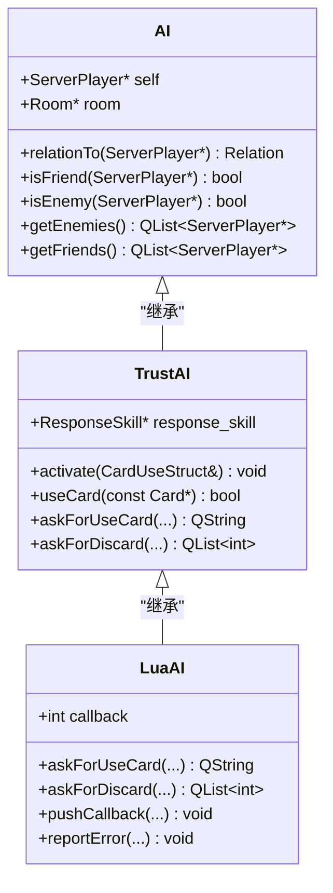
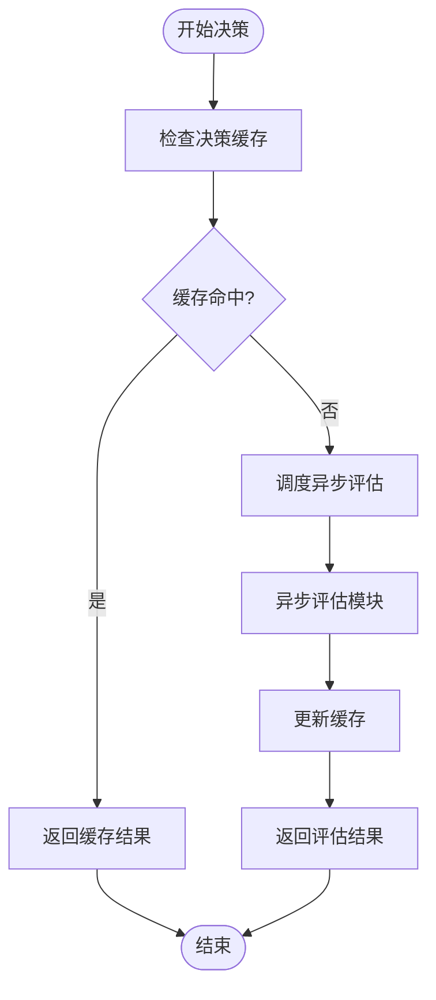

# 高并发AI性能优化

<cite>
**本文档引用文件**   
- [engine.cpp](file://src/core/engine.cpp#L1-L1201)
- [ai.cpp](file://src/server/ai.cpp#L1-L553)
- [ai.h](file://src/server/ai.h#L1-L200)
- [serverplayer.h](file://src/server/serverplayer.h#L1-L150)
- [room.h](file://src/server/room.h#L1-L300)
</cite>

## 目录
1. [引言](#引言)
2. [项目结构分析](#项目结构分析)
3. [核心组件分析](#核心组件分析)
4. [AI决策性能瓶颈分析](#ai决策性能瓶颈分析)
5. [优化策略与实施方案](#优化策略与实施方案)
6. [Qt线程池并行优化](#qt线程池并行优化)
7. [性能监控指标](#性能监控指标)
8. [结论](#结论)

## 引言
本文档针对《三国杀：霸业》游戏中多AI玩家并行决策的性能优化需求，深入分析当前AI计算的时间复杂度瓶颈。基于`engine.cpp`中的全局状态访问开销，提出分步决策、异步评估与结果缓存等技术的可行性方案。结合Qt线程池（QThreadPool）提供具体的并行度优化实施方案与代码示例，旨在提升高并发场景下的AI响应效率与系统稳定性。

## 项目结构分析
项目采用模块化分层架构，主要包含核心引擎、服务器逻辑、客户端界面、Lua脚本扩展等部分。AI决策逻辑主要分布在`src/server/ai.cpp`中，通过Lua脚本进行行为配置，并与核心引擎`src/core/engine.cpp`进行状态交互。

```mermaid
graph TB
subgraph "核心引擎"
Engine[engine.cpp]
Card[card.h]
Player[player.h]
end
subgraph "服务器逻辑"
AI[ai.cpp]
ServerPlayer[serverplayer.h]
Room[room.h]
end
subgraph "脚本扩展"
LuaAI[lua/ai/*.lua]
ConfigLua[config.lua]
end
Engine --> AI : "状态查询"
AI --> ServerPlayer : "玩家操作"
AI --> Room : "房间状态"
LuaAI --> AI : "行为策略"
```

**图示来源**
- [engine.cpp](file://src/core/engine.cpp#L1-L1201)
- [ai.cpp](file://src/server/ai.cpp#L1-L553)
- [room.h](file://src/server/room.h#L1-L300)

**本节来源**
- [engine.cpp](file://src/core/engine.cpp#L1-L50)
- [ai.cpp](file://src/server/ai.cpp#L1-L50)

## 核心组件分析
### AI决策核心类
AI系统以`AI`基类为核心，`TrustAI`和`LuaAI`为其具体实现。`LuaAI`通过调用Lua脚本实现智能决策，而`TrustAI`提供基础行为逻辑。



**图示来源**
- [ai.cpp](file://src/server/ai.cpp#L50-L200)
- [ai.h](file://src/server/ai.h#L50-L100)

**本节来源**
- [ai.cpp](file://src/server/ai.cpp#L1-L200)
- [ai.h](file://src/server/ai.h#L1-L150)

### 全局状态管理
`Engine`类作为全局单例（`Sanguosha`），管理游戏核心状态，包括卡牌、武将、房间等。其线程安全通过`QMutex`保护的`m_rooms`映射实现。

```cpp
void Engine::registerRoom(QObject *room) {
    m_mutex.lock();
    m_rooms[QThread::currentThread()] = room;
    m_mutex.unlock();
}

QObject *Engine::currentRoomObject() {
    QObject *room = NULL;
    m_mutex.lock();
    room = m_rooms[QThread::currentThread()];
    Q_ASSERT(room);
    m_mutex.unlock();
    return room;
}
```

**本节来源**
- [engine.cpp](file://src/core/engine.cpp#L400-L420)

## AI决策性能瓶颈分析
### 时间复杂度瓶颈
当前AI决策的主要瓶颈在于：
1. **频繁的全局状态查询**：每次决策需通过`currentRoom()`、`currentRoomState()`等函数获取房间状态
2. **同步Lua脚本调用**：`LuaAI::askForUseCard`等方法直接调用Lua脚本，阻塞主线程
3. **重复计算**：相同局面下的决策未进行缓存，导致重复计算

### 跨线程状态访问开销
`Engine::currentRoomObject()`使用互斥锁保护`m_rooms`映射，但在高并发AI决策场景下，大量线程竞争同一互斥锁将导致严重性能下降。

```cpp
QObject *Engine::currentRoomObject() {
    QObject *room = NULL;
    m_mutex.lock();  // 潜在的锁竞争瓶颈
    room = m_rooms[QThread::currentThread()];
    Q_ASSERT(room);
    m_mutex.unlock();
    return room;
}
```

**本节来源**
- [engine.cpp](file://src/core/engine.cpp#L410-L420)
- [ai.cpp](file://src/server/ai.cpp#L300-L350)

## 优化策略与实施方案
### 分步决策（Incremental Decision Making）
将复杂的决策过程分解为多个阶段，避免一次性计算所有可能动作。

```cpp
// 示例：分步出牌决策
void IncrementalAI::stepwiseDecision() {
    // 第一阶段：确定决策类型
    if (needBasicAction()) {
        stage = BASIC_ACTION;
    } else if (needResponse()) {
        stage = RESPONSE;
    }
    
    // 第二阶段：在确定类型后进行具体选择
    switch (stage) {
        case BASIC_ACTION:
            executeBasicAction();
            break;
        case RESPONSE:
            executeResponse();
            break;
    }
}
```

### 异步评估与结果缓存
引入异步任务队列和决策缓存机制，避免重复计算。



**图示来源**
- [ai.cpp](file://src/server/ai.cpp#L250-L300)

### 减少跨线程状态查询
建议通过以下方式减少`Engine`中全局状态查询频率：
1. **缓存房间引用**：在AI初始化时获取并缓存`Room`指针
2. **批量状态获取**：一次性获取所需的所有状态数据
3. **本地状态副本**：维护AI线程本地的状态快照

```cpp
class OptimizedAI : public AI {
private:
    Room* cachedRoom;  // 缓存房间引用
    RoomState* cachedState;
    
public:
    OptimizedAI(ServerPlayer* player) : AI(player) {
        cachedRoom = player->getRoom();  // 初始化时获取
        cachedState = cachedRoom->getRoomState();
    }
    
    // 使用缓存引用，避免频繁查询
    QList<ServerPlayer*> getVisiblePlayers() {
        return cachedRoom->getAlivePlayers();
    }
};
```

**本节来源**
- [engine.cpp](file://src/core/engine.cpp#L400-L420)
- [ai.cpp](file://src/server/ai.cpp#L50-L100)

## Qt线程池并行优化
### QThreadPool实施方案
使用Qt线程池管理AI决策任务，控制并发度，避免资源耗尽。

```cpp
#include <QThreadPool>
#include <QRunnable>

class AITask : public QRunnable {
private:
    ServerPlayer* player;
    QString decisionResult;
    
public:
    AITask(ServerPlayer* p) : player(p) {
        setAutoDelete(true);
    }
    
    void run() override {
        // 执行AI决策逻辑
        LuaAI* ai = qobject_cast<LuaAI*>(player->getAI());
        if (ai) {
            decisionResult = ai->askForUseCard("slash", "use-slash", Card::MethodUse);
        }
        
        // 通过信号或回调通知主线程
        emitDecisionComplete();
    }
    
signals:
    void decisionComplete(const QString& result);
};

// 使用示例
void dispatchAITasks(QList<ServerPlayer*> players) {
    QThreadPool* pool = QThreadPool::globalInstance();
    pool->setMaxThreadCount(4);  // 限制最大线程数
    
    foreach (ServerPlayer* player, players) {
        AITask* task = new AITask(player);
        pool->start(task);
    }
}
```

### 性能调优参数
| 参数 | 建议值 | 说明 |
|------|--------|------|
| 最大线程数 | CPU核心数 | 避免过度并行导致上下文切换开销 |
| 任务队列容量 | 10-20 | 防止内存溢出 |
| 任务优先级 | NormalPriority | 确保UI响应性 |

**本节来源**
- [ai.cpp](file://src/server/ai.cpp#L1-L553)
- [serverplayer.h](file://src/server/serverplayer.h#L1-L150)

## 性能监控指标
### 关键性能指标
- **AI响应延迟**：从决策请求到结果返回的时间
- **CPU占用率**：AI计算期间的CPU使用情况
- **内存使用量**：AI任务的内存消耗
- **线程池利用率**：实际使用的线程数与最大线程数之比

### 测量方式
```cpp
#include <QElapsedTimer>
#include <QThread>

class PerformanceMonitor {
public:
    static void measureAIDelay(std::function<void()> aiTask) {
        QElapsedTimer timer;
        timer.start();
        
        aiTask();
        
        qint64 elapsed = timer.nsecsElapsed();
        qDebug() << "AI决策耗时:" << elapsed << "纳秒";
    }
    
    static void logThreadInfo() {
        QThreadPool* pool = QThreadPool::globalInstance();
        qDebug() << "活跃线程:" << pool->activeThreadCount()
                 << "最大线程:" << pool->maxThreadCount();
    }
};
```

**本节来源**
- [ai.cpp](file://src/server/ai.cpp#L300-L350)

## 结论
本文档分析了《三国杀：霸业》中多AI玩家并行决策的性能瓶颈，提出了分步决策、异步评估、结果缓存等优化策略。通过减少`Engine`类的跨线程状态查询频率，并结合Qt线程池（QThreadPool）实现可控的并行度，可显著提升AI系统的响应速度与稳定性。建议在实际部署中结合性能监控指标持续优化，确保游戏在高并发场景下的流畅运行。