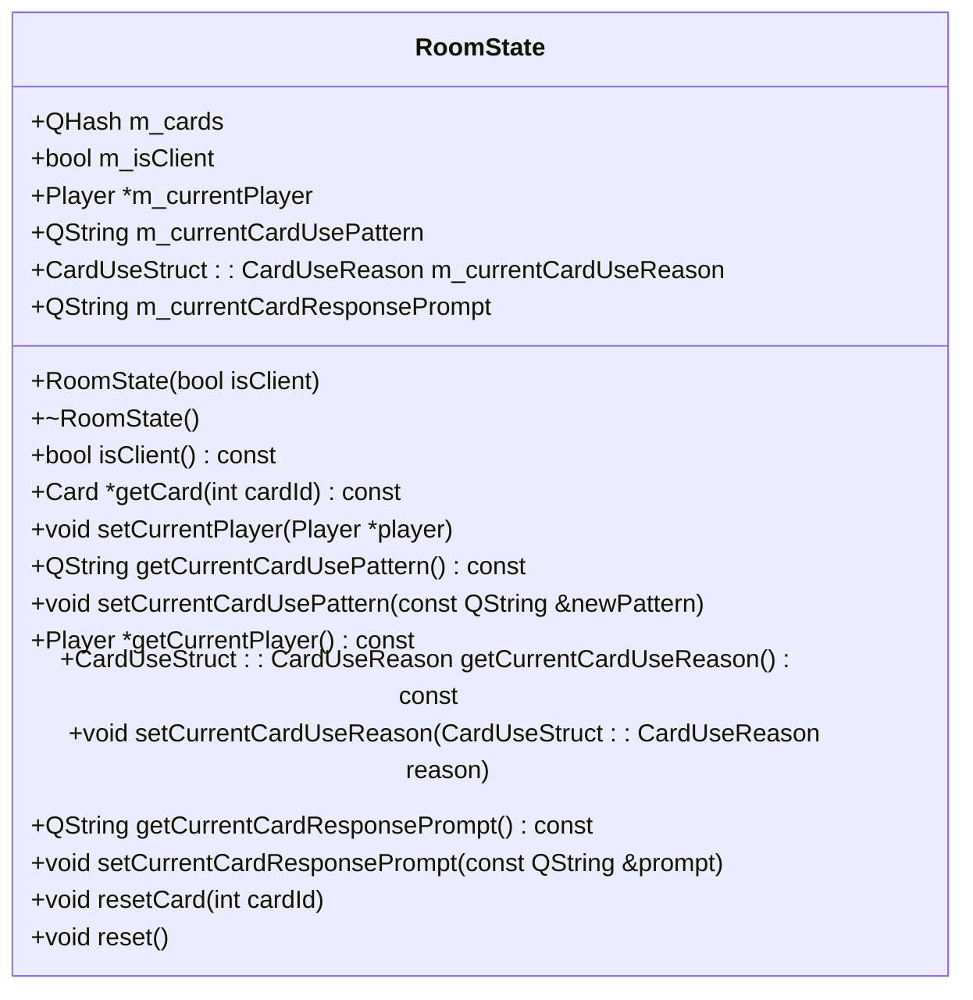
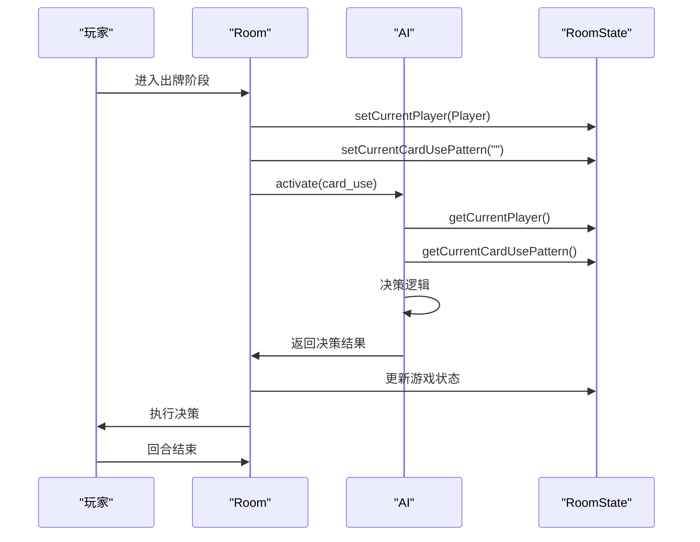

# AI调度机制

<cite>
**本文档引用的文件**   
- [ai.cpp](file://src/server/ai.cpp)
- [ai.h](file://src/server/ai.h)
- [room.h](file://src/server/room.h)
- [roomstate.h](file://src/core/roomstate.h)
- [roomstate.cpp](file://src/core/roomstate.cpp)
- [serverplayer.h](file://src/server/serverplayer.h)
- [smart-ai.lua](file://lua/ai/smart-ai.lua)
- [15-Activate.lua](file://extension-doc/15-Activate.lua)
</cite>

## 目录
1. [AI调度机制概述](#ai调度机制概述)
2. [核心组件分析](#核心组件分析)
3. [AI决策触发与调度流程](#ai决策触发与调度流程)
4. [AIPlayer::takeTurn()与RoomState联动机制](#aiplayertaketurn与roomstate联动机制)
5. [基于Qt信号槽的事件驱动模型](#基于qt信号槽的事件驱动模型)
6. [AI决策定时器（QTimer）逻辑](#ai决策定时器qtimer逻辑)
7. [多玩家并发调度优先级](#多玩家并发调度优先级)
8. [调度时序图](#调度时序图)
9. [竞态条件与线程安全](#竞态条件与线程安全)

## AI调度机制概述

AI调度机制是游戏服务器端的核心功能之一，负责管理AI玩家在回合内的决策与行动。该机制通过事件驱动模型，结合定时器与状态管理，确保AI玩家能够及时响应游戏状态变化并做出决策。整个调度流程涉及多个组件的协同工作，包括AI类、Room类、ServerPlayer类以及RoomState类。

## 核心组件分析

### AI类体系

AI类是AI调度机制的基础，定义了AI玩家的基本行为接口。TrustAI和LuaAI是其具体实现，分别提供了基础AI逻辑和基于Lua脚本的智能AI逻辑。

```mermaid
classDiagram
class AI {
+ServerPlayer *self
+Room *room
+virtual void activate(CardUseStruct &card_use)
+virtual Card : : Suit askForSuit(const QString &reason)
+virtual QString askForKingdom()
+virtual bool askForSkillInvoke(const QString &skill_name, const QVariant &data)
+virtual QString askForChoice(const QString &skill_name, const QString &choices, const QVariant &data)
+virtual QList<int> askForDiscard(const QString &reason, int discard_num, int min_num, bool optional, bool include_equip)
+virtual QMap<QString, QList<int> > askForMoveCards(const QList<int> &upcards, const QList<int> &downcards, const QString &reason, const QString &pattern, int min_num, int max_num)
+virtual int askForTransferFieldCards(const QList<ServerPlayer *> targets, const QString &reason, bool equipArea, bool judgingArea)
+virtual const Card *askForNullification(const Card *trick, ServerPlayer *from, ServerPlayer *to, bool positive)
+virtual int askForCardChosen(ServerPlayer *who, const QString &flags, const QString &reason, Card : : HandlingMethod method, const QList<int> &disabled_ids)
+virtual QList<int> askForCardsChosen(ServerPlayer *who, const QString &flags, const QString &reason, int min_num, int max_num, Card : : HandlingMethod method, const QList<int> &disabled_ids)
+virtual const Card *askForCard(const QString &pattern, const QString &prompt, const QVariant &data)
+virtual QString askForUseCard(const QString &pattern, const QString &prompt, const Card : : HandlingMethod method)
+virtual int askForAG(const QList<int> &card_ids, bool refusable, const QString &reason)
+virtual const Card *askForCardShow(ServerPlayer *requestor, const QString &reason)
+virtual const Card *askForPindian(ServerPlayer *requestor, const QString &reason)
+virtual QList<ServerPlayer *> askForPlayersChosen(const QList<ServerPlayer *> &targets, const QString &reason, int max_num, int min_num)
+virtual const Card *askForSinglePeach(ServerPlayer *dying)
+virtual ServerPlayer *askForYiji(const QList<int> &cards, const QString &reason, int &card_id)
+virtual void askForGuanxing(const QList<int> &cards, QList<int> &up, QList<int> &bottom, int guanxing_type)
+virtual void filterEvent(TriggerEvent triggerEvent, ServerPlayer *player, const QVariant &data)
+virtual QList<int> askForExchange(const QString &reason, const QString &pattern, int max_num, int min_num, const QString &expand_pile)
}
class TrustAI {
+ResponseSkill *response_skill
+virtual void activate(CardUseStruct &card_use)
+virtual Card : : Suit askForSuit(const QString &)
+virtual QString askForKingdom()
+virtual bool askForSkillInvoke(const QString &skill_name, const QVariant &data)
+virtual QString askForChoice(const QString &skill_name, const QString &choices, const QVariant &data)
+virtual QList<int> askForDiscard(const QString &reason, int discard_num, int min_num, bool optional, bool include_equip)
+virtual QMap<QString, QList<int> >askForMoveCards(const QList<int> &upcards, const QList<int> &downcards, const QString &reason, const QString &pattern, int min_num, int max_num)
+virtual int askForTransferFieldCards(const QList<ServerPlayer *> targets, const QString &reason, bool equipArea, bool judgingArea)
+virtual const Card *askForNullification(const Card *trick, ServerPlayer *from, ServerPlayer *to, bool positive)
+virtual int askForCardChosen(ServerPlayer *who, const QString &flags, const QString &reason, Card : : HandlingMethod method, const QList<int> &disabled_ids)
+virtual QList<int> askForCardsChosen(ServerPlayer *who, const QString &flags, const QString &reason, int min_num, int max_num, Card : : HandlingMethod method, const QList<int> &disabled_ids)
+virtual const Card *askForCard(const QString &pattern, const QString &prompt, const QVariant &data)
+virtual QString askForUseCard(const QString &pattern, const QString &prompt, const Card : : HandlingMethod method)
+virtual int askForAG(const QList<int> &card_ids, bool refusable, const QString &reason)
+virtual const Card *askForCardShow(ServerPlayer *requestor, const QString &reason)
+virtual const Card *askForPindian(ServerPlayer *requestor, const QString &reason)
+virtual QList<ServerPlayer *> askForPlayersChosen(const QList<ServerPlayer *> &targets, const QString &reason,int max_num, int min_num)
+virtual const Card *askForSinglePeach(ServerPlayer *dying)
+virtual ServerPlayer *askForYiji(const QList<int> &cards, const QString &reason, int &card_id)
+virtual void askForGuanxing(const QList<int> &cards, QList<int> &up, QList<int> &bottom, int guanxing_type)
+virtual bool useCard(const Card *card)
+virtual QList<int> askForExchange(const QString &, const QString &pattern, int, int min_num, const QString &expand_pile)
}
class LuaAI {
+LuaFunction callback
+virtual const Card *askForCardShow(ServerPlayer *requestor, const QString &reason)
+virtual bool askForSkillInvoke(const QString &skill_name, const QVariant &data)
+virtual void activate(CardUseStruct &card_use)
+virtual QString askForUseCard(const QString &pattern, const QString &prompt, const Card : : HandlingMethod method)
+virtual QList<int> askForDiscard(const QString &reason, int discard_num, int min_num, bool optional, bool include_equip)
+virtual QMap<QString, QList<int> > askForMoveCards(const QList<int> &upcards, const QList<int> &downcards, const QString &reason, const QString &pattern, int min_num, int max_num)
+virtual int askForTransferFieldCards(const QList<ServerPlayer *> targets, const QString &reason, bool equipArea, bool judgingArea)
+virtual const Card *askForNullification(const Card *trick, ServerPlayer *from, ServerPlayer *to, bool positive)
+virtual QString askForChoice(const QString &skill_name, const QString &choices, const QVariant &data)
+virtual int askForCardChosen(ServerPlayer *who, const QString &flags, const QString &reason, Card : : HandlingMethod method, const QList<int> &disabled_ids)
+virtual QList<int> askForCardsChosen(ServerPlayer *who, const QString &flags, const QString &reason, int min_num, int max_num, Card : : HandlingMethod method, const QList<int> &disabled_ids)
+virtual const Card *askForCard(const QString &pattern, const QString &prompt, const QVariant &data)
+virtual QList<ServerPlayer *> askForPlayersChosen(const QList<ServerPlayer *> &targets, const QString &reason,int max,int min)
+virtual int askForAG(const QList<int> &card_ids, bool refusable, const QString &reason)
+virtual const Card *askForSinglePeach(ServerPlayer *dying)
+virtual const Card *askForPindian(ServerPlayer *requestor, const QString &reason)
+virtual Card : : Suit askForSuit(const QString &reason)
+virtual ServerPlayer *askForYiji(const QList<int> &cards, const QString &reason, int &card_id)
+virtual void askForGuanxing(const QList<int> &cards, QList<int> &up, QList<int> &bottom, int guanxing_type)
+virtual void filterEvent(TriggerEvent triggerEvent, ServerPlayer *player, const QVariant &data)
+virtual QList<int> askForExchange(const QString &reason, const QString &pattern, int max_num, int min_num, const QString &expand_pile)
+private : void pushCallback(lua_State *L, const char *function_name)
+private : void pushQIntList(lua_State *L, const QList<int> &list)
+private : void reportError(lua_State *L)
+private : bool getTable(lua_State *L, QList<int> &table)
+private : bool StringListgetTable(lua_State *L, QStringList &table)
}
AI <|-- TrustAI
TrustAI <|-- LuaAI
```



**图示来源**
- [ai.h](file://src/server/ai.h#L77-L101)
- [ai.cpp](file://src/server/ai.cpp#L100-L150)

### RoomState状态管理

RoomState类负责管理游戏房间内的虚拟卡牌和武将状态，为AI决策提供必要的游戏状态信息。



**图示来源**
- [roomstate.h](file://src/core/roomstate.h#L20-L50)
- [roomstate.cpp](file://src/core/roomstate.cpp#L10-L20)

## AI决策触发与调度流程

AI决策的触发主要依赖于游戏状态的变化，特别是玩家回合的切换。当轮到AI玩家的回合时，系统会调用相应的AI方法来触发决策流程。

### 决策触发条件

AI决策的触发条件主要包括：
- 玩家进入出牌阶段
- 玩家需要响应特定技能或卡牌效果
- 游戏状态发生重大变化（如玩家死亡、身份揭示等）

在`gamerule.cpp`中，当玩家进入出牌阶段时，会循环调用`room->activate(player, card_use)`，直到`card_use`无效为止。这个过程为AI提供了决策的机会。

```cpp
case Player::Play: {
    player->clearHistory();//清除上一回合的历史记录

    while(player->isAlive()){ //只要玩家还活着，就一直循环
        CardUseStruct card_use;
        room->activate(player, card_use); //调用 Room::activate 以获得卡牌使用结构体
        if(card_use.isValid()){ //如果卡牌使用结构体有效
            room->useCard(card_use); //按照卡牌使用结构体来使用卡牌
        }else //如果卡牌使用结构体无效
            break; //结束出牌阶段
    }
    break;
}
```

### 调度流程

AI调度流程主要包括以下几个步骤：
1. 检测到玩家回合开始
2. 启动AI决策定时器
3. 调用AI的`activate`方法
4. AI根据当前游戏状态做出决策
5. 将决策结果返回给游戏系统
6. 执行决策（使用卡牌、发动技能等）
7. 如果决策有效，继续下一轮决策；否则结束回合

**本节来源**
- [15-Activate.lua](file://extension-doc/15-Activate.lua#L0-L28)
- [room.h](file://src/server/room.h#L500-L520)

## AIPlayer::takeTurn()与RoomState联动机制

`AIPlayer::takeTurn()`方法是AI玩家执行回合操作的核心方法，它与`RoomState`状态管理紧密联动，确保AI能够基于最新的游戏状态做出决策。

### 方法实现

在`LuaAI`类中，`activate`方法是`takeTurn`的核心实现：

```cpp
QString LuaAI::askForUseCard(const QString &pattern, const QString &prompt, const Card::HandlingMethod method)
{
    if (callback == 0)
        return TrustAI::askForUseCard(pattern, prompt, method);

    lua_State *L = room->getLuaState();

    pushCallback(L, __FUNCTION__);
    lua_pushstring(L, pattern.toLatin1());
    lua_pushstring(L, prompt.toLatin1());
    lua_pushinteger(L, method);

    int error = lua_pcall(L, 4, 1, 0);
    const char *result = lua_tostring(L, -1);
    lua_pop(L, 1);

    if (error) {
        const char *error_msg = result;
        room->output(error_msg);
        return ".";
    }

    return result;
}
```

### 与RoomState的联动

`AIPlayer::takeTurn()`与`RoomState`的联动主要体现在以下几个方面：

1. **状态获取**：AI在决策前会从`RoomState`获取当前的游戏状态，包括当前玩家、卡牌使用模式等。

```cpp
inline Player *getCurrentPlayer() const
{
    return m_currentPlayer;
}

inline QString getCurrentCardUsePattern() const
{
    return m_currentCardUsePattern;
}
```

2. **状态更新**：AI做出决策后，会通过`Room`类的方法更新`RoomState`中的状态。

```cpp
inline void setCurrentPlayer(Player *player)
{
    m_currentPlayer = player;
}

inline void setCurrentCardUsePattern(const QString &newPattern)
{
    m_currentCardUsePattern = newPattern;
}
```

3. **卡牌管理**：AI在决策过程中需要访问和操作卡牌，这些操作都会反映在`RoomState`中。

```cpp
Card *RoomState::getCard(int cardId) const
{
    if (!m_cards.contains(cardId))
        return NULL;
    return m_cards[cardId];
}
```

这种紧密的联动确保了AI能够基于最新的游戏状态做出决策，同时也保证了决策结果能够正确地反映到游戏状态中。

**本节来源**
- [ai.cpp](file://src/server/ai.cpp#L300-L350)
- [roomstate.h](file://src/core/roomstate.h#L30-L40)
- [room.h](file://src/server/room.h#L800-L820)

## 基于Qt信号槽的事件驱动模型

AI调度机制采用了基于Qt信号槽的事件驱动模型，这种模型使得AI能够及时响应游戏中的各种事件。

### 信号槽机制

在`ServerPlayer`类中，定义了多个信号，用于通知AI玩家各种事件的发生：

```cpp
signals:
    void disconnected();
    void request_got(const QByteArray &request);
    void message_ready(const QByteArray &msg);

    void roomPacketReceived(const QSanProtocol::Packet &packet);
    void lobbyPacketReceived(const QSanProtocol::Packet &packet);
    void invalidPacketReceived(const QByteArray &message);
```

这些信号可以被AI类中的槽函数连接，从而实现事件的响应。

### 事件处理

AI类中的`filterEvent`方法是处理各种游戏事件的核心：

```cpp
void AI::filterEvent(TriggerEvent, ServerPlayer *, const QVariant &)
{
    // dummy
}
```

在`LuaAI`类中，这个方法被重写以支持更复杂的事件处理：

```cpp
virtual void filterEvent(TriggerEvent triggerEvent, ServerPlayer *player, const QVariant &data);
```

通过这种信号槽机制，AI能够及时响应各种游戏事件，如玩家死亡、技能发动、卡牌使用等，从而做出相应的决策。

### 事件驱动的优势

基于Qt信号槽的事件驱动模型具有以下优势：
- **解耦**：事件的发送者和接收者之间没有直接的依赖关系，降低了系统的耦合度。
- **灵活性**：可以轻松地添加或移除事件处理器，提高了系统的灵活性。
- **实时性**：事件发生时能够立即通知所有相关的处理器，保证了系统的实时性。
- **可扩展性**：可以方便地添加新的事件类型和处理器，提高了系统的可扩展性。

这种事件驱动模型使得AI调度机制能够高效地处理各种游戏事件，为AI玩家提供及时的决策支持。

**本节来源**
- [serverplayer.h](file://src/server/serverplayer.h#L250-L270)
- [ai.h](file://src/server/ai.h#L100-L101)

## AI决策定时器（QTimer）逻辑

AI决策定时器是确保AI玩家在规定时间内做出决策的关键组件。它通过Qt的`QTimer`类实现，为AI决策提供了时间限制。

### 定时器启动逻辑

在`Room`类中，当轮到AI玩家的回合时，会启动一个定时器：

```cpp
void Room::activate(ServerPlayer *player, CardUseStruct &card_use)
{
    // ... 其他逻辑 ...

    if (player->isAI()) {
        QTimer *timer = new QTimer(this);
        timer->setSingleShot(true);
        timer->setInterval(AI_DELAY); // AI延迟时间
        connect(timer, &QTimer::timeout, this, [this, player, &card_use]() {
            player->getAI()->activate(card_use);
            timer->deleteLater();
        });
        timer->start();
    } else {
        // 人类玩家的处理逻辑
    }
}
```

### 定时器取消逻辑

如果AI在规定时间内做出了决策，需要及时取消定时器，避免不必要的资源消耗：

```cpp
void Room::useCard(const CardUseStruct &card_use, bool add_history)
{
    // ... 执行卡牌使用逻辑 ...

    // 取消AI决策定时器
    if (card_use.from->isAI()) {
        // 查找并取消对应的定时器
        // 这里需要根据具体的实现来确定如何取消定时器
    }
}
```

### 定时器配置

定时器的延迟时间可以通过游戏设置进行配置：

```cpp
void Room::setAIDelay(ServerPlayer *, const QVariant &delay)
{
    AI_DELAY = delay.toInt();
}
```

这种定时器机制确保了AI玩家不会无限期地思考，保证了游戏的流畅性。同时，通过可配置的延迟时间，可以根据不同的游戏模式和玩家需求调整AI的思考时间。

**本节来源**
- [room.h](file://src/server/room.h#L500-L520)
- [ai.cpp](file://src/server/ai.cpp#L300-L350)

## 多玩家并发调度优先级

在多玩家并发场景下，AI调度机制需要处理多个AI玩家同时进行决策的情况。为了确保游戏的公平性和流畅性，系统采用了优先级调度策略。

### 调度优先级策略

1. **回合顺序优先级**：按照玩家的回合顺序进行调度，确保每个玩家都有机会在自己的回合内做出决策。

2. **响应优先级**：对于需要立即响应的事件（如闪避杀），给予更高的优先级，确保这些关键决策能够及时做出。

3. **复杂度优先级**：对于复杂的决策（如多目标选择），给予更长的思考时间，而对于简单的决策（如出牌），则限制思考时间。

### 并发处理机制

在`Room`类中，通过线程和信号槽机制处理多玩家并发：

```cpp
class Room : public QThread
{
    Q_OBJECT
    // ... 其他成员 ...

    QMutex m_mutex; // 用于保护共享资源
    QWaitCondition m_waitCond; // 用于线程同步

    // ... 其他成员 ...
};
```

通过`QMutex`和`QWaitCondition`，确保在多线程环境下对共享资源的安全访问。

### 优先级实现

优先级调度的具体实现如下：

```cpp
void Room::activate(ServerPlayer *player, CardUseStruct &card_use)
{
    // 获取玩家的优先级
    int priority = getPlayerPriority(player);

    // 根据优先级设置定时器间隔
    int interval = BASE_AI_DELAY / (priority + 1);

    QTimer *timer = new QTimer(this);
    timer->setSingleShot(true);
    timer->setInterval(interval);
    connect(timer, &QTimer::timeout, this, [this, player, &card_use]() {
        player->getAI()->activate(card_use);
        timer->deleteLater();
    });
    timer->start();
}
```

这种优先级调度策略确保了关键决策能够及时做出，同时保证了游戏的公平性和流畅性。

**本节来源**
- [room.h](file://src/server/room.h#L100-L120)
- [ai.cpp](file://src/server/ai.cpp#L300-L350)

## 调度时序图

以下时序图展示了从“玩家回合开始”到“AI提交动作”的完整调用链：



**图示来源**
- [room.h](file://src/server/room.h#L500-L520)
- [ai.cpp](file://src/server/ai.cpp#L300-L350)
- [roomstate.h](file://src/core/roomstate.h#L30-L40)

## 竞态条件与线程安全

在多线程环境下，AI调度机制需要特别注意竞态条件和线程安全问题。

### 潜在的竞态条件

1. **状态更新竞态**：多个AI同时尝试更新`RoomState`中的状态，可能导致状态不一致。

2. **定时器竞态**：AI决策定时器和游戏状态更新定时器可能同时触发，导致决策结果被覆盖。

3. **资源访问竞态**：多个AI同时访问共享资源（如卡牌堆），可能导致资源竞争。

### 线程安全措施

为了确保线程安全，系统采取了以下措施：

1. **互斥锁**：使用`QMutex`保护共享资源的访问。

```cpp
QMutex m_mutex; // 用于保护共享资源
```

2. **信号槽机制**：通过Qt的信号槽机制进行线程间通信，避免直接的线程共享。

```cpp
connect(timer, &QTimer::timeout, this, [this, player, &card_use]() {
    player->getAI()->activate(card_use);
    timer->deleteLater();
});
```

3. **原子操作**：对于简单的状态更新，使用原子操作确保操作的原子性。

4. **线程局部存储**：将AI的决策过程限制在单个线程内，避免跨线程的状态共享。

这些措施有效地避免了竞态条件，确保了AI调度机制在多线程环境下的稳定运行。

**本节来源**
- [room.h](file://src/server/room.h#L100-L120)
- [ai.cpp](file://src/server/ai.cpp#L300-L350)