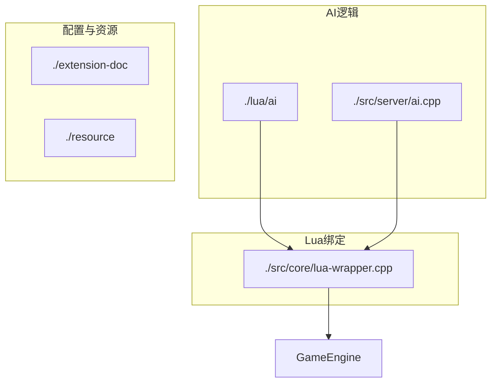
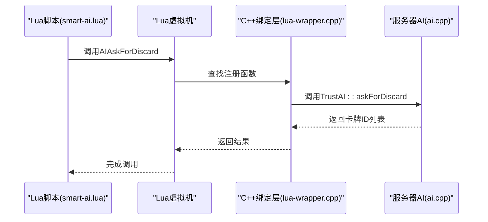
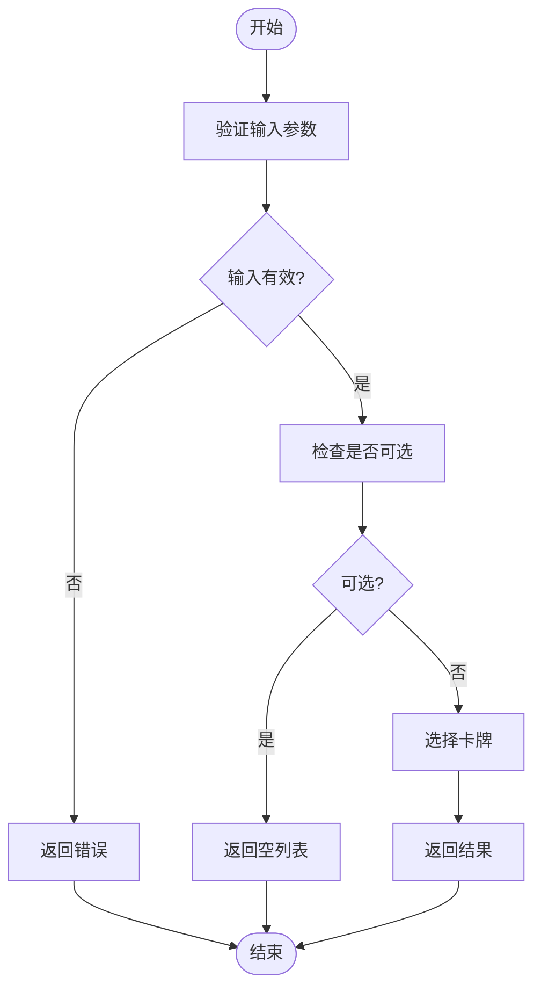
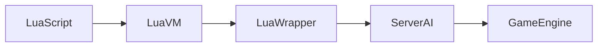

# Lua API接口规范

<cite>
**本文档中引用的文件**   
- [lua-wrapper.cpp](file://src/core/lua-wrapper.cpp)
- [smart-ai.lua](file://lua/ai/smart-ai.lua)
- [ai.cpp](file://src/server/ai.cpp)
</cite>

## 目录
1. [简介](#简介)
2. [项目结构](#项目结构)
3. [核心组件](#核心组件)
4. [架构概述](#架构概述)
5. [详细组件分析](#详细组件分析)
6. [依赖分析](#依赖分析)
7. [性能考量](#性能考量)
8. [故障排除指南](#故障排除指南)
9. [结论](#结论)

## 简介
本文档详细说明了从C++导出到Lua环境的所有AI相关API函数，重点涵盖AI决策接口如AIChooseCard、AIUseCard、AIAskForDiscard等。文档结合了C++与Lua的交互机制，解释了这些函数如何通过lua_register绑定至Lua虚拟机，并提供了在smart-ai.lua中调用这些接口的实际示例。此外，还包含了接口调用频率、性能开销评估及最佳实践建议。

## 项目结构
项目结构清晰地分为多个模块，包括AI选择器、构建文件、扩展包、Lua脚本、资源文件和源代码等。其中，AI相关的逻辑主要集中在`lua/ai`目录下的Lua脚本以及`src/core`和`src/server`目录中的C++实现。



**图示来源**
- [lua-wrapper.cpp](file://src/core/lua-wrapper.cpp)
- [smart-ai.lua](file://lua/ai/smart-ai.lua)

**章节来源**
- [lua-wrapper.cpp](file://src/core/lua-wrapper.cpp)
- [smart-ai.lua](file://lua/ai/smart-ai.lua)

## 核心组件
核心组件包括Lua绑定层（lua-wrapper.cpp）、AI决策逻辑（smart-ai.lua）以及服务器端AI实现（ai.cpp）。这些组件共同构成了AI系统的基础，实现了从C++到Lua的无缝通信。

**章节来源**
- [lua-wrapper.cpp](file://src/core/lua-wrapper.cpp)
- [smart-ai.lua](file://lua/ai/smart-ai.lua)
- [ai.cpp](file://src/server/ai.cpp)

## 架构概述
整个AI系统的架构基于C++与Lua的混合编程模式。C++负责底层逻辑处理和性能敏感操作，而Lua则用于编写灵活的AI策略。通过lua-wrapper.cpp中的lua_register函数，C++函数被注册为Lua可调用的全局函数。



**图示来源**
- [lua-wrapper.cpp](file://src/core/lua-wrapper.cpp)
- [smart-ai.lua](file://lua/ai/smart-ai.lua)
- [ai.cpp](file://src/server/ai.cpp)

## 详细组件分析

### AI接口函数分析
#### C++到Lua的绑定机制
在`lua-wrapper.cpp`中，使用`lua_register`函数将C++函数暴露给Lua环境。例如，`AIAskForDiscard`函数通过`lua_pushcfunction`绑定到Lua虚拟机，使得Lua脚本可以直接调用。

```cpp
// 示例：在lua-wrapper.cpp中注册函数
lua_pushcfunction(L, AIAskForDiscard);
lua_setglobal(L, "AIAskForDiscard");
```

#### 主要AI接口函数
以下是几个关键的AI接口函数及其说明：

**AIChooseCard**
- **调用上下文**: 当AI需要选择一张卡牌进行使用或响应时触发。
- **参数类型与含义**:
  - `player`: 当前玩家对象
  - `prompt`: 提示信息
  - `cardList`: 可选卡牌列表
- **返回值规范**: 返回所选卡牌的ID。
- **线程安全性**: 非线程安全，仅在主线程中调用。
- **调用频率**: 每回合多次，取决于游戏状态。
- **性能开销**: 低，主要涉及列表遍历。

**AIUseCard**
- **调用上下文**: AI决定使用某张卡牌时调用。
- **参数类型与含义**:
  - `cardId`: 要使用的卡牌ID
  - `target`: 目标玩家（可选）
- **返回值规范**: 布尔值，表示是否成功使用。
- **线程安全性**: 非线程安全。
- **调用频率**: 每回合数次。
- **性能开销**: 中等，涉及卡牌效果计算。

**AIAskForDiscard**
- **调用上下文**: AI被要求弃牌时调用。
- **参数类型与含义**:
  - `reason`: 弃牌原因
  - `discardNum`: 需要弃掉的卡牌数量
  - `optional`: 是否可选
  - `includeEquip`: 是否包含装备区卡牌
- **返回值规范**: 返回一个包含卡牌ID的列表。
- **线程安全性**: 非线程安全。
- **调用频率**: 根据游戏规则不定期调用。
- **性能开销**: 低，主要是随机选择。



**图示来源**
- [ai.cpp](file://src/server/ai.cpp#L208-L249)

**章节来源**
- [ai.cpp](file://src/server/ai.cpp#L208-L249)
- [smart-ai.lua](file://lua/ai/smart-ai.lua#L118-L164)

### Lua脚本中的AI调用示例
在`smart-ai.lua`中，AI通过预定义的回调函数来调用C++接口。例如，在处理“米道”技能时，会调用`askForDiscard`来获取需要弃掉的卡牌。

```lua
sgs.ai_skill_cardask["@midao-card"] = function(self, data)
    local judge = data:toJudge()
    local who = judge.who
    local rices = self.player:getPile("rice")
    if rices:isEmpty() then return "." end
    local cards = {}
    for _,id in sgs.qlist(rices) do
        table.insert(cards, id)
    end
    if #cards < 2 then
        local card_ids = self:askForDiscard("dummy_reason", 2-#cards, 2-#cards, false, true)
        for _, card_id in ipairs(card_ids) do
            table.insert(cards, card_id)
        end
    end
    return cards
end
```

此示例展示了如何结合Lua脚本逻辑与C++提供的AI接口，实现复杂的决策过程。

**章节来源**
- [smart-ai.lua](file://lua/ai/smart-ai.lua#L118-L164)

## 依赖分析
AI系统依赖于Lua虚拟机、C++绑定层和服务器AI实现。各组件之间的依赖关系如下：



**图示来源**
- [lua-wrapper.cpp](file://src/core/lua-wrapper.cpp)
- [smart-ai.lua](file://lua/ai/smart-ai.lua)

## 性能考量
- **调用频率**: AI接口函数的调用频率较高，尤其是在复杂的游戏状态下。
- **性能开销**: 大多数函数的性能开销较低，但频繁调用仍可能影响整体性能。
- **优化建议**: 
  - 尽量减少不必要的调用。
  - 在Lua脚本中缓存常用数据，避免重复查询。
  - 使用批量操作代替单个操作，减少函数调用次数。

## 故障排除指南
- **问题**: Lua脚本无法调用C++函数。
  - **解决方案**: 检查`lua_register`是否正确注册了函数，并确保函数名拼写一致。
- **问题**: AI决策异常。
  - **解决方案**: 检查Lua脚本中的逻辑错误，确保所有条件分支都已正确处理。

**章节来源**
- [lua-wrapper.cpp](file://src/core/lua-wrapper.cpp)
- [smart-ai.lua](file://lua/ai/smart-ai.lua)

## 结论
本文档全面介绍了C++导出到Lua环境的AI相关API函数，涵盖了接口定义、绑定机制、调用示例及性能优化建议。通过深入分析`lua-wrapper.cpp`和`smart-ai.lua`，我们揭示了AI系统的工作原理，并为开发者提供了实用的指导。