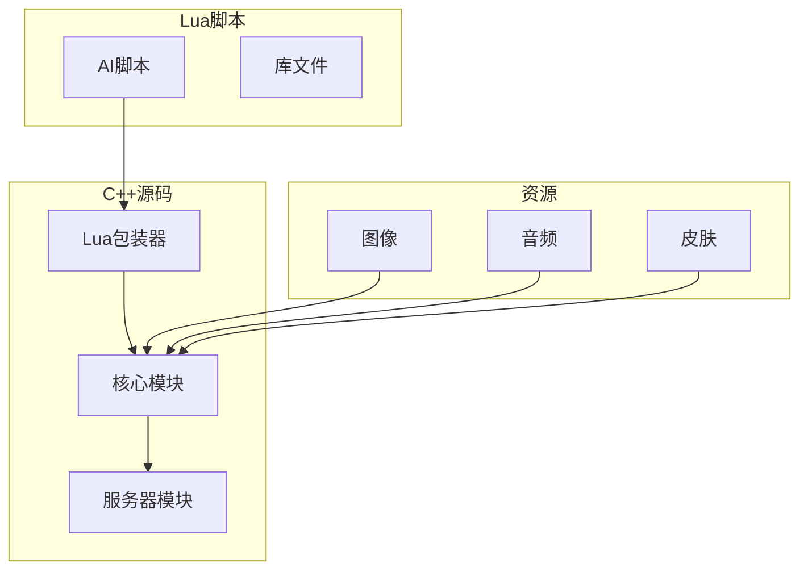
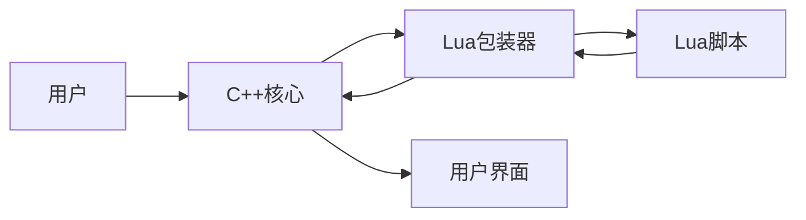
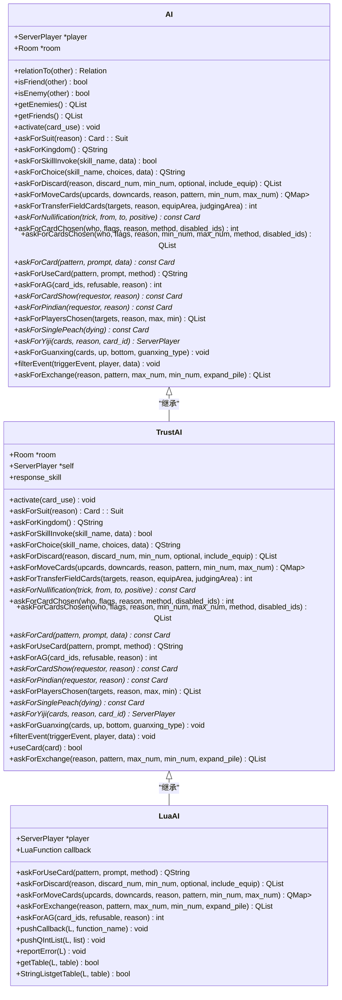
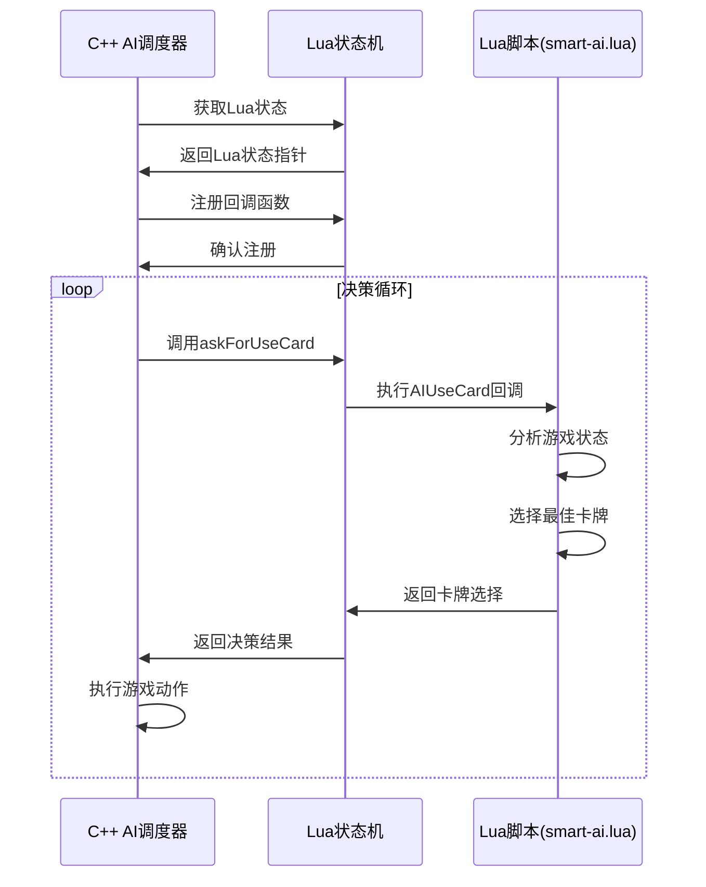
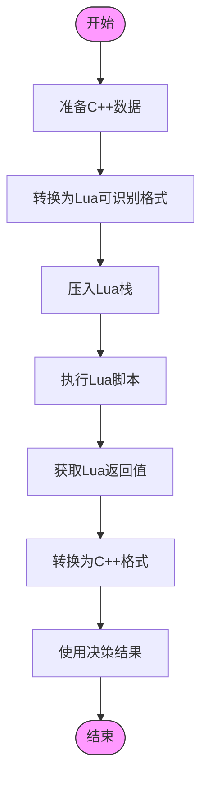
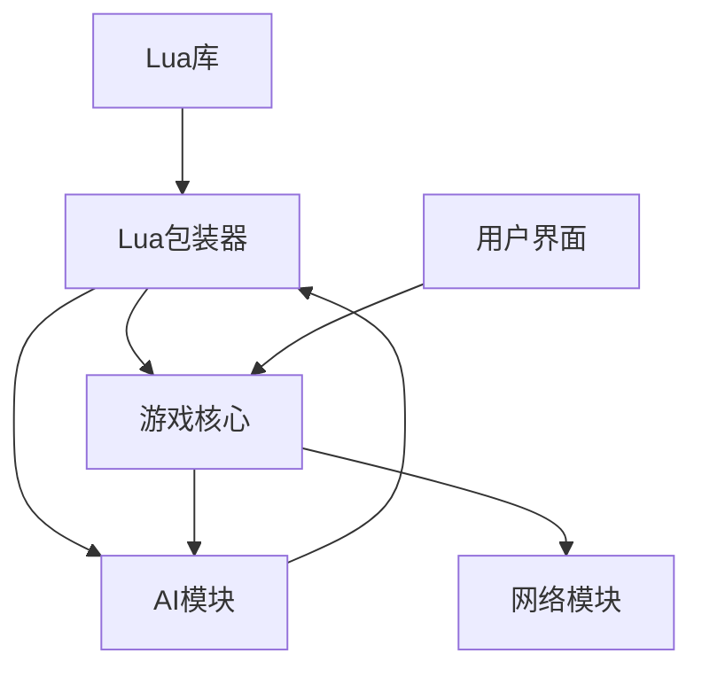

# Lua脚本集成机制

<cite>
**本文档中引用的文件**   
- [lua-wrapper.cpp](file://src/core/lua-wrapper.cpp)
- [lua-wrapper.h](file://src/core/lua-wrapper.h)
- [ai.cpp](file://src/server/ai.cpp)
- [ai.h](file://src/server/ai.h)
- [smart-ai.lua](file://lua/ai/smart-ai.lua)
</cite>

## 目录
1. [简介](#简介)
2. [项目结构](#项目结构)
3. [核心组件](#核心组件)
4. [架构概述](#架构概述)
5. [详细组件分析](#详细组件分析)
6. [依赖分析](#依赖分析)
7. [性能考虑](#性能考虑)
8. [故障排除指南](#故障排除指南)
9. [结论](#结论)

## 简介
本文档详细说明了C++ AI调度器如何调用Lua脚本进行决策，分析了`lua-wrapper.cpp`中Lua状态机的绑定机制。文档解释了C++层如何将Player、Card、Room等对象暴露给Lua环境，描述了`smart-ai.lua`中AIChooseCard、AIUseCard等回调函数的调用流程。提供了数据序列化与反序列化的具体实现细节，确保Lua脚本能准确获取游戏上下文。文档包含交互接口表，列出所有可供Lua调用的API及其参数规范，并说明错误处理与超时机制。

## 项目结构
该项目是一个基于C++和Lua的三国杀游戏实现，采用分层架构设计。核心逻辑使用C++编写，AI决策逻辑使用Lua脚本实现。项目结构清晰，分为AI选择器、构建文件、扩展、图像资源、头文件、语言包、Lua脚本、资源、规则、皮肤、源代码等多个目录。

**图示来源**
- [src/core/lua-wrapper.cpp](file://src/core/lua-wrapper.cpp#L1-L400)
- [src/server/ai.cpp](file://src/server/ai.cpp#L1-L553)

**章节来源**
- [src/core/lua-wrapper.cpp](file://src/core/lua-wrapper.cpp#L1-L400)
- [src/server/ai.cpp](file://src/server/ai.cpp#L1-L553)

## 核心组件
核心组件包括Lua包装器、AI调度器和Lua脚本引擎。Lua包装器负责在C++和Lua之间建立桥梁，AI调度器负责调用Lua脚本进行决策，Lua脚本引擎负责执行Lua脚本。

**章节来源**
- [src/core/lua-wrapper.cpp](file://src/core/lua-wrapper.cpp#L1-L400)
- [src/server/ai.cpp](file://src/server/ai.cpp#L1-L553)

## 架构概述
系统采用C++与Lua混合编程架构，C++负责核心游戏逻辑和性能关键代码，Lua负责AI决策等可配置逻辑。通过Lua包装器实现C++对象到Lua环境的暴露，使用回调机制实现Lua脚本对C++功能的调用。

**图示来源**
- [src/core/lua-wrapper.h](file://src/core/lua-wrapper.h#L1-L626)
- [src/server/ai.h](file://src/server/ai.h#L1-L167)

## 详细组件分析

### Lua包装器分析
Lua包装器组件负责实现C++与Lua之间的双向通信，通过继承机制将C++类的功能暴露给Lua脚本。

#### 类图分析

**图示来源**
- [src/server/ai.h](file://src/server/ai.h#L1-L167)
- [src/server/ai.cpp](file://src/server/ai.cpp#L1-L553)

#### 调用流程分析

**图示来源**
- [src/server/ai.cpp](file://src/server/ai.cpp#L342-L553)
- [lua/ai/smart-ai.lua](file://lua/ai/smart-ai.lua#L1-L799)

**章节来源**
- [src/server/ai.cpp](file://src/server/ai.cpp#L342-L553)
- [lua/ai/smart-ai.lua](file://lua/ai/smart-ai.lua#L1-L799)

### 数据序列化分析
数据序列化组件负责在C++和Lua之间传递复杂数据结构，确保游戏状态的准确同步。

#### 序列化流程

**图示来源**
- [src/server/ai.cpp](file://src/server/ai.cpp#L400-L500)
- [src/core/lua-wrapper.cpp](file://src/core/lua-wrapper.cpp#L100-L200)

**章节来源**
- [src/server/ai.cpp](file://src/server/ai.cpp#L400-L500)
- [src/core/lua-wrapper.cpp](file://src/core/lua-wrapper.cpp#L100-L200)

## 依赖分析
系统依赖关系清晰，C++核心模块依赖Lua库进行脚本执行，AI模块依赖游戏核心模块获取游戏状态，Lua脚本依赖C++暴露的API进行决策。

**图示来源**
- [src/core/lua-wrapper.h](file://src/core/lua-wrapper.h#L1-L626)
- [src/server/ai.h](file://src/server/ai.h#L1-L167)

**章节来源**
- [src/core/lua-wrapper.h](file://src/core/lua-wrapper.h#L1-L626)
- [src/server/ai.h](file://src/server/ai.h#L1-L167)

## 性能考虑
系统在性能方面做了充分考虑，通过对象池、缓存机制和高效的序列化方法确保游戏流畅运行。Lua脚本执行有超时保护，防止AI决策耗时过长影响游戏体验。

## 故障排除指南
当Lua脚本调用出现问题时，首先检查Lua状态机是否正常初始化，然后验证回调函数是否正确注册。查看错误日志中的Lua错误信息，检查数据序列化是否正确。确保C++对象正确暴露给Lua环境，参数类型匹配。

**章节来源**
- [src/server/ai.cpp](file://src/server/ai.cpp#L500-L553)
- [src/core/lua-wrapper.cpp](file://src/core/lua-wrapper.cpp#L300-L400)

## 结论
本文档详细分析了C++ AI调度器与Lua脚本的集成机制，展示了如何通过Lua包装器实现高效的游戏AI决策系统。该架构既保证了核心逻辑的性能，又提供了AI决策的灵活性和可配置性。