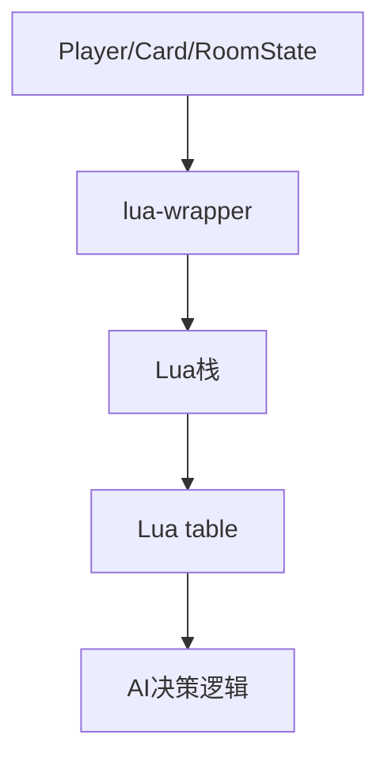
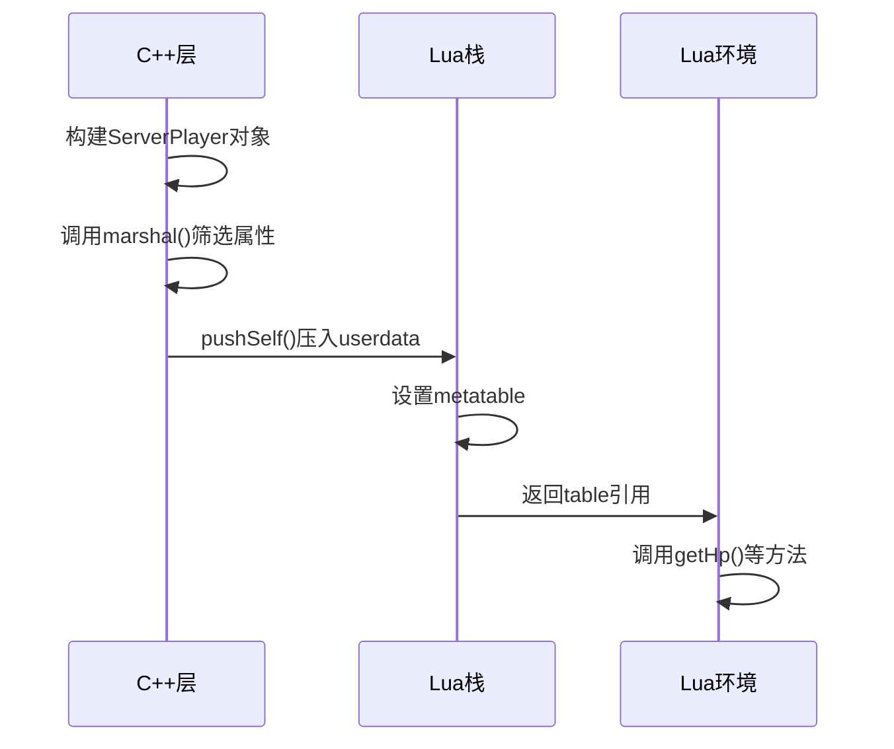

# 数据传递与序列化机制

<cite>
**本文档引用文件**  
- [lua-wrapper.cpp](file://src/core/lua-wrapper.cpp#L0-L400)
- [lua-wrapper.h](file://src/core/lua-wrapper.h#L0-L626)
- [roomstate.h](file://src/core/roomstate.h#L0-L100)
- [serverplayer.cpp](file://src/server/serverplayer.cpp#L1366-L1406)
- [client.cpp](file://src/client/client.cpp#L2589-L2623)
</cite>

## 目录
1. [引言](#引言)
2. [项目结构概述](#项目结构概述)
3. [核心组件分析](#核心组件分析)
4. [数据序列化机制](#数据序列化机制)
5. [userdata封装与metatable绑定](#userdata封装与metatable绑定)
6. [从C++到Lua的数据映射流程](#从c到lua的数据映射流程)
7. [AI决策阶段的数据链路示例](#ai决策阶段的数据链路示例)
8. [深拷贝与引用传递的权衡](#深拷贝与引用传递的权衡)
9. [性能优化策略](#性能优化策略)
10. [结论](#结论)

## 引言

本项目为《三国杀·霸业》的C++实现，采用Lua脚本扩展游戏逻辑。系统通过C++核心层管理玩家、卡牌、房间状态等复杂对象，并将其高效地传递至Lua环境供AI与游戏规则使用。本文档深入分析C++与Lua之间的数据交互机制，重点阐述对象序列化、userdata封装、状态快照生成及性能优化策略。

**Section sources**
- [lua-wrapper.h](file://src/core/lua-wrapper.h#L0-L626)

## 项目结构概述

项目采用分层架构，主要分为：
- **src/core**: 核心逻辑，包含Player、Card、RoomState等基础类
- **src/server**: 服务端逻辑，如ServerPlayer、Room
- **src/lua**: Lua虚拟机封装
- **extension-doc**: Lua脚本接口文档
- **lua/ai**: AI行为脚本

关键数据流路径为：`C++对象 → Lua栈 → Lua table → AI逻辑使用`。



**Diagram sources**
- [lua-wrapper.h](file://src/core/lua-wrapper.h#L0-L626)
- [serverplayer.cpp](file://src/server/serverplayer.cpp#L1366-L1406)

## 核心组件分析

### Player与ServerPlayer

`Player`为抽象基类，定义了生命值、手牌、装备等基本属性。`ServerPlayer`继承自`Player`，用于服务端状态管理，支持网络同步。

### Card与WrappedCard

`Card`表示卡牌实体，`WrappedCard`为其包装类，用于房间内动态状态管理。`RoomState`通过`QHash<int, WrappedCard*>`维护所有卡牌。

### RoomState

`RoomState`为单例类，存储房间内所有虚拟武将与卡牌状态。其核心成员包括：
- `m_cards`: 卡牌哈希表
- `m_currentPlayer`: 当前操作玩家
- `m_currentCardUsePattern`: 当前卡牌使用模式

```cpp
class RoomState {
    QHash<int, WrappedCard *> m_cards;
    Player *m_currentPlayer;
    QString m_currentCardUsePattern;
    // ...
};
```

**Section sources**
- [roomstate.h](file://src/core/roomstate.h#L0-L100)

## 数据序列化机制

C++对象通过`lua-wrapper`模块序列化为Lua可读结构。核心机制包括：

### 对象属性选择性暴露

并非所有C++属性都暴露给Lua。例如`ServerPlayer`仅通过`notifyProperty`广播必要属性：

```cpp
room->notifyProperty(player, this, "maxhp");
room->notifyProperty(player, this, "hp");
room->notifyProperty(player, this, "general1_showed");
```

这实现了**属性过滤**，避免敏感或冗余数据泄露。

### 状态快照生成

`RoomState`在每回合生成状态快照，确保Lua脚本在一致状态下运行。`reset()`方法重置所有卡牌与武将状态。

### JSON辅助序列化

部分数据通过`JsonUtils`进行JSON格式转换，如`setAvailableCards`接收`QVariant`并解析为`QList<int>`：

```cpp
void Client::setAvailableCards(const QVariant &pile) {
    QList<int> drawPile;
    if (JsonUtils::tryParse(pile, drawPile))
        available_cards = drawPile;
}
```

**Section sources**
- [serverplayer.cpp](file://src/server/serverplayer.cpp#L1366-L1406)
- [client.cpp](file://src/client/client.cpp#L2589-L2623)

## userdata封装与metatable绑定

Lua无法直接操作C++对象，需通过`userdata`封装并绑定`metatable`提供接口。

### pushSelf方法

所有可暴露类（如`LuaSkillCard`、`LuaViewAsSkill`）均实现`pushSelf(lua_State *L)`方法，将自身压入Lua栈：

```cpp
void LuaSkillCard::pushSelf(lua_State *L) const {
    // 将C++对象指针作为userdata压栈
    lua_pushlightuserdata(L, const_cast<LuaSkillCard*>(this));
    // 设置metatable
    luaL_setmetatable(L, "LuaSkillCard");
}
```

### metatable定义

在Lua侧定义metatable，映射C++方法：

```lua
local mt = {
    __index = {
        getClassName = function(self)
            return tolua.cast(self, "Card"):getClassName()
        end,
        -- 其他方法...
    }
}
setmetatable(LuaSkillCard, mt)
```

此机制实现**对象透明访问**，Lua脚本可像调用原生对象一样操作C++实例。

**Section sources**
- [lua-wrapper.cpp](file://src/core/lua-wrapper.cpp#L0-L400)
- [lua-wrapper.h](file://src/core/lua-wrapper.h#L0-L626)

## 从C++到Lua的数据映射流程

以`ServerPlayer`为例，数据映射流程如下：

1. **C++对象准备**：`ServerPlayer`实例包含完整状态
2. **属性筛选**：调用`marshal`方法选择需同步的属性
3. **事件通知**：通过`notifyProperty`发送属性变更事件
4. **栈压入**：在Lua绑定层将对象指针压入Lua栈
5. **metatable绑定**：设置metatable以提供方法访问
6. **Lua table生成**：Lua脚本通过`tolua.cast`获取table接口



**Diagram sources**
- [serverplayer.cpp](file://src/server/serverplayer.cpp#L1366-L1406)
- [lua-wrapper.cpp](file://src/core/lua-wrapper.cpp#L0-L400)

## AI决策阶段的数据链路示例

以AI获取手牌信息为例，完整链路如下：

1. **C++层触发**：AI决策时，C++调用`getPlayer()->getHandcards()`
2. **序列化为table**：手牌列表通过`lua-wrapper`转换为Lua table
3. **压栈传递**：table被压入Lua栈，供AI脚本访问
4. **Lua脚本解析**：AI脚本遍历手牌table，评估出牌策略

```cpp
// C++侧：将手牌压栈
void pushCardList(lua_State *L, const QList<const Card*> &cards) {
    lua_newtable(L);
    for (int i = 0; i < cards.length(); ++i) {
        cards[i]->pushSelf(L);
        lua_rawseti(L, -2, i + 1);
    }
}
```

```lua
-- Lua侧：AI使用手牌
local handcards = player:getHandcards()
for _, card in ipairs(handcards) do
    if card:isAvailable(player) then
        -- 评估出牌价值
        local value = ai:cardValue(card, player)
    end
end
```

此过程实现了**数据隔离与安全访问**，Lua脚本无法修改原始C++对象。

**Section sources**
- [lua-wrapper.cpp](file://src/core/lua-wrapper.cpp#L0-L400)
- [client.cpp](file://src/client/client.cpp#L2589-L2623)

## 深拷贝与引用传递的权衡

### 引用传递（默认）

大多数情况下采用**引用传递**，即Lua userdata指向C++对象指针。优点：
- 内存开销小
- 实时同步状态
- 避免数据不一致

缺点：
- Lua脚本可能意外修改状态（需通过metatable控制权限）

### 深拷贝（特定场景）

对于敏感操作（如卡牌预览），采用深拷贝生成独立副本：

```cpp
LuaSkillCard *LuaSkillCard::clone() const {
    LuaSkillCard *new_card = new LuaSkillCard(NULL, NULL);
    new_card->setObjectName(objectName());
    new_card->addSubcards(subcards);
    // 复制所有属性
    return new_card;
}
```

应用场景：
- 技能预演（guhuo）
- 手牌评估（AI模拟出牌）

**Section sources**
- [lua-wrapper.cpp](file://src/core/lua-wrapper.cpp#L0-L400)

## 性能优化策略

### 懒加载（Lazy Loading）

仅在需要时才序列化复杂对象。例如`getCard(int cardId)`按需加载卡牌：

```cpp
Card *RoomState::getCard(int cardId) const {
    if (!m_cards.contains(cardId))
        return NULL;
    return m_cards[cardId];
}
```

### 增量更新

避免全量同步，仅发送变更属性。`notifyProperty`机制实现**增量更新**：

```cpp
room->notifyProperty(player, this, "hp"); // 仅同步hp变化
```

### 对象池与缓存

- `QHash`缓存已加载卡牌
- `LuaSkillCards`静态哈希表避免重复创建
- 手牌列表复用`QList`减少内存分配

### 批量操作

合并多次小更新为一次大更新，减少Lua调用开销。

**Section sources**
- [roomstate.h](file://src/core/roomstate.h#L0-L100)
- [serverplayer.cpp](file://src/server/serverplayer.cpp#L1366-L1406)

## 结论

本系统通过**选择性序列化**、**userdata封装**、**增量更新**等机制，实现了C++与Lua之间的高效、安全数据交互。AI决策链路清晰，性能优化充分，支持复杂游戏逻辑的灵活扩展。未来可进一步引入**二进制序列化**（如Protocol Buffers）提升大数据量传输效率。