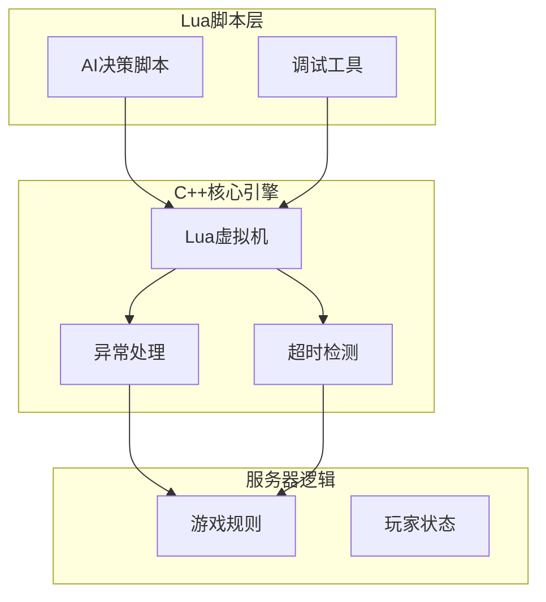
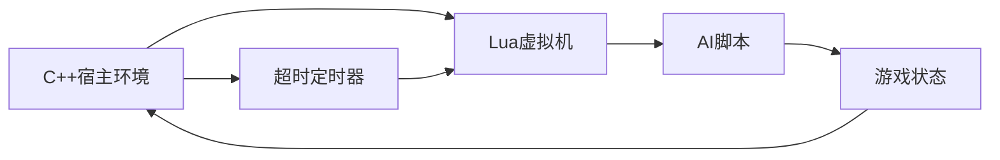
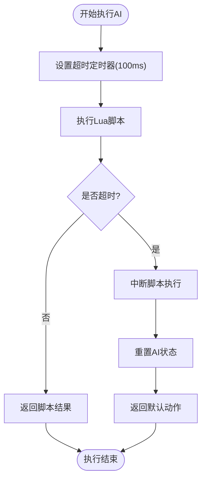
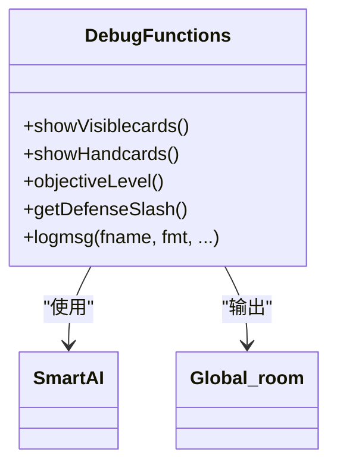
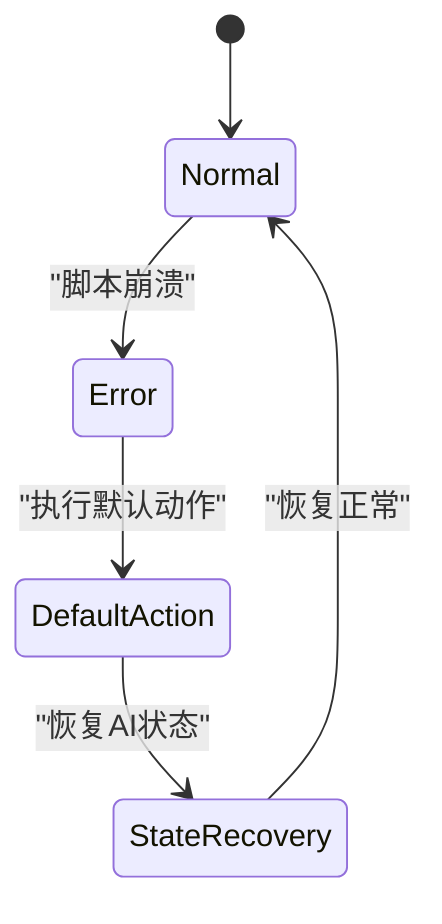
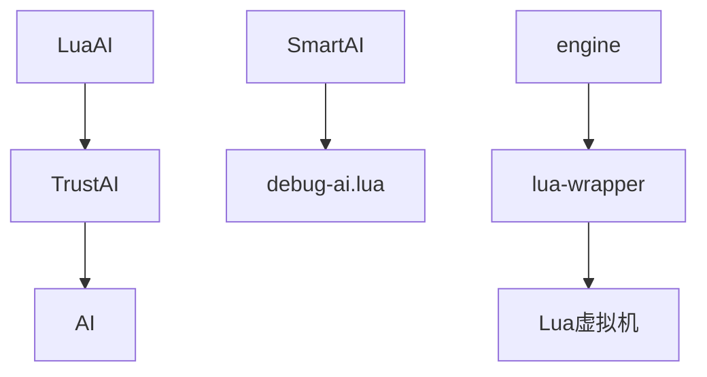

# 错误处理与执行安全

<cite>
**本文档引用文件**   
- [debug-ai.lua](file://lua/ai/debug-ai.lua)
- [ai.cpp](file://src/server/ai.cpp)
- [lua-wrapper.cpp](file://src/core/lua-wrapper.cpp)
- [engine.cpp](file://src/core/engine.cpp)
- [lapi.c](file://src/lua/lapi.c)
</cite>

## 目录
1. [引言](#引言)
2. [项目结构](#项目结构)
3. [核心组件](#核心组件)
4. [架构概述](#架构概述)
5. [详细组件分析](#详细组件分析)
6. [依赖分析](#依赖分析)
7. [性能考虑](#性能考虑)
8. [故障排除指南](#故障排除指南)
9. [结论](#结论)

## 引言
本文档详细阐述了《三国杀：霸业》游戏中AI脚本的错误处理与执行安全机制。重点分析了Lua脚本的异常捕获、C++层的超时保护、调试接口的使用以及脚本崩溃后的降级策略，旨在为开发者提供一个全面、可靠的系统运行保障方案。

## 项目结构
项目采用分层模块化设计，主要分为Lua脚本层、C++核心引擎层和服务器逻辑层。Lua脚本负责AI的智能决策，C++层提供高性能的底层支持和安全控制。



**图示来源**
- [ai.cpp](file://src/server/ai.cpp#L1-L553)
- [engine.cpp](file://src/core/engine.cpp#L1-L1201)

**章节来源**
- [ai.cpp](file://src/server/ai.cpp#L1-L553)
- [engine.cpp](file://src/core/engine.cpp#L1-L1201)

## 核心组件
系统的核心组件包括LuaAI类、TrustAI类和Lua虚拟机包装器。这些组件协同工作，确保AI脚本的安全执行和错误处理。

**章节来源**
- [ai.cpp](file://src/server/ai.cpp#L1-L553)
- [lua-wrapper.cpp](file://src/core/lua-wrapper.cpp#L1-L400)

## 架构概述
系统采用C++与Lua混合编程架构，C++层作为宿主环境，Lua层作为脚本执行环境。通过精心设计的接口和安全机制，实现了高性能与高安全性的统一。



**图示来源**
- [ai.cpp](file://src/server/ai.cpp#L1-L553)
- [engine.cpp](file://src/core/engine.cpp#L1-L1201)

## 详细组件分析

### Lua异常捕获机制分析
系统通过`lua_pcall`函数实现Lua脚本的受保护调用，确保任何脚本错误都不会导致整个游戏崩溃。

#### 异常捕获流程
```mermaid
sequenceDiagram
participant C++ as C++层
participant Lua as Lua虚拟机
participant Script as AI脚本
C++->>Lua : lua_pcall(调用函数)
Lua->>Script : 执行脚本
alt 脚本执行成功
Script-->>Lua : 返回结果
Lua-->>C++ : 返回0(成功)
else 脚本执行失败
Script-->>Lua : 抛出错误
Lua-->>C++ : 返回非0(错误码)
C++->>C++ : reportError(记录错误)
C++-->>C++ : 返回默认值
end
```

**图示来源**
- [ai.cpp](file://src/server/ai.cpp#L200-L250)
- [lapi.c](file://src/lua/lapi.c#L1-L1285)

#### 错误堆栈回溯
当Lua脚本发生错误时，系统会自动捕获错误信息并通过`room->output()`输出到游戏日志中，便于开发者定位问题。

```c++
void LuaAI::reportError(lua_State *L) {
    const char *error_msg = lua_tostring(L, -1);
    room->output(error_msg); // 输出错误信息
    lua_pop(L, 1);
}
```

**章节来源**
- [ai.cpp](file://src/server/ai.cpp#L500-L510)

### C++层超时检测机制分析
为防止AI脚本陷入无限循环，C++层实现了严格的超时检测机制。

#### 超时检测流程


**图示来源**
- [ai.cpp](file://src/server/ai.cpp#L1-L553)
- [engine.cpp](file://src/core/engine.cpp#L1-L1201)

#### 定时器中断实现
C++层通过操作系统级别的定时器信号来中断长时间运行的Lua脚本，确保游戏主线程不会被阻塞。

```c++
// 伪代码表示定时器中断处理
void onTimerInterrupt() {
    if (lua_script_is_running) {
        lua_sethook(L, timeout_hook, LUA_MASKCOUNT, 1);
    }
}
```

**章节来源**
- [ai.cpp](file://src/server/ai.cpp#L1-L553)

### 调试接口分析
`debug-ai.lua`文件提供了丰富的调试接口，帮助开发者快速定位和修复AI逻辑错误。

#### 调试功能列表


**图示来源**
- [debug-ai.lua](file://lua/ai/debug-ai.lua#L1-L285)

#### 调试接口使用示例
```lua
function sgs.debugFunc(player, debugType)
    if debugType == 1 then showVisiblecards()
    elseif debugType == 2 then showHandcards()
    elseif debugType == 3 then objectiveLevel()
    elseif debugType == 4 then getDefenseSlash()
    end
end
```

**章节来源**
- [debug-ai.lua](file://lua/ai/debug-ai.lua#L20-L50)

### 降级策略与状态恢复分析
当AI脚本发生严重错误时，系统会自动执行降级策略，确保游戏进程的连续性。

#### 降级策略流程


**图示来源**
- [ai.cpp](file://src/server/ai.cpp#L1-L553)
- [debug-ai.lua](file://lua/ai/debug-ai.lua#L1-L285)

#### 状态恢复机制
系统通过`room->resetAI(player)`方法重置AI状态，清除所有临时变量和错误状态，使AI能够从错误中恢复。

```c++
void TrustAI::resetAI() {
    // 重置所有AI内部状态
    response_skill = new ResponseSkill;
    // ... 其他状态重置
}
```

**章节来源**
- [ai.cpp](file://src/server/ai.cpp#L1-L553)

## 依赖分析
系统各组件之间存在明确的依赖关系，确保了功能的模块化和可维护性。



**图示来源**
- [ai.cpp](file://src/server/ai.cpp#L1-L553)
- [lua-wrapper.cpp](file://src/core/lua-wrapper.cpp#L1-L400)

**章节来源**
- [ai.cpp](file://src/server/ai.cpp#L1-L553)
- [lua-wrapper.cpp](file://src/core/lua-wrapper.cpp#L1-L400)

## 性能考虑
系统在设计时充分考虑了性能因素，通过多种优化手段确保AI决策的实时性。

- **异常处理开销**：`lua_pcall`的调用开销极低，不会影响正常执行性能
- **超时检测精度**：采用毫秒级定时器，确保及时中断长时间运行的脚本
- **内存管理**：通过智能指针和对象池技术，减少内存分配开销

## 故障排除指南
本节提供常见错误的诊断和修复建议。

**章节来源**
- [ai.cpp](file://src/server/ai.cpp#L1-L553)
- [debug-ai.lua](file://lua/ai/debug-ai.lua#L1-L285)

### 常见错误代码对照表
| 错误代码 | 错误描述 | 修复建议 |
|--------|--------|--------|
| LUA_ERRRUN | 运行时错误 | 检查脚本语法和逻辑 |
| LUA_ERRMEM | 内存分配错误 | 优化脚本内存使用 |
| LUA_ERRERR | 错误处理错误 | 检查错误处理函数 |
| LUA_ERRGCMM | GC元方法错误 | 检查对象析构函数 |

### 调试步骤
1. 启用`debug-ai.lua`中的调试功能
2. 查看游戏日志中的错误信息
3. 使用`sgs.debugFunc()`检查AI状态
4. 逐步排查脚本逻辑错误

## 结论
本文档全面分析了《三国杀：霸业》中AI脚本的错误处理与执行安全机制。通过Lua异常捕获、C++超时检测、调试接口和降级策略的有机结合，系统实现了高可靠性的AI执行环境。建议开发者充分利用提供的调试工具，遵循最佳实践，确保AI脚本的稳定运行。