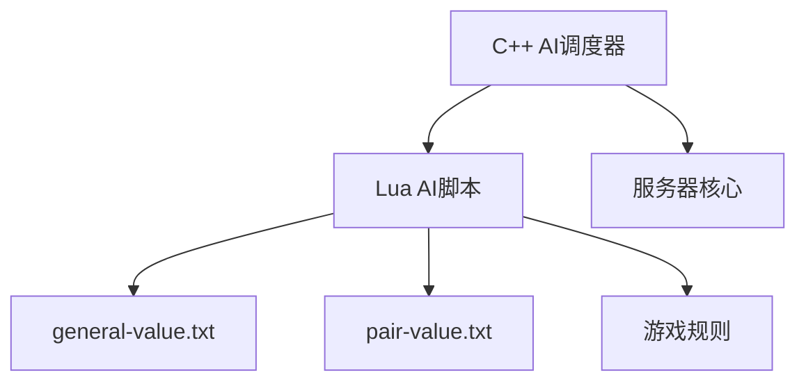
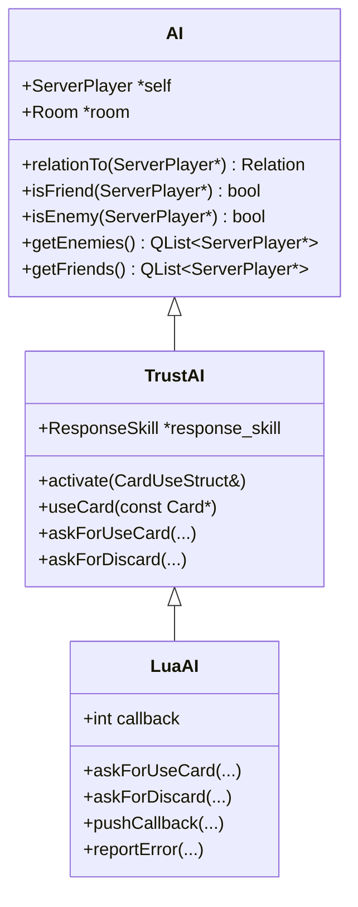
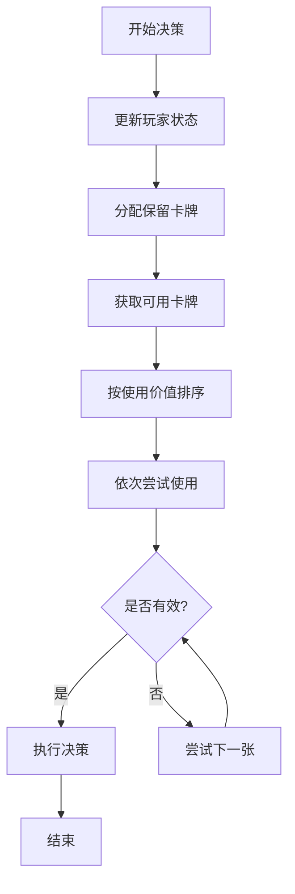
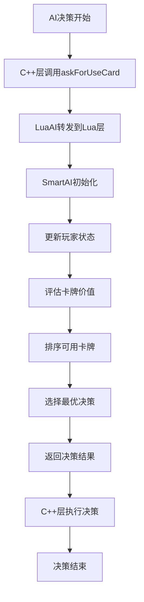
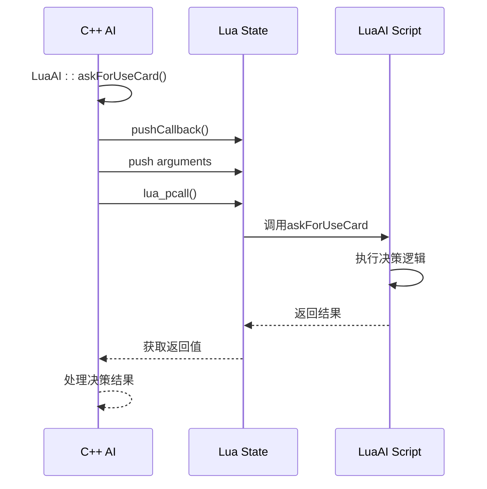

# AI系统

<cite>
**本文档中引用的文件**   
- [ai.cpp](file://src/server/ai.cpp)
- [smart-ai.lua](file://lua/ai/smart-ai.lua)
- [general-value.txt](file://ai-selector/general-value.txt)
- [pair-value.txt](file://ai-selector/pair-value.txt)
</cite>

## 目录
1. [项目结构分析](#项目结构分析)
2. [AI系统架构概述](#ai系统架构概述)
3. [C++ AI调度器实现](#c-ai调度器实现)
4. [Lua AI决策逻辑](#lua-ai决策逻辑)
5. [武将权重配置机制](#武将权重配置机制)
6. [AI决策流程图](#ai决策流程图)
7. [Lua与C++交互时序图](#lua与c交互时序图)
8. [AI调试与性能优化](#ai调试与性能优化)

## 项目结构分析

根据项目目录结构，AI系统主要分布在以下几个关键目录中：
- `src/server/ai.cpp`：AI调度器的核心C++实现
- `lua/ai/`：各类AI脚本，包括`smart-ai.lua`等
- `ai-selector/`：AI武将选择和配对的权重配置文件
- `lang/zh_CN/AIDebug.lua`：AI调试相关功能

AI系统采用C++与Lua混合编程架构，C++层负责基础逻辑和接口调度，Lua层实现复杂的决策算法。



**图源**
- [ai.cpp](file://src/server/ai.cpp)
- [smart-ai.lua](file://lua/ai/smart-ai.lua)

## AI系统架构概述

AI系统采用分层架构设计，包含以下核心组件：
- **AI调度器**：C++实现，负责调用AI决策接口
- **AI决策引擎**：Lua实现，包含复杂的决策逻辑
- **权重配置系统**：文本文件配置，用于武将价值评估
- **C++/Lua交互层**：实现两种语言间的函数调用和数据传递

系统通过`LuaAI`类作为桥梁，将C++的AI请求转发到Lua脚本进行处理。

**节源**
- [ai.cpp](file://src/server/ai.cpp)
- [smart-ai.lua](file://lua/ai/smart-ai.lua)

## C++ AI调度器实现

`src/server/ai.cpp`文件实现了AI系统的核心调度逻辑，主要包含以下类：

### AI类层次结构



**图源**
- [ai.cpp](file://src/server/ai.cpp#L1-L552)

### TrustAI类实现

`TrustAI`类继承自`AI`基类，实现了基本的AI决策方法：

```cpp
bool TrustAI::useCard(const Card *card)
{
    if (card->isKindOf("EquipCard")) {
        const EquipCard *equip = qobject_cast<const EquipCard *>(card->getRealCard());
        switch (equip->location()) {
        case EquipCard::WeaponLocation: {
            WrappedCard *weapon = self->getWeapon();
            if (weapon == NULL)
                return true;
            const Weapon *new_weapon = qobject_cast<const Weapon *>(equip);
            const Weapon *ole_weapon = qobject_cast<const Weapon *>(weapon->getRealCard());
            return new_weapon->getRange() > ole_weapon->getRange();
        }
        case EquipCard::ArmorLocation: return !self->getArmor();
        case EquipCard::OffensiveHorseLocation: return !self->getOffensiveHorse();
        case EquipCard::DefensiveHorseLocation: return !self->getDefensiveHorse();
        case EquipCard::TreasureLocation: return !self->getTreasure();
        case EquipCard::SpecialHorseLocation: return !self->getSpecialHorse();
        default:
            return true;
        }
    }
    return false;
}
```

该方法实现了装备牌的使用逻辑，优先装备更强大的武器和缺失的防具。

**节源**
- [ai.cpp](file://src/server/ai.cpp#L150-L185)

## Lua AI决策逻辑

`lua/ai/smart-ai.lua`文件实现了智能AI的核心决策逻辑。

### SmartAI类结构

```lua
SmartAI = (require "middleclass").class("SmartAI")

function SmartAI:initialize(player)
    self.player = player
    self.room = player:getRoom()
    self.role = player:getRole()
    self.lua_ai = sgs.LuaAI(player)
    -- 初始化回调函数
    self.lua_ai.callback = function(full_method_name, ...)
        -- 解析方法名并调用对应方法
    end
end
```

### 决策流程实现



**图源**
- [smart-ai.lua](file://lua/ai/smart-ai.lua#L1-L800)

### 卡牌使用决策

```lua
function SmartAI:getTurnUse()
    local cards = {}
    -- 获取所有可用手牌
    for _ ,c in sgs.qlist(self.player:getHandcards()) do
        if c:isAvailable(self.player) then table.insert(cards, c) end
    end
    
    local turnUse = {}
    -- 填充技能卡牌
    self:fillSkillCards(cards)
    
    for _, card in ipairs(cards) do
        local dummy_use = { isDummy = true }
        local type = card:getTypeId()
        -- 调用对应类型的使用方法
        self["use" .. sgs.ai_type_name[type + 1]](self, card, dummy_use)
        
        if dummy_use.card then
            table.insert(turnUse, dummy_use.card)
            -- 如果优先级足够高则提前退出
            if self:getDynamicUsePriority(dummy_use.card) >= 10 then break end
        end
    end
    
    return turnUse
end
```

**节源**
- [smart-ai.lua](file://lua/ai/smart-ai.lua#L200-L250)

## 武将权重配置机制

AI系统通过文本文件配置武将的价值和配对权重。

### 武将价值配置

`ai-selector/general-value.txt`文件定义了各个武将的基础价值：

```txt
cacao=3
simayi=4
xiahoudun=2
zhangliao=2.5
guojia=5
zhenji=4
```

这些价值用于评估武将的强度，在AI决策时作为参考。

### 武将配对价值

`ai-selector/pair-value.txt`文件定义了武将组合的协同价值：

```txt
caocao+lidian=9
yuejin+caoren=6
zhenji+guojia=12
liguo+zuoci=9
yuanshao+yanliangwenchou=8
zhangfei+huangyueying=8.5
sunshangxiang+luxun=10
```

这些配对价值反映了武将之间的协同效应，在团队决策时尤为重要。

### Lua中的权重加载

```lua
sgs.general_value = sgs.readGeneralValuefromtxt()
assert(sgs.general_value)

sgs.general_pair_value = sgs.readGeneralPairValuefromtxt()
assert(sgs.general_pair_value)
```

AI系统在初始化时从文件中读取这些权重配置。

**节源**
- [general-value.txt](file://ai-selector/general-value.txt)
- [pair-value.txt](file://ai-selector/pair-value.txt)
- [smart-ai.lua](file://lua/ai/smart-ai.lua#L100-L120)

## AI决策流程图



**图源**
- [ai.cpp](file://src/server/ai.cpp)
- [smart-ai.lua](file://lua/ai/smart-ai.lua)

## Lua与C++交互时序图



**图源**
- [ai.cpp](file://src/server/ai.cpp#L400-L450)
- [smart-ai.lua](file://lua/ai/smart-ai.lua)

## AI调试与性能优化

### 调试技巧

1. **启用调试模式**：
```lua
sgs.debugmode = true
Global_room:writeToConsole(AIversion .. ", Powered by " .. _VERSION)
```

2. **错误报告**：
```cpp
void LuaAI::reportError(lua_State *L)
{
    const char *error_msg = lua_tostring(L, -1);
    room->output(error_msg);
    lua_pop(L, 1);
}
```

### 性能优化建议

1. **缓存频繁查询的结果**：
```lua
-- 缓存玩家状态
self:updatePlayers(true, true)
```

2. **避免重复计算**：
```lua
-- 减少同名牌重复检索
for _, c in ipairs(turnUse) do
    if c:objectName() == card:objectName() and c:sameColorWith(card) then
        -- 跳过重复牌
    end
end
```

3. **提前终止高优先级决策**：
```lua
if self:getDynamicUsePriority(dummy_use.card) >= 10 then break end
```

**节源**
- [smart-ai.lua](file://lua/ai/smart-ai.lua)
- [ai.cpp](file://src/server/ai.cpp)