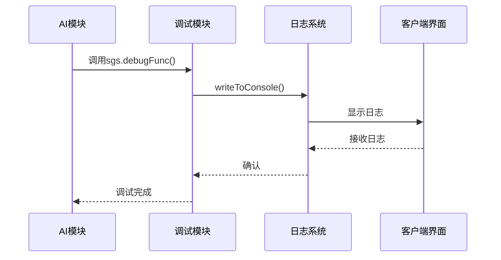
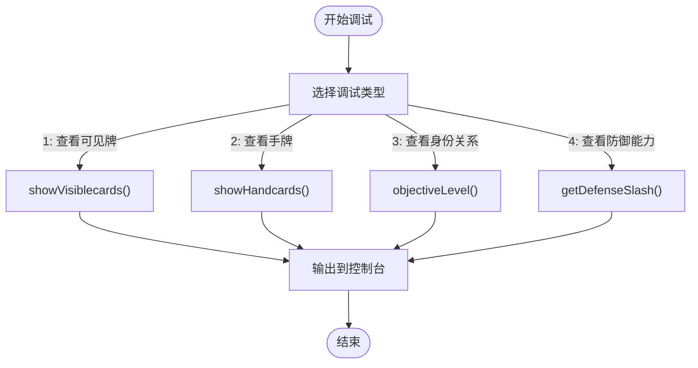
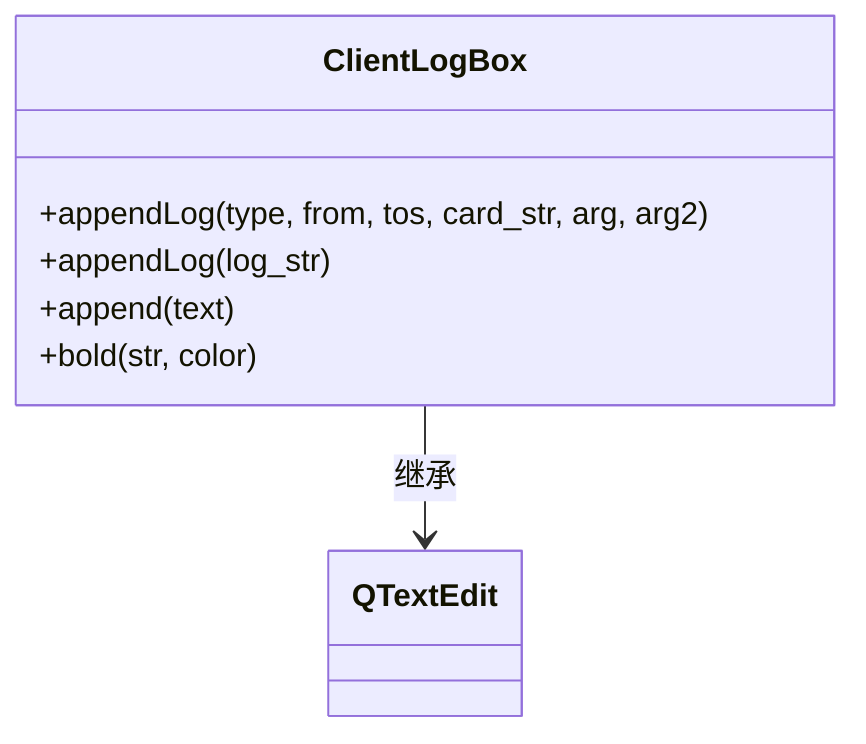
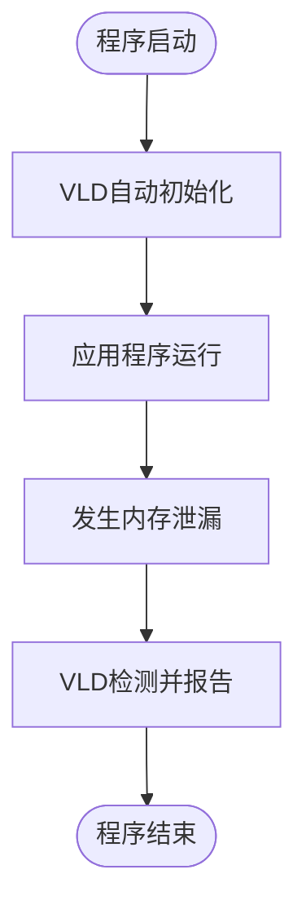
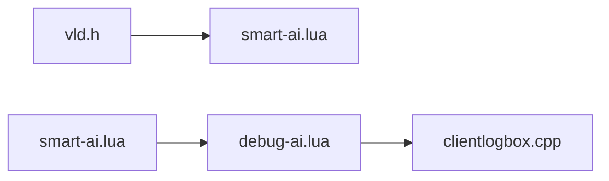
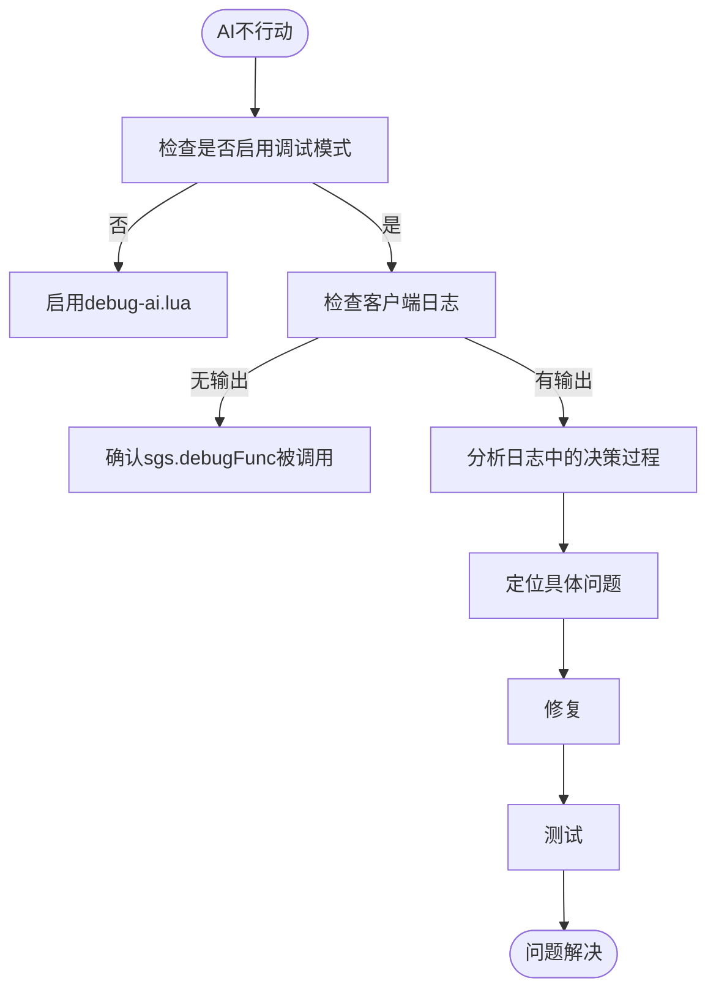
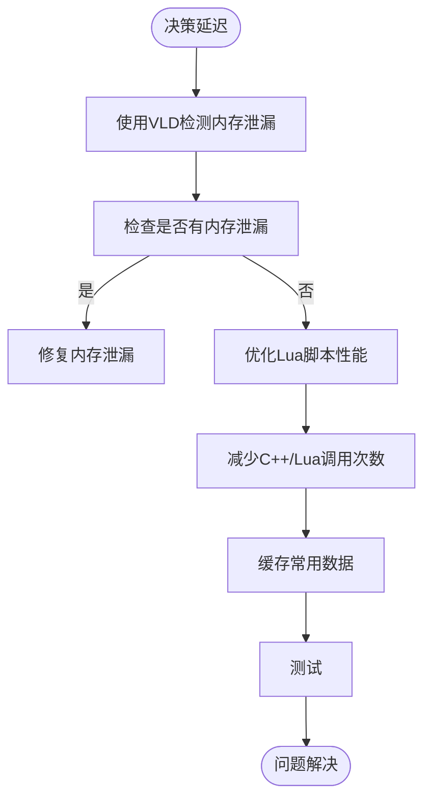

# AI调试与性能优化

<cite>
**本文档引用文件**  
- [debug-ai.lua](file://lua/ai/debug-ai.lua)
- [AIDebug.lua](file://lang/zh_CN/AIDebug.lua)
- [clientlogbox.cpp](file://src/ui/clientlogbox.cpp)
- [vld.h](file://include/vld/vld.h)
</cite>

## 目录
1. [简介](#简介)
2. [项目结构](#项目结构)
3. [核心组件](#核心组件)
4. [架构概览](#架构概览)
5. [详细组件分析](#详细组件分析)
6. [依赖分析](#依赖分析)
7. [性能考量](#性能考量)
8. [故障排查指南](#故障排查指南)
9. [结论](#结论)

## 简介
本文档旨在为《三国杀：霸业》AI系统提供全面的调试与性能优化指导。内容涵盖AI调试模式的启用方法、AI决策日志的输出与解析、性能分析工具的使用建议，以及常见性能陷阱的识别与规避。文档特别针对“AI不行动”、“决策延迟”等典型问题提供根因分析与解决方案，帮助开发者快速定位并解决AI相关问题。

## 项目结构
本项目采用模块化设计，主要分为AI逻辑脚本、客户端界面、核心引擎、调试工具等部分。AI行为逻辑主要由Lua脚本实现，位于`lua/ai/`目录下；客户端日志显示功能由C++实现，位于`src/ui/`目录；性能检测依赖Visual Leak Detector（VLD）工具，其头文件位于`include/vld/`目录。

```mermaid
graph TB
subgraph "AI逻辑"
AILua[debug-ai.lua]
SmartAI[smart-ai.lua]
end
subgraph "客户端界面"
ClientLogBox[clientlogbox.cpp]
end
subgraph "调试工具"
VLD[vld.h]
end
AILua --> ClientLogBox : 输出日志
SmartAI --> AILua : 调用调试函数
VLD --> SmartAI : 内存检测
```

**图示来源**  
- [debug-ai.lua](file://lua/ai/debug-ai.lua)
- [clientlogbox.cpp](file://src/ui/clientlogbox.cpp)
- [vld.h](file://include/vld/vld.h)

**本节来源**  
- [debug-ai.lua](file://lua/ai/debug-ai.lua)
- [clientlogbox.cpp](file://src/ui/clientlogbox.cpp)
- [vld.h](file://include/vld/vld.h)

## 核心组件
本系统的核心组件包括AI调试模块、日志输出模块和内存检测模块。AI调试模块（`debug-ai.lua`）提供了多种调试功能，如查看手牌、分析身份关系等。日志输出模块（`clientlogbox.cpp`）负责在客户端界面上显示AI的决策信息。内存检测模块（`vld.h`）用于检测程序运行过程中的内存泄漏问题。

**本节来源**  
- [debug-ai.lua](file://lua/ai/debug-ai.lua)
- [clientlogbox.cpp](file://src/ui/clientlogbox.cpp)
- [vld.h](file://include/vld/vld.h)

## 架构概览
整个AI调试与性能优化系统的工作流程如下：AI在决策过程中调用`sgs.debugFunc`函数生成调试信息，这些信息通过`Global_room:writeToConsole`输出到日志系统，最终由`ClientLogBox`组件在客户端界面上显示。同时，VLD工具在后台监控内存使用情况，及时发现潜在的内存泄漏。



**图示来源**  
- [debug-ai.lua](file://lua/ai/debug-ai.lua)
- [clientlogbox.cpp](file://src/ui/clientlogbox.cpp)

## 详细组件分析

### AI调试模块分析
AI调试模块的核心是`sgs.debugFunc`函数，它提供了多种调试选项，包括查看可见牌、手牌、身份关系和防御能力。



**图示来源**  
- [debug-ai.lua](file://lua/ai/debug-ai.lua)

**本节来源**  
- [debug-ai.lua](file://lua/ai/debug-ai.lua)

### 日志输出模块分析
日志输出模块负责将AI的决策信息格式化并显示在客户端界面上。它通过`appendLog`函数接收日志信息，并根据类型进行不同的格式化处理。



**图示来源**  
- [clientlogbox.cpp](file://src/ui/clientlogbox.cpp)

**本节来源**  
- [clientlogbox.cpp](file://src/ui/clientlogbox.cpp)

### 内存检测模块分析
内存检测模块基于Visual Leak Detector（VLD）实现，提供了运行时启用/禁用内存检测、报告内存泄漏等功能。



**图示来源**  
- [vld.h](file://include/vld/vld.h)

**本节来源**  
- [vld.h](file://include/vld/vld.h)

## 依赖分析
各组件之间的依赖关系清晰，AI调试模块依赖于日志系统进行信息输出，而性能分析则独立于主逻辑，通过链接VLD库实现内存监控。



**图示来源**  
- [debug-ai.lua](file://lua/ai/debug-ai.lua)
- [clientlogbox.cpp](file://src/ui/clientlogbox.cpp)
- [vld.h](file://include/vld/vld.h)

**本节来源**  
- [debug-ai.lua](file://lua/ai/debug-ai.lua)
- [clientlogbox.cpp](file://src/ui/clientlogbox.cpp)
- [vld.h](file://include/vld/vld.h)

## 性能考量
在AI开发过程中，应注意避免以下性能陷阱：
- **频繁Lua调用**：尽量减少C++与Lua之间的频繁交互，可批量处理数据。
- **死循环判断**：确保AI决策逻辑中不存在无限循环，特别是在技能触发判断中。
- **内存泄漏**：使用VLD工具定期检测，确保对象正确释放。

**本节来源**  
- [vld.h](file://include/vld/vld.h)

## 故障排查指南
针对常见问题提供以下排查流程：

### AI不行动


**图示来源**  
- [debug-ai.lua](file://lua/ai/debug-ai.lua)
- [clientlogbox.cpp](file://src/ui/clientlogbox.cpp)

### 决策延迟


**图示来源**  
- [vld.h](file://include/vld/vld.h)
- [debug-ai.lua](file://lua/ai/debug-ai.lua)

**本节来源**  
- [debug-ai.lua](file://lua/ai/debug-ai.lua)
- [clientlogbox.cpp](file://src/ui/clientlogbox.cpp)
- [vld.h](file://include/vld/vld.h)

## 结论
通过合理使用`debug-ai.lua`中的调试功能，结合`clientlogbox.cpp`的日志输出和VLD内存检测工具，可以有效提升AI系统的开发效率和运行性能。建议开发者在开发过程中养成定期使用这些工具的习惯，及时发现并解决问题。