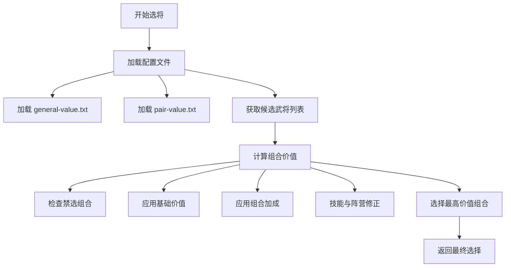
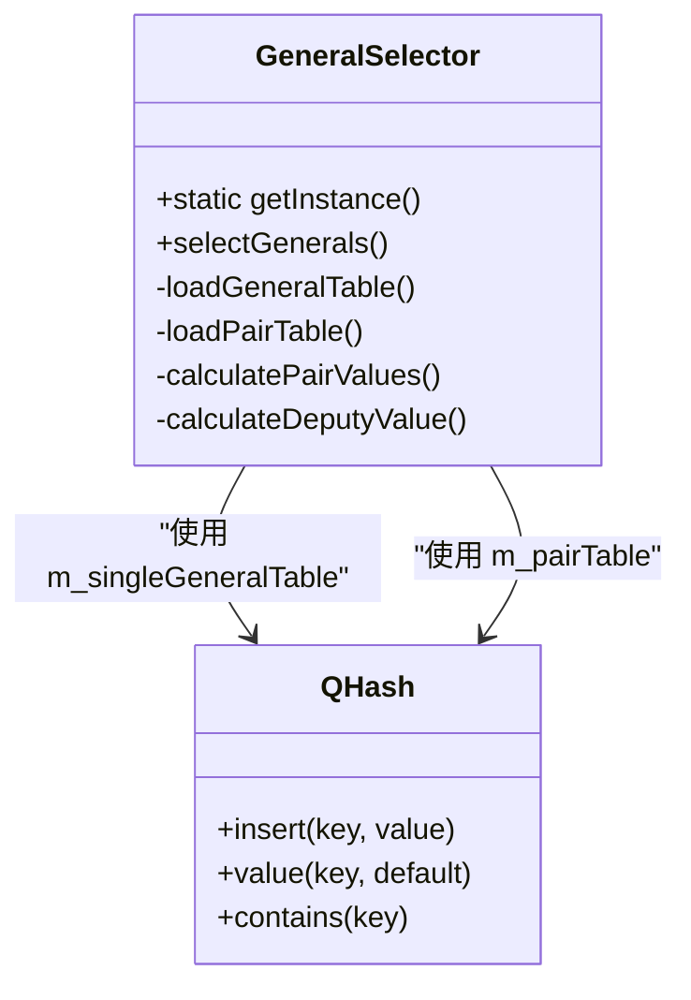
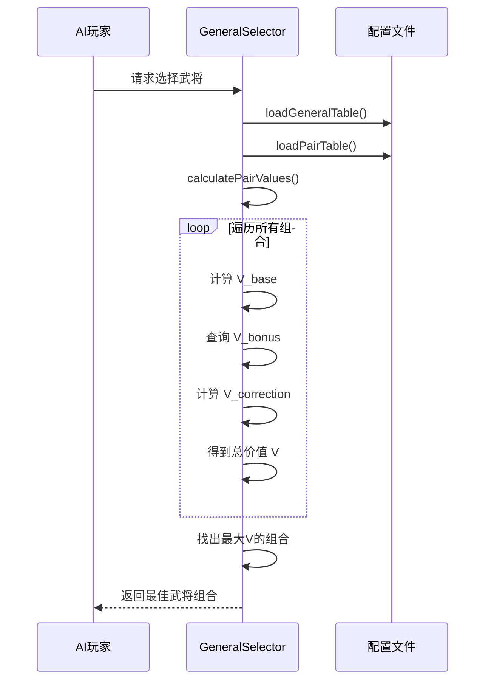
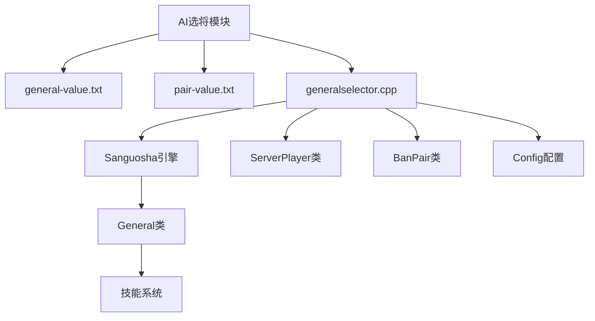

# AI配置与权重管理

<cite>
**本文档引用文件**  
- [general-value.txt](file://ai-selector/general-value.txt)
- [pair-value.txt](file://ai-selector/pair-value.txt)
- [generalselector.cpp](file://src/server/generalselector.cpp)
- [generalselector.h](file://src/server/generalselector.h)
- [value_config.lua](file://extension-doc/value_config.lua)
</cite>

## 目录
1. [引言](#引言)
2. [项目结构概述](#项目结构概述)
3. [核心组件分析](#核心组件分析)
4. [架构概览](#架构概览)
5. [详细组件分析](#详细组件分析)
6. [依赖关系分析](#依赖关系分析)
7. [性能考量](#性能考量)
8. [故障排查指南](#故障排查指南)
9. [结论](#结论)

## 引言
本文档全面阐述了《三国杀》AI武将选择与配对的配置机制。重点解析了AI如何通过`general-value.txt`和`pair-value.txt`两个配置文件，结合C++与Lua代码，实现智能化的武将选择策略。文档将深入分析配置文件的语法、加载逻辑、权重计算模型，并提供调参指导。

## 项目结构概述
AI选将功能的核心文件位于`ai-selector`目录下，主要由两个配置文件构成：
- **general-value.txt**: 定义单个武将的基础价值。
- **pair-value.txt**: 定义武将组合的加成权重。

这些配置由C++代码`src/server/generalselector.cpp`加载和处理，并通过`value_config.lua`在Lua层进行补充和扩展，共同影响AI在选将阶段的决策。

**Section sources**
- [general-value.txt](file://ai-selector/general-value.txt)
- [pair-value.txt](file://ai-selector/pair-value.txt)

## 核心组件分析
AI选将的核心逻辑由`GeneralSelector`类实现，该类是一个单例模式，负责管理所有AI的选将决策。

**Section sources**
- [generalselector.h](file://src/server/generalselector.h#L0-L56)
- [generalselector.cpp](file://src/server/generalselector.cpp#L0-L279)

## 架构概览
AI选将的整体流程如下图所示：



**Diagram sources**
- [generalselector.cpp](file://src/server/generalselector.cpp#L100-L279)

## 详细组件分析

### 武将基础价值配置 (general-value.txt)

#### 配置文件语法
`general-value.txt`文件定义了每个武将的基础价值，其语法格式为：
```
<武将英文名> <基础价值>
```
例如：
```
caocao 7
zhenji 9
```
- **武将英文名**: 必须与游戏内定义的武将名称完全一致。
- **基础价值**: 一个整数，代表该武将的综合强度评分。数值越高，AI越倾向于选择。

#### 加载逻辑
`generalselector.cpp`中的`loadGeneralTable()`函数负责加载此文件：
1. 使用正则表达式 `rx("(\\w+)\\s+(\\d+)")` 解析每一行。
2. 将解析出的武将名和价值存入 `m_singleGeneralTable` 哈希表中。
3. 同时会检查`extensions/ai-selector/`目录下是否存在Lua扩展包对应的`*-general-value.txt`文件，并加载它们，实现配置的扩展。



**Diagram sources**
- [generalselector.cpp](file://src/server/generalselector.cpp#L150-L175)

**Section sources**
- [general-value.txt](file://ai-selector/general-value.txt)
- [generalselector.cpp](file://src/server/generalselector.cpp#L150-L175)

### 武将组合加成配置 (pair-value.txt)

#### 配置文件语法
`pair-value.txt`文件定义了特定武将组合的加成权重，其语法格式为：
```
<主将英文名> <副将英文名> <主将加成> <副将加成>
```
例如：
```
huangyueying zhangfei 23 22
```
- **主将/副将英文名**: 定义组合的两个武将。
- **主将加成/副将加成**: 两个整数，分别代表当第一个武将作为主将、第二个作为副将时的加成值，以及反过来的加成值。
- **对称性**: 系统会自动创建反向组合（如`zhangfei+huangyueying`），并赋予对应的加成值。

#### 加载逻辑
`generalselector.cpp`中的`loadPairTable()`函数负责加载此文件：
1. 使用正则表达式 `rx("(\\w+)\\s+(\\w+)\\s+(\\d+)\\s+(\\d+)")` 解析每一行。
2. 将组合构造成 `"<主将>+<副将>"` 的字符串作为键，加成值作为值，存入 `m_pairTable` 哈希表中。
3. 同样支持Lua扩展包的配置文件。

**Section sources**
- [pair-value.txt](file://ai-selector/pair-value.txt)
- [generalselector.cpp](file://src/server/generalselector.cpp#L177-L202)

### 组合价值计算模型

#### 数学模型
AI选择武将的最终决策基于一个综合评分模型。对于一个`主将+副将`的组合，其总价值 `V` 的计算公式如下：

```
V = V_base + V_bonus + V_correction
```

其中：
- **V_base**: 基础价值总和。
  - `V_base = m_singleGeneralTable[主将] + m_singleGeneralTable[副将]`
- **V_bonus**: 组合加成。
  - 如果 `m_pairTable` 中存在 `"主将+副将"` 的键，则 `V_bonus = m_pairTable["主将+副将"]`。
  - 否则 `V_bonus = 0`。
- **V_correction**: 多项修正值。
  - **阵营偏好**: 根据预设的阵营优先级列表 `kingdom_list` 进行调整。
  - **体力值修正**: 若主将+副将的最大体力值之和为奇数，则减1分。
  - **搭档关系**: 若两武将存在“搭档”关系（如刘备与关羽），则加3分。
  - **性别与阵营**: 女性武将在吴国减分，在其他非群雄阵营加分；群雄男性武将加分。
  - **技能修正**: 根据主将的特定技能进行加减分（如法正主将+0.5，王平主将-2）。
  - **君主替换**: 若开启君主替换且主将拥有特定技能（如刘备的“仁德”），则大幅加分（+10）。
  - **高体力需求**: 若组合体力值低于8，且任一武将拥有依赖高体力的技能（如“制衡”），则减5分。

#### 决策流程
`selectGenerals()`函数是决策的核心：
1. 对候选武将列表进行预处理（如处理转换武将）。
2. 调用 `calculatePairValues()` 计算当前玩家所有可能组合的价值，并存入 `m_privatePairValueTable`。
3. 遍历 `m_privatePairValueTable`，找出价值最高的组合。
4. 返回该组合的武将名称列表。



**Diagram sources**
- [generalselector.cpp](file://src/server/generalselector.cpp#L60-L145)

**Section sources**
- [generalselector.cpp](file://src/server/generalselector.cpp#L60-L279)

### Lua层配置 (value_config.lua)

#### 功能说明
`value_config.lua`文件位于`extension-doc`目录下，主要用于定义AI在**使用和保留卡牌**时的偏好，而非直接参与选将。它通过`sgs`全局表定义了多个权重表，例如：
- `sgs.zhangfei_keep_value`: 定义张飞保留不同卡牌的价值。
- `sgs.xiaoqiao_suit_value`: 定义小乔对不同花色牌的偏好。

#### 与选将机制的关系
虽然`value_config.lua`不直接影响`general-value.txt`或`pair-value.txt`的加载，但它是AI整体行为配置体系的一部分。开发者可以通过修改此文件来调整AI在游戏中的整体策略，从而间接影响其对某些武将（如依赖特定卡牌的武将）的评价。

**Section sources**
- [value_config.lua](file://extension-doc/value_config.lua)

## 依赖关系分析
AI选将模块的依赖关系清晰，主要依赖于核心引擎和配置系统。



**Diagram sources**
- [generalselector.h](file://src/server/generalselector.h#L0-L56)
- [generalselector.cpp](file://src/server/generalselector.cpp#L0-L279)

## 性能考量
- **加载性能**: 配置文件在服务器启动时一次性加载，对运行时性能无影响。
- **计算性能**: `calculatePairValues()`函数的时间复杂度为O(n²)，其中n为候选武将数量。在常规5选2的场景下，计算量很小，性能开销可忽略不计。
- **内存占用**: 价值表使用哈希表存储，查询效率为O(1)，内存占用与配置文件大小成正比。

## 故障排查指南
当AI选将行为不符合预期时，请按以下步骤排查：
1. **检查文件路径**: 确认`ai-selector/general-value.txt`和`pair-value.txt`文件存在且路径正确。
2. **检查文件格式**: 确保配置文件没有语法错误（如多余的空格、非英文字符）。
3. **检查武将名称**: 确保配置文件中的武将英文名与游戏内定义完全一致。
4. **检查禁选组合**: 确认所期望的组合未被`BanPair`系统禁用。
5. **验证技能修正**: 检查`calculateDeputyValue()`函数中的技能修正逻辑是否符合预期。
6. **日志调试**: 可在`calculateDeputyValue()`函数中添加日志，输出每个组合的详细计算过程。

**Section sources**
- [generalselector.cpp](file://src/server/generalselector.cpp#L204-L279)

## 结论
AI武将选择与配对机制是一个基于配置文件驱动的、可高度定制的系统。通过精确调整`general-value.txt`中的基础价值和`pair-value.txt`中的组合加成，开发者可以精细地控制AI的行为倾向。理解其背后的数学模型和计算流程，是进行有效调参的关键。合理的调参范围建议：
- **基础价值**: 4-11，与武将实际强度相符。
- **组合加成**: 5-26，5表示无加成，26表示极强的组合。
- **技能修正**: ±10以内，避免单个因素影响过大。