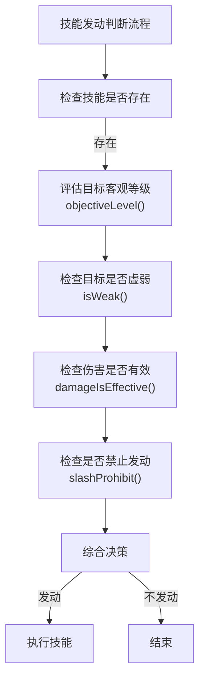
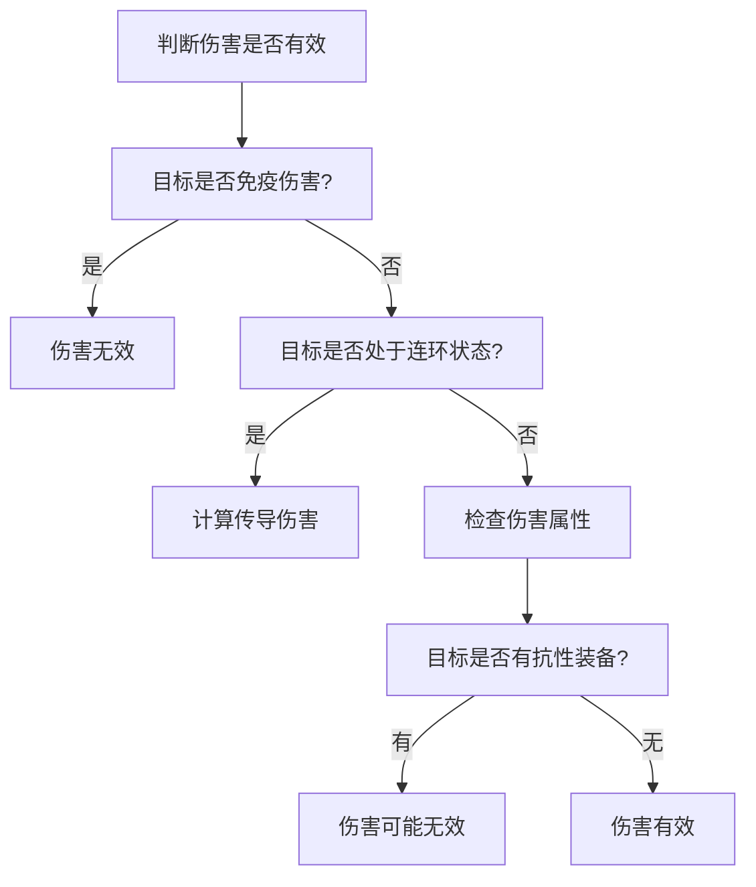
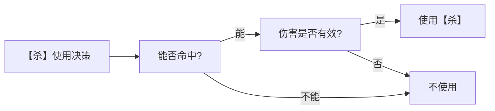
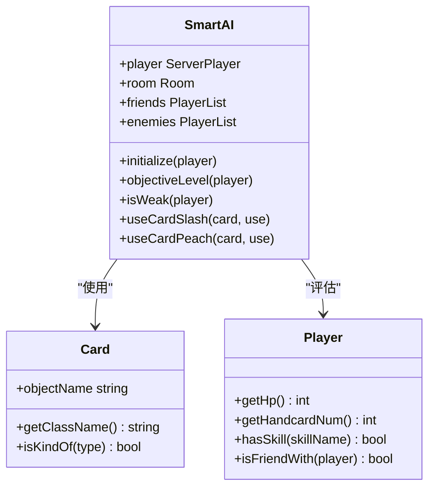

# 技能与卡牌评估

<cite>
**本文档引用文件**   
- [smart-ai.lua](file://lua/ai/smart-ai.lua)
- [standard_cards-ai.lua](file://lua/ai/standard_cards-ai.lua)
</cite>

## 目录
1. [引言](#引言)
2. [AI技能发动判断机制](#ai技能发动判断机制)
3. [基本卡牌价值评估](#基本卡牌价值评估)
4. [延时锦囊使用价值分析](#延时锦囊使用价值分析)
5. [技能评估权重表](#技能评估权重表)
6. [技能冲突与联动处理](#技能冲突与联动处理)

## 引言
本文档旨在深入解析《三国杀》AI系统中关于技能发动时机判断及卡牌价值评估的核心机制。文档基于`smart-ai.lua`和`standard_cards-ai.lua`两个核心Lua脚本文件，详细阐述了AI如何通过`SmartAI:hasSkill()`、`SmartAI:isWeak()`等方法进行决策，以及对【闪】、【桃】等基本卡牌的评估逻辑。内容涵盖使用优先级、目标适配度、风险收益计算等关键方面，并结合代码示例说明AI对延时锦囊和技能联动的处理策略。

## AI技能发动判断机制

AI技能发动的判断是一个复杂的决策过程，核心在于`SmartAI`类及其相关方法。AI通过分析玩家状态、技能特性、战场局势等多维度信息，决定是否发动技能。

### 核心判断方法
AI通过`SmartAI`类的实例方法来评估技能发动的必要性和时机。例如，`SmartAI:isWeak()`方法用于判断一名玩家是否处于“虚弱”状态，这是许多技能（如【桃】的使用）的关键触发条件。



**Diagram sources**
- [smart-ai.lua](file://lua/ai/smart-ai.lua#L1500-L1600)

**Section sources**
- [smart-ai.lua](file://lua/ai/smart-ai.lua#L1500-L1600)

### 客观等级评估
`SmartAI:objectiveLevel()`函数是AI决策的核心，它为每个玩家赋予一个客观等级值，用于区分敌友和优先级。该函数综合考虑了玩家身份、势力、血量、手牌、技能、当前游戏进程等多种因素。

```lua
function SmartAI:objectiveLevel(player)
    if not player then return 0 end
    if self.player:objectName() == player:objectName() then return -2 end
    if self.player:isFriendWith(player) then return -2 end
    -- ... 更多复杂的逻辑判断
end
```

该函数的返回值决定了AI的行为：负值通常代表友方，正值代表敌方，数值越大，攻击优先级越高。例如，当游戏进程显示某一势力明显占优时，AI会将该势力的敌对玩家视为高优先级目标。

### 伤害有效性判断
在发动攻击性技能前，AI会通过`SmartAI:damageIsEffective()`等方法判断伤害是否有效。这包括检查目标是否免疫伤害、是否处于连环状态、伤害属性是否被抗性技能（如【藤甲】）抵消等。



**Diagram sources**
- [smart-ai.lua](file://lua/ai/smart-ai.lua#L2000-L2100)

**Section sources**
- [smart-ai.lua](file://lua/ai/smart-ai.lua#L2000-L2100)

## 基本卡牌价值评估

AI对卡牌的评估是其行动的基础，通过`sgs.ai_use_value`、`sgs.ai_keep_value`和`sgs.ai_use_priority`三个全局表来定义卡牌的使用价值、保留价值和使用优先级。

### 评估逻辑与优先级
AI在评估卡牌时，会综合考虑卡牌的即时收益、潜在风险和战略价值。例如，【桃】的价值评估极高，因为其直接关系到生存。

```lua
-- 在 standard_cards-ai.lua 中定义的卡牌价值
sgs.ai_use_value.Peach = 7
sgs.ai_keep_value.Peach = 7
sgs.ai_use_priority.Peach = 0.9
```

*   **使用价值 (ai_use_value)**: 表示使用该卡牌能带来的直接收益。【桃】的使用价值为7，是所有卡牌中最高的之一。
*   **保留价值 (ai_keep_value)**: 表示在手牌中保留该卡牌的价值。【桃】的保留价值同样为7，表明AI会优先保留【桃】。
*   **使用优先级 (ai_use_priority)**: 决定了在多个可用卡牌中，AI选择使用的顺序。数值越低，优先级越高。【桃】的使用优先级为0.9，意味着它会在大多数其他卡牌之前被使用。

### 【杀】与【闪】的评估
【杀】和【闪】作为最基础的攻防卡牌，其评估逻辑非常精细。

*   **【杀】的评估**: AI会计算【杀】能否命中目标。这涉及到对目标【闪】数量的估算（`getCardsNum("Jink", to, self.player)`）以及目标的防御技能（如【藤甲】、【仁王盾】）。如果目标的防御值（`sgs.getDefenseSlash()`）低于某个阈值，AI才会认为【杀】是有效的。
*   **【闪】的评估**: 【闪】的保留价值（5.2）远高于使用价值（8.9），这表明AI更倾向于保留【闪】用于防御，而不是主动使用。AI会根据当前受到的威胁等级来决定是否打出【闪】。



**Diagram sources**
- [standard_cards-ai.lua](file://lua/ai/standard_cards-ai.lua#L1000-L1200)

**Section sources**
- [standard_cards-ai.lua](file://lua/ai/standard_cards-ai.lua#L1000-L1200)

## 延时锦囊使用价值分析

延时锦囊（如【乐不思蜀】、【兵粮寸断】）的使用价值评估更为复杂，因为它涉及到对目标未来行为的预测。

### 使用价值计算
AI通过`SmartAI:useCardIndulgence()`等函数来评估延时锦囊的使用价值。其核心逻辑是计算目标在下个回合跳过摸牌阶段的“收益”。

```lua
function SmartAI:useCardIndulgence(card, use)
    local getvalue = function(enemy)
        local value = enemy:getHandcardNum() - enemy:getHp()
        -- 增加负面因素：目标是弱者、有高优先级技能等
        if self:isWeak(enemy) then value = value + 3 end
        if enemy:hasShownSkills(sgs.priority_skill) then value = value + 5 end
        -- 增加正面因素（对AI有利）：目标有【克己】、是主公等
        if enemy:hasShownSkill("keji") then value = value - 10 end
        return value
    end
    -- ... 根据value值排序，选择最优目标
end
```

AI会为每个敌人计算一个`value`值，该值越低，表示对AI越有利，就越应该对其使用【乐不思蜀】。例如，一个手牌多但血量少的敌人，其`value`值会很高，AI不会优先选择他；而一个手牌少但有【克己】技能的敌人，其`value`值会被大幅降低，成为优先目标。

### 风险与收益
使用延时锦囊的风险在于，目标可能通过【无懈可击】或判定成功来解除。因此，AI在使用前会评估目标使用【无懈可击】的可能性（`getCardsNum("Nullification", enemy, self.player)`），并结合当前局势做出最终决策。

## 技能评估权重表

下表列出了AI对常见技能的评估权重，这些权重影响了AI在决策时的倾向性。

| 技能名称 | 技能类型 | AI评估权重 | 说明 |
| :--- | :--- | :--- | :--- |
| **咆哮** | 攻击技能 | 高 | 能连续使用【杀】，极大提升输出能力。 |
| **仁德** | 回复技能 | 中 | 可以转移手牌，但AI更倾向于保留关键卡牌。 |
| **龙胆** | 防御技能 | 高 | 【闪】可当【杀】，【杀】可当【闪】，攻防一体。 |
| **空城** | 防御技能 | 极高 | 当AI手牌为空时，此技能使其几乎无法被【杀】命中。 |
| **观星** | 摸牌技能 | 高 | 可以调整牌堆顶的牌，对战略有重要影响。 |
| **制衡** | 摸牌技能 | 高 | 可以弃牌摸牌，优化手牌结构。 |
| **连营** | 回复技能 | 高 | 每次失去【闪】或【桃】时摸一张牌，续航能力强。 |
| **遗计** | 摸牌技能 | 高 | 受到伤害后摸牌，能有效补充手牌。 |

**Section sources**
- [smart-ai.lua](file://lua/ai/smart-ai.lua#L50-L100)
- [standard_cards-ai.lua](file://lua/ai/standard_cards-ai.lua#L50-L100)

## 技能冲突与联动处理

AI系统能够处理复杂的技能冲突和联动情况，确保决策的合理性和有效性。

### 技能冲突处理
当多个技能效果发生冲突时，AI会根据技能的优先级和游戏规则进行处理。例如，当【乐不思蜀】判定为红色时，目标跳过摸牌阶段；但如果目标同时有【克己】技能，AI会认为【克己】的效果优先，因此不会对其使用【乐不思蜀】。

```lua
-- 在 useCardIndulgence 函数中，有如下判断
if enemy:hasShownSkill("keji") then return -101 end
```

这里的`-101`是一个极低的`value`值，确保该目标永远不会被选中。

### 技能联动处理
AI能够识别并利用技能之间的联动效应。例如，【丈八蛇矛】技能允许玩家弃两张手牌当【杀】使用。

```lua
-- 在 Spear_skill.getTurnUseCard 函数中
local card_str = ("slash:%s[%s:%s]=%d+%d&%s"):format(skill_name, "to_be_decided", 0, card_id1, card_id2, skill_name)
```

AI会主动寻找两张手牌（通常是【杀】或【桃】以外的牌）来组合成【杀】，从而在手牌不足时依然能发起攻击。这种联动处理极大地增强了AI的灵活性和攻击性。



**Diagram sources**
- [smart-ai.lua](file://lua/ai/smart-ai.lua)
- [standard_cards-ai.lua](file://lua/ai/standard_cards-ai.lua)

**Section sources**
- [smart-ai.lua](file://lua/ai/smart-ai.lua)
- [standard_cards-ai.lua](file://lua/ai/standard_cards-ai.lua)