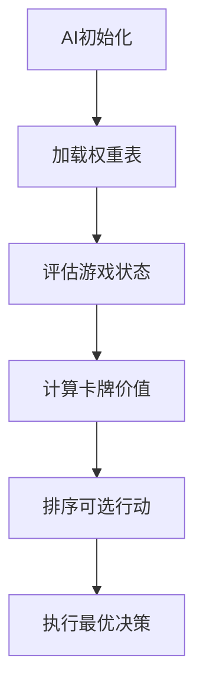
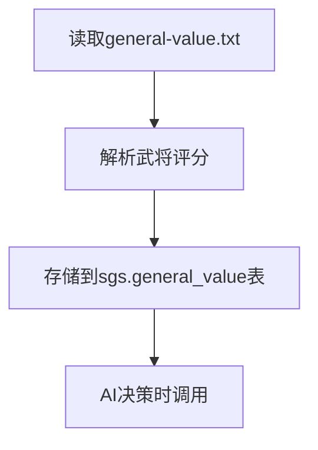
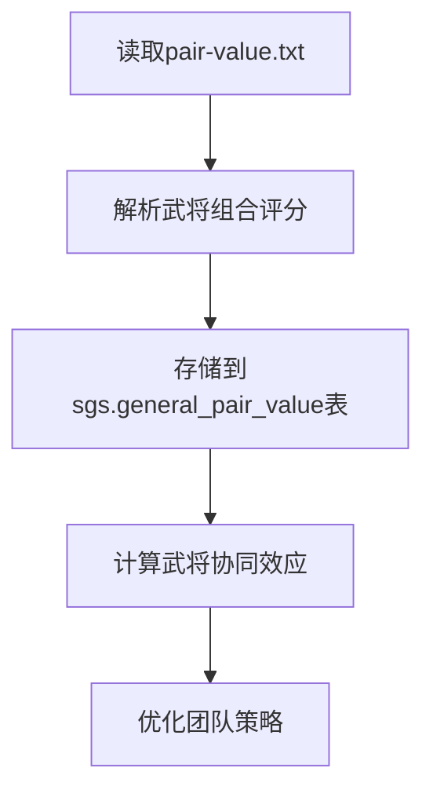
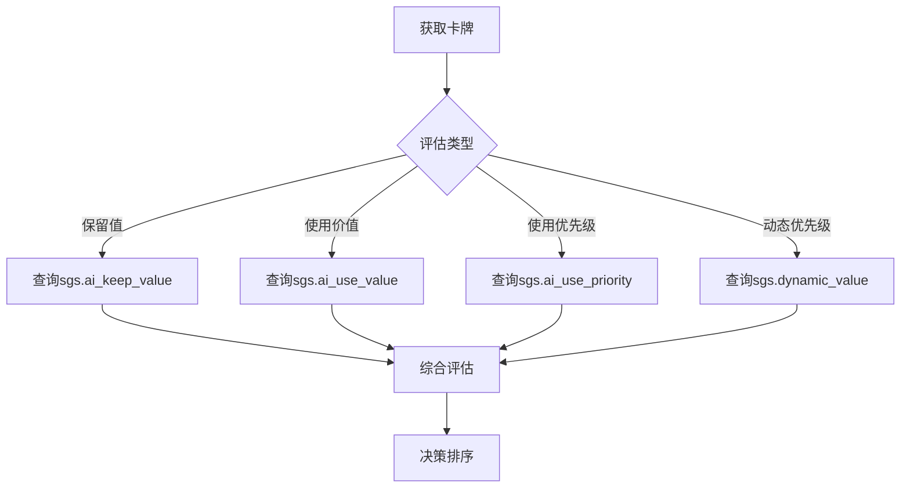
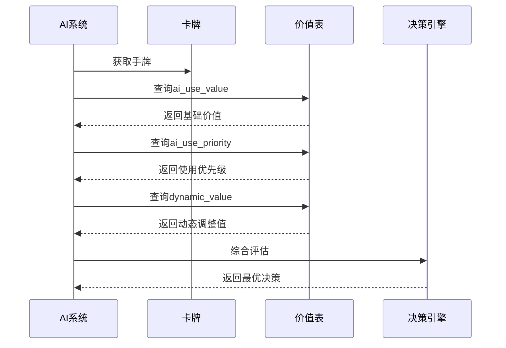
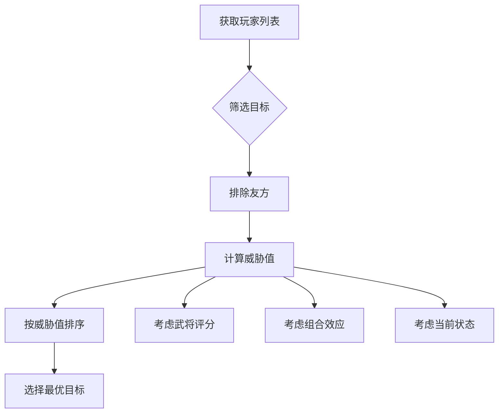

# AI配置与调优

<cite>
**本文档引用文件**   
- [12-SmartAI.lua](file://extension-doc/12-SmartAI.lua)
- [general-value.txt](file://ai-selector/general-value.txt)
- [pair-value.txt](file://ai-selector/pair-value.txt)
- [smart-ai.lua](file://lua/ai/smart-ai.lua)
- [transformation-ai.lua](file://lua/ai/transformation-ai.lua)
</cite>

## 目录
1. [AI决策权重系统概述](#ai决策权重系统概述)
2. [武将强度评分配置](#武将强度评分配置)
3. [武将克制关系配置](#武将克制关系配置)
4. [AI技能优先级评估](#ai技能优先级评估)
5. [卡牌使用价值评估](#卡牌使用价值评估)
6. [目标选择与仇恨值计算](#目标选择与仇恨值计算)
7. [新武将AI配置示例](#新武将ai配置示例)
8. [AI调试方法](#ai调试方法)

## AI决策权重系统概述

智能AI系统通过一系列预定义的权重表和评估函数来模拟玩家的决策过程。核心机制基于Lua脚本实现，主要依赖`smart-ai.lua`作为基础类，通过加载不同扩展的AI脚本（如`standard-ai.lua`、`maneuvering-ai.lua`等）来构建完整的决策体系。

AI决策流程主要分为以下几个阶段：
1. 初始化AI实例并加载基础权重数据
2. 评估当前游戏状态和玩家关系
3. 计算卡牌的保留值、使用价值和优先级
4. 根据综合评估结果做出最优决策



**图示来源**
- [smart-ai.lua](file://lua/ai/smart-ai.lua#L1-L100)

**本节来源**
- [12-SmartAI.lua](file://extension-doc/12-SmartAI.lua#L1-L50)

## 武将强度评分配置

武将强度评分是AI评估玩家威胁程度的基础，存储在`ai-selector/general-value.txt`文件中。该文件采用简单的键值对格式，定义了每个武将的综合强度评分。

### 配置文件结构

```
武将英文名							评分
lord_caocao							11
caocao								7
simayi								8
...
```

评分范围通常在1-11之间，其中：
- **1-3分**：较弱武将
- **4-6分**：普通武将
- **7-8分**：较强武将
- **9-10分**：强力武将
- **11分**：主公专属高分

### 评分原则

1. **主公加成**：主公身份的武将通常获得最高评分（11分）
2. **技能强度**：拥有强力技能的武将评分较高
3. **综合能力**：考虑武将的攻击、防御、辅助等综合能力
4. **游戏平衡**：避免评分过高导致AI行为失衡



**图示来源**
- [general-value.txt](file://ai-selector/general-value.txt)
- [smart-ai.lua](file://lua/ai/smart-ai.lua#L60-L70)

**本节来源**
- [general-value.txt](file://ai-selector/general-value.txt)
- [smart-ai.lua](file://lua/ai/smart-ai.lua#L60-L70)

## 武将克制关系配置

武将克制关系定义了特定武将组合之间的协同效应，存储在`ai-selector/pair-value.txt`文件中。这种配置允许AI识别强力的武将搭配，从而优化团队策略。

### 配置文件结构

```
武将1英文名 武将2英文名								评分1 评分2
lord_liubei fazheng								26 25
huangyueying zhangfei							23 22
zhangfei guanyu									25 24
...
```

每行包含两个武将的英文名和两个评分值，分别代表：
- **第一个评分**：AI作为第一个武将时对组合的评价
- **第二个评分**：AI作为第二个武将时对组合的评价

### 典型克制关系

1. **蜀国组合**：
   - 刘备+法正：26/25（强力辅助组合）
   - 张飞+关羽：25/24（经典猛将组合）
   - 黄月英+诸葛亮：22/21（智力型组合）

2. **吴国组合**：
   - 孙权+孙尚香：26/25（主公与妹妹的强力组合）
   - 周瑜+小乔：23/22（经典夫妻档）
   - 甘宁+凌统：23/22（水战专家组合）

3. **魏国组合**：
   - 曹操+郭嘉：24/23（智谋型主公组合）
   - 夏侯惇+夏侯渊：24/23（兄弟猛将组合）
   - 荀彧+荀攸：23/22（谋士组合）



**图示来源**
- [pair-value.txt](file://ai-selector/pair-value.txt)
- [transformation-ai.lua](file://lua/ai/transformation-ai.lua#L2400-L2440)

**本节来源**
- [pair-value.txt](file://ai-selector/pair-value.txt)
- [transformation-ai.lua](file://lua/ai/transformation-ai.lua#L2400-L2440)

## AI技能优先级评估

AI通过一系列函数来评估技能和卡牌的优先级，这些评估直接影响AI的决策顺序。

### 核心评估函数

#### 1. 保留值评估
```lua
-- 获取卡牌保留值
SmartAI:getKeepValue(card, kept)
```
该函数从`sgs.ai_keep_value`表中获取卡牌的保留值，值越高表示越倾向于保留该卡牌。

#### 2. 使用价值评估
```lua
-- 获取卡牌使用价值
SmartAI:getUseValue(card)
```
从`sgs.ai_use_value`表中获取卡牌的使用价值，用于决定是否使用某张卡牌。

#### 3. 使用优先级评估
```lua
-- 获取卡牌使用优先级
SmartAI:getUsePriority(card)
```
从`sgs.ai_use_priority`表中获取卡牌的使用优先级，数值越大优先级越高。

#### 4. 动态优先级评估
```lua
-- 获取卡牌动态使用优先级
SmartAI:getDynamicUsePriority(card)
```
考虑当前手牌组合对卡牌优先级的影响，更加智能化。

### 优先级配置示例

```lua
-- 卡牌保留值配置
sgs.ai_keep_value.Analeptic = 4.5

-- 武将专属卡牌保留值
sgs.zhangfei_keep_value = {
    Peach = 6,
    Analeptic = 5.8,
    Jink = 5.7,
    FireSlash = 5.6
}

-- 卡牌使用价值
sgs.ai_use_value.ExNihilo = 10 -- 无中生有

-- 卡牌使用优先级
sgs.ai_use_priority.XinzhanCard = 9.2
```



**图示来源**
- [12-SmartAI.lua](file://extension-doc/12-SmartAI.lua#L21-L57)
- [smart-ai.lua](file://lua/ai/smart-ai.lua#L100-L150)

**本节来源**
- [12-SmartAI.lua](file://extension-doc/12-SmartAI.lua#L21-L57)
- [smart-ai.lua](file://lua/ai/smart-ai.lua#L100-L150)

## 卡牌使用价值评估

卡牌使用价值评估是AI决策的核心环节，决定了AI在出牌阶段的行为模式。

### 评估维度

1. **基础价值**：卡牌的固有价值，存储在`sgs.ai_use_value`表中
2. **优先级**：卡牌的使用优先级，存储在`sgs.ai_use_priority`表中
3. **动态调整**：根据当前手牌组合动态调整优先级

### 评估流程



### 排序函数

AI提供了多种排序函数来优化决策：

```lua
-- 按保留值排序（从小到大）
SmartAI:sortByKeepValue(cards, inverse, kept)

-- 按使用价值排序（从大到小）
SmartAI:sortByUseValue(cards, inverse)

-- 按使用优先级排序（从大到小）
SmartAI:sortByUsePriority(cards, inverse)

-- 按动态优先级排序（从大到小）
SmartAI:sortByDynamicUsePriority(cards, inverse)
```

### 实际应用示例

```lua
-- 华佗青囊技能的卡牌选择
local cards = self.player:getHandcards()
cards = sgs.QList2Table(cards)
self:sortByKeepValue(cards) -- 按保留值排序
local card_str = ("@QingnangCard=%d"):format(cards[1]:getId())
-- 选择保留值最小的卡牌使用
```

**图示来源**
- [12-SmartAI.lua](file://extension-doc/12-SmartAI.lua#L113-L131)
- [smart-ai.lua](file://lua/ai/smart-ai.lua#L200-L250)

**本节来源**
- [12-SmartAI.lua](file://extension-doc/12-SmartAI.lua#L113-L131)
- [smart-ai.lua](file://lua/ai/smart-ai.lua#L200-L250)

## 目标选择与仇恨值计算

AI的目标选择基于复杂的仇恨值计算系统，综合考虑玩家身份、武将强度和当前游戏状态。

### 核心判断函数

```lua
-- 判断友方关系
SmartAI:isFriend(other, another)

-- 判断敌方关系
SmartAI:isEnemy(other, another)

-- 获取友方玩家列表
SmartAI:getFriends(player)

-- 获取敌方玩家列表
SmartAI:getEnemies(player)
```

### 仇恨值计算因素

1. **身份关系**：主公、忠臣、反贼、内奸的关系
2. **武将评分**：基于`general-value.txt`的强度评分
3. **组合效应**：基于`pair-value.txt`的协同评分
4. **当前状态**：体力值、手牌数、装备情况

### 排序关键字

AI提供了多种排序关键字来优化目标选择：

```lua
-- 按体力值排序
SmartAI:sort(players, "hp")

-- 按手牌数排序
SmartAI:sort(players, "handcard")

-- 按综合值排序（手牌数+体力*2）
SmartAI:sort(players, "value")

-- 按嘲讽值排序
SmartAI:sort(players, "chaofeng")

-- 按防御值排序
SmartAI:sort(players, "defense")

-- 按威胁值排序
SmartAI:sort(players, "threat")
```



**图示来源**
- [12-SmartAI.lua](file://extension-doc/12-SmartAI.lua#L113-L131)
- [smart-ai.lua](file://lua/ai/smart-ai.lua#L300-L350)

**本节来源**
- [12-SmartAI.lua](file://extension-doc/12-SmartAI.lua#L113-L131)
- [smart-ai.lua](file://lua/ai/smart-ai.lua#L300-L350)

## 新武将AI配置示例

以"火焰骑士"为例，演示如何为新武将配置AI权重。

### 武将基本信息

- **英文名**：huoyanqishi
- **势力**：群
- **技能**：火焰之怒、烈焰护盾、焚天灭地

### 配置步骤

#### 1. 添加武将强度评分
在`ai-selector/general-value.txt`中添加：
```
huoyanqishi							9
```

#### 2. 配置克制关系
在`ai-selector/pair-value.txt`中添加：
```
huoyanqishi huatuo								22 21
huoyanqishi zhangjiao							23 22
huoyanqishi new_zuoci							21 20
```

#### 3. 创建AI配置文件
创建`lua/ai/huoyanqishi-ai.lua`：

```lua
-- 火焰骑士AI配置

-- 卡牌保留值
sgs.huoyanqishi_keep_value = {
    Peach = 5.5,
    Jink = 4.8,
    FireSlash = 6.5,
    Slash = 5.2,
    ThunderSlash = 5.0,
    ExNihilo = 4.0
}

-- 卡牌花色偏好
sgs.huoyanqishi_suit_value = {
    heart = 7.0, -- 红桃（火焰属性）
    spade = 4.5, -- 黑桃
    club = 4.0, -- 草花
    diamond = 3.5 -- 方片
}

-- 技能优先级
sgs.ai_use_priority.HuoYanZhiNuCard = 9.5
sgs.ai_use_priority.LieYanHuDunCard = 8.8
sgs.ai_use_priority.FenTianMieDiCard = 9.8

-- 技能使用价值
sgs.ai_use_value.HuoYanZhiNuCard = 8.5
sgs.ai_use_value.LieYanHuDunCard = 7.0
sgs.ai_use_value.FenTianMieDiCard = 9.0

-- 动态价值调整
sgs.dynamic_value.damage_card.FireSlash = true
sgs.dynamic_value.damage_card.FireAttack = true
sgs.dynamic_value.benefit.LieYanHuDunCard = true

-- 技能使用函数
sgs.ai_skill_use["HuoYanZhiNu"] = function(self, prompt, method)
    local targets = {}
    for _, enemy in ipairs(self.enemies) do
        if self:slashIsEffective(nil, enemy) and enemy:getHp() <= 2 then
            table.insert(targets, enemy:objectName())
        end
    end
    if #targets > 0 then
        return "@HuoYanZhiNuCard=" .. table.concat(targets, "+") .. "&HuoYanZhiNu"
    end
end

sgs.ai_skill_use["LieYanHuDun"] = function(self, prompt, method)
    if self.player:getHp() <= 2 and self:getCards("Peach") == 0 then
        return "@LieYanHuDunCard=" .. self.player:objectName() .. "&LieYanHuDun"
    end
end

sgs.ai_skill_use["FenTianMieDi"] = function(self, prompt, method)
    local targets = {}
    for _, enemy in ipairs(self.enemies) do
        if enemy:getHp() <= 1 and self:slashIsEffective(nil, enemy) then
            table.insert(targets, enemy:objectName())
        end
    end
    if #targets >= 2 then
        return "@FenTianMieDiCard=" .. table.concat(targets, "+") .. "&FenTianMieDi"
    end
end

-- 嘲讽值设置
sgs.ai_chaofeng.huoyanqishi = 3
```

#### 4. 战斗策略调整

```lua
-- 火焰骑士战斗策略
function SmartAI:huoyanqishiStrategy()
    -- 优先使用火焰相关卡牌
    self:sortByUsePriority(self.player:getHandcards(), false, "Fire")
    
    -- 针对低血量敌人优先
    self:sort(self.enemies, "hp")
    
    -- 保留防御性卡牌当血量较低时
    if self.player:getHp() <= 2 then
        self:sortByKeepValue(self.player:getHandcards(), false, {Jink = true, Peach = true})
    end
end
```

**本节来源**
- [12-SmartAI.lua](file://extension-doc/12-SmartAI.lua)
- [smart-ai.lua](file://lua/ai/smart-ai.lua)

## AI调试方法

有效的调试是优化AI行为的关键，系统提供了多种调试工具。

### 启用调试日志

在`lang/zh_CN/AIDebug.lua`中配置调试选项：

```lua
-- 启用AI调试模式
sgs.debugmode = true

-- 设置调试级别
sgs.ai_debug_level = 3

-- 启用特定事件调试
sgs.ai_debug_func[sgs.EventPhaseStart] = true
sgs.ai_debug_func[sgs.EventPhaseProceeding] = true
sgs.ai_debug_func[sgs.EventPhaseEnd] = true
```

### 调试函数

```lua
-- 输出调试信息
function SmartAI:outputDebug(msg)
    if sgs.debugmode then
        self.room:writeToConsole("[AI Debug] " .. msg)
    end
end

-- 记录决策过程
function SmartAI:recordDecision(card, target, value)
    if sgs.debugmode then
        local record = string.format("决策: %s -> %s (价值: %.2f)", 
                    card:objectName(), target:objectName(), value)
        self:outputDebug(record)
    end
end
```

### 调试技巧

1. **逐步验证**：先测试基础功能，再逐步增加复杂性
2. **对比测试**：与人类玩家行为进行对比
3. **场景测试**：在不同游戏场景下测试AI表现
4. **参数调整**：微调权重参数优化AI行为

### 常见问题排查

| 问题现象 | 可能原因 | 解决方案 |
|---------|--------|--------|
| AI不使用特定技能 | 技能优先级过低 | 提高`ai_use_priority`值 |
| AI目标选择不合理 | 仇恨值计算错误 | 检查`isFriend`/`isEnemy`逻辑 |
| 卡牌保留不当 | 保留值配置不合理 | 调整`ai_keep_value`配置 |
| 决策过于保守 | 风险评估过严 | 调整`damageIsEffective`判断 |

**本节来源**
- [12-SmartAI.lua](file://extension-doc/12-SmartAI.lua)
- [smart-ai.lua](file://lua/ai/smart-ai.lua)