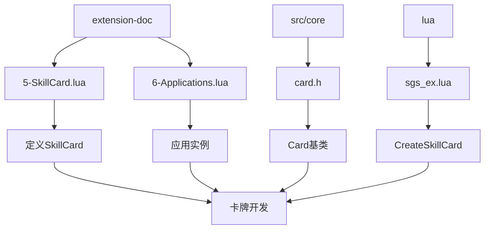
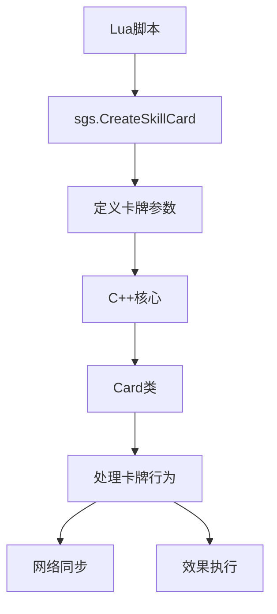
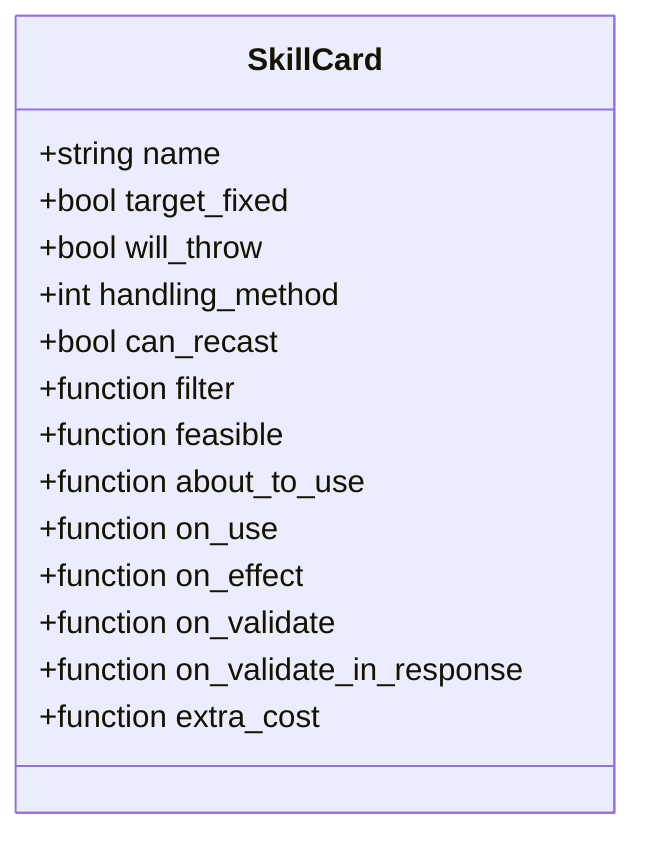
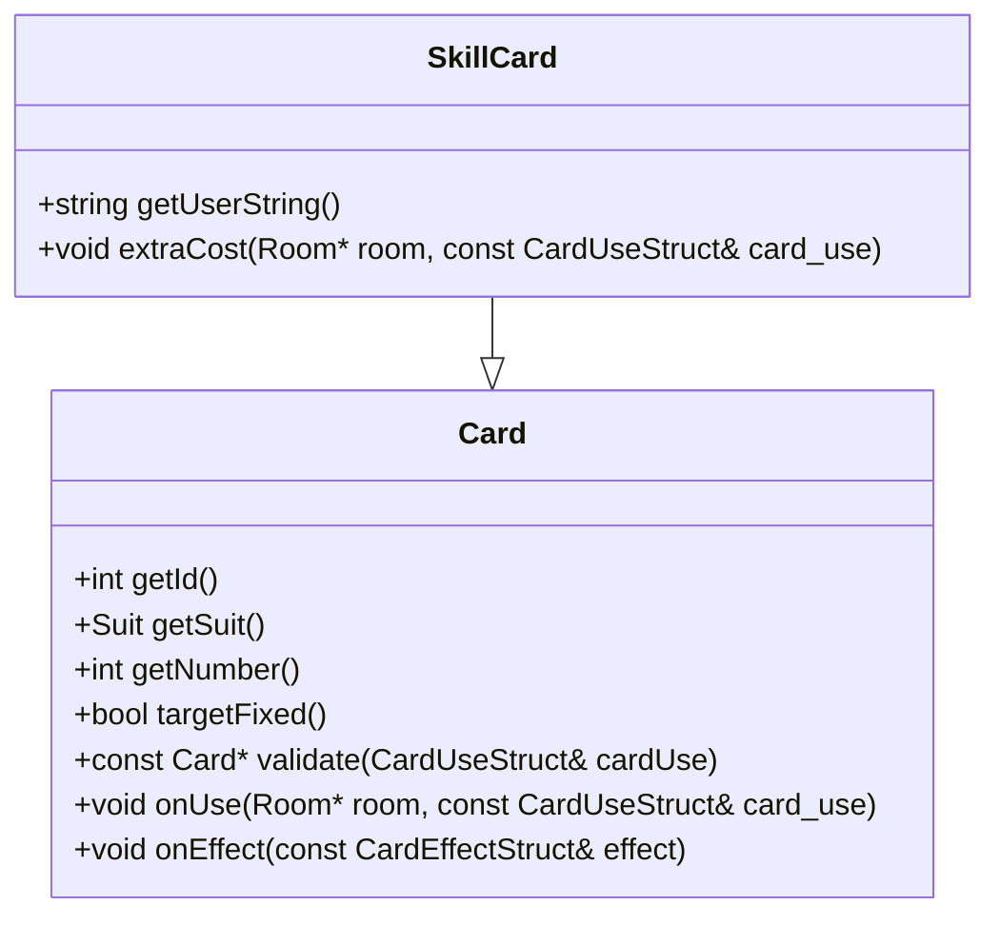
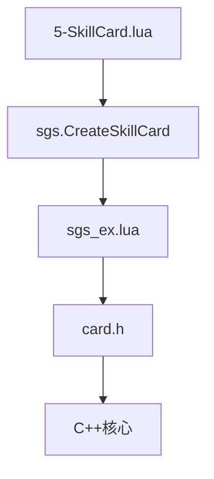

# 卡牌开发

<cite>
**本文档引用文件**  
- [5-SkillCard.lua](file://extension-doc/5-SkillCard.lua)
- [6-Applications.lua](file://extension-doc/6-Applications.lua)
- [card.h](file://src/core/card.h)
- [sgs_ex.lua](file://lua/sgs_ex.lua)
</cite>

## 目录
1. [引言](#引言)
2. [项目结构](#项目结构)
3. [核心组件](#核心组件)
4. [架构概览](#架构概览)
5. [详细组件分析](#详细组件分析)
6. [依赖分析](#依赖分析)
7. [性能考量](#性能考量)
8. [故障排除指南](#故障排除指南)
9. [结论](#结论)

## 引言
本文档系统化介绍如何使用Lua在《神杀》框架中创建自定义卡牌。基于提供的文档和源码，详细阐述了SkillCard的定义方法，涵盖卡牌类型、花色点数、目标选择逻辑（targetFilter、aboutToUse）和效果执行（onUse、onEffect）。结合应用实例，展示如何实现“酒”、“无懈可击”等特殊卡牌逻辑。同时解析C++中Card类的关键方法，说明Lua如何通过createCard函数创建卡牌实例，并处理卡牌的包装、序列化和网络同步。最后提供一个创建“火焰杀”的完整示例。

## 项目结构
项目结构清晰，主要分为以下几个部分：
- `extension-doc/`：包含详细的Lua脚本开发文档，如`5-SkillCard.lua`和`6-Applications.lua`，是学习自定义技能和卡牌的核心资料。
- `src/core/`：包含游戏核心逻辑的C++源码，如`card.h`定义了卡牌的基类。
- `lua/`：包含游戏逻辑的Lua脚本，其中`sgs_ex.lua`定义了`CreateSkillCard`等关键函数。
- `extensions/`：存放扩展包的Lua脚本。



**图示来源**
- [5-SkillCard.lua](file://extension-doc/5-SkillCard.lua)
- [6-Applications.lua](file://extension-doc/6-Applications.lua)
- [card.h](file://src/core/card.h)
- [sgs_ex.lua](file://lua/sgs_ex.lua)

**节来源**
- [5-SkillCard.lua](file://extension-doc/5-SkillCard.lua)
- [6-Applications.lua](file://extension-doc/6-Applications.lua)
- [card.h](file://src/core/card.h)
- [sgs_ex.lua](file://lua/sgs_ex.lua)

## 核心组件
核心组件包括Lua中的`sgs.CreateSkillCard`函数和C++中的`Card`类。`CreateSkillCard`函数用于在Lua中定义技能卡牌的参数，而`Card`类则在C++底层实现卡牌的通用行为和属性。

**节来源**
- [5-SkillCard.lua](file://extension-doc/5-SkillCard.lua#L0-L269)
- [card.h](file://src/core/card.h#L0-L307)

## 架构概览
整个卡牌系统的架构是Lua脚本与C++核心的结合。Lua脚本负责定义游戏逻辑和规则，而C++核心负责处理性能关键的操作和底层数据结构。



**图示来源**
- [5-SkillCard.lua](file://extension-doc/5-SkillCard.lua#L0-L269)
- [card.h](file://src/core/card.h#L0-L307)

## 详细组件分析
### SkillCard定义方法
在Lua中，通过`sgs.CreateSkillCard`函数创建技能卡牌。该函数接受一个包含卡牌属性的Lua表作为参数。

#### 参数说明
- **name**: 字符串，卡牌名称。
- **target_fixed**: 布尔值，使用卡牌时是否需要指定目标。
- **will_throw**: 布尔值，使用后是否弃置卡牌。
- **handling_method**: 枚举值，表示卡牌的操作方式。
- **can_recast**: 布尔值，指定卡牌能否被重铸。
- **filter**: Lua函数，用于判断目标是否可选。
- **feasible**: Lua函数，判断卡牌使用条件是否满足。
- **about_to_use**: Lua函数，执行使用前的结算。
- **on_use**: Lua函数，执行使用效果。
- **on_effect**: Lua函数，执行对目标的效果。
- **on_validate**: Lua函数，使用前修改卡牌。
- **on_validate_in_response**: Lua函数，响应前修改卡牌。
- **extra_cost**: Lua函数，执行额外消耗。



**图示来源**
- [5-SkillCard.lua](file://extension-doc/5-SkillCard.lua#L0-L269)

**节来源**
- [5-SkillCard.lua](file://extension-doc/5-SkillCard.lua#L0-L269)

### 应用实例分析
#### 箭矢技能
“箭矢”技能展示了如何将两个基本技能组合起来。一个触发技监听卡牌移动事件，将黑色牌置于武将牌上；另一个视为技允许玩家将两张“箭”当作【无懈可击】使用。

```lua
devJianshiCard = sgs.CreateSkillCard{
    name = "devJianshiCard", 
    target_fixed = true,
    will_throw = false,
    skill_name = "devJianshi",
    on_validate = function(self, carduse)
        -- 实现逻辑
    end,
    on_validate_in_response = function(self, source)
        -- 实现逻辑
    end,
}
```

**节来源**
- [6-Applications.lua](file://extension-doc/6-Applications.lua#L219-L230)

### C++中Card类解析
`Card`类是所有卡牌的基类，定义了卡牌的通用属性和方法。

#### 关键方法
- **getId()**: 获取卡牌ID。
- **getSuit()**: 获取卡牌花色。
- **getNumber()**: 获取卡牌点数。
- **targetFixed()**: 判断是否固定目标。
- **validate()**: 验证卡牌使用。
- **onUse()**: 执行使用效果。
- **onEffect()**: 执行对目标的效果。



**图示来源**
- [card.h](file://src/core/card.h#L0-L307)

**节来源**
- [card.h](file://src/core/card.h#L0-L307)

## 依赖分析
卡牌系统的依赖关系清晰，Lua脚本依赖C++核心提供的API，而C++核心则通过Lua绑定暴露接口给脚本层。



**图示来源**
- [5-SkillCard.lua](file://extension-doc/5-SkillCard.lua)
- [sgs_ex.lua](file://lua/sgs_ex.lua)
- [card.h](file://src/core/card.h)

**节来源**
- [5-SkillCard.lua](file://extension-doc/5-SkillCard.lua)
- [sgs_ex.lua](file://lua/sgs_ex.lua)
- [card.h](file://src/core/card.h)

## 性能考量
由于卡牌效果在Lua中定义，频繁的卡牌使用可能影响性能。建议将复杂的逻辑尽量用C++实现，或优化Lua脚本的执行效率。

## 故障排除指南
- **卡牌无法使用**：检查`feasible`函数是否返回`true`。
- **目标选择异常**：检查`filter`函数的逻辑。
- **效果未执行**：确保`on_use`和`on_effect`函数正确实现。

**节来源**
- [5-SkillCard.lua](file://extension-doc/5-SkillCard.lua#L0-L269)
- [6-Applications.lua](file://extension-doc/6-Applications.lua#L0-L230)

## 结论
通过结合Lua脚本的灵活性和C++核心的性能，可以高效地创建复杂的自定义卡牌。理解`CreateSkillCard`的参数和`Card`类的方法是开发的关键。合理组合基本技能，可以实现丰富的游戏机制。