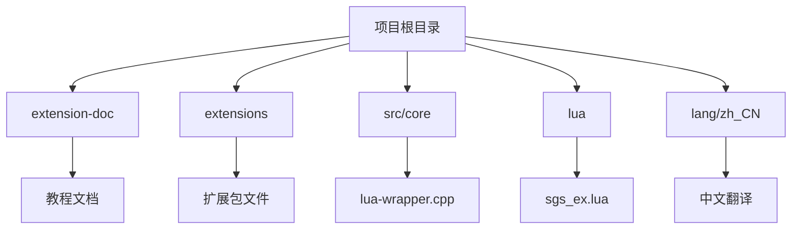
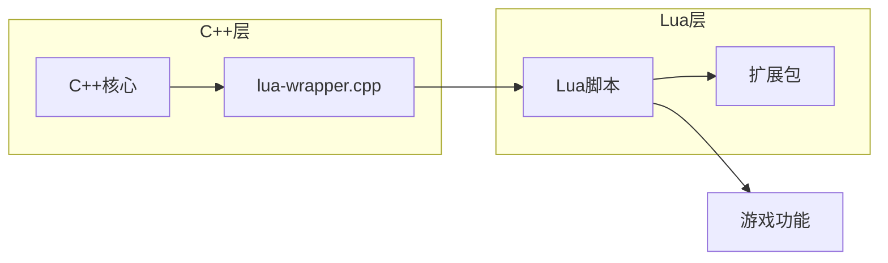
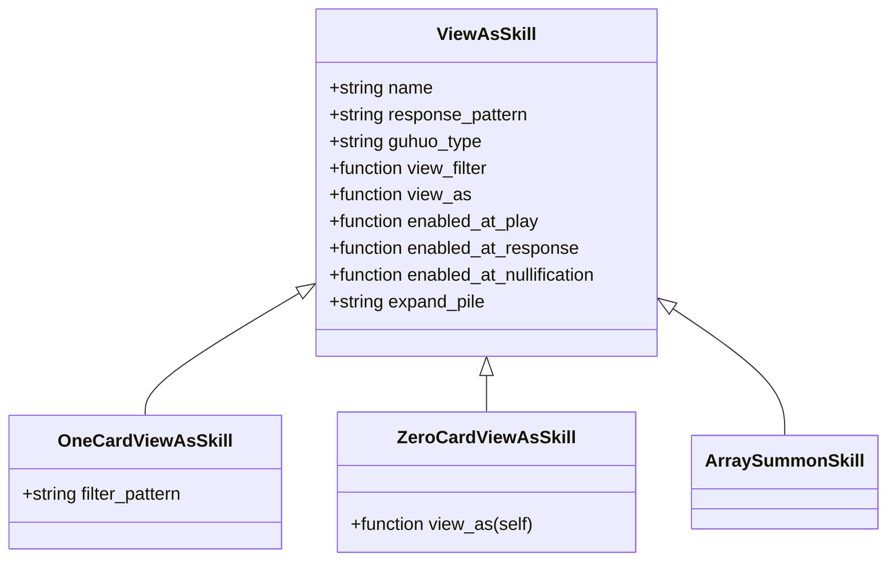
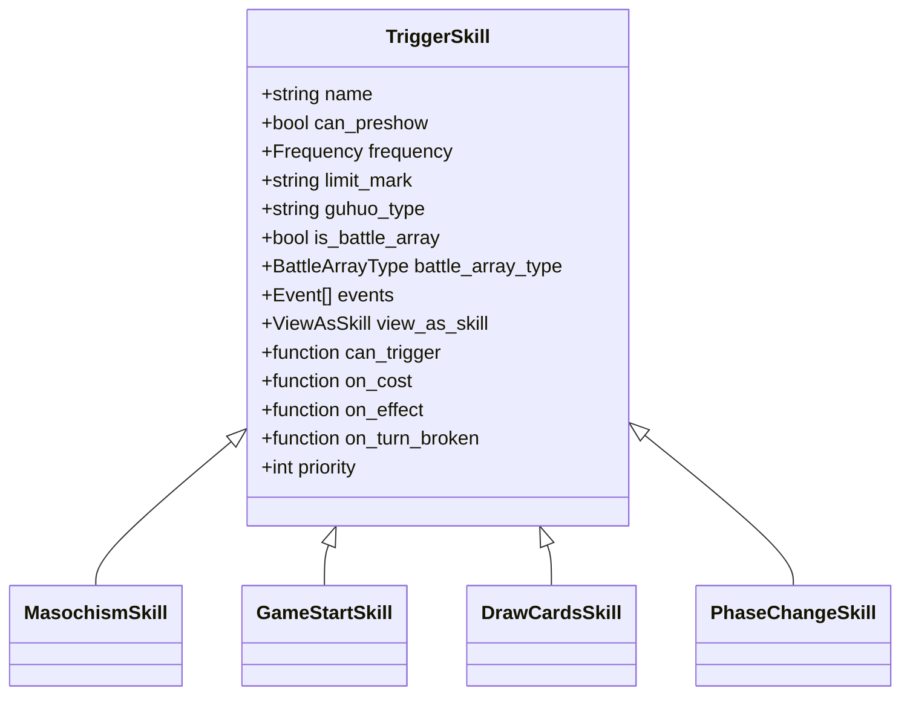
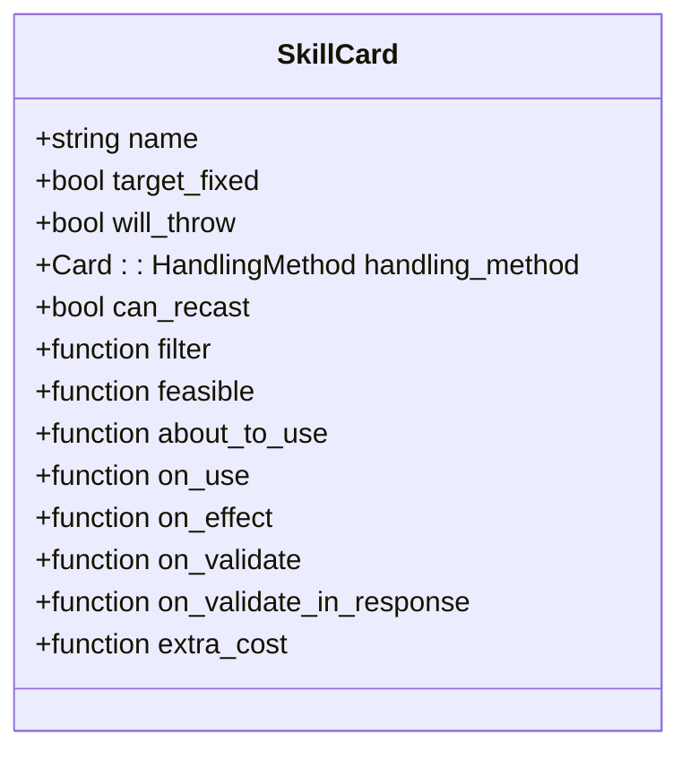
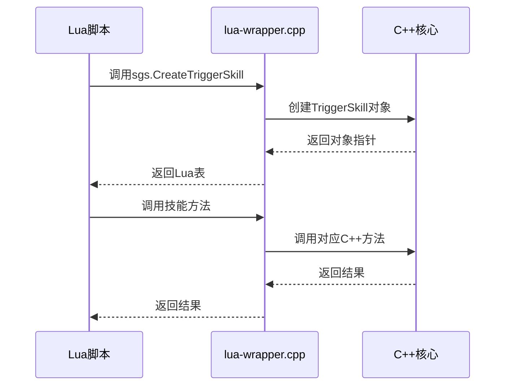
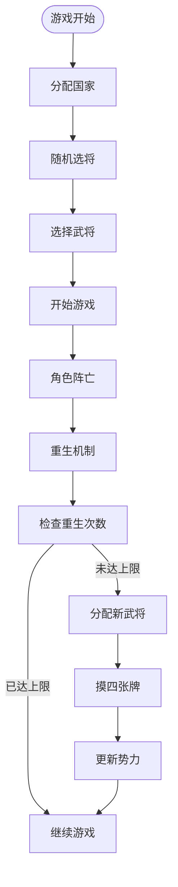
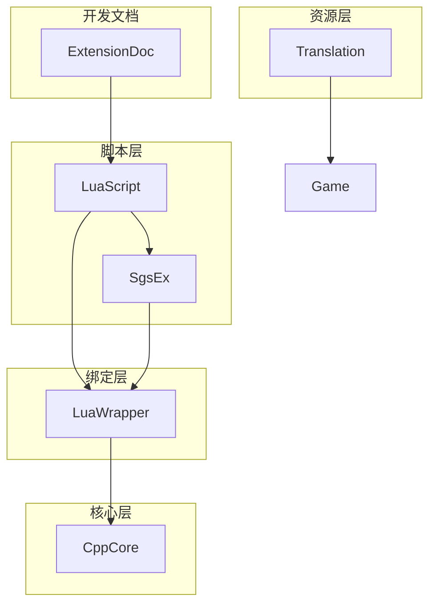

# 扩展开发

<cite>
**本文档引用文件**   
- [1-Start.lua](file://extension-doc/1-Start.lua)
- [2-ViewAsSkill.lua](file://extension-doc/2-ViewAsSkill.lua)
- [3-TriggerSkill.lua](file://extension-doc/3-TriggerSkill.lua)
- [5-SkillCard.lua](file://extension-doc/5-SkillCard.lua)
- [7-Extension.lua](file://extension-doc/7-Extension.lua)
- [Xmode.lua](file://extensions/Xmode.lua)
- [lua-wrapper.cpp](file://src/core/lua-wrapper.cpp)
- [sgs_ex.lua](file://lua/sgs_ex.lua)
</cite>

## 目录
1. [引言](#引言)
2. [项目结构](#项目结构)
3. [核心组件](#核心组件)
4. [架构概述](#架构概述)
5. [详细组件分析](#详细组件分析)
6. [依赖分析](#依赖分析)
7. [性能考虑](#性能考虑)
8. [故障排除指南](#故障排除指南)
9. [结论](#结论)

## 引言
本文档旨在为希望使用Lua脚本为《太阳神三国杀》游戏添加新功能的开发者提供全面的扩展开发指南。文档系统化整理了从入门到高级的扩展开发知识体系，详细说明如何使用Lua脚本创建新的技能、卡牌和武将，并深入解析C++与Lua的绑定机制。通过结合Xmode.lua实例分析，本文档将帮助开发者掌握扩展包的完整实现流程。

## 项目结构
本项目采用模块化设计，主要分为以下几个部分：
- `extension-doc/`：包含系列教程文档，从基础到高级逐步介绍扩展开发
- `extensions/`：存放实际的扩展包Lua文件
- `src/core/`：核心C++代码，包含Lua绑定实现
- `lua/`：游戏主Lua脚本和辅助库
- `lang/zh_CN/`：中文语言包



**图示来源**
- [1-Start.lua](file://extension-doc/1-Start.lua)
- [Xmode.lua](file://extensions/Xmode.lua)

**本节来源**
- [1-Start.lua](file://extension-doc/1-Start.lua#L1-L53)
- [Xmode.lua](file://extensions/Xmode.lua#L1-L92)

## 核心组件
扩展开发的核心在于理解Lua脚本如何与C++底层交互。主要涉及三个关键组件：视为技（ViewAsSkill）、触发技（TriggerSkill）和技能卡（SkillCard）。

**本节来源**
- [2-ViewAsSkill.lua](file://extension-doc/2-ViewAsSkill.lua#L1-L247)
- [3-TriggerSkill.lua](file://extension-doc/3-TriggerSkill.lua#L1-L235)
- [5-SkillCard.lua](file://extension-doc/5-SkillCard.lua#L1-L270)

## 架构概述
游戏的扩展架构基于C++与Lua的混合编程模式。C++提供核心功能和性能关键代码，而Lua负责可扩展性和脚本化功能。



**图示来源**
- [lua-wrapper.cpp](file://src/core/lua-wrapper.cpp)
- [sgs_ex.lua](file://lua/sgs_ex.lua)

## 详细组件分析

### 视为技分析
视为技用于实现"将某牌作为某牌打出"的功能，主要在客户端运行。

#### 创建方法


**图示来源**
- [2-ViewAsSkill.lua](file://extension-doc/2-ViewAsSkill.lua#L1-L247)

#### 实现示例
```lua
shentou = sgs.CreateOneCardViewAsSkill{ 
    name = "shentou",
    filter_pattern = ".|club|.|hand" ,
    view_as = function(self, card)
        local new_card = sgs.Sanguosha:cloneCard("snatch", sgs.Card_SuitToBeDecided, -1)
        new_card:addSubcard(card:getId())
        new_card:setSkillName(self:objectName())
        new_card:setShowSkill(self:objectName())
        return new_card
    end
}
```

**本节来源**
- [2-ViewAsSkill.lua](file://extension-doc/2-ViewAsSkill.lua#L1-L247)
- [1-Start.lua](file://extension-doc/1-Start.lua#L1-L53)

### 触发技分析
触发技用于实现"在某个时机，满足条件时执行效果"的功能，主要在服务端运行。

#### 创建方法


**图示来源**
- [3-TriggerSkill.lua](file://extension-doc/3-TriggerSkill.lua#L1-L235)

#### 实现示例
```lua
LuaJianxiong = sgs.CreateTriggerSkill{
    name = "LuaJianxiong" ,
    events = {sgs.Damaged} ,
    can_trigger = function(self, event, room, player, data)
        if player and player:isAlive() and player:hasSkill(self:objectName()) then
            local damage = data:toDamage()
            local card = damage.card
            return (card and (room:getCardPlace(card:getEffectiveId()) == sgs.Player_PlaceTable)) and self:objectName() or ""
        end
        return ""
    end ,
    on_cost = function(self, event, room, player, data,ask_who)
        if player:askForSkillInvoke(self:objectName(), data) then
            room:broadcastSkillInvoke(self:objectName())
            return true
        end
        return false
    end ,
    on_effect = function(self, event, room, player, data,ask_who)
        local damage = data:toDamage()
        player:obtainCard(damage.card)
        return false
    end ,
}
```

**本节来源**
- [3-TriggerSkill.lua](file://extension-doc/3-TriggerSkill.lua#L1-L235)

### 技能卡分析
技能卡用于实现复杂的技能效果，将技能定义在抽象的"牌"中。

#### 创建方法


**图示来源**
- [5-SkillCard.lua](file://extension-doc/5-SkillCard.lua#L1-L270)

#### 实现示例
```lua
LuaZhihengCard = sgs.CreateSkillCard{
    name = "LuaZhihengCard" ,
    target_fixed = true ,
    on_use = function(self, room, source, targets)
        if source:isAlive() then
            source:drawCards(self:getSubcards():length())
        end
    end ,
}
```

**本节来源**
- [5-SkillCard.lua](file://extension-doc/5-SkillCard.lua#L1-L270)

### C++与Lua绑定机制
`src/core/lua-wrapper.cpp`文件实现了C++与Lua的绑定，将C++对象和方法暴露给Lua脚本使用。



**图示来源**
- [lua-wrapper.cpp](file://src/core/lua-wrapper.cpp)
- [sgs_ex.lua](file://lua/sgs_ex.lua)

**本节来源**
- [lua-wrapper.cpp](file://src/core/lua-wrapper.cpp)
- [sgs_ex.lua](file://lua/sgs_ex.lua)

### Xmode扩展实例分析
Xmode.lua是一个完整的扩展包实例，展示了如何实现复杂的游戏模式。

#### 功能流程


**图示来源**
- [Xmode.lua](file://extensions/Xmode.lua#L1-L92)

#### 关键代码
```lua
XmodeRule = sgs.CreateTriggerSkill{
    name = "XmodeRule",
    events = {sgs.BuryVictim},
    on_effect = function(self, evnet, room, player, data,ask_who)
        player:bury()
        local times = room:getTag(player:getKingdom().."_Change"):toInt()
        if times >= 3 then return false end
        local used = room:getTag("Xmode_UsedGeneral"):toString():split("+")
        local random_general = getRandomGenerals(sgs.GetConfig("HegemonyMaxChoice",0),player:getKingdom(),used)
        local choice = room:askForGeneral(player,table.concat(random_general,"+"),nil,false):split("+")
        table.insertTable(used,choice)
        room:setTag("Xmode_UsedGeneral",sgs.QVariant(table.concat(used,"+")))
        room:doDragonPhoenix(player,choice[1], choice[2],true,player:getKingdom(),false,"",true)
        player:drawCards(4)
        room:broadcastProperty(player,"kingdom")
        times = times + 1
        room:setTag(player:getKingdom().."_Change",sgs.QVariant(times))
        return true
    end,
    priority = 1,
}
```

**本节来源**
- [Xmode.lua](file://extensions/Xmode.lua#L1-L92)

## 依赖分析
扩展开发涉及多个层次的依赖关系：



**图示来源**
- [lua-wrapper.cpp](file://src/core/lua-wrapper.cpp)
- [sgs_ex.lua](file://lua/sgs_ex.lua)
- [extension-doc/](file://extension-doc/)
- [extensions/](file://extensions/)

**本节来源**
- [lua-wrapper.cpp](file://src/core/lua-wrapper.cpp)
- [sgs_ex.lua](file://lua/sgs_ex.lua)

## 性能考虑
在扩展开发中需要注意以下性能问题：
- 避免在频繁触发的事件中执行复杂计算
- 合理使用缓存机制减少重复计算
- 注意内存管理，及时释放不再使用的对象
- 避免在客户端执行过多逻辑，减轻客户端负担

## 故障排除指南
常见问题及解决方案：

**本节来源**
- [2-ViewAsSkill.lua](file://extension-doc/2-ViewAsSkill.lua#L1-L247)
- [3-TriggerSkill.lua](file://extension-doc/3-TriggerSkill.lua#L1-L235)
- [5-SkillCard.lua](file://extension-doc/5-SkillCard.lua#L1-L270)

## 结论
通过本文档的系统化介绍，开发者可以全面掌握《太阳神三国杀》的扩展开发技术。从基础的视为技、触发技到复杂的技能卡和C++绑定机制，再到完整的Xmode实例分析，为开发者提供了完整的知识体系。建议开发者从简单的技能开始实践，逐步掌握更复杂的扩展功能。