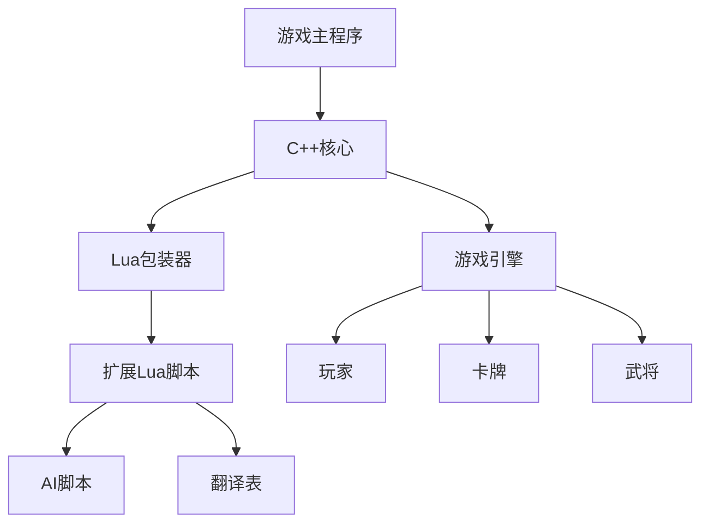

# 扩展开发基础

<cite>
**本文档引用文件**  
- [1-Start.lua](file://extension-doc/1-Start.lua)
- [11-Fundamentals.lua](file://extension-doc/11-Fundamentals.lua)
- [lua-wrapper.cpp](file://src/core/lua-wrapper.cpp)
- [Xmode.lua](file://extensions/Xmode.lua)
- [general_config.lua](file://extension-doc/general_config.lua)
- [value_config.lua](file://extension-doc/value_config.lua)
</cite>

## 目录
1. [简介](#简介)
2. [项目结构概览](#项目结构概览)
3. [Lua扩展基础](#lua扩展基础)
4. [C++与Lua交互机制](#c与lua交互机制)
5. [最简扩展包示例](#最简扩展包示例)
6. [配置文件作用说明](#配置文件作用说明)
7. [常见错误与解决方案](#常见错误与解决方案)

## 简介

本指南旨在为初次接触《三国杀》Lua扩展机制的开发者提供全面的入门指导。通过分析核心文件，详细解释扩展包的创建、注册、加载机制，以及C++与Lua的交互原理。文档将结合代码示例，帮助开发者快速上手并避免常见陷阱。

## 项目结构概览

项目采用模块化设计，主要目录包括：
- `extension-doc/`: 包含扩展开发的示例和教程文件
- `extensions/`: 存放用户自定义的扩展Lua文件
- `src/core/`: 核心C++代码，包含Lua包装器
- `lua/ai/`: AI逻辑脚本
- `lang/zh_CN/`: 中文语言包



**Diagram sources**
- [1-Start.lua](file://extension-doc/1-Start.lua)
- [lua-wrapper.cpp](file://src/core/lua-wrapper.cpp)

## Lua扩展基础

### 扩展包的创建与注册

Lua扩展通过返回一个包含`Package`对象的表来实现。`Package`对象由`sgs.Package`构造函数创建。

**Section sources**
- [1-Start.lua](file://extension-doc/1-Start.lua#L10-L15)

#### 扩展包类型
- `sgs.Package_GeneralPack`: 武将包（默认）
- `sgs.Package_CardPack`: 卡牌包

```lua
-- 创建名为"moligaloo"的武将包
extension = sgs.Package("moligaloo", sgs.Package_GeneralPack)
```

### 武将与技能定义

使用`sgs.General`创建武将对象，并通过`addSkill`方法添加技能。

**Section sources**
- [1-Start.lua](file://extension-doc/1-Start.lua#L17-L45)

```lua
-- 创建时迁武将，势力为"qun"
shiqian = sgs.General(extension, "shiqian", "qun") 

-- 创建"神偷"技能
shentou = sgs.CreateOneCardViewAsSkill{ 
    name = "shentou",
    filter_pattern = ".|club|.|hand" ,
    view_as = function(self, card)
        local new_card = sgs.Sanguosha:cloneCard("snatch", sgs.Card_SuitToBeDecided, -1)
        new_card:addSubcard(card:getId())
        new_card:setSkillName(self:objectName())
        return new_card
    end
}

-- 将技能赋予武将
shiqian:addSkill(shentou) 
```

### 翻译表

使用`sgs.LoadTranslationTable`为扩展内容提供中文名称和描述。

```lua
sgs.LoadTranslationTable{
    ["moligaloo"] = "太阳神上" ,
    ["shentou"] = "神偷",
    [":shentou"] = "你可以将一张梅花手牌当做【顺手牵羊】使用。",
}
```

## C与Lua交互机制

### LuaWrapper类解析

`src/core/lua-wrapper.cpp`中的`LuaWrapper`类（实际为一系列`Lua*`类）负责将C++对象和方法导出到Lua环境。

**Section sources**
- [lua-wrapper.cpp](file://src/core/lua-wrapper.cpp#L1-L400)

#### 核心机制
1. **类继承**: Lua技能类（如`LuaTriggerSkill`）继承自C++的基类（如`TriggerSkill`）。
2. **函数指针**: C++类中定义了`lua_function`类型的成员变量（如`can_trigger`, `on_effect`），用于存储Lua函数的引用。
3. **SWIG绑定**: 通过SWIG工具将C++类和方法暴露给Lua脚本。

```cpp
// 示例：LuaViewAsSkill类
class LuaViewAsSkill : public ViewAsSkill {
public:
    LuaViewAsSkill(const char *name, ...);
    // Lua函数指针
    int view_filter;
    int view_as;
    int enabled_at_play;
    // ...
};
```

#### 对象生命周期
- **创建**: 在Lua中调用`sgs.Create*`系列函数时，C++端会创建对应的`Lua*`对象。
- **克隆**: `clone()`方法确保技能卡在游戏过程中能被正确复制。
- **销毁**: 由Lua垃圾回收器和C++析构函数共同管理。

## 最简扩展包示例

### 从零创建XMode扩展

1. **创建文件**: 在`extensions/`目录下创建`Xmode.lua`。
2. **定义场景**: 使用`sgs.CreateLuaScenario`创建一个自定义场景。

**Section sources**
- [Xmode.lua](file://extensions/Xmode.lua#L1-L92)

```lua
-- 定义场景规则
XmodeRule = sgs.CreateTriggerSkill{
    name = "XmodeRule",
    events = {sgs.BuryVictim},
    on_effect = function(self, event, room, player, data, ask_who)
        -- 规则逻辑：玩家死亡后更换武将
        player:bury()
        local times = room:getTag(player:getKingdom().."_Change"):toInt()
        if times >= 3 then return false end
        
        -- 随机选择新武将
        local used = room:getTag("Xmode_UsedGeneral"):toString():split("+")
        local random_general = getRandomGenerals(2, player:getKingdom(), used)
        local choice = room:askForGeneral(player, table.concat(random_general,"+"), nil, false):split("+")
        
        -- 执行武将更换
        room:doDragonPhoenix(player, choice[1], choice[2], true, player:getKingdom(), false, "", true)
        player:drawCards(4)
        times = times + 1
        room:setTag(player:getKingdom().."_Change", sgs.QVariant(times))
        return true
    end,
    priority = 1,
}

-- 定义场景
Xmode = {
    name = "Xmode_hegemony",
    expose_role = false,
    player_count = 8,
    random_seat = true,
    rule = XmodeRule,
    on_assign = function(self, room)
        -- 分配武将逻辑
        -- ...
    end,
}

-- 加载翻译
sgs.LoadTranslationTable{
    ["Xmode_hegemony"] = "一统天下",
}

-- 返回场景对象
return sgs.CreateLuaScenario(Xmode)
```

3. **启动游戏**: 将`Xmode.lua`放入`extensions/`目录，启动游戏即可在场景模式中选择"一统天下"。

## 配置文件作用说明

### general_config.lua

该文件定义了AI在评估卡牌价值时使用的全局参数。

**Section sources**
- [general_config.lua](file://extension-doc/general_config.lua#L1-L238)

#### 核心配置表
- `sgs.ai_keep_value`: 保留卡牌的AI价值。数值越高，AI越倾向于保留该卡。
- `sgs.ai_use_value`: 使用卡牌的AI价值。数值越高，AI越倾向于使用该卡。
- `sgs.ai_use_priority`: 使用卡牌的优先级。数值越高，AI越优先使用该卡。
- `sgs.ai_chaofeng`: 武将的"超风"值，影响AI的激进程度。

```lua
-- 示例：桃的保留价值为5，使用价值为6
sgs.ai_keep_value.Peach = 5
sgs.ai_use_value.Peach = 6
```

### value_config.lua

该文件定义了更精细的AI策略，包括动态价值和特定武将的偏好。

**Section sources**
- [value_config.lua](file://extension-doc/value_config.lua#L1-L230)

#### 核心配置表
- `sgs.dynamic_value`: 动态卡牌价值分类，如`damage_card`（伤害卡）、`control_card`（控制卡）。
- `sgs.*_keep_value`: 特定武将的卡牌保留价值表，如`zhangfei_keep_value`。
- `sgs.*_suit_value`: 特定武将对花色的偏好值。

```lua
-- 示例：张飞更倾向于保留【火杀】
sgs.zhangfei_keep_value.FireSlash = 5.6
```

## 常见错误与解决方案

### 函数命名冲突

**问题**: 在Lua中定义了与内置函数同名的函数，导致行为异常。

**解决方案**: 使用唯一的前缀或命名空间。

```lua
-- 错误
function useCard() ... end

-- 正确
function Xmode_useCard() ... end
```

### 返回值类型错误

**问题**: Lua函数期望返回特定类型（如boolean），但返回了nil或其它类型。

**解决方案**: 显式返回正确类型。

```lua
-- 错误：可能返回nil
on_effect = function(self, event, room, player, data)
    if condition then
        -- do something
    end
end

-- 正确：明确返回boolean
on_effect = function(self, event, room, player, data)
    if condition then
        -- do something
        return true
    end
    return false
end
```

### 数据传递给AI

**问题**: AI无法获取技能触发所需的关键信息。

**解决方案**: 使用`QVariant`通过`data`参数或`tag`传递数据。

```lua
-- C++代码中
QVariant who = QVariant::fromValue(targetPlayer);
player->askForSkillInvoke("songwei", who);

-- Lua AI代码中
sgs.ai_skill_invoke.songwei = function(self, data)
    local who = data:toPlayer()
    return self:isFriend(who)
end
```