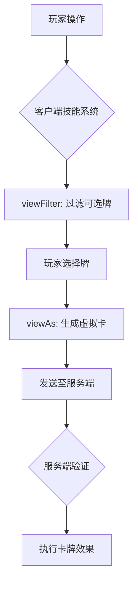
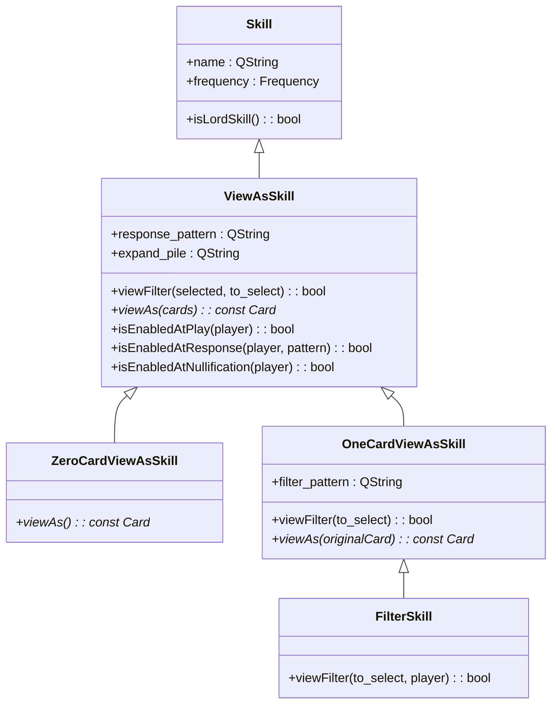

# ViewAs技能开发

<cite>
**本文档引用文件**  
- [skill.h](file://src/core/skill.h#L105-L180)
- [2-ViewAsSkill.lua](file://extension-doc/2-ViewAsSkill.lua)
- [13-ViewAs.lua](file://extension-doc/13-ViewAs.lua)
</cite>

## 目录
1. [引言](#引言)
2. [ViewAs技能基础概念](#viewas技能基础概念)
3. [C++核心类结构分析](#c核心类结构分析)
4. [Lua接口实现机制](#lua接口实现机制)
5. [实战开发示例](#实战开发示例)
6. [AI适配与智能决策](#ai适配与智能决策)
7. [UI反馈与合法性校验](#ui反馈与合法性校验)
8. [总结与最佳实践](#总结与最佳实践)

## 引言

在《太阳神三国杀》的扩展开发中，ViewAs技能（视为技）是实现主动技能、装备转换、卡牌重铸等核心玩法的关键机制。本文档将深入解析从C++底层类定义到Lua脚本实现的完整技术链路，结合`src/core/skill.h`中的`ViewAsSkill`类与`extension-doc`中的Lua示例，系统阐述如何开发一个功能完整、逻辑严谨的视为技。

**Section sources**
- [skill.h](file://src/core/skill.h#L105-L180)
- [2-ViewAsSkill.lua](file://extension-doc/2-ViewAsSkill.lua)

## ViewAs技能基础概念

视为技允许玩家将手牌或装备区的卡牌“视为”另一张卡牌使用或打出，是实现技能效果的核心手段。其典型应用场景包括：
- **装备转换**：如将任意牌视为【无懈可击】
- **卡牌重铸**：如【制衡】将手牌弃置并摸牌
- **特殊响应**：如【流离】响应【杀】的结算

与在服务端运行的触发技不同，视为技主要在客户端运行，负责管理玩家可选择的牌和最终生成的虚拟卡牌。



**Diagram sources**
- [2-ViewAsSkill.lua](file://extension-doc/2-ViewAsSkill.lua)

## C++核心类结构分析

`ViewAsSkill`是所有视为技的基类，定义在`src/core/skill.h`中，采用继承体系实现不同类型的视为技。

### ViewAsSkill类继承体系



**Diagram sources**
- [skill.h](file://src/core/skill.h#L105-L180)

**Section sources**
- [skill.h](file://src/core/skill.h#L105-L180)

### 核心回调函数说明

| 函数名 | 参数 | 作用 | 执行端 |
|--------|------|------|--------|
| `viewFilter` | selected, to_select | 判断某张牌是否可被选中 | 客户端 |
| `viewAs` | cards | 将选中的牌列表视为一张新卡 | 客户端 |
| `isEnabledAtPlay` | player | 出牌阶段是否可用 | 客户端 |
| `isEnabledAtResponse` | player, pattern | 响应特定模式时是否可用 | 客户端 |
| `isEnabledAtNullification` | player | 询问无懈可击时是否可用 | 服务端 |

**Section sources**
- [skill.h](file://src/core/skill.h#L105-L138)

## Lua接口实现机制

通过`sgs.CreateViewAsSkill`等工厂函数，可在Lua中重写C++类的虚函数，实现技能逻辑。

### 标准视为技创建

```lua
sgs.CreateViewAsSkill{
    name = "example",
    view_filter = function(self, selected, to_select)
        -- 过滤逻辑：仅可选择黑桃牌
        return to_select:getSuit() == sgs.Card_Spade
    end,
    view_as = function(self, cards)
        if #cards == 0 then return nil end
        -- 将选中的黑桃牌视为【杀】
        local card = sgs.Sanguosha:cloneCard("slash")
        for _,c in ipairs(cards) do
            card:addSubcard(c:getId())
        end
        card:setSkillName(self:objectName())
        return card
    end,
    enabled_at_play = function(self, player)
        return player:getPhase() == sgs.Player_Play
    end
}
```

### 特殊视为技类型

| 类型 | 创建函数 | 特点 |
|------|----------|------|
| 单牌视为技 | `sgs.CreateOneCardViewAsSkill` | 只能选择一张牌，参数简化 |
| 零牌视为技 | `sgs.CreateZeroCardViewAsSkill` | 无需选牌，直接发动 |
| 阵法召唤技 | `sgs.CreateArraySummonSkill` | 专用于阵法系统 |

**Section sources**
- [2-ViewAsSkill.lua](file://extension-doc/2-ViewAsSkill.lua)

## 实战开发示例

### 示例1：将手牌视为【无懈可击】

```lua
wuxie_viewas = sgs.CreateViewAsSkill{
    name = "wuxie_viewas",
    view_filter = function(self, selected, to_select)
        return #selected == 0 -- 只能选择一张牌
    end,
    view_as = function(self, cards)
        if #cards ~= 1 then return nil end
        local card = sgs.Sanguosha:cloneCard("nullification")
        card:addSubcard(cards[1]:getId())
        card:setSkillName(self:objectName())
        return card
    end,
    enabled_at_nullification = function(self, player)
        return true -- 允许在无懈询问时使用
    end
}
```

### 示例2：实现【制衡】类重铸功能

```lua
zhiheng = sgs.CreateViewAsSkill{
    name = "zhiheng",
    view_filter = function(self, selected, to_select)
        return not to_select:isEquipped() -- 只能选择手牌
    end,
    view_as = function(self, cards)
        if #cards == 0 then return nil end
        -- 创建技能牌"zhiheng_card"来处理效果
        local card = zhihengCard:clone()
        for _,c in ipairs(cards) do
            card:addSubcard(c:getId())
        end
        card:setSkillName(self:objectName())
        return card
    end,
    enabled_at_play = function(self, player)
        return player:canDiscard(player, "he") -- 有牌可弃
    end
}
```

**Section sources**
- [2-ViewAsSkill.lua](file://extension-doc/2-ViewAsSkill.lua)

## AI适配与智能决策

由于视为技在客户端运行而AI在服务端，必须在AI脚本中重新定义视为逻辑。

### AI视为映射表

```lua
-- 用于一般视为技
sgs.ai_view_as.wuxie_viewas = function(card, player, card_place)
    if card_place == sgs.Player_Hand then
        local suit = card:getSuitString()
        local number = card:getNumberString()
        local id = card:getEffectiveId()
        return ("nullification:wuxie_viewas[%s:%s]=%d"):format(suit, number, id)
    end
end

-- 用于锁定视为技（如武将技能）
sgs.ai_filterskill_filter.wushen = function(card, card_place)
    if card:getSuit() == sgs.Card_Heart then
        local suit = card:getSuitString()
        local number = card:getNumberString()
        local id = card:getEffectiveId()
        return ("slash:wushen[%s:%s]=%d"):format(suit, number, id)
    end
end
```

### 核心AI函数

- `sgs.Card_Parse(str)`: 将字符串解析为卡牌对象
- `string:format(...)`: 字符串格式化，构建解析字符串

**Section sources**
- [13-ViewAs.lua](file://extension-doc/13-ViewAs.lua)

## UI反馈与合法性校验

### UI交互流程

1. 技能按钮在客户端根据`enabled_at_*`系列函数显示/禁用
2. 玩家点击技能按钮，客户端调用`viewFilter`筛选可选牌
3. 玩家选择牌后，调用`viewAs`生成虚拟卡并提交
4. 服务端通过`isEnabledAtNullification`等函数进行最终校验

### 合法性校验要点

- 在`viewAs`中检查`#cards`数量是否符合要求
- 在`enabled_at_*`中检查玩家状态（如回合阶段、技能使用次数）
- 通过`setSkillName`标记技能来源，便于后续效果追踪

**Section sources**
- [2-ViewAsSkill.lua](file://extension-doc/2-ViewAsSkill.lua)

## 总结与最佳实践

1. **明确技能类型**：根据是否需要选牌，选择`ViewAsSkill`、`OneCardViewAsSkill`或`ZeroCardViewAsSkill`
2. **完整实现回调**：确保`viewFilter`和`viewAs`逻辑匹配，避免出现可选但不可用的牌
3. **AI同步实现**：在AI脚本中通过`sgs.ai_view_as`表重新定义视为逻辑
4. **合理使用标记**：通过`setSkillName`和`setShowSkill`确保技能效果可追溯
5. **服务端校验**：对于关键技能，利用服务端运行的`isEnabledAtNullification`进行最终验证

通过深入理解C++与Lua的交互机制，开发者可以灵活实现各种复杂的视为技，为游戏增添丰富的策略深度。

**Section sources**
- [2-ViewAsSkill.lua](file://extension-doc/2-ViewAsSkill.lua)
- [13-ViewAs.lua](file://extension-doc/13-ViewAs.lua)