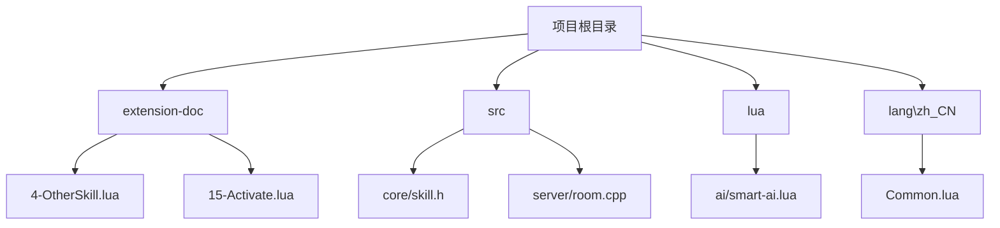
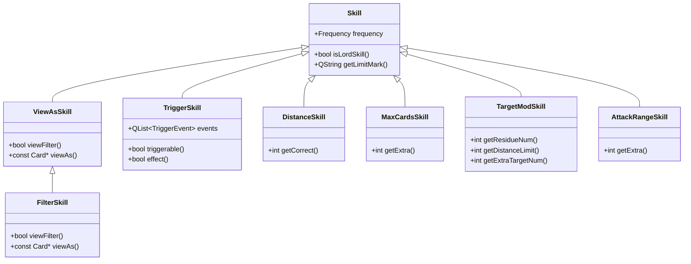
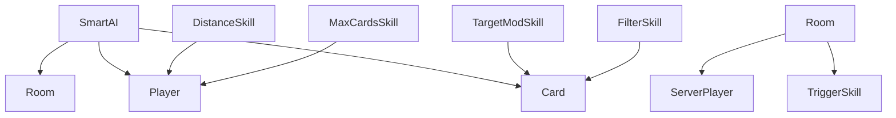

# 其他技能类型开发

<cite>
**本文档引用文件**  
- [4-OtherSkill.lua](file://extension-doc/4-OtherSkill.lua)
- [15-Activate.lua](file://extension-doc/15-Activate.lua)
- [skill.h](file://src/core/skill.h)
- [skill.cpp](file://src/core/skill.cpp)
- [room.cpp](file://src/server/room.cpp)
- [roomthread.cpp](file://src/server/roomthread.cpp)
</cite>

## 目录
1. [引言](#引言)  
2. [项目结构](#项目结构)  
3. [核心组件](#核心组件)  
4. [架构概览](#架构概览)  
5. [详细组件分析](#详细组件分析)  
6. [依赖分析](#依赖分析)  
7. [性能考量](#性能考量)  
8. [故障排除指南](#故障排除指南)  
9. [结论](#结论)

## 引言
本文档旨在系统介绍《三国杀》扩展开发中除`ViewAs`和`TriggerSkill`之外的其他技能类型，包括主动技能（AcquireSkill）、阶段变更响应（PhaseChange）、身份判定类技能等。基于`4-OtherSkill.lua`和`15-Activate.lua`文档，说明如何通过Lua注册一次性技能或动态添加技能。结合`src/core/skill.h`中的Skill类继承体系，解析`addTriggerSkill`、`detachSkill`等运行时操作的实现原理。提供实战示例，如开发一个在游戏开始时自动获得技能的主公技，或实现一个在角色死亡时触发的遗计类技能，并说明技能生命周期管理与内存释放注意事项。

## 项目结构
本项目为《三国杀》国战模式的扩展开发框架，主要包含Lua脚本、C++核心逻辑、资源文件和扩展包。Lua脚本位于`extension-doc`目录，用于定义技能、AI行为和扩展逻辑；C++源码位于`src`目录，实现核心游戏机制；`lua`目录包含AI逻辑脚本。



**图示来源**  
- [4-OtherSkill.lua](file://extension-doc/4-OtherSkill.lua)
- [15-Activate.lua](file://extension-doc/15-Activate.lua)
- [skill.h](file://src/core/skill.h)

**本节来源**  
- [4-OtherSkill.lua](file://extension-doc/4-OtherSkill.lua)
- [15-Activate.lua](file://extension-doc/15-Activate.lua)

## 核心组件
核心组件包括技能系统、AI决策系统和运行时技能管理。技能系统通过`Skill`类及其子类实现多种技能类型；AI系统通过`SmartAI:activate`函数处理主动出牌逻辑；运行时技能管理通过`Room::acquireSkill`和`detachSkill`实现技能的动态增减。

**本节来源**  
- [skill.h](file://src/core/skill.h)
- [room.cpp](file://src/server/room.cpp)
- [15-Activate.lua](file://extension-doc/15-Activate.lua)

## 架构概览
整个技能系统基于C++与Lua的混合架构。C++定义技能基类和核心逻辑，Lua实现具体技能行为。AI系统通过`sgs.ai_skills`表注册主动技能，并在出牌阶段调用`SmartAI:getTurnUse()`和`SmartAI:activate()`进行决策。



**图示来源**  
- [skill.h](file://src/core/skill.h)

**本节来源**  
- [skill.h](file://src/core/skill.h)

## 详细组件分析

### 距离技（DistanceSkill）
距离技用于修改玩家之间的距离，如马术。通过`sgs.CreateDistanceSkill`创建，`correct_func`函数返回距离修正值。

```lua
function sgs.CreateMashuSkill(name)
    local mashu_skill = {}
    mashu_skill.name = "LuaMashu_" .. name
    mashu_skill.correct_func = function(self, from, to)
        if from:hasShownSkill(self) then
            return -1
        end
        return 0
    end
    return sgs.CreateDistanceSkill(mashu_skill)
end
```

**本节来源**  
- [4-OtherSkill.lua](file://extension-doc/4-OtherSkill.lua)

### 手牌上限技（MaxCardsSkill）
手牌上限技用于修改玩家手牌上限，如“横江”。通过`sgs.CreateMaxCardsSkill`创建，`extra_func`返回额外手牌数。

```lua
LuaTestMaxCards = sgs.CreateMaxCardsSkill{
    name = "LuaTestMaxCards" ,
    extra_func = function(self, player)
        if (player:hasSkill(self:objectName())) then
            return 2
        end
        return 0
    end
}
```

**本节来源**  
- [4-OtherSkill.lua](file://extension-doc/4-OtherSkill.lua)

### 目标修改技（TargetModSkill）
目标修改技用于修改卡牌使用的目标限制，包括次数、目标数和距离限制。例如“奇才”技能允许无限距离使用锦囊牌。

```lua
LuaQicai = sgs.CreateTargetModSkill{
    name = "LuaQicai" ,
    distance_limit_func = function(self, player, card)
        if (player:hasSkill(self:objectName()) and card:isKindOf("TrickCard")) then
            return 1000
        end
        return 0
    end ,
}
```

**本节来源**  
- [4-OtherSkill.lua](file://extension-doc/4-OtherSkill.lua)

### 攻击范围技（AttackRangeSkill）
攻击范围技用于修改玩家的攻击范围，如黄忠的“烈弓”。通过`extra_func`返回额外攻击范围。

```lua
LuaLiegongRange = sgs.CreateAttackRangeSkill{
    name = "#LuaLiegong-for-lord" ,
    extra_func = function(self, player, include_weapon)
        if player:hasShownSkill(sgs.Sanguosha:getSkill("liegong")) then
            local lord = player:getLord()
            if lord and lord:hasLordSkill("shouyue") then
                return 1
            end
        end
        return 0
    end ,
}
```

**本节来源**  
- [4-OtherSkill.lua](file://extension-doc/4-OtherSkill.lua)

### 锁定视为技（FilterSkill）
锁定视为技用于实现“XX牌视为xx牌”的效果，如小乔的“红颜”。通过`view_filter`和`view_as`函数实现。

```lua
LuaHongyan = sgs.CreateFilterSkill{
    name = "LuaHongyan" ,
    view_filter = function(self, to_select)
        return to_select:getSuit() == sgs.Card_Spade
    end ,
    view_as = function(self, card)
        local id = card:getEffectiveId()
        local new_card = sgs.Sanguosha:getWrappedCard(id)
        new_card:setSkillName(self:objectName())
        new_card:setSuit(sgs.Card_Heart)
        new_card:setModified(true)
        return new_card
    end ,
}
```

**本节来源**  
- [4-OtherSkill.lua](file://extension-doc/4-OtherSkill.lua)

### 主动技能（AcquireSkill）与AI响应
主动技能通过`sgs.ai_skills`表注册，AI在出牌阶段通过`SmartAI:getTurnUse()`获取可使用技能，并通过`SmartAI:activate()`执行。

```lua
local zhijian_skill={}
zhijian_skill.name="zhijian"
table.insert(sgs.ai_skills, zhijian_skill)
zhijian_skill.getTurnUseCard = function(self)
    local equips = {}
    for _, card in sgs.qlist(self.player:getHandcards()) do
        if card:getTypeId() == sgs.Card_Equip then
            table.insert(equips, card)
        end
    end
    if #equips == 0 then return end
    return sgs.Card_Parse("@ZhijianCard=.")
end
```

**本节来源**  
- [15-Activate.lua](file://extension-doc/15-Activate.lua)

### 阶段变更响应（PhaseChange）
`PhaseChangeSkill`用于响应玩家阶段变更，如“回合开始”或“回合结束”。需重写`onPhaseChange`函数。

```cpp
class PhaseChangeSkill : public TriggerSkill
{
    Q_OBJECT
public:
    PhaseChangeSkill(const QString &name);
    virtual bool onPhaseChange(ServerPlayer *target) const = 0;
};
```

**本节来源**  
- [skill.h](file://src/core/skill.h)

### 游戏开始技能（GameStartSkill）
`GameStartSkill`用于在游戏开始时触发，如主公技。需重写`onGameStart`函数。

```cpp
class GameStartSkill : public TriggerSkill
{
    Q_OBJECT
public:
    GameStartSkill(const QString &name);
    virtual void onGameStart(ServerPlayer *player) const = 0;
};
```

**本节来源**  
- [skill.h](file://src/core/skill.h)

### 技能生命周期管理
通过`Room::acquireSkill`和`detachSkill`实现技能的动态添加与移除。`detachSkill`会触发`EventLoseSkill`事件，清理相关资源。

```cpp
void Room::handleAcquireDetachSkills(ServerPlayer *player, const QStringList &skill_names, bool acquire_only)
{
    foreach (const QString &_skill_name, skill_names) {
        if (_skill_name.startsWith("-")) {
            QString actual_skill = _skill_name.mid(1);
            player->detachSkill(actual_skill, head);
        }
    }
}
```

**本节来源**  
- [room.cpp](file://src/server/room.cpp)
- [skill.cpp](file://src/core/skill.cpp)

## 依赖分析
技能系统依赖于`Room`、`Player`和`Card`等核心类。Lua脚本通过`sgs`全局对象与C++交互。AI系统依赖`SmartAI`类和`sgs.ai_skills`表。



**图示来源**  
- [skill.h](file://src/core/skill.h)
- [room.cpp](file://src/server/room.cpp)

**本节来源**  
- [skill.h](file://src/core/skill.h)
- [room.cpp](file://src/server/room.cpp)

## 性能考量
- 技能函数应避免复杂循环，防止卡顿。
- `getTurnUse`中应尽早返回，减少无效计算。
- `detachSkill`会触发事件广播，频繁调用可能影响性能。

## 故障排除指南
- **技能未触发**：检查`triggerable`条件是否满足，技能是否已亮出。
- **AI不使用技能**：检查`sgs.ai_skills`是否正确注册，`getTurnUseCard`是否返回有效卡牌。
- **内存泄漏**：确保`TriggerSkill`析构时正确释放`view_as_skill`。

**本节来源**  
- [skill.cpp](file://src/core/skill.cpp)
- [room.cpp](file://src/server/room.cpp)

## 结论
本文档系统介绍了《三国杀》扩展开发中的多种技能类型，涵盖距离技、手牌上限技、目标修改技、攻击范围技和锁定视为技。通过Lua与C++协同开发，可实现丰富的游戏机制。运行时技能管理提供了动态增减技能的能力，适用于主公技、遗计等复杂逻辑。开发者应遵循性能最佳实践，确保游戏流畅运行。