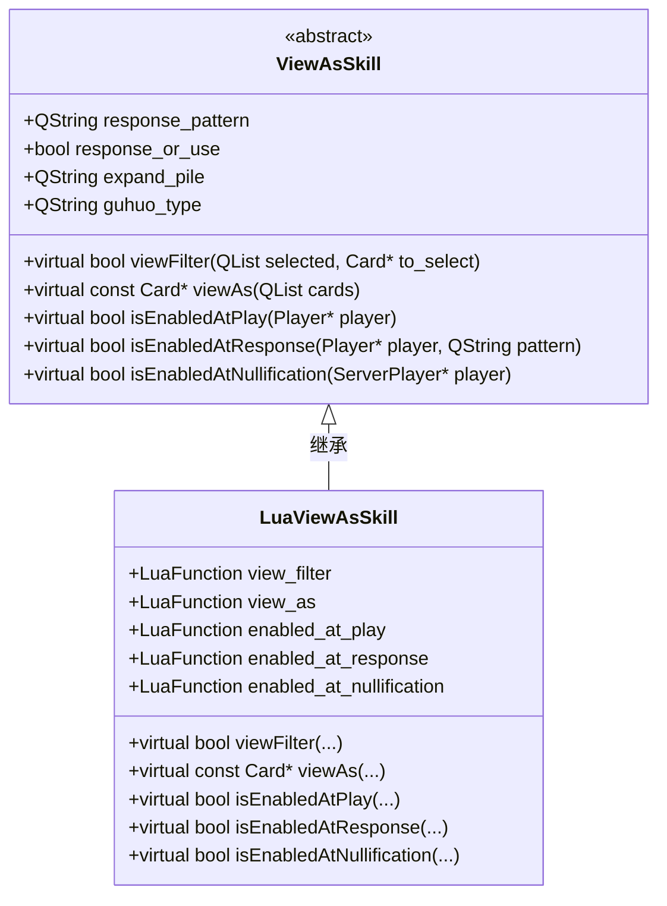
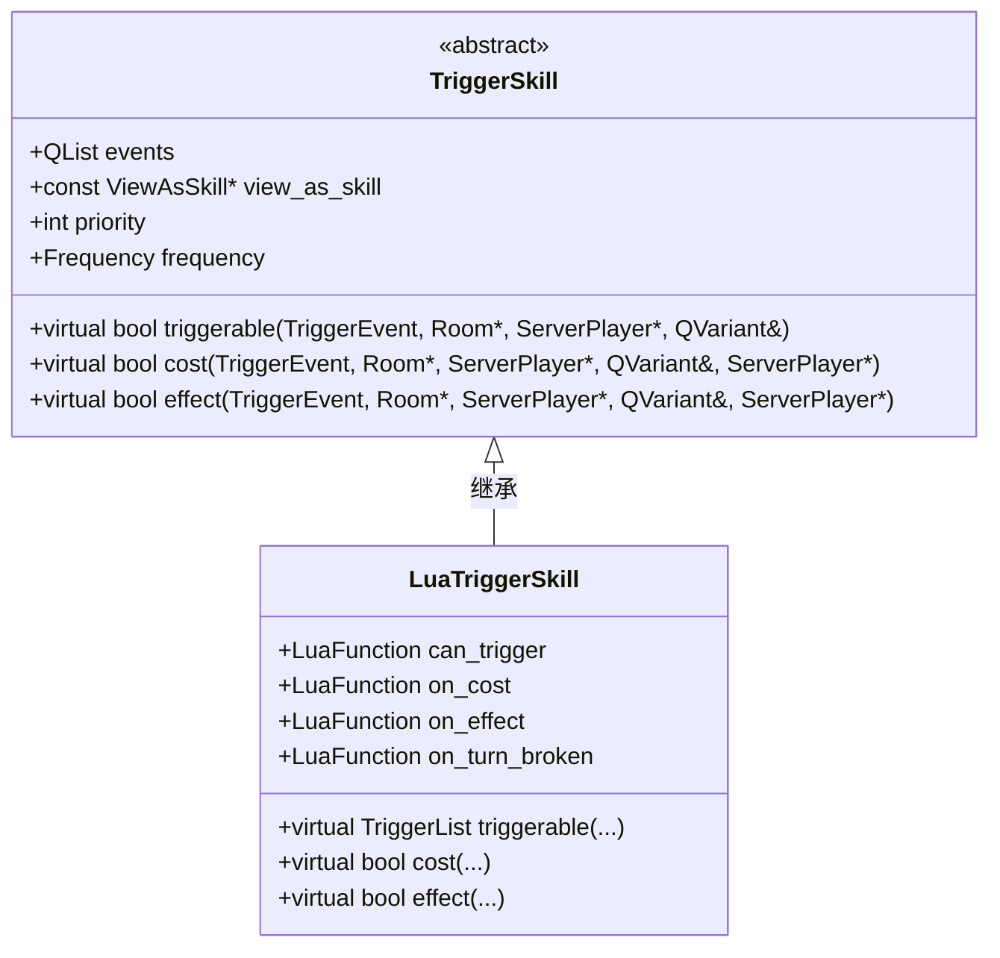
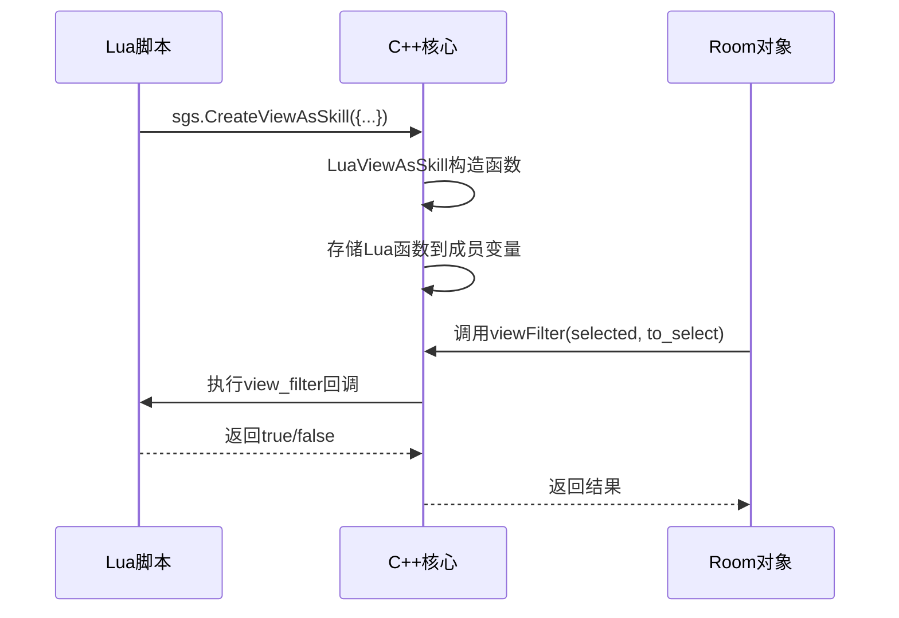
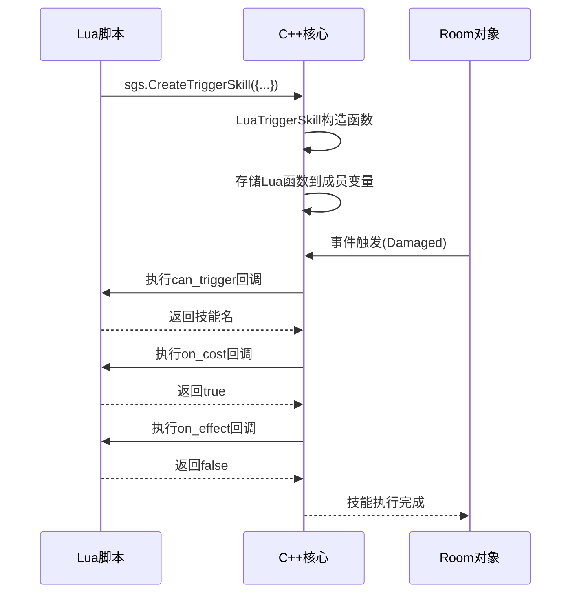

# 技能开发

<cite>
**本文档引用文件**   
- [2-ViewAsSkill.lua](file://extension-doc/2-ViewAsSkill.lua)
- [3-TriggerSkill.lua](file://extension-doc/3-TriggerSkill.lua)
- [4-OtherSkill.lua](file://extension-doc/4-OtherSkill.lua)
- [skill.h](file://src/core/skill.h)
- [structs.h](file://src/core/structs.h)
- [lua-wrapper.h](file://src/core/lua-wrapper.h)
- [lua-wrapper.cpp](file://src/core/lua-wrapper.cpp)
</cite>

## 目录
1. [技能开发](#技能开发)
2. [ViewAsSkill（视为技）详解](#viewasskill视为技详解)
3. [TriggerSkill（触发技）详解](#triggerskill触发技详解)
4. [其他技能类型](#其他技能类型)
5. [Lua与C++交互机制](#lua与c交互机制)
6. [实战示例](#实战示例)

## ViewAsSkill（视为技）详解

视为技（ViewAsSkill）用于实现“将某些牌视为另一张牌使用或打出”的技能，是主动技能的主要实现方式。这类技能在客户端运行，允许玩家选择手牌或装备牌，并将其“视为”特定的牌来使用。

### 基本结构与参数

`sgs.CreateViewAsSkill` 是创建视为技的核心方法，其定义在 `lua/sgs_ex.lua` 中，最终通过 C++ 的 `LuaViewAsSkill` 类实现。该类继承自 `ViewAsSkill`，并将 Lua 函数绑定为成员函数。



**Diagram sources**
- [skill.h](file://src/core/skill.h#L100-L150)
- [lua-wrapper.h](file://src/core/lua-wrapper.h#L134-L174)

**Section sources**
- [2-ViewAsSkill.lua](file://extension-doc/2-ViewAsSkill.lua#L1-L246)

### 核心回调函数

#### view_filter
定义哪些牌可以被选中用于发动技能。

```lua
view_filter = function(self, selected, to_select)
    return (#selected == 0) and (to_select:getSuit() == sgs.Card_Club)
end
```
此示例允许选择一张梅花牌。

#### view_as
定义选中的牌将被视为哪张牌返回。

```lua
view_as = function(self, cards)
    if #cards < 1 then return nil end
    local suit, number = sgs.Card_Spade, 1
    -- ... 根据cards计算花色和点数
    local card = sgs.Sanguosha:cloneCard("collateral", suit, number)
    for _, c in ipairs(cards) do
        card:addSubcard(c:getId())
    end
    card:setSkillName(self:objectName())
    return card
end
```

#### 启用条件
- `enabled_at_play`: 出牌阶段是否可用。
- `enabled_at_response`: 是否可用于响应。
- `enabled_at_nullification`: 是否可用于无懈可击响应（唯一在服务端运行的视为技函数）。

## TriggerSkill（触发技）详解

触发技（TriggerSkill）用于实现“在特定时机，满足条件时执行效果”的被动技能。它在服务端运行，是游戏规则的一部分。

### 基本结构与参数

`sgs.CreateTriggerSkill` 是创建触发技的核心方法，其定义在 `lua/sgs_ex.lua` 中，最终通过 C++ 的 `LuaTriggerSkill` 类实现。



**Diagram sources**
- [skill.h](file://src/core/skill.h#L250-L300)
- [lua-wrapper.h](file://src/core/lua-wrapper.h#L30-L76)

**Section sources**
- [3-TriggerSkill.lua](file://extension-doc/3-TriggerSkill.lua#L1-L234)

### 触发流程

1. **事件监听**：通过 `events` 数组注册监听的 `TriggerEvent`（如 `sgs.Damaged`, `sgs.EventPhaseStart`）。
2. **条件判断**：`can_trigger` 函数判断技能是否可触发，返回技能名和发动者。
3. **执行消耗**：`on_cost` 函数处理技能发动的消耗（如询问玩家、播放音效）。
4. **执行效果**：`on_effect` 函数执行技能的实际效果。

### 实例：曹操“奸雄”

```lua
LuaJianxiong = sgs.CreateTriggerSkill{
    name = "LuaJianxiong",
    events = {sgs.Damaged},
    can_trigger = function(self, event, room, player, data)
        if player and player:isAlive() and player:hasSkill(self:objectName()) then
            local damage = data:toDamage()
            local card = damage.card
            return (card and (room:getCardPlace(card:getEffectiveId()) == sgs.Player_PlaceTable)) and self:objectName() or ""
        end
        return ""
    end,
    on_cost = function(self, event, room, player, data, ask_who)
        return player:askForSkillInvoke(self:objectName(), data)
    end,
    on_effect = function(self, event, room, player, data, ask_who)
        local damage = data:toDamage()
        player:obtainCard(damage.card)
        return false
    end
}
```

## 其他技能类型

除了 `ViewAsSkill` 和 `TriggerSkill`，还有多种特殊技能类型。

### 距离技（DistanceSkill）
用于修改玩家间距离，全局生效。

```lua
function sgs.CreateMashuSkill(name)
    local mashu_skill = {}
    mashu_skill.name = "LuaMashu_" .. name
    mashu_skill.correct_func = function(self, from, to)
        if from:hasShownSkill(self) then
            return -1
        end
        return 0
    end
    return sgs.CreateDistanceSkill(mashu_skill)
end
```

### 手牌上限技（MaxCardsSkill）
修改玩家手牌上限。

```lua
LuaTestMaxCards = sgs.CreateMaxCardsSkill{
    name = "LuaTestMaxCards",
    extra_func = function(self, player)
        if player:hasSkill(self:objectName()) then
            return 2
        end
        return 0
    end
}
```

### 目标修改技（TargetModSkill）
修改牌的使用限制，如距离、次数、目标数。

```lua
LuaQicai = sgs.CreateTargetModSkill{
    name = "LuaQicai",
    distance_limit_func = function(self, player, card)
        if player:hasSkill(self:objectName()) and card:isKindOf("TrickCard") then
            return 1000
        end
        return 0
    end
}
```

### 锁定视为技（FilterSkill）
实现“XX牌视为XX牌”的锁定技，如小乔“红颜”。

```lua
LuaHongyan = sgs.CreateFilterSkill{
    name = "LuaHongyan",
    view_filter = function(self, to_select)
        return to_select:getSuit() == sgs.Card_Spade
    end,
    view_as = function(self, card)
        local new_card = sgs.Sanguosha:getWrappedCard(card:getEffectiveId())
        new_card:setSkillName(self:objectName())
        new_card:setSuit(sgs.Card_Heart)
        new_card:setModified(true)
        return new_card
    end
}
```

**Section sources**
- [4-OtherSkill.lua](file://extension-doc/4-OtherSkill.lua#L1-L111)

## Lua与C++交互机制

Lua 技能通过 `lua-wrapper` 模块与 C++ 核心交互。核心机制是将 Lua 函数作为回调绑定到 C++ 对象。

### ViewAsSkill 交互流程

1. **创建**：`sgs.CreateViewAsSkill` 在 Lua 中调用，传入包含回调函数的表。
2. **构造**：C++ 的 `LuaViewAsSkill` 构造函数（`lua-wrapper.cpp`）接收参数并初始化。
3. **绑定**：Lua 函数（如 `view_filter`, `view_as`）被存储在 `LuaFunction` 成员变量中。
4. **调用**：当游戏需要判断或执行时，C++ 调用 `viewFilter()` 或 `viewAs()`，这些函数内部再调用存储的 Lua 函数。



**Diagram sources**
- [lua-wrapper.cpp](file://src/core/lua-wrapper.cpp#L71-L82)
- [lua-wrapper.h](file://src/core/lua-wrapper.h#L134-L174)

### TriggerSkill 交互流程

类似地，`LuaTriggerSkill` 将 `can_trigger`, `on_cost`, `on_effect` 等函数绑定。



**Diagram sources**
- [lua-wrapper.cpp](file://src/core/lua-wrapper.cpp#L23-L32)
- [lua-wrapper.h](file://src/core/lua-wrapper.h#L30-L76)

## 实战示例

### 示例1：开发“观星”类ViewAs技能

实现一个技能，允许玩家将两张手牌视为【观星】使用。

```lua
LuaGuanxingSkill = sgs.CreateViewAsSkill{
    name = "LuaGuanxingSkill",
    view_filter = function(self, selected, to_select)
        return (#selected < 2) and (not to_select:isEquipped())
    end,
    view_as = function(self, cards)
        if #cards ~= 2 then return nil end
        local card = sgs.Sanguosha:cloneCard("guanxing_card", sgs.Card_NoSuit, 0)
        for _, c in ipairs(cards) do
            card:addSubcard(c:getId())
        end
        card:setSkillName(self:objectName())
        return card
    end,
    enabled_at_play = function(self, player)
        return not player:hasUsed("#guanxing_card")
    end
}
```

### 示例2：开发“闪避”类TriggerSkill

实现一个技能，在受到【杀】时有50%概率闪避。

```lua
LuaShanbiSkill = sgs.CreateTriggerSkill{
    name = "LuaShanbiSkill",
    events = {sgs.SlashEffected},
    can_trigger = function(self, event, room, player, data)
        if player and player:isAlive() and player:hasSkill(self:objectName()) then
            local effect = data:toSlashEffect()
            return self:objectName()
        end
        return ""
    end,
    on_cost = function(self, event, room, player, data, ask_who)
        return room:askForSkillInvoke(player, self:objectName(), data)
    end,
    on_effect = function(self, event, room, player, data, ask_who)
        local effect = data:toSlashEffect()
        effect.nullified = true
        room:notifySkillInvoked(player, self:objectName())
        room:broadcastSkillInvoke(self:objectName())
        return true
    end
}
```

**Section sources**
- [2-ViewAsSkill.lua](file://extension-doc/2-ViewAsSkill.lua#L1-L246)
- [3-TriggerSkill.lua](file://extension-doc/3-TriggerSkill.lua#L1-L234)