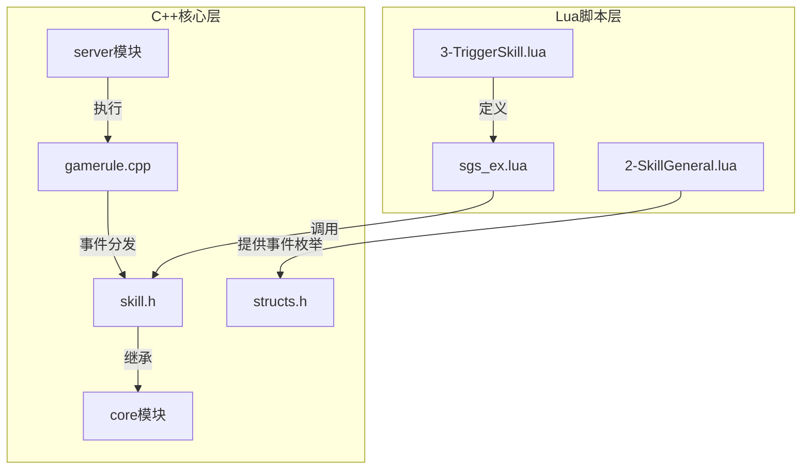
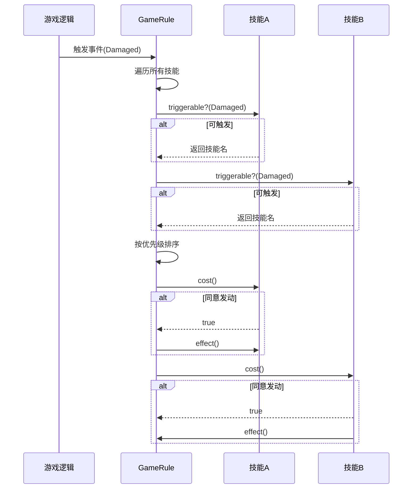
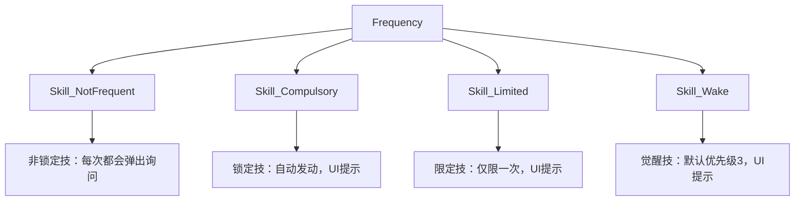
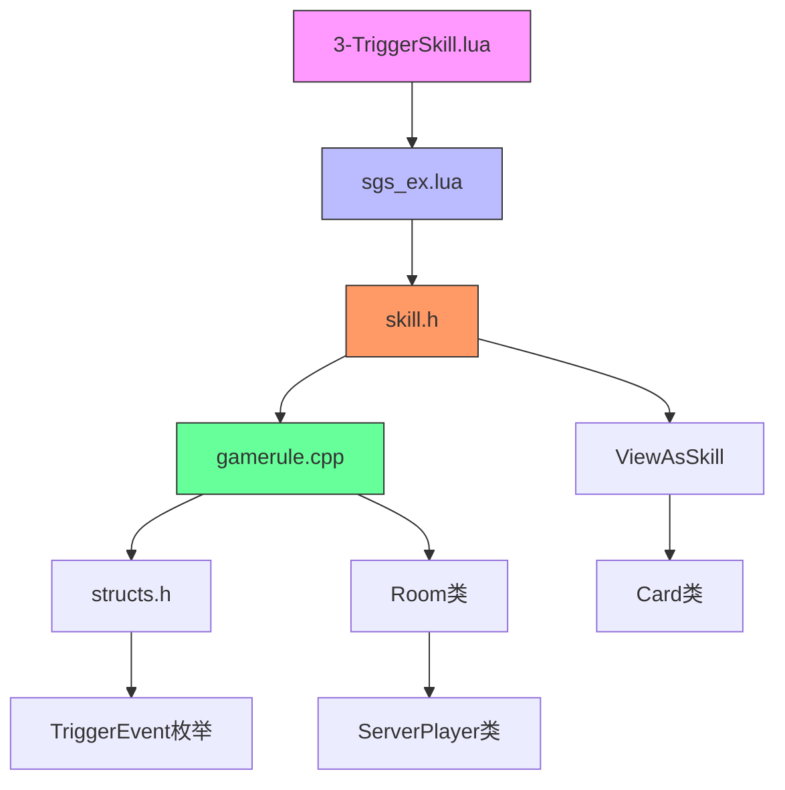

# 触发技能开发

<cite>
**本文档引用文件**  
- [3-TriggerSkill.lua](file://extension-doc/3-TriggerSkill.lua)
- [skill.h](file://src/core/skill.h)
- [gamerule.cpp](file://src/server/gamerule.cpp)
- [structs.h](file://src/core/structs.h)
</cite>

## 目录
1. [引言](#引言)
2. [项目结构分析](#项目结构分析)
3. [核心组件解析](#核心组件解析)
4. [触发技能架构概述](#触发技能架构概述)
5. [详细组件分析](#详细组件分析)
6. [依赖关系分析](#依赖关系分析)
7. [性能与优先级机制](#性能与优先级机制)
8. [实战示例：闪避技能开发](#实战示例：闪避技能开发)
9. [结论](#结论)

## 引言
本文档全面解析《三国杀》扩展框架中触发技能（TriggerSkill）的开发流程。基于Lua脚本与C++核心代码，深入探讨技能在回合开始、结束、受到伤害、使用卡牌等多种时机下的触发机制。结合`3-TriggerSkill.lua`文档、`skill.h`中的`TriggerSkill`类定义以及`gamerule.cpp`中的事件分发逻辑，系统阐述技能触发优先级、多技能冲突处理机制和全局事件监听流程。通过具体实例演示如何开发一个在受到【杀】时触发闪避效果的技能，并详细说明`canTrigger`、`onCost`和`onEffect`回调函数的设置方法。

## 项目结构分析
本项目为《三国杀·霸业》的扩展开发框架，采用C++为主、Lua为辅的混合架构。核心逻辑由C++实现，而技能定义等可配置内容则通过Lua脚本进行扩展。



**图示来源**  
- [3-TriggerSkill.lua](file://extension-doc/3-TriggerSkill.lua)
- [skill.h](file://src/core/skill.h)
- [gamerule.cpp](file://src/server/gamerule.cpp)
- [structs.h](file://src/core/structs.h)

**本节来源**  
- [3-TriggerSkill.lua](file://extension-doc/3-TriggerSkill.lua)
- [skill.h](file://src/core/skill.h)

## 核心组件解析
触发技能系统由Lua脚本接口与C++底层类库共同构成，二者通过`sgs.CreateTriggerSkill`等API进行交互。

### Lua脚本接口
Lua端通过`sgs.CreateTriggerSkill`函数创建触发技能，该函数在`lua/sgs_ex.lua`中定义，接收一个包含技能属性的表作为参数。

关键字段包括：
- **name**: 技能名称
- **events**: 触发时机（`TriggerEvent`枚举）
- **frequency**: 发动频率（`Skill::Frequency`枚举）
- **priority**: 执行优先级
- **can_trigger**: 条件判断函数
- **on_cost**: 消耗执行函数
- **on_effect**: 效果执行函数

### C++核心类
C++端`TriggerSkill`类（定义于`skill.h`）是所有触发技能的基类，负责事件监听、优先级排序和回调调度。

```mermaid
classDiagram
class TriggerSkill {
+QString name
+Frequency frequency
+QList~TriggerEvent~ events
+double priority
+ViewAsSkill* view_as_skill
+bool isGlobal()
+getPriority() int
+triggerable() TriggerList
+cost() bool
+effect() bool
}
class Skill {
+enum Frequency { Frequent, NotFrequent, Compulsory, Limited, Wake }
+QString getLimitMark()
+bool canPreshow()
}
class ViewAsSkill {
+QString response_pattern
+bool response_or_use
+virtual bool viewFilter()
+virtual const Card* viewAs()
}
TriggerSkill --|> Skill : 继承
TriggerSkill --> ViewAsSkill : 拥有
```

**图示来源**  
- [skill.h](file://src/core/skill.h#L1-L509)

**本节来源**  
- [skill.h](file://src/core/skill.h)
- [3-TriggerSkill.lua](file://extension-doc/3-TriggerSkill.lua)

## 触发技能架构概述
整个触发技能系统基于事件驱动架构，由游戏规则引擎统一调度。

### 事件分发流程
当游戏内发生特定事件时，`GameRule`类（`gamerule.cpp`）负责收集所有监听该事件的技能，并按优先级排序后依次执行。



**图示来源**  
- [gamerule.cpp](file://src/server/gamerule.cpp#L0-L799)
- [skill.h](file://src/core/skill.h#L1-L509)

**本节来源**  
- [gamerule.cpp](file://src/server/gamerule.cpp)
- [skill.h](file://src/core/skill.h)

## 详细组件分析
### 触发时机（Events）
触发时机由`TriggerEvent`枚举定义，位于`structs.h`文件中。常见时机包括：

| 事件 | 说明 | 典型技能 |
|------|------|----------|
| `GameStart` | 游戏开始时 | 化身 |
| `TurnStart` | 回合开始前 | 争功 |
| `EventPhaseStart` | 阶段开始时 | 突袭 |
| `EventPhaseEnd` | 阶段结束时 | 生息 |
| `Damaged` | 受到伤害时 | 遗计 |
| `DamageDone` | 伤害结算时 | 奸雄 |
| `CardUsed` | 使用卡牌时 | 判若两人 |

```lua
-- 示例：定义在受到伤害时触发的技能
events = { sgs.Damaged }
```

**本节来源**  
- [structs.h](file://src/core/structs.h#L481-L679)
- [3-TriggerSkill.lua](file://extension-doc/3-TriggerSkill.lua)

### 发动频率（Frequency）
`frequency`字段决定技能的发动方式和UI显示：



**本节来源**  
- [3-TriggerSkill.lua](file://extension-doc/3-TriggerSkill.lua)

### 优先级机制（Priority）
优先级决定多个技能同时触发时的执行顺序：

- **游戏规则**: 优先级为0
- **C++技能**: 基本为2
- **Lua技能**: 默认为3

```cpp
// 在gamerule.cpp中，GameRule的优先级为0
int GameRule::getPriority() const
{
    return 0;
}
```

开发者可通过设置`priority`字段调整Lua技能的执行顺序。

**本节来源**  
- [gamerule.cpp](file://src/server/gamerule.cpp#L790-L792)
- [3-TriggerSkill.lua](file://extension-doc/3-TriggerSkill.lua)

## 依赖关系分析
触发技能系统各组件间存在明确的依赖关系：



**图示来源**  
- [3-TriggerSkill.lua](file://extension-doc/3-TriggerSkill.lua)
- [skill.h](file://src/core/skill.h)
- [gamerule.cpp](file://src/server/gamerule.cpp)
- [structs.h](file://src/core/structs.h)

**本节来源**  
- [3-TriggerSkill.lua](file://extension-doc/3-TriggerSkill.lua)
- [skill.h](file://src/core/skill.h)
- [gamerule.cpp](file://src/server/gamerule.cpp)

## 性能与优先级机制
### 多技能冲突处理
当多个技能在同一时机触发时，系统按以下流程处理：

1. 收集所有可触发技能
2. 按`priority`降序排序
3. 依次调用`can_trigger`判断条件
4. 对符合条件的技能调用`on_cost`询问玩家
5. 执行`on_effect`效果

### 全局事件监听
`GameRule`类通过注册多个事件实现全局监听：

```cpp
GameRule::GameRule(QObject *parent)
    : TriggerSkill("game_rule")
{
    events << GameStart << TurnStart
        << EventPhaseStart << EventPhaseProceeding << EventPhaseEnd
        << PreCardUsed << CardUsed << CardFinished
        << DamageDone << DamageComplete
        << StartJudge << FinishJudge;
}
```

这使得游戏核心规则（如摸牌、弃牌、濒死结算）能在统一入口处理。

**本节来源**  
- [gamerule.cpp](file://src/server/gamerule.cpp#L50-L100)
- [3-TriggerSkill.lua](file://extension-doc/3-TriggerSkill.lua)

## 实战示例：闪避技能开发
下面开发一个在受到【杀】时触发闪避效果的技能：

```lua
-- 闪避技能定义
LuaShanbi = sgs.CreateTriggerSkill{
    name = "LuaShanbi",
    events = {sgs.SlashEffected}, -- 在【杀】生效时触发
    can_trigger = function(self, event, room, player, data)
        -- 判断：拥有技能且存活
        if player and player:isAlive() and player:hasSkill(self:objectName()) then
            local effect = data:toSlashEffect()
            if effect.slash:isKindOf("Slash") then
                return self:objectName() -- 返回技能名表示可触发
            end
        end
        return ""
    end,
    on_cost = function(self, event, room, player, data, ask_who)
        local effect = data:toSlashEffect()
        -- 询问是否发动闪避
        if player:askForSkillInvoke(self:objectName(), data) then
            room:broadcastSkillInvoke(self:objectName()) -- 播放音效
            return true -- 消耗完成
        end
        return false -- 不发动
    end,
    on_effect = function(self, event, room, player, data, ask_who)
        local effect = data:toSlashEffect()
        -- 阻止【杀】生效
        room:sendLog(sgs.LogType_LoseHp, player, nil, nil, "shanbi")
        return true -- 返回true阻止后续效果
    end,
    priority = 4 -- 高于大多数技能，确保优先判定
}
```

### 关键点说明
- **events = {sgs.SlashEffected}**: 在【杀】即将生效时触发
- **data:toSlashEffect()**: 将`QVariant`数据转换为`SlashEffectStruct`
- **on_cost中询问玩家**: 使用`askForSkillInvoke`获取玩家意图
- **on_effect返回true**: 表示阻止原事件继续执行
- **priority = 4**: 确保在其他技能前处理

**本节来源**  
- [3-TriggerSkill.lua](file://extension-doc/3-TriggerSkill.lua)
- [structs.h](file://src/core/structs.h#L589-L590)

## 结论
本文档系统解析了《三国杀》触发技能的开发机制。通过Lua脚本与C++核心的紧密结合，开发者可以灵活定义各种复杂的技能逻辑。关键要点包括：

1. **事件驱动**: 所有技能均绑定到特定`TriggerEvent`
2. **优先级控制**: 通过`priority`字段精确控制执行顺序
3. **三段式回调**: `can_trigger`、`on_cost`、`on_effect`构成完整技能流程
4. **数据转换**: 使用`toXXX()`方法将`QVariant`转换为具体结构体
5. **全局监听**: `GameRule`类负责核心规则的统一调度

掌握这些机制后，开发者可高效实现各类创新技能，丰富游戏策略深度。