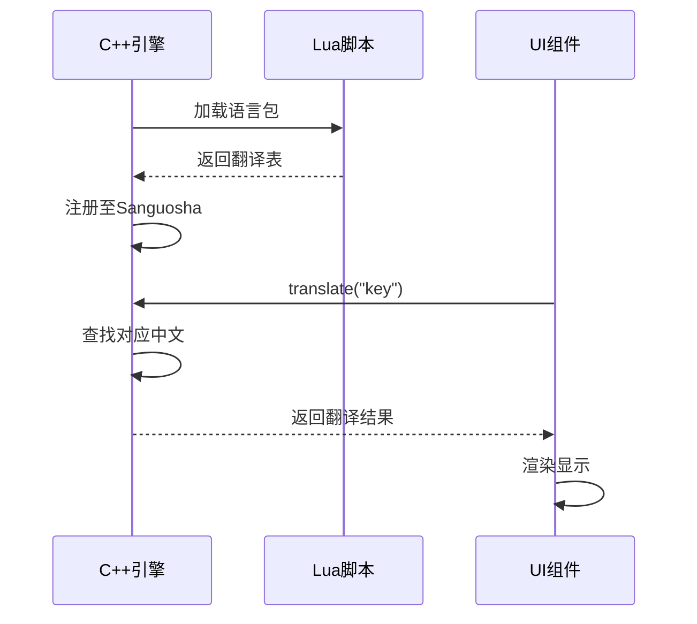
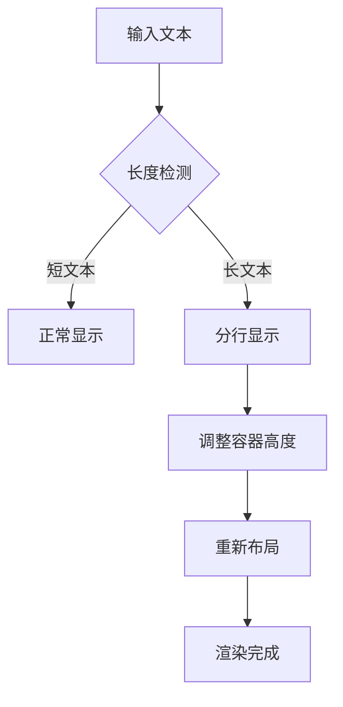
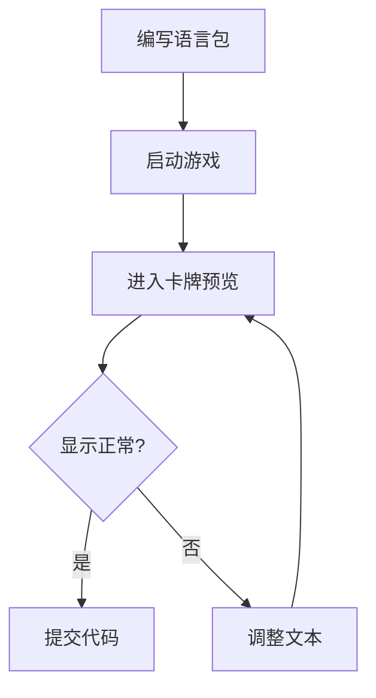

# 多语言本地化集成

<cite>
**本文档引用文件**  
- [StrategicAdvantagePackage.lua](file://lang/zh_CN/Package/StrategicAdvantagePackage.lua)
- [Xmode.lua](file://extensions/Xmode.lua)
- [Common.lua](file://lang/zh_CN/Common.lua)
- [StandardGeneralPackage.lua](file://lang/zh_CN/Package/StandardGeneralPackage.lua)
- [StandardPackage.lua](file://lang/zh_CN/Package/StandardPackage.lua)
- [StandardWeiGeneral.lua](file://lang/zh_CN/Package/StandardWeiGeneral.lua)
- [carditem.cpp](file://src/ui/carditem.cpp)
- [card.cpp](file://src/core/card.cpp)
- [cardoverview.cpp](file://src/dialog/cardoverview.cpp)
- [guhuobox.cpp](file://src/ui/guhuobox.cpp)
- [cardeditor.cpp](file://src/dialog/cardeditor.cpp)
</cite>

## 目录
1. [项目结构分析](#项目结构分析)
2. [多语言系统架构](#多语言系统架构)
3. [本地化字段命名规范](#本地化字段命名规范)
4. [语言包加载与解析机制](#语言包加载与解析机制)
5. [字符串转义与动态参数处理](#字符串转义与动态参数处理)
6. [文本长度适配与UI布局](#文本长度适配与ui布局)
7. [实际开发问题与解决方案](#实际开发问题与解决方案)
8. [推荐实践与最佳方案](#推荐实践与最佳方案)

## 项目结构分析

项目采用模块化结构，语言资源集中存放在 `lang/zh_CN` 目录下，按功能划分为多个独立的 `.lua` 文件。核心语言包位于 `lang/zh_CN/Package/` 子目录中，包含武将、卡牌、技能等游戏元素的中文翻译。

关键目录结构如下：
- `lang/zh_CN/Package/`：存放各类扩展包的语言定义
- `lang/zh_CN/Common.lua`：通用术语与系统提示语
- `extensions/`：扩展模式定义（如 Xmode）
- `src/`：C++ 核心逻辑，负责加载和使用语言资源

**Section sources**
- [StrategicAdvantagePackage.lua](file://lang/zh_CN/Package/StrategicAdvantagePackage.lua)
- [Xmode.lua](file://extensions/Xmode.lua)
- [Common.lua](file://lang/zh_CN/Common.lua)

## 多语言系统架构

游戏采用基于 Lua 的语言资源管理系统，通过键值对方式组织翻译内容。核心机制由 C++ 引擎调用 `Sanguosha->translate()` 接口实现动态文本解析。

```mermaid
graph TB
A[语言资源文件 .lua] --> B[资源加载器]
B --> C[翻译表注册]
C --> D[Sanguosha::translate()]
D --> E[UI组件显示]
F[卡牌描述] --> D
G[技能说明] --> D
H[系统提示] --> D
```

**Diagram sources**
- [StrategicAdvantagePackage.lua](file://lang/zh_CN/Package/StrategicAdvantagePackage.lua)
- [card.cpp](file://src/core/card.cpp)
- [carditem.cpp](file://src/ui/carditem.cpp)

## 本地化字段命名规范

语言包中使用特定前缀标识不同类型的文本内容，形成统一的命名体系：

### 基础命名规则
- `["key"] = "值"`：普通名称翻译
- `[":key"] = "描述"`：冒号前缀表示技能或卡牌描述
- `["@key"] = "提示"`：at符号前缀表示操作提示
- `["#key"] = "事件"`：井号前缀表示事件或特效名称
- `["~key"] = "交互"`：波浪号前缀表示用户交互指令

### 示例解析
```lua
["Halberd"] = "方天画戟",                    -- 卡牌名称
[":Halberd"] = "装备牌·武器\n\n攻击范围：4", -- 卡牌描述
["@halberd-use"] = "是否发动【方天画戟】效果", -- 使用提示
["#HalberdNullified"] = "由于【%arg】的效果..." -- 事件文本
```

**Section sources**
- [StrategicAdvantagePackage.lua](file://lang/zh_CN/Package/StrategicAdvantagePackage.lua)
- [StandardPackage.lua](file://lang/zh_CN/Package/StandardPackage.lua)

## 语言包加载与解析机制

游戏启动时，Lua 脚本通过 `return { ... }` 导出翻译表，由 C++ 引擎注册到全局 `Sanguosha` 对象中。调用流程如下：



在 C++ 代码中，`card.cpp` 的 `getDescription()` 方法会调用 `Sanguosha->translate()` 获取本地化描述：

```cpp
setToolTip(Sanguosha->translate(card->getDescription()));
```

**Diagram sources**
- [carditem.cpp](file://src/ui/carditem.cpp)
- [card.cpp](file://src/core/card.cpp)
- [StrategicAdvantagePackage.lua](file://lang/zh_CN/Package/StrategicAdvantagePackage.lua)

**Section sources**
- [card.cpp](file://src/core/card.cpp#L400-L437)
- [carditem.cpp](file://src/ui/carditem.cpp#L39-L91)

## 字符串转义与动态参数处理

系统支持动态参数插入和 HTML 标签转义，确保复杂文本正确显示。

### 动态参数格式
使用 `%arg`, `%from`, `%to`, `%card` 等占位符进行动态替换：
```lua
["#HalberdNullified"] = "由于【%arg】的效果，%from 对 %to 使用的【%arg2】无效"
```

### 转义处理
在 `card.cpp` 中，描述文本会自动处理换行和颜色标记：
```cpp
desc.replace("\n", "<br/>");
if (isTransferable()) {
    desc += "<br/><br/>";
    desc += Sanguosha->translate("is_transferable");
}
```

支持红黑字体自动着色：
```cpp
if (red)
    desc.replace(to_replace, QString("<font color=#FF0000>%1</font>").arg(...));
else
    desc.replace(to_replace, QString("<font color=#000000>...%1...</font>").arg(...));
```

**Section sources**
- [card.cpp](file://src/core/card.cpp#L400-L437)
- [StrategicAdvantagePackage.lua](file://lang/zh_CN/Package/StrategicAdvantagePackage.lua)

## 文本长度适配与UI布局

不同语言文本长度差异大，需考虑 UI 布局适配。

### 卡牌预览界面
`cardoverview.cpp` 中设置固定列宽以适应长文本：
```cpp
ui->tableWidget->setColumnWidth(0, 80); // 名称列
ui->tableWidget->setColumnWidth(3, 60); // 类型列
```

### 提示框动态布局
`guhuobox.cpp` 根据内容动态调整标题位置：
```cpp
titlepos.setY(topBlankWidth + defaultButtonHeight * i + interval * i + titleWidth * i);
```

### 推荐实践
- 避免过长技能描述
- 使用缩写或分段表达
- 在编辑器中预览不同语言效果



**Diagram sources**
- [cardoverview.cpp](file://src/dialog/cardoverview.cpp#L41-L80)
- [guhuobox.cpp](file://src/ui/guhuobox.cpp#L141-L168)

**Section sources**
- [cardoverview.cpp](file://src/dialog/cardoverview.cpp)
- [guhuobox.cpp](file://src/ui/guhuobox.cpp)

## 实际开发问题与解决方案

### 问题1：特殊字符冲突
**现象**：`%` 符号被误解析为参数占位符  
**解决方案**：使用双百分号 `%%` 转义

### 问题2：文本截断
**现象**：UI控件无法完整显示长描述  
**解决方案**：
- 增加滚动区域
- 使用省略号+悬停显示完整文本
- 分段展示技能效果

### 问题3：动态参数缺失
**现象**：`%from` 等变量未正确传入  
**解决方案**：确保调用 `LogMessage` 时完整传递参数对象

### 问题4：字体渲染异常
**现象**：中文显示乱码或方块  
**解决方案**：
- 检查字体文件是否包含中文字符集
- 确保 `freetype` 库正确加载
- 设置合适的字体编码

**Section sources**
- [card.cpp](file://src/core/card.cpp)
- [carditem.cpp](file://src/ui/carditem.cpp)
- [cardeditor.cpp](file://src/dialog/cardeditor.cpp)

## 推荐实践与最佳方案

### 1. 命名一致性
保持键名与对象名一致：
```lua
["JadeSeal"] = "玉玺"
[":JadeSeal"] = "装备牌·宝物..."
```

### 2. 描述结构化
使用换行和符号分隔逻辑段落：
```lua
[":WoodenOx"] = "装备牌·宝物\n\n技能：\n" ..
                "1. 出牌阶段限一次...\n" ..
                "◆“辎”对你可见。"
```

### 3. 公共术语统一
在 `Common.lua` 中定义通用词汇：
```lua
["SingleTargetTrick"] = "单体锦囊"
["MultiTarget"] = "群体锦囊"
["DelayedTrick"] = "延时锦囊"
```

### 4. 测试验证流程
1. 修改语言包
2. 启动游戏
3. 检查卡牌/技能显示
4. 验证动态参数替换
5. 测试不同分辨率下的布局

### 5. 工具辅助
使用 `CardEditor` 进行实时预览：
- 实时查看名称与描述效果
- 调整字体大小与布局
- 导出测试资源包



**Diagram sources**
- [cardeditor.cpp](file://src/dialog/cardeditor.cpp)
- [cardoverview.cpp](file://src/dialog/cardoverview.cpp)

**Section sources**
- [Common.lua](file://lang/zh_CN/Common.lua)
- [cardeditor.cpp](file://src/dialog/cardeditor.cpp)
- [StrategicAdvantagePackage.lua](file://lang/zh_CN/Package/StrategicAdvantagePackage.lua)