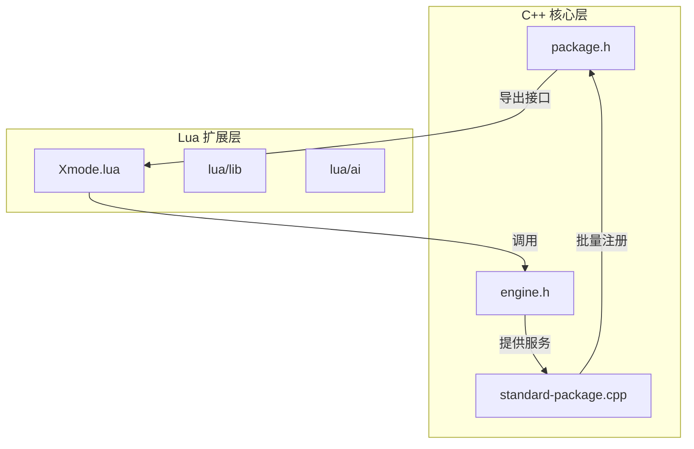
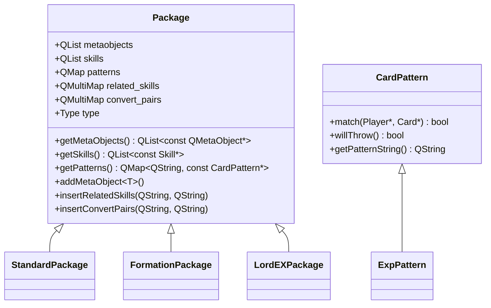
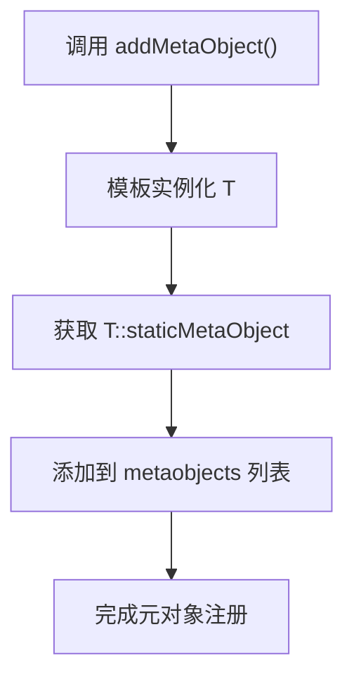
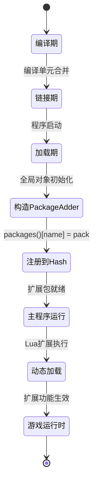
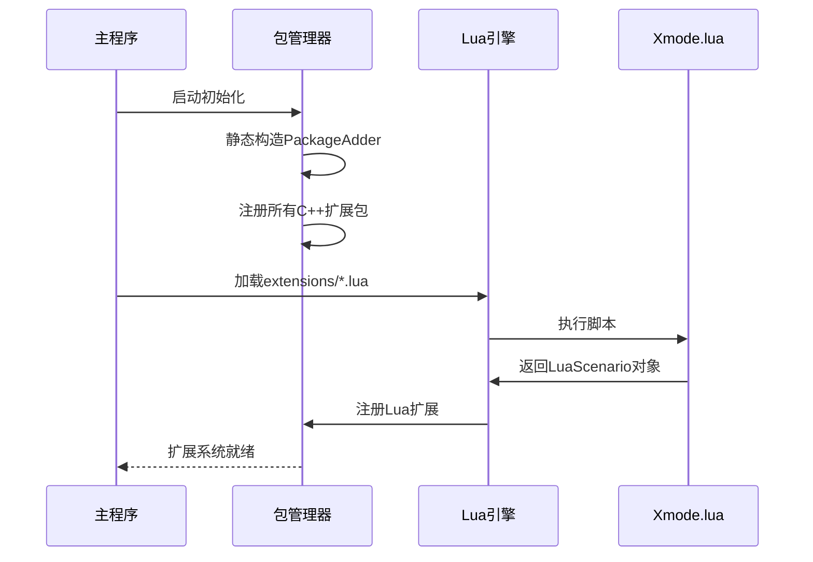
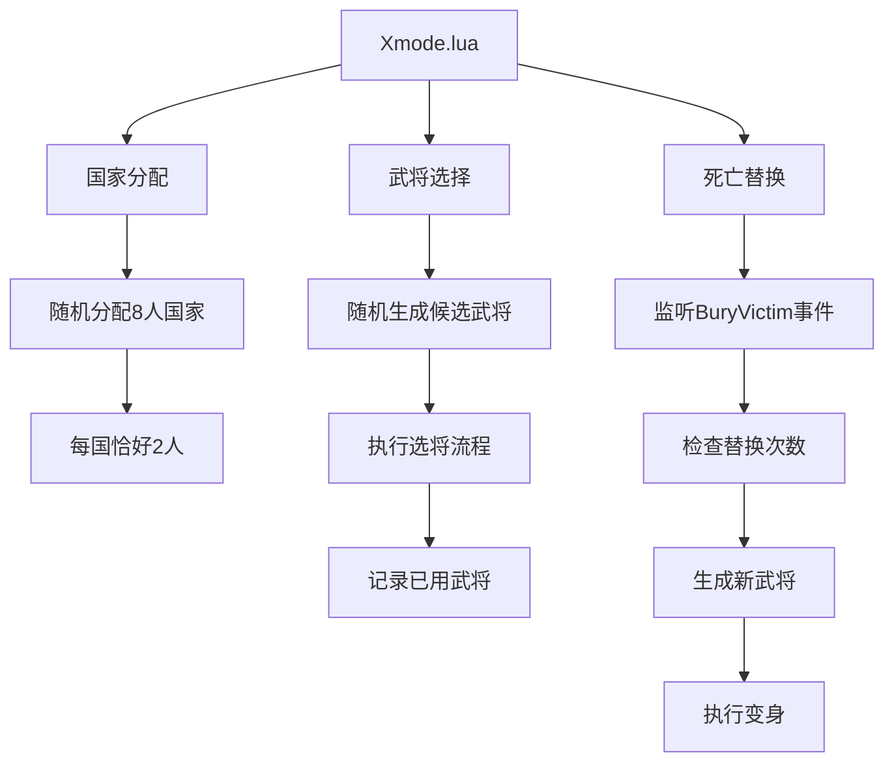

# 扩展包注册与加载

<cite>
**本文档引用文件**  
- [package.h](file://src/package/package.h#L1-L143)
- [standard-package.cpp](file://src/package/standard-package.cpp#L1-L840)
- [Xmode.lua](file://extensions/Xmode.lua#L1-L91)
</cite>

## 目录
1. [引言](#引言)
2. [项目结构概述](#项目结构概述)
3. [核心组件分析](#核心组件分析)
4. [Package类设计原理](#package类设计原理)
5. [武将注册机制详解](#武将注册机制详解)
6. [扩展包生命周期管理](#扩展包生命周期管理)
7. [静态注册与动态加载流程](#静态注册与动态加载流程)
8. [依赖声明与初始化顺序](#依赖声明与初始化顺序)
9. [防止加载冲突的最佳实践](#防止加载冲突的最佳实践)
10. [附录：Xmode扩展示例解析](#附录xmode扩展示例解析)

## 引言

本技术文档详细阐述了《三国杀：霸业》扩展系统中武将注册与加载的核心机制。文档深入分析了C++层Package类的设计原理、Lua脚本扩展接口的使用方法，以及扩展包从静态注册到动态加载的完整生命周期管理流程。通过结合源码分析与实际案例，为开发者提供了一套完整的扩展开发指导方案。

## 项目结构概述

项目采用分层架构设计，主要分为以下几个关键目录：

- **extensions/**：存放Lua编写的扩展脚本，如`Xmode.lua`
- **src/package/**：包含所有扩展包的C++实现，如`standard-package.cpp`
- **include/**：头文件定义，包括`package.h`等核心接口
- **lua/**：游戏逻辑相关的Lua脚本库
- **lang/zh_CN/**：中文语言包定义

该结构实现了C++核心引擎与Lua扩展脚本的良好解耦，支持灵活的模块化扩展。



**图示来源**
- [package.h](file://src/package/package.h#L1-L143)
- [standard-package.cpp](file://src/package/standard-package.cpp#L1-L840)
- [Xmode.lua](file://extensions/Xmode.lua#L1-L91)

## 核心组件分析

系统核心由以下三个组件构成：

1. **Package类**：扩展包的抽象基类，定义了元对象、技能、卡牌模式等注册接口
2. **PackageAdder机制**：基于静态对象构造的自动注册系统
3. **Lua扩展接口**：通过`sgs.Sanguosha`暴露给Lua脚本的注册API

这些组件共同构成了一个稳定、可扩展的插件体系。

**本节来源**
- [package.h](file://src/package/package.h#L1-L143)
- [standard-package.cpp](file://src/package/standard-package.cpp#L1-L840)

## Package类设计原理

`Package`类是所有扩展包的基类，其设计遵循单一职责原则，主要职责包括：

- 管理元对象（MetaObject）集合
- 存储技能（Skill）列表
- 维护卡牌模式（CardPattern）映射
- 处理技能关联关系

### 类结构分析



**图示来源**
- [package.h](file://src/package/package.h#L50-L143)

### 关键成员解析

:metaobjects: 存储通过`addMetaObject`注册的元对象指针，用于Qt的元对象系统反射机制  
:skills: 技能对象列表，包含所有该扩展包定义的技能实例  
:patterns: 卡牌模式字典，支持通过字符串模式匹配卡牌  
:related_skills: 技能关联映射，表示主技能与附属技能的关系  
:convert_pairs: 技能转换对，用于技能继承或替换机制  

## 武将注册机制详解

### C++层注册方式

在C++扩展包中，通过继承`Package`类并重写构造函数来注册新武将。以`StandardPackage`为例：

```cpp
StandardPackage::StandardPackage() : Package("standard")
{
    addWeiGenerals();    // 添加魏国武将
    addShuGenerals();    // 添加蜀国武将
    addWuGenerals();     // 添加吴国武将
    addQunGenerals();    // 添加群雄武将
    
    // 注册卡牌元对象
    addMetaObject<CompanionCard>();
    addMetaObject<HalfMaxHpCard>();
    
    // 注册技能
    skills << new Companion << new HalfMaxHp;
}
```

#### addMetaObject模板方法



**图示来源**
- [package.h](file://src/package/package.h#L98-L102)

### Lua层注册接口

虽然`Xmode.lua`未直接注册武将，但可通过`sgs.Sanguosha`对象访问注册接口：

```lua
-- 获取扩展包管理器
local packageManager = sgs.Sanguosha:getPackage("standard")

-- 动态添加元对象（需C++支持）
-- packageManager:addMetaObject(...) -- 此接口通常不直接暴露给Lua

-- 注册新技能示例
MySkill = sgs.CreateTriggerSkill{
    name = "mySkill",
    events = {sgs.EventPhaseStart},
    on_trigger = function(self, event, room, player, data)
        -- 技能逻辑
    end
}
```

> **注意**：Lua脚本通常通过预定义的`CreateTriggerSkill`等工厂函数创建技能，而非直接调用C++的`addMetaObject`。

## 扩展包生命周期管理

### 静态注册机制

系统采用C++静态初始化机制实现自动注册：

```cpp
#define ADD_PACKAGE(name) static PackageAdder name##PackageAdder(#name, new name##Package);
```

当编译`standard-package.cpp`时，会生成：

```cpp
static PackageAdder standardPackageAdder("standard", new StandardPackage);
```

利用全局对象在`main()`执行前自动构造的特性，完成包注册。

### 生命周期流程



**图示来源**
- [package.h](file://src/package/package.h#L136-L141)
- [standard-package.cpp](file://src/package/standard-package.cpp#L1542-L1543)

## 静态注册与动态加载流程

### 静态注册流程（C++扩展）

1. 定义扩展包类（如`StandardPackage`）
2. 在构造函数中调用`addMetaObject`、`addWeiGenerals`等注册方法
3. 使用`ADD_PACKAGE(standard)`宏触发静态注册
4. 程序启动时自动完成注册

### 动态加载流程（Lua扩展）

1. 创建`.lua`扩展文件（如`Xmode.lua`）
2. 定义扩展规则与事件回调
3. 通过`sgs.CreateLuaScenario`创建场景对象
4. 使用`return sgs.CreateLuaScenario(Xmode)`导出扩展



**图示来源**
- [package.h](file://src/package/package.h#L136-L141)
- [Xmode.lua](file://extensions/Xmode.lua#L1-L91)

## 依赖声明与初始化顺序

### 依赖管理机制

系统通过以下方式管理依赖：

1. **编译依赖**：通过头文件包含（如`#include "standard-basics.h"`）
2. **运行时依赖**：通过技能名称字符串引用
3. **加载顺序**：C++扩展优先于Lua扩展加载

### 初始化顺序控制

```cpp
// 在standard-package.cpp中明确的初始化顺序
StandardPackage::StandardPackage()
    : Package("standard")
{
    // 1. 先注册武将
    addWeiGenerals();
    addShuGenerals();
    addWuGenerals();
    addQunGenerals();

    // 2. 再注册卡牌元对象
    addMetaObject<CompanionCard>();
    
    // 3. 最后注册技能
    skills << new Companion << new HalfMaxHp;
}
```

这种顺序确保了：
- 武将定义先于技能引用
- 卡牌类型先于技能使用
- 基础模式先于复杂逻辑

## 防止加载冲突的最佳实践

### 命名空间隔离

```lua
-- 推荐：使用唯一前缀
XmodeRule = sgs.CreateTriggerSkill{
    name = "XmodeRule",  -- 前缀+功能
    ...
}

-- 避免：使用通用名称
MySkill = sgs.CreateTriggerSkill{  -- 可能冲突
    name = "MySkill",
    ...
}
```

### 资源使用检查

```lua
function getRandomGenerals(n, kingdom, exceptions)
    -- 检查并打乱已有列表
    hash[kingdom] = table.Shuffle(hash[kingdom])
    local result = {}
    for _,general in pairs(hash[kingdom]) do
        if #result == n then break end
        if not table.contains(exceptions, general) then
            table.insert(result, general)
        end
    end
    return result
end
```

### 冲突检测机制

1. **标签命名**：使用扩展名作为标签前缀
   ```lua
   room:setTag("Xmode_UsedGeneral", ...)
   ```

2. **标记管理**：使用唯一标记名
   ```cpp
   limit_mark = "@xmode_companion";  // 而非通用名
   ```

3. **事件优先级**：合理设置触发优先级
   ```lua
   priority = 1,  -- 避免过高优先级干扰核心逻辑
   ```

## 附录：Xmode扩展示例解析

### Xmode.lua核心功能



**本节来源**
- [Xmode.lua](file://extensions/Xmode.lua#L1-L91)

### 关键代码解析

```lua
XmodeRule = sgs.CreateTriggerSkill{
    name = "XmodeRule",
    events = {sgs.BuryVictim},  -- 监听埋葬事件
    on_effect = function(self, event, room, player, data, ask_who)
        player:bury()  -- 先执行埋葬
        
        -- 检查替换次数
        local times = room:getTag(player:getKingdom().."_Change"):toInt()
        if times >= 3 then return false end
        
        -- 获取已用武将列表
        local used = room:getTag("Xmode_UsedGeneral"):toString():split("+")
        
        -- 随机获取新武将
        local random_general = getRandomGenerals(
            sgs.GetConfig("HegemonyMaxChoice",0),
            player:getKingdom(), 
            used
        )
        
        -- 询问玩家选择
        local choice = room:askForGeneral(player, table.concat(random_general,"+"))
        
        -- 执行变身
        room:doDragonPhoenix(player, choice[1], choice[2], true, player:getKingdom(), false, "", true)
        
        -- 更新记录
        table.insert(used, choice[1])
        table.insert(used, choice[2])
        room:setTag("Xmode_UsedGeneral", sgs.QVariant(table.concat(used,"+")))
        
        times = times + 1
        room:setTag(player:getKingdom().."_Change", sgs.QVariant(times))
        
        return true
    end,
    priority = 1,
}
```

该实现展示了如何通过Lua脚本实现复杂的扩展逻辑，同时遵循了命名隔离、状态管理等最佳实践。

**本节来源**
- [Xmode.lua](file://extensions/Xmode.lua#L1-L91)