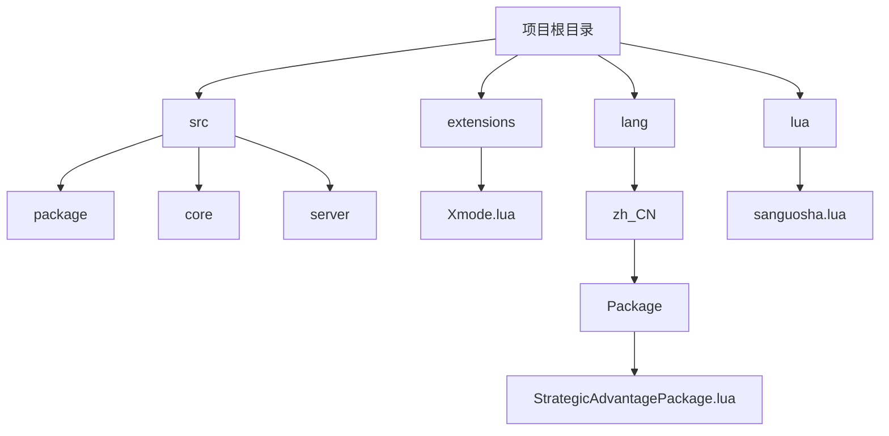
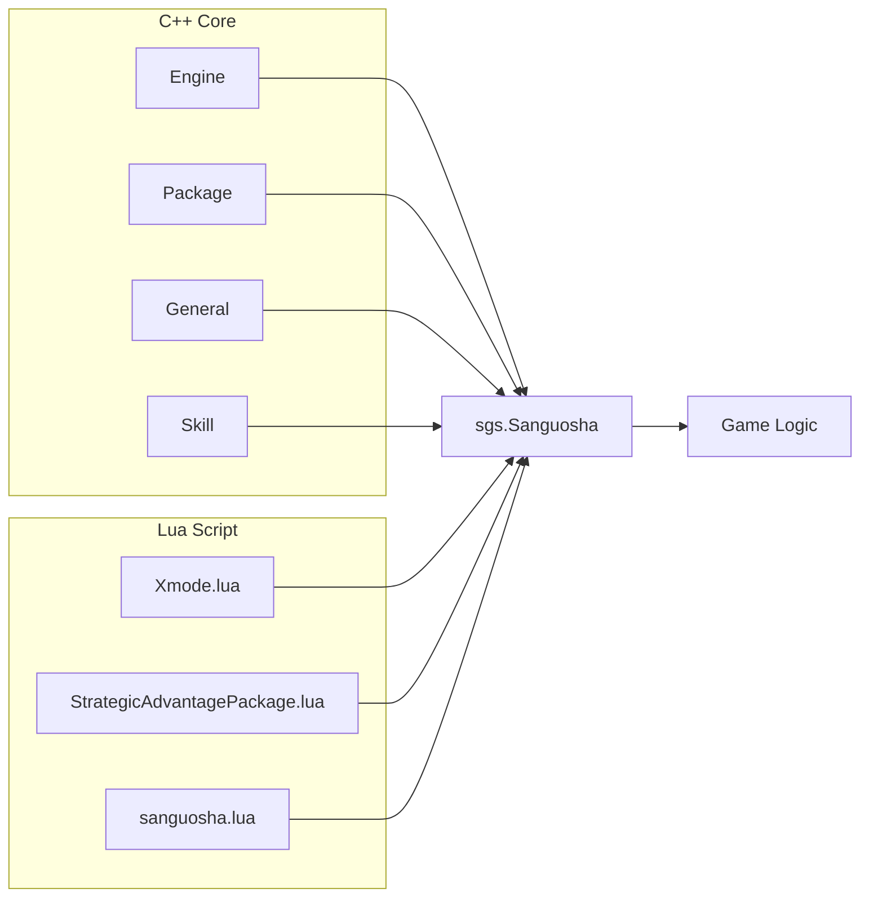
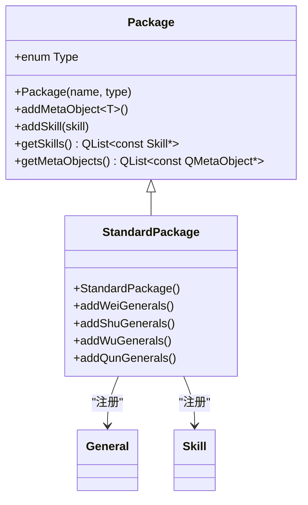
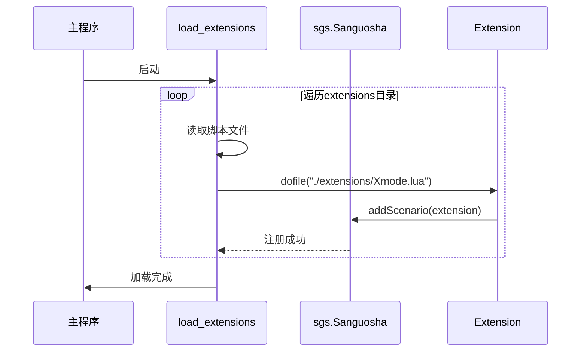
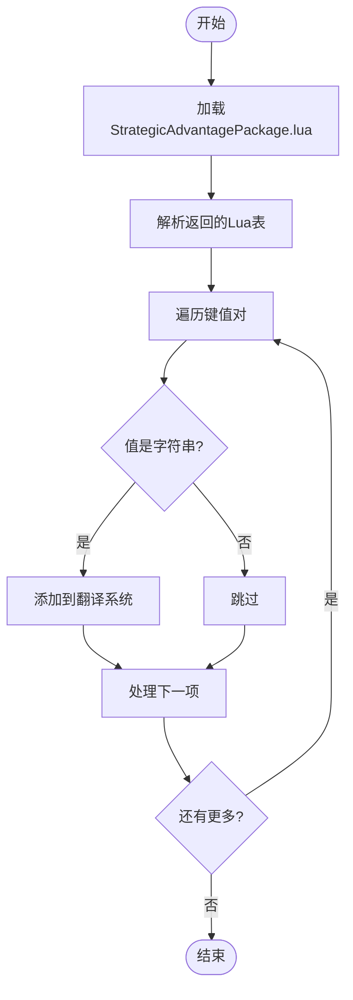
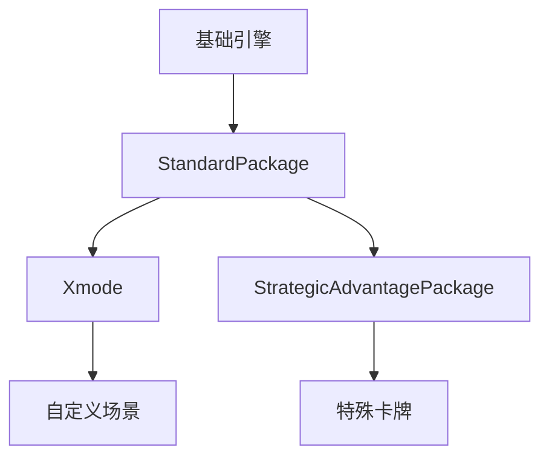

# 扩展包集成

<cite>
**本文档中引用的文件**  
- [package.h](file://src/package/package.h#L0-L143)
- [standard-package.cpp](file://src/package/standard-package.cpp#L0-L839)
- [Xmode.lua](file://extensions/Xmode.lua#L0-L91)
- [StrategicAdvantagePackage.lua](file://lang/zh_CN/Package/StrategicAdvantagePackage.lua#L0-L106)
- [sanguosha.lua](file://lua/sanguosha.lua#L45-L124)
</cite>

## 目录
1. [引言](#引言)
2. [项目结构](#项目结构)
3. [核心组件](#核心组件)
4. [架构概览](#架构概览)
5. [详细组件分析](#详细组件分析)
6. [依赖分析](#依赖分析)
7. [性能考虑](#性能考虑)
8. [故障排除指南](#故障排除指南)
9. [结论](#结论)

## 引言
本文档旨在详细说明如何将新开发的武将集成到《三国杀》游戏的扩展包中。涵盖在 `Xmode.lua` 等扩展脚本中注册武将、配置解锁条件、设置隐藏标志、多势力适配等核心流程。同时，结合 `StrategicAdvantagePackage.lua` 等语言包文件，阐述武将名称和描述的本地化方法。深入分析 `src/package/package.h` 中的扩展包加载机制，以及 `standard-package.cpp` 中武将批量注册的实现模式，并提供扩展包版本兼容性、依赖管理、加载顺序冲突等实际问题的解决方案。

## 项目结构
项目采用分层模块化设计，主要分为核心引擎、扩展脚本、语言资源和UI资源四大模块。核心逻辑位于 `src` 目录下，使用C++实现；扩展逻辑和游戏规则通过 `extensions` 目录下的Lua脚本定义；多语言支持由 `lang` 目录下的Lua文件提供。

**图示来源**
- [Xmode.lua](file://extensions/Xmode.lua#L0-L91)
- [StrategicAdvantagePackage.lua](file://lang/zh_CN/Package/StrategicAdvantagePackage.lua#L0-L106)
- [sanguosha.lua](file://lua/sanguosha.lua#L45-L124)

**本节来源**
- [Xmode.lua](file://extensions/Xmode.lua#L0-L91)
- [StrategicAdvantagePackage.lua](file://lang/zh_CN/Package/StrategicAdvantagePackage.lua#L0-L106)
- [sanguosha.lua](file://lua/sanguosha.lua#L45-L124)

## 核心组件
核心组件包括扩展包基类 `Package`、武将注册机制、本地化系统和扩展加载器。`Package` 类定义了扩展包的基本结构，通过模板方法 `addMetaObject` 和 `addSkill` 注册元对象和技能。`StandardPackage` 类展示了如何批量注册武将和卡牌。本地化系统通过 `LoadTranslationTable` 函数加载语言包，实现多语言支持。

**本节来源**
- [package.h](file://src/package/package.h#L0-L143)
- [standard-package.cpp](file://src/package/standard-package.cpp#L0-L839)
- [StrategicAdvantagePackage.lua](file://lang/zh_CN/Package/StrategicAdvantagePackage.lua#L0-L106)

## 架构概览
系统采用C++与Lua混合编程架构。C++层负责核心引擎、数据结构和性能关键逻辑；Lua层负责可配置的游戏规则、扩展包和场景。两者通过 `sgs.Sanguosha` 全局对象进行交互。扩展包的加载由 `sanguosha.lua` 中的 `load_extensions` 函数统一管理。

**图示来源**
- [package.h](file://src/package/package.h#L0-L143)
- [standard-package.cpp](file://src/package/standard-package.cpp#L0-L839)
- [Xmode.lua](file://extensions/Xmode.lua#L0-L91)
- [sanguosha.lua](file://lua/sanguosha.lua#L45-L124)

## 详细组件分析

### 扩展包注册机制分析
`Package` 类是所有扩展包的基类，通过继承和宏定义 `ADD_PACKAGE` 实现自动注册。`StandardPackage` 的构造函数展示了如何批量添加武将和技能。

**图示来源**
- [package.h](file://src/package/package.h#L0-L143)
- [standard-package.cpp](file://src/package/standard-package.cpp#L0-L839)

**本节来源**
- [package.h](file://src/package/package.h#L0-L143)
- [standard-package.cpp](file://src/package/standard-package.cpp#L0-L839)

### 扩展加载流程分析
`load_extensions` 函数遍历 `extensions` 目录，动态加载所有 `.lua` 文件，并根据对象类型调用 `addScenario` 或 `addPackage` 进行注册。

**图示来源**
- [sanguosha.lua](file://lua/sanguosha.lua#L45-L124)

**本节来源**
- [sanguosha.lua](file://lua/sanguosha.lua#L45-L124)

### 本地化系统分析
本地化系统通过返回包含键值对的Lua表实现，键为英文标识符，值为中文文本。`LoadTranslationTable` 函数将这些键值对注入全局翻译系统。

**图示来源**
- [StrategicAdvantagePackage.lua](file://lang/zh_CN/Package/StrategicAdvantagePackage.lua#L0-L106)

**本节来源**
- [StrategicAdvantagePackage.lua](file://lang/zh_CN/Package/StrategicAdvantagePackage.lua#L0-L106)

## 依赖分析
扩展包之间存在明确的依赖关系。`Xmode` 依赖于基础武将数据，而 `StrategicAdvantagePackage` 依赖于基础卡牌和技能系统。加载顺序由 `sanguosha.lua` 的执行流程保证，基础包先于扩展包加载。

**图示来源**
- [standard-package.cpp](file://src/package/standard-package.cpp#L0-L839)
- [Xmode.lua](file://extensions/Xmode.lua#L0-L91)
- [StrategicAdvantagePackage.lua](file://lang/zh_CN/Package/StrategicAdvantagePackage.lua#L0-L106)

**本节来源**
- [standard-package.cpp](file://src/package/standard-package.cpp#L0-L839)
- [Xmode.lua](file://extensions/Xmode.lua#L0-L91)
- [StrategicAdvantagePackage.lua](file://lang/zh_CN/Package/StrategicAdvantagePackage.lua#L0-L106)

## 性能考虑
批量注册武将和技能在游戏启动时一次性完成，避免了运行时的性能开销。Lua脚本的加载和解析也集中在初始化阶段，确保游戏运行时的流畅性。建议在扩展包中避免在 `on_assign` 等运行时函数中进行复杂的计算。

## 故障排除指南
- **武将未显示**：检查 `Xmode.lua` 中 `getLimitedGeneralNames` 的过滤逻辑，确保新武将未被 `startsWith("lord_")` 过滤。
- **本地化失效**：确认 `StrategicAdvantagePackage.lua` 文件位于正确的 `lang/zh_CN/Package/` 路径下，并且 `load_translations` 函数已执行。
- **扩展包未加载**：检查 `extensions` 目录下的Lua文件是否以 `.lua` 结尾，并且 `load_extensions` 函数未被禁用。
- **技能不生效**：确保在 `Package` 子类的构造函数中通过 `addSkill` 或 `skills << new Skill` 正确注册了技能对象。

**本节来源**
- [Xmode.lua](file://extensions/Xmode.lua#L0-L91)
- [StrategicAdvantagePackage.lua](file://lang/zh_CN/Package/StrategicAdvantagePackage.lua#L0-L106)
- [sanguosha.lua](file://lua/sanguosha.lua#L45-L124)

## 结论
通过深入分析 `package.h`、`standard-package.cpp`、`Xmode.lua` 和 `StrategicAdvantagePackage.lua` 等核心文件，我们掌握了将新武将集成到游戏扩展包的完整流程。关键在于理解C++与Lua的交互机制、扩展包的自动注册模式以及本地化系统的实现方式。遵循本文档的指导，开发者可以高效、可靠地创建和维护游戏扩展内容。