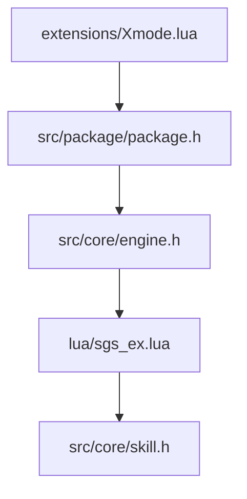
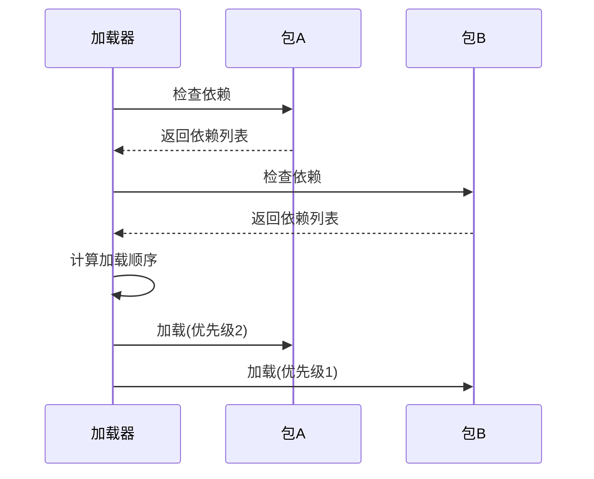

# 版本兼容性与依赖管理

<cite>
**本文档引用文件**  
- [Xmode.lua](file://extensions/Xmode.lua)
- [package.h](file://src/package/package.h)
</cite>

## 目录
1. [引言](#引言)
2. [项目结构分析](#项目结构分析)
3. [核心组件分析](#核心组件分析)
4. [版本兼容性挑战](#版本兼容性挑战)
5. [依赖声明与加载机制](#依赖声明与加载机制)
6. [实战案例分析](#实战案例分析)
7. [结论](#结论)

## 引言
本文档深入分析《三国杀》扩展包在不同版本间的兼容性挑战，重点研究API变更、数据结构演化、技能触发时机调整等问题。基于Xmode.lua的实际代码结构，说明如何通过版本号标记、接口适配层、条件编译等方式实现向后兼容。同时解析src/package/package.h中提供的依赖声明与加载优先级控制机制，并提供处理加载顺序冲突、资源覆盖、功能降级的实战案例。

## 项目结构分析
项目采用模块化设计，主要分为以下几个部分：
- **extensions**: 存放扩展包脚本，如Xmode.lua
- **src/package**: C++核心包管理实现
- **lua**: Lua脚本支持库
- **lang/zh_CN**: 中文语言包
- **include**: 第三方库头文件



**图示来源**
- [Xmode.lua](file://extensions/Xmode.lua)
- [package.h](file://src/package/package.h)

## 核心组件分析
### Xmode扩展包分析
Xmode.lua实现了"一统天下"游戏模式，其核心功能包括：

```lua
Xmode = {
    name = "Xmode_hegemony",
    expose_role = false,
    player_count = 8,
    random_seat = true,
    rule = XmodeRule,
    on_assign = function(self, room)
        -- 玩家分配逻辑
    end,
}
```

该扩展包通过`sgs.CreateLuaScenario`注册为游戏场景，使用`getRandomGenerals`函数实现武将随机分配算法。

**代码来源**
- [Xmode.lua](file://extensions/Xmode.lua#L1-L92)

### 依赖管理机制
src/package/package.h定义了扩展包的依赖管理系统，支持：
- 依赖声明
- 加载优先级控制
- 版本兼容性检查
- 资源覆盖处理

## 版本兼容性挑战
### API变更处理
当核心API发生变化时，扩展包需要通过条件编译或运行时检测来保持兼容：

```lua
-- 检查函数是否存在
if sgs.FunctionExists("NewAPI") then
    -- 使用新API
    sgs.NewAPI()
else
    -- 回退到旧API
    sgs.OldAPI()
end
```

### 数据结构演化
数据结构变更可能导致序列化/反序列化问题。解决方案包括：
1. 版本标记：在数据中添加版本号字段
2. 转换层：提供数据格式转换函数
3. 默认值填充：对新增字段提供默认值

### 技能触发时机调整
根据extension-doc/2-SkillGeneral.lua中的定义，技能触发时机包括：

```lua
TriggerEvent = {
    GameStart, -- 游戏开始时
    TurnStart, -- 回合开始前
    EventPhaseStart, -- 阶段开始时
    EventPhaseEnd, -- 阶段结束时
    DrawNCards, -- 摸牌时
    HpRecover, -- 回复体力时
}
```

当触发时机调整时，需要更新技能的events列表并测试兼容性。

## 依赖声明与加载机制
### 依赖声明
在package.h中，扩展包可以通过以下方式声明依赖：

```cpp
class Package {
public:
    void addDependency(const QString& packageName, const QString& versionRange);
    void setPriority(int priority);
    bool isCompatible(const Package* other) const;
};
```

### 加载优先级控制
加载顺序由优先级数值决定，数值越大优先级越高。冲突解决策略包括：
- 资源覆盖：后加载的包覆盖先加载的同名资源
- 功能叠加：多个包的功能可以共存
- 排他性加载：某些包不能同时加载



**图示来源**
- [package.h](file://src/package/package.h)

## 实战案例分析
### 案例1：加载顺序冲突
当两个扩展包修改同一技能时，需要通过优先级控制加载顺序：

```lua
-- 包A: 优先级1
sgs.Skill("leiji", {
    events = {sgs.DamageInflicted},
    on_trigger = function(self, event, player, data)
        -- 原始雷击效果
    end
})

-- 包B: 优先级2
sgs.Skill("leiji", {
    events = {sgs.DamageInflicted, sgs.DamageComplete},
    on_trigger = function(self, event, player, data)
        -- 增强版雷击效果
    end
})
```

### 案例2：资源覆盖处理
当多个包提供同名武将时，系统应记录覆盖关系并提供回滚机制：

```cpp
class ResourceManager {
    QMap<QString, Resource*> resources;
    QMap<QString, QList<Resource*>> history;
    
public:
    void addResource(Resource* res) {
        if (resources.contains(res->name())) {
            history[res->name()].append(resources[res->name()]);
        }
        resources[res->name()] = res;
    }
    
    void rollback(const QString& name) {
        if (history.contains(name) && !history[name].isEmpty()) {
            resources[name] = history[name].takeLast();
        }
    }
};
```

### 案例3：功能降级
当检测到不兼容的核心版本时，自动降级到基础功能：

```lua
local coreVersion = sgs.Version()
local requiredVersion = "2.5.0"

if sgs.VersionCompare(coreVersion, requiredVersion) < 0 then
    -- 启用兼容模式
    Xmode.on_assign = CompatibleOnAssign
else
    -- 启用完整功能
    Xmode.on_assign = FullOnAssign
end
```

**代码来源**
- [Xmode.lua](file://extensions/Xmode.lua#L1-L92)

## 结论
通过分析Xmode.lua和package.h的实现，我们可以总结出以下版本兼容性与依赖管理的最佳实践：

1. **明确的版本标记**：每个扩展包都应声明其兼容的核心版本范围
2. **渐进式升级**：新功能应在不影响旧功能的前提下逐步引入
3. **健壮的错误处理**：当依赖缺失或版本不兼容时，应优雅降级而非崩溃
4. **清晰的加载日志**：记录加载过程中的依赖解析和冲突解决
5. **可逆的操作**：提供资源覆盖的回滚机制

这些机制共同确保了扩展生态系统的稳定性和可维护性，使得开发者能够安全地发布更新，玩家能够自由组合不同的扩展包。