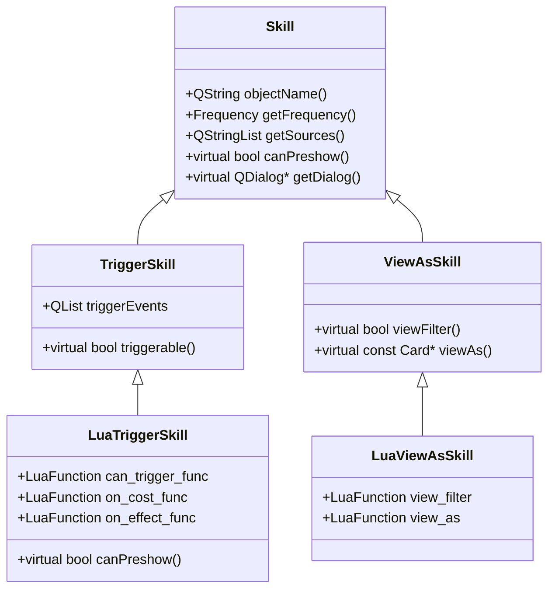
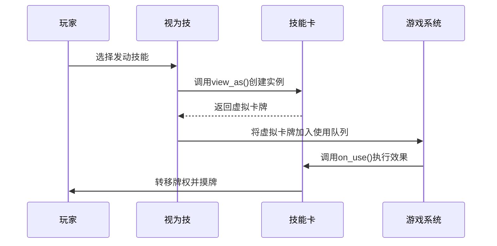

# 技能声明与注册

<cite>
**本文档引用文件**  
- [2-SkillGeneral.lua](file://extension-doc/2-SkillGeneral.lua)
- [skill.h](file://src/core/skill.h)
- [skill.cpp](file://src/core/skill.cpp)
- [lua-wrapper.h](file://src/core/lua-wrapper.h)
- [lua-wrapper.cpp](file://src/core/lua-wrapper.cpp)
- [sgs_ex.lua](file://lua/sgs_ex.lua)
- [qsanbutton.h](file://src/ui/qsanbutton.h)
- [qsanbutton.cpp](file://src/ui/qsanbutton.cpp)
</cite>

## 目录
1. [技能声明与注册](#技能声明与注册)  
2. [技能定义基础语法](#技能定义基础语法)  
3. [技能分类与触发时机](#技能分类与触发时机)  
4. [C++层技能类结构解析](#c层技能类结构解析)  
5. [技能ID与国际化处理](#技能id与国际化处理)  
6. [技能分类标签实现](#技能分类标签实现)  
7. [技能卡机制详解](#技能卡机制详解)  
8. [注册实践建议与常见错误](#注册实践建议与常见错误)  
9. [正确与错误的声明示例](#正确与错误的声明示例)

## 技能定义基础语法

在《神杀》系统中，所有技能均通过 `sgs.CreateXXXSkill` 系列函数在 Lua 脚本中声明。技能定义采用 Lua 表（table）语法，通过键值对配置技能元数据。

核心声明语法如下：

```lua
thetrigger = sgs.CreateTriggerSkill{
    name = "thetrigger",
    events = {sgs.EventPhaseStart},
    can_trigger = function(self, event, room, player, data)
        -- 判断是否可触发
        return player:objectName() == "target_player"
    end,
    on_cost = function(self, event, room, player, data)
        -- 触发代价
        return true
    end,
    on_effect = function(self, event, room, player, data)
        -- 技能效果
        room:drawCards(player, 1)
        return false
    end,
}
```

### 关键字段说明

- **name**: 字符串类型，表示技能名称。无默认值，不能为空。该名称将作为技能的唯一标识符（ID），必须全局唯一。
- **relate_to_place**: 字符串类型，表示技能归属位置。可选值为 `"head"`（主将技）、`"deputy"`（副将技），若不设置则为主副将共有技能。

**Section sources**
- [2-SkillGeneral.lua](file://extension-doc/2-SkillGeneral.lua#L1-L30)

## 技能分类与触发时机

《神杀》系统将技能分为多种类型，每种类型对应不同的基类和注册函数：

| 技能类型 | 特点 | Lua 创建函数 |
|--------|------|-------------|
| 视为技 | 可将某牌当作另一牌使用（如龙胆、武圣） | `sgs.CreateViewAsSkill` |
| 触发技 | 在特定时机自动或手动触发（如奸雄、反馈） | `sgs.CreateTriggerSkill` |
| 距离技 | 修改角色间距离（如马术、飞影） | `sgs.CreateDistanceSkill` |
| 手牌上限技 | 修改角色手牌上限（如横江） | `sgs.CreateMaxCardsSkill` |
| 目标修改技 | 修改卡牌使用次数、目标数或距离限制（如咆哮） | `sgs.CreateTargetModSkill` |

### 触发时机（TriggerEvent）

触发技依赖于精确的触发时机，系统定义了丰富的事件枚举：

```lua
TriggerEvent = {
    GameStart,          -- 游戏开始时
    TurnStart,          -- 回合开始前
    EventPhaseStart,    -- 阶段开始时
    EventPhaseEnd,      -- 阶段结束时
    EventPhaseChanging, -- 阶段转换时
    DamageInflicted,    -- 受到伤害时
    Damaged,            -- 受到伤害后
    Death,              -- 死亡时
    ...
}
```

开发者需根据技能逻辑选择合适的时机。例如，`克己` 使用 `EventPhaseChanging` 时机来判断回合结束。

**Section sources**
- [2-SkillGeneral.lua](file://extension-doc/2-SkillGeneral.lua#L35-L163)

## C++层技能类结构解析

Lua 层声明的技能最终由 C++ 的 `Skill` 类及其派生类解析和存储。

### Skill 基类结构

```cpp
class Skill : public QObject {
    Q_OBJECT
public:
    enum Frequency { NotFrequent, Frequent, Compulsory, Limited, Wake, Rookie };
    enum SkillType { Trigger, ViewAs, Distance, MaxCards, TargetMod, AttackRange, Filter, Recast };

    Skill(const QString &name, Frequency frequency = NotFrequent);
    virtual ~Skill();

    QString objectName() const; // 返回技能ID（即name）
    Frequency getFrequency() const; // 获取技能频率
    QStringList getSources() const; // 获取音效资源

    // 虚函数，由Lua子类重写
    virtual bool canPreshow() const;
    virtual QDialog *getDialog() const;
    virtual QString getGuhuoBox() const;

private:
    Frequency frequency;
    QStringList sources;
    QString limit_mark;
};
```

### Lua 技能包装类

C++ 为每种技能类型提供了 Lua 包装类，如 `LuaTriggerSkill`、`LuaViewAsSkill` 等。这些类继承自 `Skill`，并持有 Lua 函数指针：

```cpp
class LuaTriggerSkill : public TriggerSkill {
    Q_OBJECT
public:
    LuaTriggerSkill(const char *name, const QList<TriggerEvent> &events);

    virtual int getPriority() const;
    virtual bool triggerable(const ServerPlayer *target) const;
    virtual bool canPreshow() const;

    LuaFunction can_trigger_func;
    LuaFunction on_cost_func;
    LuaFunction on_effect_func;
};
```

当 Lua 调用 `sgs.CreateTriggerSkill` 时，C++ 层会创建 `LuaTriggerSkill` 实例，并将 Lua 函数绑定到对应的 `LuaFunction` 成员上。



**Diagram sources**
- [skill.h](file://src/core/skill.h#L1-L100)
- [lua-wrapper.h](file://src/core/lua-wrapper.h#L1-L100)

**Section sources**
- [skill.h](file://src/core/skill.h#L1-L200)
- [skill.cpp](file://src/core/skill.cpp#L1-L100)

## 技能ID与国际化处理

### 技能ID生成机制

技能ID直接来源于 Lua 定义中的 `name` 字段。系统要求该名称必须唯一，否则会导致注册冲突。ID 通常为英文小写字符串（如 `"longdan"`）。

### 国际化名称处理

技能的显示名称（中文、英文等）不存储在代码中，而是通过语言文件进行映射。例如，在 `lang/zh_CN/Common.lua` 中定义：

```lua
sgs.Sanguosha:addTranslation("zh_CN", {
    ["longdan"] = "龙胆",
    ["wusheng"] = "武圣"
})
```

游戏运行时，系统根据当前语言环境，通过技能ID查找对应的本地化名称。

**Section sources**
- [2-SkillGeneral.lua](file://extension-doc/2-SkillGeneral.lua#L1-L30)
- [skill.cpp](file://src/core/skill.cpp#L183-L238)

## 技能分类标签实现

技能的分类标签（如主动、被动）在 UI 层通过 `QSanSkillButton` 类实现。

### 按钮类型映射

```cpp
// qsanbutton.h
QString QSanSkillButton::getSkillTypeString(SkillType type) {
    QString arg1;
    if (type == S_SKILL_ONEOFF_SPELL) arg1 = "oneoff";
    else if (type == S_SKILL_PROACTIVE) arg1 = "proactive"; // 主动技
    else if (type == S_SKILL_AWAKEN) arg1 = "awaken";       // 觉醒技
    else if (type == S_SKILL_ATTACHEDLORD) arg1 = "attachedlord";
    return arg1;
}
```

### 事件处理

当玩家点击技能按钮时，`QSanSkillButton::onMouseClick()` 会触发信号：

```cpp
void QSanSkillButton::onMouseClick() {
    if (_m_skill == NULL) return;

    if ((_m_style == S_STYLE_TOGGLE && isDown() && _m_emitActivateSignal) || _m_style == S_STYLE_PUSH) {
        emit skill_activated();        // 发出技能激活信号
        emit skill_activated(_m_skill); // 携带技能对象
    }
}
```

该信号被上层逻辑捕获，进而调用技能的 `view_as` 或 `on_cost` 等函数。

**Section sources**
- [qsanbutton.h](file://src/ui/qsanbutton.h#L155-L198)
- [qsanbutton.cpp](file://src/ui/qsanbutton.cpp#L274-L312)

## 技能卡机制详解

技能卡（SkillCard）是一种虚拟卡牌，用于实现无固定时机的技能效果（如仁德、制衡）。

### Lua 层创建

```lua
function sgs.CreateSkillCard(spec)
    local card = sgs.LuaSkillCard(spec.name, spec.skill_name)
    card:setTargetFixed(spec.target_fixed or false)
    card:setWillThrow(spec.will_throw or true)
    card.filter = spec.filter
    card.on_use = spec.on_use
    card.on_effect = spec.on_effect
    return card
end
```

### C++ 层结构

```cpp
class LuaSkillCard : public SkillCard {
    Q_OBJECT
public:
    LuaSkillCard(const char *name, const char *skillName);
    LuaSkillCard *clone() const;

    void setTargetFixed(bool fixed) { target_fixed = fixed; }
    void setWillThrow(bool throw) { will_throw = throw; }

    LuaFunction filter;
    LuaFunction feasible;
    LuaFunction on_use;
    LuaFunction on_effect;
};
```

技能卡通过 `ViewAsSkill` 被“视为”使用。例如，`仁德` 技能允许玩家将任意手牌当作 `RendeCard` 使用。



**Diagram sources**
- [sgs_ex.lua](file://lua/sgs_ex.lua#L269-L320)
- [lua-wrapper.h](file://src/core/lua-wrapper.h#L241-L294)
- [lua-wrapper.cpp](file://src/core/lua-wrapper.cpp#L80-L130)

**Section sources**
- [5-SkillCard.lua](file://extension-doc/5-SkillCard.lua#L0-L19)
- [sgs_ex.lua](file://lua/sgs_ex.lua#L269-L320)
- [lua-wrapper.cpp](file://src/core/lua-wrapper.cpp#L80-L255)

## 注册实践建议与常见错误

### 实践建议

1. **命名唯一性**：确保 `name` 字段全局唯一，建议使用项目前缀（如 `mylord_longdan`）。
2. **避免循环引用**：在 `on_effect` 中谨慎调用其他技能，防止无限递归。
3. **资源管理**：及时释放 `subcards`，避免内存泄漏。
4. **性能优化**：复杂计算避免在 `can_trigger` 中进行。

### 常见错误

- **注册失败**：`name` 为空或重复。
- **无法触发**：`events` 列表为空或时机错误。
- **效果不执行**：`on_effect` 函数未返回 `false`（表示技能已消耗）。
- **音效缺失**：未在 `hero-skin/` 目录下放置对应音效文件。

**Section sources**
- [2-SkillGeneral.lua](file://extension-doc/2-SkillGeneral.lua#L1-L163)

## 正确与错误的声明示例

### 正确示例

```lua
-- 正确：完整的触发技声明
local yingzi = sgs.CreateTriggerSkill{
    name = "yingzi",
    events = {sgs.DrawNCards},
    can_trigger = function(self, event, room, player, data)
        return player and player:isMale() -- 限定男性角色
    end,
    on_effect = function(self, event, room, player, data)
        local n = data:toInt()
        data:setValue(n + 1) -- 摸牌数+1
        return false
    end
}
```

### 错误示例

```lua
-- 错误：缺少name字段
local bad_skill = sgs.CreateTriggerSkill{
    events = {sgs.TurnStart},
    on_effect = function(self, event, room, player, data)
        room:loseHp(player, 1)
        return false
    end
} -- 注册将失败

-- 错误：on_effect未返回值
local bad_effect = sgs.CreateTriggerSkill{
    name = "bad_effect",
    events = {sgs.Damaged},
    on_effect = function(self, event, room, player, data)
        room:drawCards(player, 1)
        -- 缺少 return false
    end
} -- 技能可能被重复触发
```

**Section sources**
- [2-SkillGeneral.lua](file://extension-doc/2-SkillGeneral.lua#L1-L163)