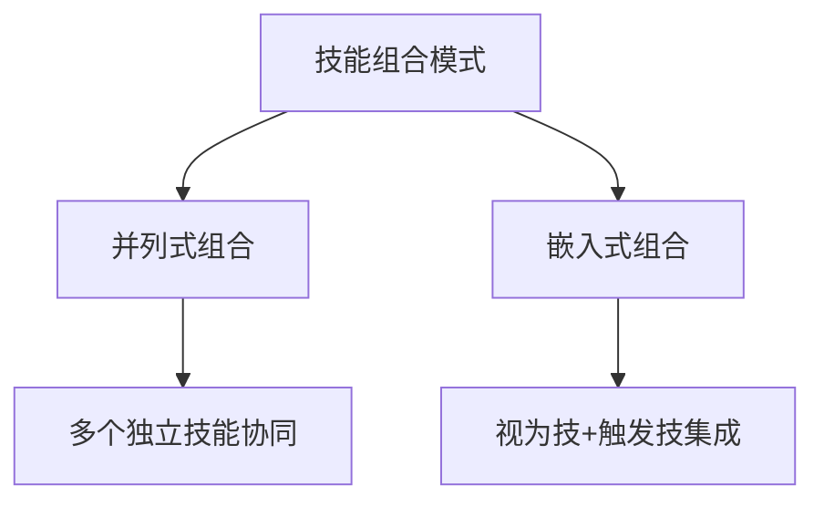
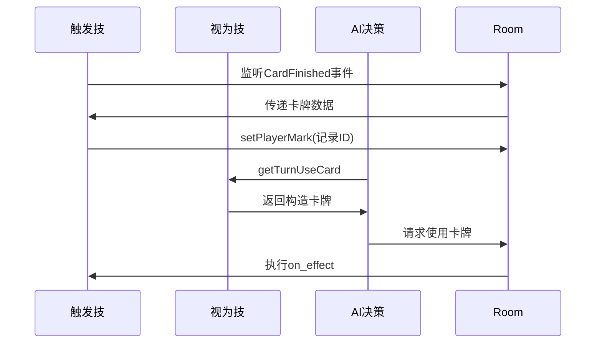

# 技能组合模式

<cite>
**本文档引用的文件**  
- [17-Example.lua](file://extension-doc/17-Example.lua#L0-L88)
- [6-Applications.lua](file://extension-doc/6-Applications.lua#L0-L230)
- [skill.cpp](file://src/core/skill.cpp#L183-L238)
- [skill.cpp](file://src/core/skill.cpp#L568-L603)
- [room.cpp](file://src/server/room.cpp#L733-L767)
- [roomthread.cpp](file://src/server/roomthread.cpp#L332-L347)
</cite>

## 目录
1. [引言](#引言)
2. [技能组合设计模式概述](#技能组合设计模式概述)
3. [并列式技能组合](#并列式技能组合)
4. [嵌入式技能组合](#嵌入式技能组合)
5. [实战案例解析：义舍技能](#实战案例解析：义舍技能)
6. [依赖关系与策略链构建](#依赖关系与策略链构建)
7. [循环引用与死锁风险规避](#循环引用与死锁风险规避)
8. [性能监控与瓶颈定位](#性能监控与瓶颈定位)
9. [单元测试框架建议](#单元测试框架建议)
10. [平衡性调整与热更新设计](#平衡性调整与热更新设计)

## 引言
在《三国杀》类卡牌游戏中，技能系统是核心玩法之一。随着游戏复杂度提升，单一技能已难以满足设计需求，必须通过多种技能组合模式实现复杂的交互逻辑。本文档基于 `QSanguosha-For-Hegemony-xxyheaven` 项目中的实际代码，系统总结常见的技能组合设计模式，包括联动触发、条件互斥、状态叠加等，并结合 `17-Example.lua` 中的实战案例深入解析其实现要点。

**Section sources**  
- [17-Example.lua](file://extension-doc/17-Example.lua#L0-L88)

## 技能组合设计模式概述
技能组合是指将多个基础技能通过特定方式组合，形成具有复合效果的高级技能机制。主要分为两大类：**并列式组合**和**嵌入式组合**。每种模式适用于不同的设计场景，合理选择可显著提升代码可维护性和扩展性。



**Diagram sources**  
- [6-Applications.lua](file://extension-doc/6-Applications.lua#L0-L29)

## 并列式技能组合
并列式组合指多个技能并行存在，各自负责不同功能，通过技能关联机制统一管理。典型应用场景为一个技能包含多个独立效果（如手牌上限与攻击范围同时变化）。

### 实现要点
- 每个子技能独立定义，职责清晰
- 使用 `sgs.insertRelatedSkills` 建立主从关系
- 隐藏技能名称以 `#` 开头，避免界面显示

#### 示例：奇心技能
```lua
devQixin = sgs.CreateMaxCardsSkill{
    name = "devQixin",
    extra_func = function(self, target)
        if target:hasSkill(self:objectName()) then
            return target:getHp()
        end
    end
}

devQixinAttackRange = sgs.CreateAttackRangeSkill{
    name = "#devQixin_attack",
    extra_func = function(self, target)
        if target:hasSkill(self:objectName()) then
            return target:getLostHp()
        end
    end
}

sgs.insertRelatedSkills(extension, "devQixin", "#devQixin_attack")
```

上述代码实现了“奇心”技能的两个效果：手牌上限等于当前体力值，攻击范围等于损失体力值。两个技能通过 `insertRelatedSkills` 关联，确保逻辑一致性。

**Section sources**  
- [6-Applications.lua](file://extension-doc/6-Applications.lua#L0-L29)

## 嵌入式技能组合
嵌入式组合通常由一个**视为技（ViewAsSkill）** 和一个**触发技（TriggerSkill）** 构成，通过 `view_as_skill` 成员连接，形成闭环逻辑。适用于需要动态生成卡牌或响应特定事件的复杂技能。

### 实现要点
- 视为技负责卡牌构造逻辑
- 触发技监听事件并设置状态
- 使用 `Mark` 或 `Tag` 在技能间传递数据

#### 示例：奸雄技能
```lua
devJiaoxiongVS = sgs.CreateViewAsSkill{
    name = "devJiaoxiong",
    view_as = function(self, cards)
        local card = sgs.Sanguosha:cloneCard(sgs.Sanguosha:getCard(player:getMark(self:objectName())):objectName())
        card:addSubcard(cards[1]:getId())
        card:setSkillName(self:objectName())
        return card
    end
}

devJiaoxiong = sgs.CreateTriggerSkill{
    name = "devJiaoxiong",
    view_as_skill = devJiaoxiongVS,
    events = {sgs.CardFinished},
    can_trigger = function(self, event, room, player, data)
        if event == sgs.CardFinished then
            local card = data:toCardUse().card
            if not card:isKindOf("EquipCard") then
                room:setPlayerMark(player, self:objectName(), card:getId())
            end
        end
        return ""
    end
}
```

该模式通过 `CardFinished` 事件记录上次使用的基本牌ID，并在视为技中克隆该牌，实现“将一张牌当作上一张使用的牌使用”的效果。

**Section sources**  
- [6-Applications.lua](file://extension-doc/6-Applications.lua#L50-L100)

## 实战案例解析：义舍技能
以 `17-Example.lua` 中的“义舍”技能为例，展示复杂技能的完整实现流程。

### 功能分析
义舍技能包含两种操作：
1. 将手牌（优先【屎】牌）放入“米”堆，最多5张
2. 回合内未使用时，可将“米”堆所有牌收回手牌

此外，还涉及“义舍要牌”请求的响应逻辑。

### 核心实现
```lua
-- 注册义舍技能
local yishe_skill = {name = "yishe"}
table.insert(sgs.ai_skills, yishe_skill)

yishe_skill.getTurnUseCard = function(self)
    return sgs.Card_Parse("@YisheCard=.")
end

sgs.ai_skill_use_func.YisheCard = function(card, use, self)
    if self.player:getPile("rice"):isEmpty() then
        -- 放入“米”堆逻辑
        local usecards = {}
        for _, card in ipairs(self.player:getHandcards()) do
            if card:inherits("Shit") then table.insert(usecards, card:getId()) end
        end
        local discards = self:askForDiscard("gamerule", math.min(self:getOverflow(), 5 - #usecards))
        for _, card in ipairs(discards) do table.insert(usecards, card) end
        if #usecards > 0 then
            use.card = sgs.Card_Parse("@YisheCard=" .. table.concat(usecards, "+"))
        end
    else
        -- 收回“米”堆逻辑
        if not self.player:hasUsed("YisheCard") then use.card = card return end
    end
end
```

### 义舍要牌响应
通过全局标志 `yisheasksource` 记录请求来源，并在 `ai_skill_choice` 中判断是否为友方：
```lua
sgs.ai_skill_choice.yisheask = function(self, choices)
    assert(sgs.yisheasksource)
    return self:isFriend(sgs.yisheasksource) and "allow" or "disallow"
end
```

此案例展示了**状态叠加**（“米”堆管理）与**条件互斥**（仅未使用时可收回）的综合运用。

**Section sources**  
- [17-Example.lua](file://extension-doc/17-Example.lua#L0-L88)

## 依赖关系与策略链构建
技能间的依赖关系是构建复杂策略链的基础。可通过以下方式建立依赖：

### 依赖类型
- **数据依赖**：通过 `setPlayerMark`、`tag` 传递状态
- **事件依赖**：监听 `CardFinished`、`PhaseStart` 等事件
- **逻辑依赖**：前置技能成功后才触发后续技能

### 策略链示例


**Diagram sources**  
- [17-Example.lua](file://extension-doc/17-Example.lua#L40-L60)
- [6-Applications.lua](file://extension-doc/6-Applications.lua#L80-L100)

## 循环引用与死锁风险规避
不当的技能组合可能导致循环引用或死锁，需注意以下几点：

### 风险场景
- 技能A触发技能B，技能B又反过来触发技能A
- 多个技能同时监听同一事件且无明确优先级
- 使用 `hasUsed` 判断时未正确重置状态

### 规避策略
1. **明确触发顺序**：通过 `insertPriority` 设置技能优先级
2. **状态隔离**：使用独立的 `Mark` 或 `Tag` 避免状态污染
3. **使用限制**：通过 `hasUsed` 或计数器限制技能使用次数
4. **避免递归调用**：在 `on_effect` 中避免再次触发同类技能

```cpp
// C++层技能触发顺序控制
void RoomThread::addPlayerSkills(ServerPlayer *player, bool invoke_game_start)
{
    foreach (const TriggerSkill *skill, player->getTriggerSkills()) {
        // 按优先级排序
        skill->insertPriority(sgs.EventPhaseStart, 1.0);
    }
}
```

**Section sources**  
- [roomthread.cpp](file://src/server/roomthread.cpp#L332-L347)
- [skill.cpp](file://src/core/skill.cpp#L568-L603)

## 性能监控与瓶颈定位
复杂技能组合可能带来性能开销，需建立监控机制。

### 关键指标
- **技能触发频率**：统计每回合平均触发次数
- **AI决策耗时**：记录 `getTurnUseCard` 执行时间
- **内存占用**：监控 `Mark`、`Tag` 的数量增长

### 瓶颈定位方法
1. **日志追踪**：在关键函数入口输出调试信息
2. **断点分析**：使用 `assert` 验证状态合法性
3. **性能采样**：定期记录技能执行时间

```lua
-- 示例：添加性能日志
sgs.ai_skill_use_func.YisheCard = function(card, use, self)
    local start_time = os.clock()
    -- ...技能逻辑...
    Global_room:writeToConsole("义舍技能耗时: " .. (os.clock() - start_time))
end
```

**Section sources**  
- [17-Example.lua](file://extension-doc/17-Example.lua#L40-L60)

## 单元测试框架建议
为确保技能组合的稳定性，应建立自动化测试框架。

### 测试维度
- **功能测试**：验证技能效果是否符合预期
- **边界测试**：测试空手牌、满牌堆等极端情况
- **交互测试**：验证与其他技能的兼容性

### 测试代码结构
```lua
-- test_yishe.lua
function test_yishe_put_rice()
    local player = createPlayer()
    player:addHandCard(ShitCard())
    player:useSkill("yishe")
    assert(player:getPile("rice"):length() == 1)
end

function test_yishe_draw_rice()
    local player = createPlayer()
    player:addToPile("rice", {card1, card2})
    player:useSkill("yishe")
    assert(player:getHandcardNum() == 2)
end
```

推荐使用 `luaunit` 或自定义测试框架集成到构建流程中。

## 平衡性调整与热更新设计
为支持后期迭代，技能设计需预留调整接口。

### 平衡性接口
- 可配置参数：通过 `value_config.lua` 定义数值
- 条件开关：使用 `getFrequency()` 控制技能频率
- 动态权重：在AI中通过 `extra_func` 返回可变值

### 热更新能力
- **Lua脚本热加载**：修改 `.lua` 文件后无需重启服务
- **配置热生效**：监听配置文件变化并动态更新
- **技能重载**：提供 `reloadSkill` 接口重新注册技能

```lua
-- 示例：热更新支持
function reloadYisheSkill()
    sgs.removeSkill("yishe")
    loadfile("extension-doc/17-Example.lua")()
    sgs.addSkill(yishe_skill)
end
```

通过合理设计，可实现技能逻辑的在线调整，极大提升开发与运营效率。

**Section sources**  
- [value_config.lua](file://extension-doc/value_config.lua)
- [17-Example.lua](file://extension-doc/17-Example.lua)