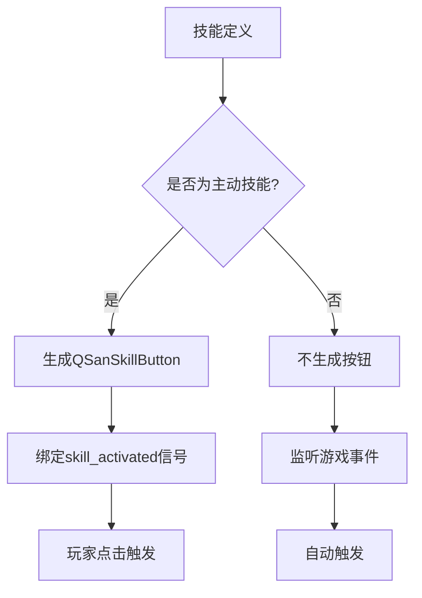
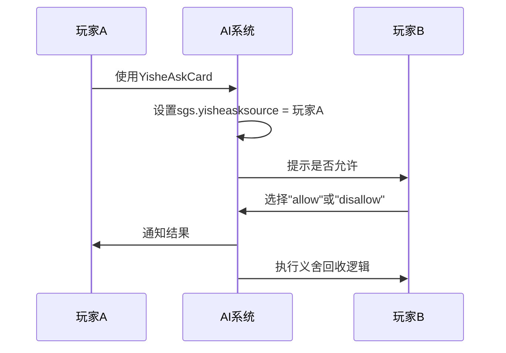

# 技能绑定与组合

<cite>
**本文档引用文件**   
- [17-Example.lua](file://extension-doc/17-Example.lua)
- [skill.h](file://src/core/skill.h)
- [player.h](file://src/core/player.h)
- [lua-wrapper.h](file://src/core/lua-wrapper.h)
- [qsanbutton.h](file://src/ui/qsanbutton.h)
- [room.cpp](file://src/server/room.cpp)
- [serverplayer.cpp](file://src/server/serverplayer.cpp)
- [sgs_ex.lua](file://lua/sgs_ex.lua)
</cite>

## 目录
1. [技能绑定机制概述](#技能绑定机制概述)
2. [技能列表声明与注册](#技能列表声明与注册)
3. [技能继承与同名覆盖规则](#技能继承与同名覆盖规则)
4. [技能初始化与运行时管理](#技能初始化与运行时管理)
5. [被动技能与主动技能的差异处理](#被动技能与主动技能的差异处理)
6. [技能触发优先级与状态持久化](#技能触发优先级与状态持久化)
7. [技能组合逻辑与实例分析](#技能组合逻辑与实例分析)
8. [性能优化与冲突规避建议](#性能优化与冲突规避建议)

## 技能绑定机制概述

在《三国杀》扩展框架中，技能（Skill）是武将（General）行为逻辑的核心载体。技能通过绑定机制与武将关联，并在游戏运行时由Player对象进行激活与管理。技能系统支持多种类型，包括触发技（TriggerSkill）、视为技（ViewAsSkill）、锁定技、觉醒技等，每种技能类型具有不同的触发条件和执行逻辑。

技能绑定过程涉及Lua脚本层与C++核心引擎的协同工作。Lua负责定义技能逻辑和注册，C++层则负责技能对象的创建、状态维护和事件分发。整个系统通过`sgs.ai_skills`等全局表进行技能注册，并通过Player对象的技能列表进行管理和调用。

**Section sources**
- [17-Example.lua](file://extension-doc/17-Example.lua#L1-L88)
- [skill.h](file://src/core/skill.h#L82-L129)

## 技能列表声明与注册

技能的声明与注册是技能绑定的第一步。在Lua脚本中，技能通常以表（table）的形式定义，并通过`table.insert(sgs.ai_skills, skill)`将其注册到全局技能列表中。

以`extension-doc/17-Example.lua`中的“义舍”技能为例：

```lua
local yishe_skill = {name = "yishe"}
table.insert(sgs.ai_skills, yishe_skill)
```

该代码创建了一个名为`yishe_skill`的表，并将其插入`sgs.ai_skills`全局列表。`name`字段是技能的唯一标识符，用于在系统中查找和引用该技能。

注册后的技能可以通过`getTurnUseCard`等函数定义其行为。例如，`yishe_skill.getTurnUseCard`定义了该技能在回合内可使用的卡牌：

```lua
yishe_skill.getTurnUseCard = function(self)
    return sgs.Card_Parse("@YisheCard=.")
end
```

此函数返回一个解析后的技能卡对象，表示该技能可以被当作“义舍卡”使用。

**Section sources**
- [17-Example.lua](file://extension-doc/17-Example.lua#L1-L10)
- [sgs_ex.lua](file://lua/sgs_ex.lua#L578-L619)

## 技能继承与同名覆盖规则

技能系统支持继承机制，允许新技能复用已有技能的属性和方法。在C++层面，`ViewAsSkill`、`TriggerSkill`等基类提供了通用接口，Lua层通过函数重写实现具体逻辑。

同名技能的覆盖规则遵循“后注册覆盖先注册”的原则。当两个技能具有相同的`name`字段时，后注册的技能会覆盖先注册的技能。这一机制允许开发者在不修改原技能的情况下进行功能扩展或修正。

例如，若需修改“义舍”技能的行为，可重新定义`yishe_skill`并再次注册：

```lua
local yishe_skill = {name = "yishe"}
yishe_skill.getTurnUseCard = function(self)
    -- 新的逻辑
end
table.insert(sgs.ai_skills, yishe_skill) -- 覆盖原有技能
```

需要注意的是，覆盖操作会影响所有使用该技能的武将，因此应谨慎使用。

**Section sources**
- [skill.h](file://src/core/skill.h#L82-L129)
- [lua-wrapper.h](file://src/core/lua-wrapper.h#L149-L197)

## 技能初始化与运行时管理

技能在运行时由Player对象进行管理。Player类通过`getSkillList()`、`hasSkill()`等方法维护其技能集合。当武将被创建或更换时，`ServerPlayer::sendSkillsToOthers()`会将技能同步给其他玩家。

```cpp
void ServerPlayer::sendSkillsToOthers(bool head_skill /* = true */)
{
    const QList<const Skill *> skills = head_skill ? getHeadSkillList() : getDeputySkillList();
    foreach (const Skill *skill, skills) {
        // 发送技能添加事件
        room->doBroadcastNotify(QSanProtocol::S_COMMAND_LOG_EVENT, args);
    }
}
```

技能的激活通过UI按钮触发。`QSanSkillButton`类负责技能按钮的渲染和事件处理。当玩家点击技能按钮时，`onMouseClick()`会发射`skill_activated`信号，进而调用技能的执行逻辑。

```cpp
void QSanSkillButton::onMouseClick()
{
    if (_m_skill == NULL) return;
    if ((_m_style == S_STYLE_TOGGLE && isDown() && _m_emitActivateSignal) || _m_style == S_STYLE_PUSH) {
        emit skill_activated();
        emit skill_activated(_m_skill);
    }
}
```

**Section sources**
- [serverplayer.cpp](file://src/server/serverplayer.cpp#L2095-L2134)
- [qsanbutton.cpp](file://src/ui/qsanbutton.cpp#L274-L312)
- [qsanbutton.h](file://src/ui/qsanbutton.h#L155-L198)

## 被动技能与主动技能的差异处理

被动技能与主动技能在触发机制和UI表现上存在显著差异。

**被动技能**（如“锁定技”）无需玩家主动触发，通常在特定游戏事件发生时自动响应。其`frequency`属性为`Skill_Wake`或`Skill_Compulsory`，且不生成UI按钮。系统通过`triggerable()`方法判断是否满足触发条件：

```cpp
virtual bool triggerable(const ServerPlayer *target) const;
```

**主动技能**（如“回合技”）需玩家手动激活，通常在回合内通过按钮使用。其`getTurnUseCard`函数定义了可使用的卡牌类型，且`response_or_use`属性决定其是否可用于响应。

在UI层面，主动技能会生成`QSanSkillButton`按钮，而被动技能则不会。按钮类型由`SkillType`枚举决定，如`S_SKILL_PROACTIVE`表示主动技，`S_SKILL_AWAKEN`表示觉醒技。



**Diagram sources**
- [qsanbutton.h](file://src/ui/qsanbutton.h#L155-L198)
- [skill.h](file://src/core/skill.h#L476-L507)

**Section sources**
- [skill.h](file://src/core/skill.h#L82-L129)
- [qsanbutton.cpp](file://src/ui/qsanbutton.cpp#L274-L312)

## 技能触发优先级与状态持久化

技能触发优先级由`frequency`属性和技能注册顺序共同决定。高优先级技能（如“锁定技”）优先于普通技能触发。当多个技能可触发时，系统按注册顺序提示玩家选择。

状态持久化通过Player对象的标记（flag）和牌堆（pile）实现。例如，“义舍”技能使用`rice`牌堆存储“米”牌：

```lua
if self.player:getPile("rice"):isEmpty() then
    -- 处理加入“米”牌逻辑
else
    -- 处理回收“米”牌逻辑
end
```

AI决策状态通过全局标志位管理，如`sgs.ai_global_flags`：

```lua
table.insert(sgs.ai_global_flags, "yisheasksource")
```

这些状态在回合结束时自动清理，确保技能状态的正确性。

**Section sources**
- [17-Example.lua](file://extension-doc/17-Example.lua#L30-L31)
- [skill.h](file://src/core/skill.h#L82-L129)

## 技能组合逻辑与实例分析

以“义舍”技能为例，分析技能组合的完整逻辑结构。

“义舍”包含两个子技能：`yishe`（义舍）和`yisheask`（义舍要牌）。前者允许玩家将手牌放入“米”堆或回收，后者允许向拥有“义舍”的玩家请求牌。

```lua
sgs.ai_skill_use_func.YisheCard = function(card, use, self)
    if self.player:getPile("rice"):isEmpty() then
        -- 加入手牌到“米”堆
    else
        -- 回收“米”堆牌
        if not self.player:hasUsed("YisheCard") then
            use.card = card
        end
    end
end
```

AI通过`sgs.ai_skill_choice.yisheask`决定是否允许请求：

```lua
sgs.ai_skill_choice.yisheask = function(self, choices)
    if self:isFriend(sgs.yisheasksource) then
        return "allow"
    else
        return "disallow"
    end
end
```

该设计体现了技能间的协同：`yisheask`触发后，`yishe`决定是否响应，形成完整的技能链。



**Diagram sources**
- [17-Example.lua](file://extension-doc/17-Example.lua#L1-L88)

**Section sources**
- [17-Example.lua](file://extension-doc/17-Example.lua#L1-L88)

## 性能优化与冲突规避建议

为避免技能冲突和性能瓶颈，建议遵循以下实践：

1. **避免频繁注册同名技能**：重复注册会导致技能覆盖，可能引发意外行为。
2. **合理使用全局标志位**：过多的全局状态会增加内存开销和逻辑复杂度。
3. **优化技能触发条件**：在`triggerable()`中尽早返回`false`，减少不必要的计算。
4. **减少跨技能依赖**：复杂的技能链会增加调试难度，建议保持技能独立性。
5. **使用`qlist`辅助函数**：如`sgs.qlist()`可高效遍历QList，提升性能。

```lua
for _, player in sgs.qlist(self.room:getOtherPlayers(self.player)) do
    -- 高效遍历
end
```

6. **明确技能作用范围**：通过`setRelateToPlace()`限定技能影响区域，避免全图扫描。

通过以上措施，可确保技能系统高效、稳定运行。

**Section sources**
- [17-Example.lua](file://extension-doc/17-Example.lua#L45-L50)
- [sgs_ex.lua](file://lua/sgs_ex.lua#L578-L619)