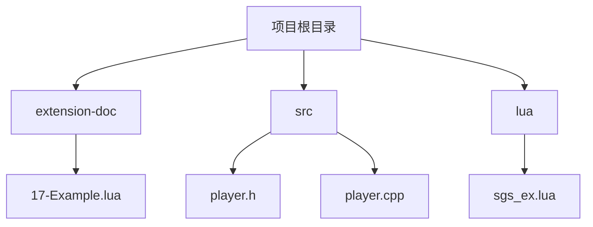
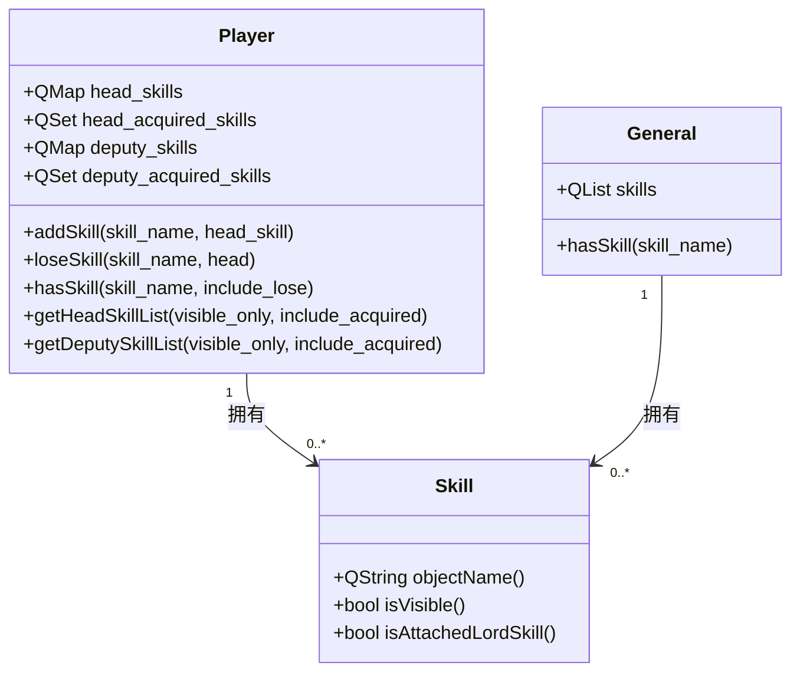
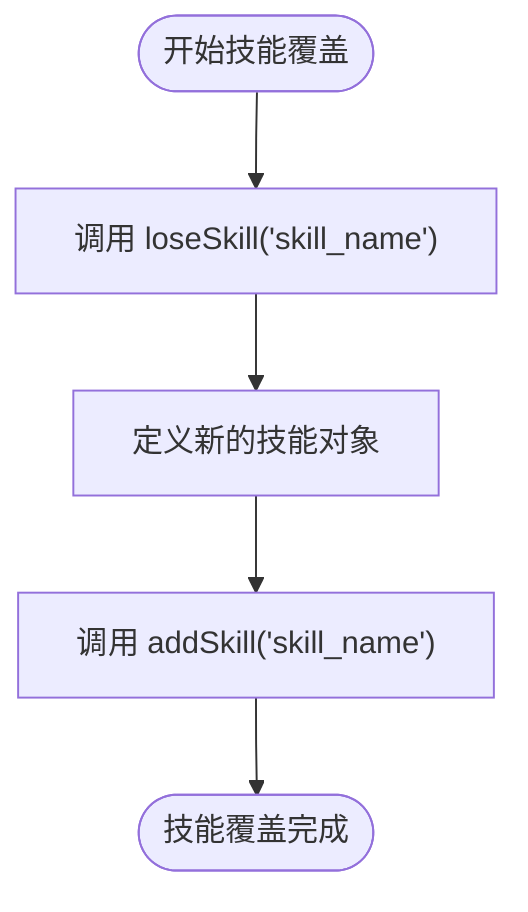
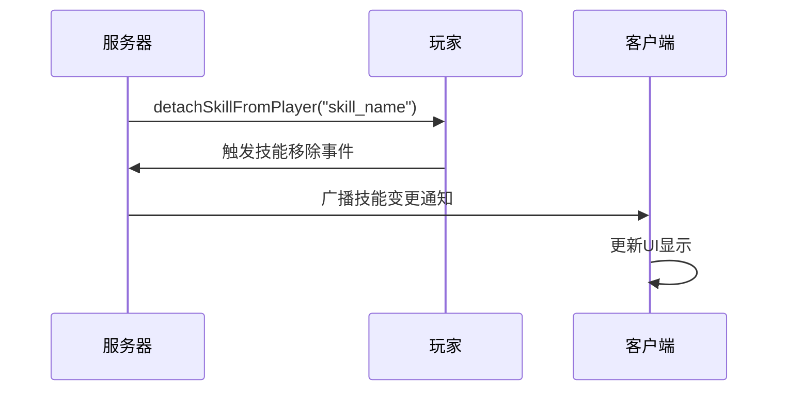
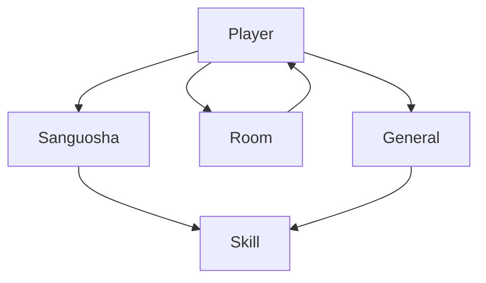

# 技能继承与覆盖

<cite>
**本文档引用文件**  
- [17-Example.lua](file://extension-doc/17-Example.lua)
- [player.h](file://src/core/player.h)
- [player.cpp](file://src/core/player.cpp)
- [room.cpp](file://src/server/room.cpp)
- [serverplayer.cpp](file://src/server/serverplayer.cpp)
</cite>

## 目录
1. [引言](#引言)
2. [项目结构](#项目结构)
3. [核心组件](#核心组件)
4. [架构概述](#架构概述)
5. [详细组件分析](#详细组件分析)
6. [依赖分析](#依赖分析)
7. [性能考量](#性能考量)
8. [故障排除指南](#故障排除指南)
9. [结论](#结论)

## 引言
本文档深入分析《三国杀》游戏中武将技能的继承与覆盖机制。基于 `17-Example.lua` 中的“义舍”技能实例，详细阐述子类武将如何继承父类技能并进行扩展或重写，解释同名技能的覆盖规则及其在运行时的优先级判定逻辑。结合 `Player` 类的技能管理方法，说明技能继承链的构建过程和内存布局，并讨论多层继承可能引发的性能开销及优化建议。

## 项目结构
项目采用模块化设计，主要分为 `extension-doc`（扩展文档与示例）、`src`（核心C++源码）、`lua`（AI与脚本逻辑）等目录。技能相关的逻辑主要分布在 `extension-doc` 的Lua脚本中，而核心的技能数据结构和玩家管理则在 `src/core` 目录下实现。

**图示来源**
- [17-Example.lua](file://extension-doc/17-Example.lua)
- [player.h](file://src/core/player.h)
- [player.cpp](file://src/core/player.cpp)

## 核心组件

本文档的核心组件是 `Player` 类和 `Skill` 系统。`Player` 类负责管理武将的所有状态，包括生命值、装备、手牌以及最重要的**技能集合**。技能的继承与覆盖逻辑正是通过 `Player` 类中对技能的增删查改操作来实现的。

**核心组件来源**
- [player.h](file://src/core/player.h#L38-L484)
- [player.cpp](file://src/core/player.cpp#L27-L38)

## 架构概述

游戏的技能系统采用基于对象的继承模型。每个武将（`General`）拥有其固有技能，当武将被分配给玩家（`Player`）时，这些技能会被“附加”到玩家身上。玩家可以动态地获得（`acquireSkill`）或失去（`loseSkill`）技能，从而实现技能的继承与覆盖。

**图示来源**
- [player.h](file://src/core/player.h#L38-L484)
- [player.cpp](file://src/core/player.cpp#L1539-L1574)

## 详细组件分析

### 技能继承机制分析

技能继承并非传统面向对象的类继承，而是一种**运行时的组合与覆盖**。当一个玩家获得一个新武将或新技能时，系统会调用 `Player` 类的 `addSkill` 或 `acquireSkill` 方法。

- **`addSkill`**：将技能添加到 `head_skills` 或 `deputy_skills` 映射中。这通常用于武将自带的技能。
- **`acquireSkill`**：将技能添加到 `head_acquired_skills` 或 `deputy_acquired_skills` 集合中。这通常用于通过游戏效果获得的技能。

这两种方式都使得 `hasSkill` 方法能够返回 `true`，从而实现技能的“继承”。

#### 技能覆盖规则

当子类武将需要重写父类技能时，其核心是**同名技能的覆盖**。系统通过 `loseSkill` 方法移除旧的技能，再通过 `addSkill` 或 `acquireSkill` 添加新的同名技能。

在 `17-Example.lua` 中，虽然没有直接展示覆盖，但其注册的 `yishe_skill` 和 `yisheask_skill` 都是独立的技能对象。如果需要覆盖，其逻辑如下：
1.  调用 `player:loseSkill("yishe")` 移除原有的“义舍”技能。
2.  定义一个新的 `yishe_skill` 对象，修改其 `getTurnUseCard` 或 `ai_skill_use_func.YisheCard` 函数。
3.  调用 `player:addSkill("yishe")` 将新技能添加回玩家。

**图示来源**
- [player.cpp](file://src/core/player.cpp#L2095-L2134)
- [17-Example.lua](file://extension-doc/17-Example.lua#L1-L88)

### 运行时优先级与继承链

技能的“继承链”在运行时是通过 `getSkillList` 等方法动态构建的。该方法会合并 `head_skills`、`deputy_skills`、`head_acquired_skills` 和 `deputy_acquired_skills` 中的所有技能。

**优先级判定逻辑**：
1.  **存在性检查**：`hasSkill` 方法是核心，它会检查技能是否存在于上述四个容器中。
2.  **可见性与有效性**：`getSkillList` 方法会根据 `visible_only` 参数过滤掉不可见的技能，并通过 `Sanguosha->correctSkillValidity` 检查技能的有效性。
3.  **位置优先级**：虽然代码中没有明确的“父类”、“子类”概念，但后添加的同名技能会覆盖先添加的，因为 `loseSkill` 会将其从容器中移除。

### 多层继承性能分析

多层继承（即频繁地 `loseSkill` 和 `addSkill`）会带来一定的性能开销：
1.  **内存开销**：`QMap` 和 `QSet` 的增删操作平均时间复杂度为 O(log n)，在技能数量庞大时会累积。
2.  **查找开销**：每次调用 `hasSkill` 或 `getSkillList` 都需要遍历多个容器，复杂度为 O(n)。
3.  **事件开销**：在 `serverplayer.cpp` 中，`detachSkillFromPlayer` 会触发广播事件，通知客户端技能变更，网络通信开销不可忽视。

**优化建议**：
- **批量操作**：避免在单个回合内对同一技能进行多次增删，应合并操作。
- **缓存机制**：对于频繁查询的技能列表，可以在玩家状态改变时进行一次完整计算并缓存结果，避免重复遍历。
- **减少广播**：对于非关键技能的变更，可以考虑不立即广播，而是合并到下一个状态同步包中。

**图示来源**
- [serverplayer.cpp](file://src/server/serverplayer.cpp#L2095-L2134)
- [room.cpp](file://src/server/room.cpp#L2951-L2990)

## 依赖分析

技能系统依赖于多个核心模块：
- **`Sanguosha` 全局对象**：提供技能注册、查找和校验功能。
- **`Room` 类**：管理玩家和游戏流程，是技能触发的上下文。
- **`General` 类**：定义了武将的初始技能集合。

**图示来源**
- [player.h](file://src/core/player.h#L38-L484)
- [lua/sgs_ex.lua](file://lua/sgs_ex.lua#L173-L224)

## 性能考量
如上文所述，技能的动态管理是性能的关键点。应尽量减少运行时的技能变更频率，并优化相关数据结构的访问。

## 故障排除指南
- **问题：技能未生效**  
  **检查**：确认 `hasSkill` 返回 `true`，并检查 `getSkillList` 是否包含该技能。确认技能的 `isVisible` 属性和 `canShowGeneral` 权限。
- **问题：同名技能冲突**  
  **检查**：使用 `loseSkill` 确保旧技能已被移除，再添加新技能。检查 `head_skills` 和 `deputy_skills` 映射中的状态。

**故障排除来源**
- [player.cpp](file://src/core/player.cpp#L1539-L1574)
- [player.cpp](file://src/core/player.cpp#L2095-L2134)

## 结论
《三国杀》的技能继承与覆盖机制是一种灵活的运行时组合系统，而非静态的类继承。它通过 `Player` 类的技能容器（`head_skills`, `deputy_skills`, `acquired_skills`）来管理技能的增删，实现“继承”和“覆盖”。同名技能的覆盖通过先移除后添加的方式完成。虽然该设计提供了极大的灵活性，但也带来了潜在的性能开销，需要在开发中注意优化。