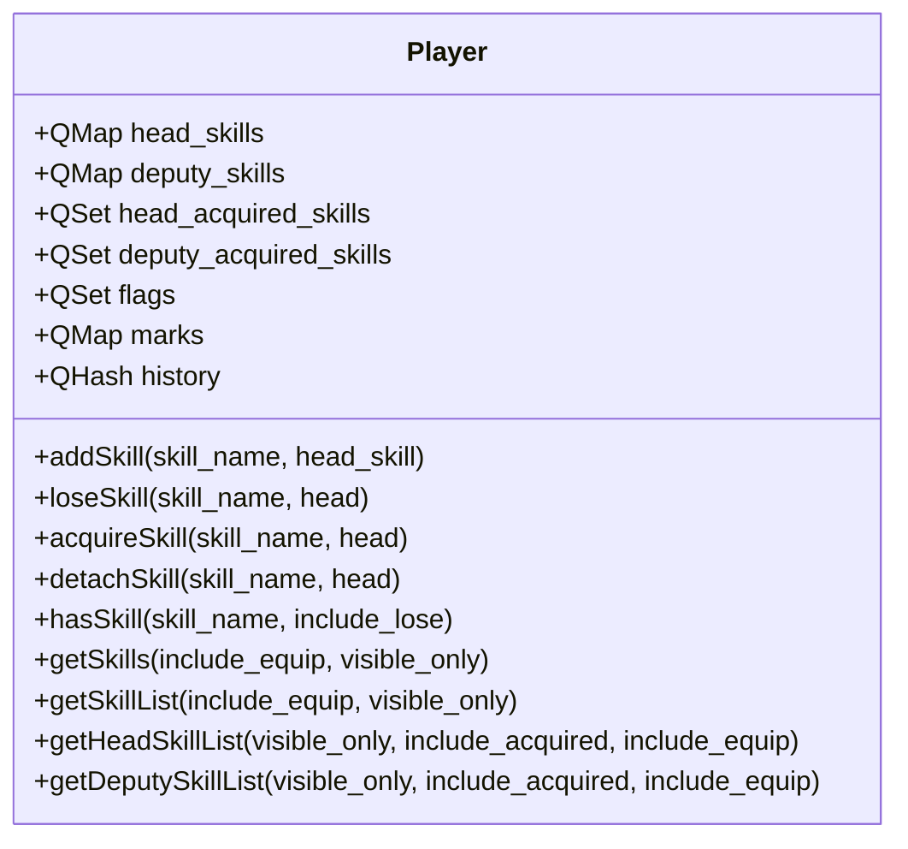
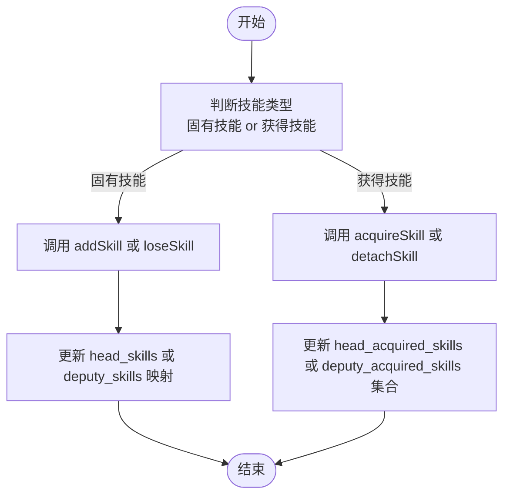
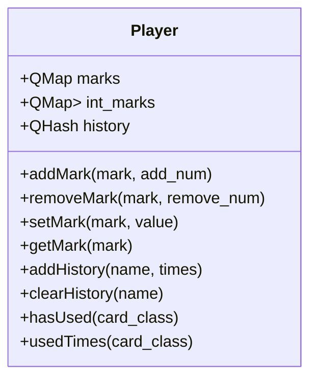
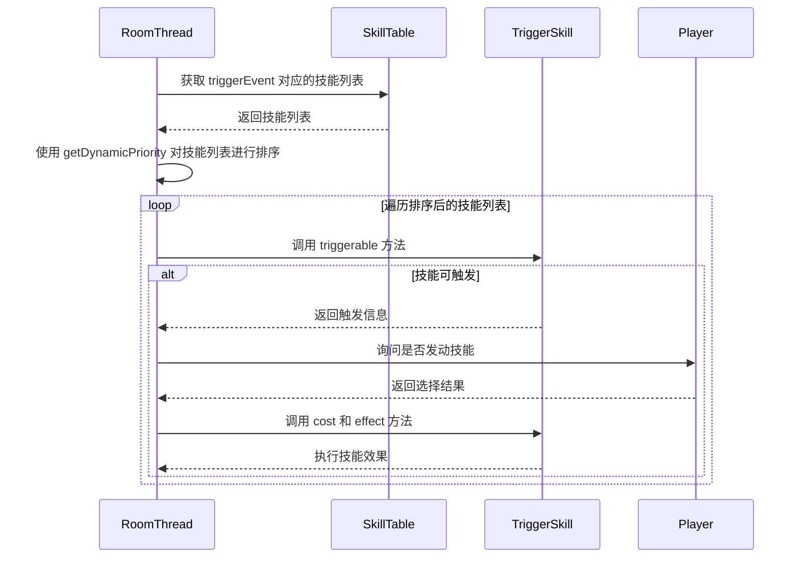
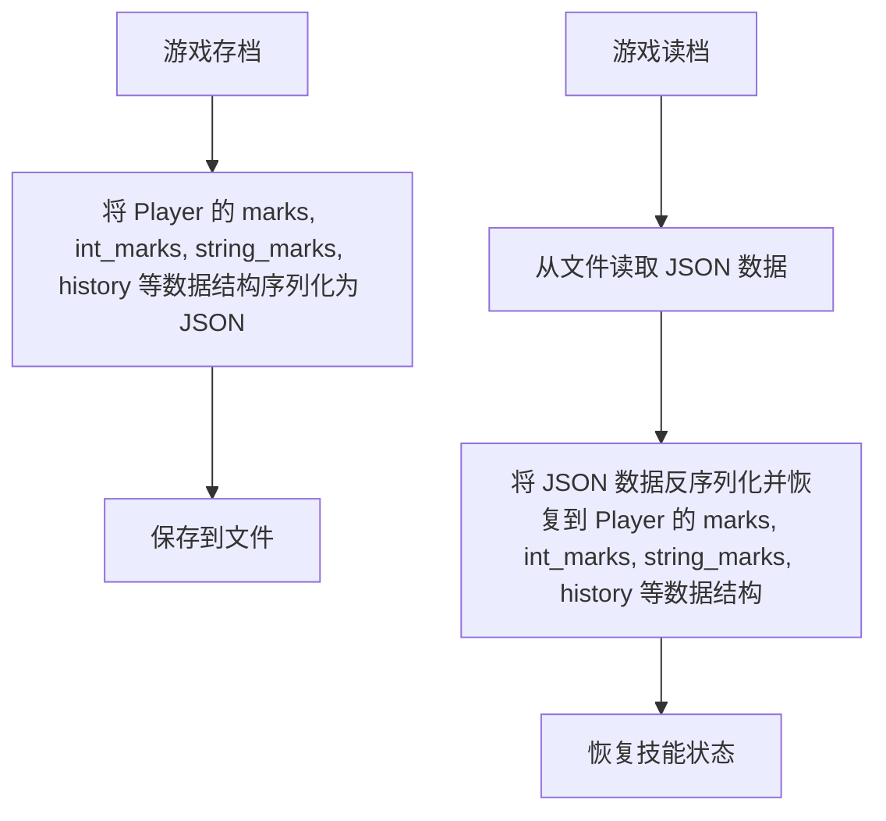
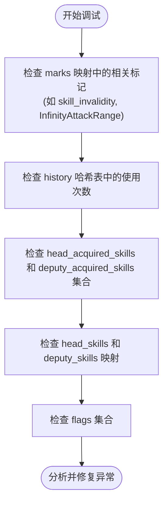

# 运行时技能管理

<cite>
**本文档引用文件**   
- [player.h](file://src/core/player.h#L38-L484)
- [player.cpp](file://src/core/player.cpp#L0-L2323)
- [skill.h](file://src/core/skill.h#L23-L508)
- [skill.cpp](file://src/core/skill.cpp#L0-L1020)
- [roomthread.cpp](file://src/server/roomthread.cpp#L200-L399)
</cite>

## 目录
1. [运行时技能管理](#运行时技能管理)
2. [玩家类与技能容器设计](#玩家类与技能容器设计)
3. [技能的激活与禁用机制](#技能的激活与禁用机制)
4. [技能状态持久化与事件监听](#技能状态持久化与事件监听)
5. [技能触发优先级与事件分发](#技能触发优先级与事件分发)
6. [被动与主动技能的差异](#被动与主动技能的差异)
7. [技能状态的序列化与反序列化](#技能状态的序列化与反序列化)
8. [技能状态异常调试工具](#技能状态异常调试工具)

## 玩家类与技能容器设计

`Player` 类是游戏运行时技能管理的核心，它通过多个数据结构来维护技能的生命周期。该类使用 `QMap<QString, bool>` 类型的 `head_skills` 和 `deputy_skills` 映射来存储角色主将和副将的固有技能，同时使用 `QSet<QString>` 类型的 `head_acquired_skills` 和 `deputy_acquired_skills` 集合来存储通过游戏机制获得的技能。



**图示来源**
- [player.h](file://src/core/player.h#L38-L484)

**本节来源**
- [player.h](file://src/core/player.h#L38-L484)
- [player.cpp](file://src/core/player.cpp#L0-L2323)

## 技能的激活与禁用机制

技能的激活与禁用是通过 `Player` 类提供的 `addSkill`、`loseSkill`、`acquireSkill` 和 `detachSkill` 方法实现的。`addSkill` 和 `loseSkill` 用于管理角色固有技能（即武将牌自带的技能），而 `acquireSkill` 和 `detachSkill` 则用于管理通过游戏效果获得或失去的技能。



**图示来源**
- [player.cpp](file://src/core/player.cpp#L1400-L1450)

**本节来源**
- [player.cpp](file://src/core/player.cpp#L1400-L1450)

## 技能状态持久化与事件监听

技能的状态持久化主要通过 `marks`（标记）、`int_marks`（整数标记）和 `history`（历史记录）等数据结构实现。`marks` 用于存储技能相关的布尔状态或计数器，`history` 则用于记录技能的使用次数等历史信息。



**图示来源**
- [player.h](file://src/core/player.h#L38-L484)

**本节来源**
- [player.h](file://src/core/player.h#L38-L484)
- [player.cpp](file://src/core/player.cpp#L1800-L1900)

## 技能触发优先级与事件分发

技能的触发优先级由 `TriggerSkill` 类的 `getDynamicPriority` 方法决定。在 `RoomThread::trigger` 方法中，所有可能触发的技能会根据其动态优先级进行稳定排序，优先级高的技能会优先被处理。



**图示来源**
- [roomthread.cpp](file://src/server/roomthread.cpp#L233-L256)

**本节来源**
- [roomthread.cpp](file://src/server/roomthread.cpp#L233-L256)
- [skill.cpp](file://src/core/skill.cpp#L0-L1020)

## 被动与主动技能的差异

被动技能和主动技能的主要区别在于其触发方式和频率。被动技能通常由 `TriggerSkill` 派生，其 `getFrequency` 返回 `Compulsory` 或 `Frequent`，它们在满足条件时自动生效，无需玩家手动选择。主动技能则通常由 `ViewAsSkill` 派生，其 `getFrequency` 返回 `NotFrequent`，需要玩家在特定时机（如出牌阶段）手动选择发动。

```mermaid
classDiagram
class Skill {
+Frequency getFrequency()
}
class TriggerSkill {
+getPriority()
+triggerable()
+effect()
}
class ViewAsSkill {
+isAvailable()
+viewAs()
}
Skill <|-- TriggerSkill : "继承"
Skill <|-- ViewAsSkill : "继承"
TriggerSkill --> "Compulsory/Frequent" : "频率"
ViewAsSkill --> "NotFrequent" : "频率"
```

**图示来源**
- [skill.h](file://src/core/skill.h#L23-L508)

**本节来源**
- [skill.h](file://src/core/skill.h#L23-L508)
- [skill.cpp](file://src/core/skill.cpp#L0-L1020)

## 技能状态的序列化与反序列化

技能状态的序列化与反序列化主要通过 `marks`、`int_marks`、`string_marks` 和 `history` 等成员变量实现。这些变量存储了技能相关的所有状态信息，如冷却时间（通过 `marks` 中的计数器实现）、使用次数（通过 `history` 实现）等。在游戏存档和读档时，这些数据结构会被整体保存和恢复。



**本节来源**
- [player.h](file://src/core/player.h#L38-L484)
- [player.cpp](file://src/core/player.cpp#L0-L2323)

## 技能状态异常调试工具

调试技能状态异常的实用工具包括检查 `marks` 和 `history` 的值，以及使用 `hasSkill`、`hasShownSkill` 等方法来验证技能的激活状态。开发者可以通过日志输出或调试器直接检查 `Player` 对象的这些成员变量，以确定技能状态是否符合预期。



**本节来源**
- [player.h](file://src/core/player.h#L38-L484)
- [player.cpp](file://src/core/player.cpp#L0-L2323)