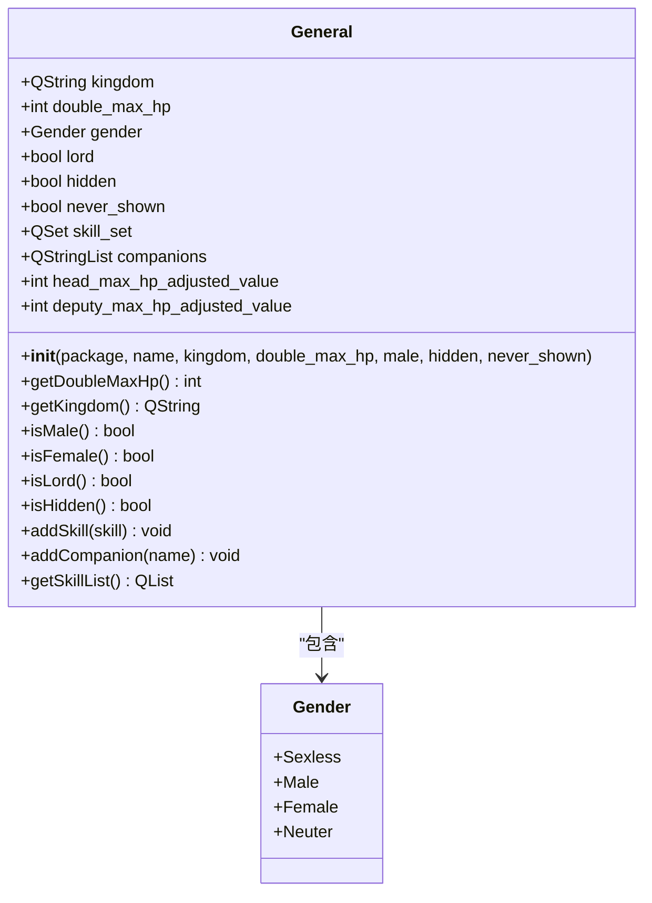

# 武将属性定义

<cite>
**本文档引用文件**  
- [2-SkillGeneral.lua](file://extension-doc/2-SkillGeneral.lua#L0-L163)
- [StandardGeneralPackage.lua](file://lang/zh_CN/Package/StandardGeneralPackage.lua#L0-L37)
- [general.h](file://src/core/general.h#L0-L139)
</cite>

## 目录
1. [简介](#简介)
2. [核心属性定义](#核心属性定义)
3. [Lua构造函数详解](#lua构造函数详解)
4. [C++底层数据结构映射](#c底层数据结构映射)
5. [标准武将定义示例](#标准武将定义示例)
6. [常见错误排查](#常见错误排查)
7. [命名规范与本地化最佳实践](#命名规范与本地化最佳实践)

## 简介
本文档详细说明如何在《三国杀》扩展框架中定义武将的基本属性。通过分析Lua脚本层的sgs.General构造函数与C++底层的General类定义，全面阐述武将名称、称号、势力、体力值、性别、边框类型等字段的配置方法。结合标准武将包的实际代码，提供完整的属性定义指南和最佳实践。

## 核心属性定义

### 武将基本属性字段
在Lua中定义武将时，需通过sgs.General构造函数设置以下核心属性：

**name**  
- 字符串类型，表示武将的唯一标识名
- 必填项，不能为空
- 通常使用拼音或英文缩写，如"zhaoyun"、"caocao"

**kingdom**  
- 字符串类型，表示武将所属势力
- 合法取值："wei"（魏）、"shu"（蜀）、"wu"（吴）、"qun"（群）、"god"（神）
- 势力拼写必须准确，否则会导致游戏逻辑错误

**max_hp**  
- 整数类型，表示武将的双将体力上限
- 实际值为双将总和，单将体力为max_hp / 2
- 合法范围：2-8（对应单将1-4点体力）
- 奇数体力值会导致计算异常

**male**  
- 布尔类型，表示武将性别
- true表示男性，false表示女性
- 影响语音播放、技能描述等

**hidden**  
- 布尔类型，表示武将是否为暗将
- true表示初始暗置，false表示明置
- 国战模式中影响武将牌显示状态

**never_shown**  
- 布尔类型，表示武将是否完全隐藏
- true时武将信息对所有玩家不可见
- 用于特殊模式或隐藏身份

**Section sources**
- [general.h](file://src/core/general.h#L25-L30)

## Lua构造函数详解

### sgs.General构造函数参数
在2-SkillGeneral.lua中，武将通过C++封装的sgs.General构造函数创建：

```lua
General(Package *package, const QString &name, const QString &kingdom,
        int double_max_hp = 4, bool male = true, bool hidden = false, bool never_shown = false);
```

各参数含义如下：

**package**  
- 所属扩展包指针
- 由当前扩展上下文自动提供

**name**  
- 武将内部标识名
- 必须全局唯一
- 建议使用小写字母和下划线

**kingdom**  
- 势力标识字符串
- 决定武将边框颜色和阵营归属
- 错误拼写会导致阵营判断失效

**double_max_hp**  
- 双将体力上限
- 默认值为4（即单将2点体力）
- 实际体力值为该值的一半

**male**  
- 性别标志
- 默认为true（男性）
- 女性武将设为false

**hidden**  
- 初始隐藏状态
- 默认为false（明置）
- 暗将设为true

**never_shown**  
- 完全隐藏标志
- 默认为false
- 特殊隐藏武将设为true

**Section sources**
- [2-SkillGeneral.lua](file://extension-doc/2-SkillGeneral.lua#L0-L163)

## C++底层数据结构映射

### General类核心成员
src/core/general.h中的General类定义了武将的底层数据结构：



**Diagram sources**
- [general.h](file://src/core/general.h#L25-L139)

### 关键属性映射关系
| Lua参数 | C++成员 | 类型 | 说明 |
|--------|--------|------|------|
| name | (构造函数参数) | QString | 武将唯一标识 |
| kingdom | kingdom | QString | 势力字符串 |
| max_hp | double_max_hp | int | 双将体力上限 |
| male | gender | Gender | 性别枚举 |
| hidden | hidden | bool | 隐藏状态 |
| never_shown | never_shown | bool | 完全隐藏 |

### 属性访问方法
General类提供了丰富的属性访问接口：
- `getDoubleMaxHp()`：获取双将体力上限
- `getKingdom()`：获取势力
- `isMale()`/`isFemale()`：判断性别
- `isHidden()`：判断是否隐藏
- `addSkill()`：添加技能
- `addCompanion()`：添加同伴

**Section sources**
- [general.h](file://src/core/general.h#L25-L139)

## 标准武将定义示例

### 标准武将包代码模式
在StandardGeneralPackage.lua中，武将定义遵循统一模式：

```lua
-- 士兵武将定义示例
["#sujiang"] = "我是男的",
["sujiang"] = "士兵",
["illustrator:sujiang"] = "官方",
["#sujiangf"] = "我是女的",
["sujiangf"] = "士兵",
["illustrator:sujiangf"] = "官方"
```

### 完整武将定义流程
1. **定义翻译条目**：在语言文件中添加武将名称和称号
2. **创建武将对象**：使用sgs.General构造函数
3. **添加技能**：通过addSkill方法关联技能
4. **设置同伴**：使用addCompanion指定配合武将

### 实际代码示例
```lua
-- 创建魏势力3体力男性武将
local jianggan = new General(this, "jianggan", "wei", 3);
jianggan->addSkill(new Weicheng);
jianggan->addSkill(new Daoshu);

-- 创建蜀势力3体力女性武将
local yangwan = new General(this, "yangwan", "shu", 3, false);
yangwan->addCompanion("machao");
yangwan->addSkill(new Youyan);
```

**Section sources**
- [StandardGeneralPackage.lua](file://lang/zh_CN/Package/StandardGeneralPackage.lua#L0-L37)
- [newsgs.cpp](file://src/package/newsgs.cpp#L3682-L3720)

## 常见错误排查

### 字符编码问题
**症状**：武将名称显示乱码或问号
**原因**：文件编码非UTF-8
**解决方案**：
1. 确保.lua文件保存为UTF-8编码
2. 避免使用中文作为内部标识名
3. 在语言文件中定义中文显示名

### 势力拼写错误
**症状**：武将边框颜色错误或阵营判断异常
**常见错误**：
- "Wei"（首字母大写）→ 应为"wei"
- "shu "（尾部空格）→ 应为"shu"
- "qun1"（数字后缀）→ 应为"qun"

**验证方法**：
```lua
-- 正确势力值
local valid_kingdoms = {"wei", "shu", "wu", "qun", "god"}
```

### 体力值越界
**症状**：游戏崩溃或体力显示异常
**合法范围**：2-8（双将体力）
**常见错误**：
- 设置为1（单将0.5体力）
- 设置为10（超出合理范围）
- 使用小数（如3.5）

**验证代码**：
```cpp
// C++层有边界检查
if (double_max_hp < 2 || double_max_hp > 8) {
    qWarning() << "Invalid max hp value:" << double_max_hp;
}
```

### 技能关联错误
**症状**：技能无法触发或效果异常
**常见原因**：
- 技能名称拼写错误
- 忘记添加相关技能
- 技能与武将性别冲突

**排查步骤**：
1. 检查addSkill参数是否正确
2. 验证技能文件是否存在
3. 确认技能继承关系

**Section sources**
- [2-SkillGeneral.lua](file://extension-doc/2-SkillGeneral.lua#L0-L163)
- [general.h](file://src/core/general.h#L25-L139)

## 命名规范与本地化最佳实践

### 命名规范
**武将标识名**：
- 使用小写字母
- 采用拼音或英文缩写
- 避免特殊字符
- 示例："zhaoyun"、"dianwei"

**技能标识名**：
- 与武将名关联
- 使用小写字母和连字符
- 示例："longdan"、"wusheng"

### 本地化支持
**语言文件结构**：
```lua
return {
    ["#sujiang"] = "我是男的",  -- 称号
    ["sujiang"] = "士兵",       -- 名称
    ["illustrator:sujiang"] = "官方" -- 画师
}
```

**最佳实践**：
1. **分离标识与显示**：内部使用英文标识，显示使用中文
2. **统一命名空间**：避免命名冲突
3. **完整翻译条目**：包含名称、称号、技能描述
4. **版本控制**：同步更新多语言文件

### 扩展包集成
**包依赖管理**：
- 明确声明扩展依赖
- 避免循环引用
- 使用标准命名前缀

**兼容性考虑**：
- 支持不同游戏模式
- 考虑技能平衡性
- 提供配置选项

**Section sources**
- [StandardGeneralPackage.lua](file://lang/zh_CN/Package/StandardGeneralPackage.lua#L0-L37)
- [2-SkillGeneral.lua](file://extension-doc/2-SkillGeneral.lua#L0-L163)