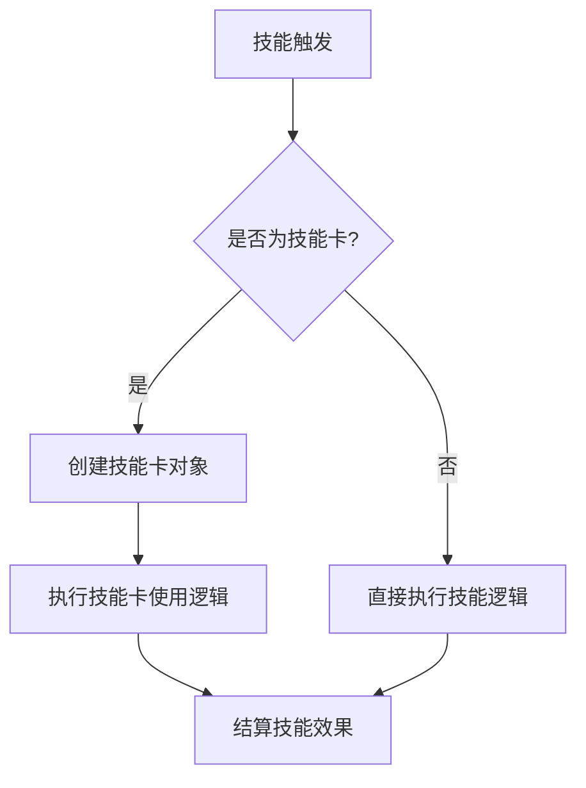
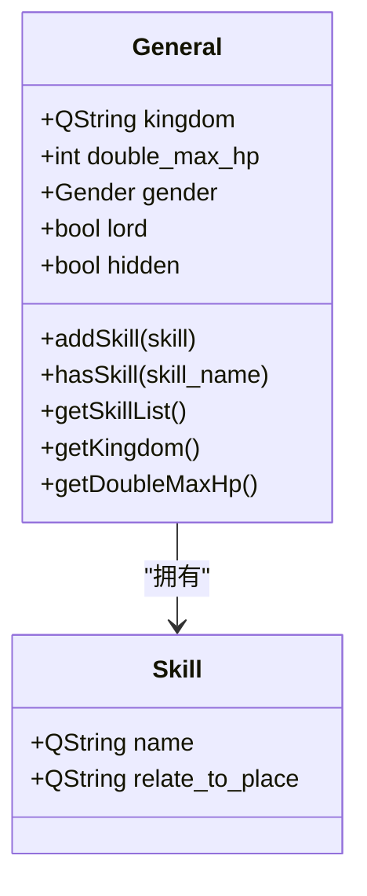
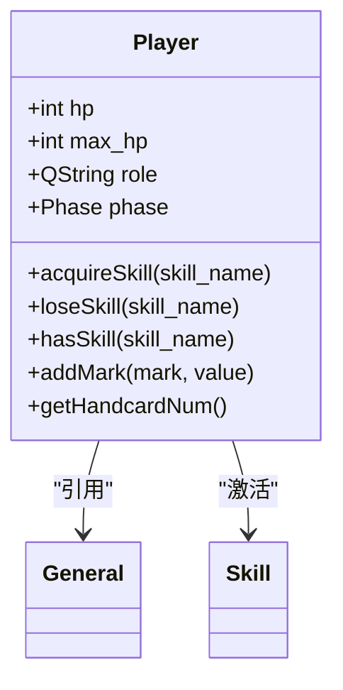

# 武将开发

<cite>
**本文档引用文件**  
- [2-SkillGeneral.lua](file://extension-doc/2-SkillGeneral.lua)
- [17-Example.lua](file://extension-doc/17-Example.lua)
- [Xmode.lua](file://extensions/Xmode.lua)
- [general.h](file://src/core/general.h)
- [player.h](file://src/core/player.h)
</cite>

## 目录
1. [引言](#引言)
2. [武将注册与配置](#武将注册与配置)
3. [技能系统详解](#技能系统详解)
4. [技能绑定与继承机制](#技能绑定与继承机制)
5. [扩展包武将组织结构分析](#扩展包武将组织结构分析)
6. [底层数据结构与状态管理](#底层数据结构与状态管理)
7. [自定义谋士武将开发教程](#自定义谋士武将开发教程)

## 引言

本指南旨在全面指导开发者如何使用Lua脚本在《一统天下》模式中定义新武将及其技能组合。通过分析核心文档与代码文件，我们将深入探讨武将注册方法、技能系统架构、扩展包组织方式以及底层数据结构支持，最终提供一个完整的自定义武将开发实例。

## 武将注册与配置

在《一统天下》模式中，新武将的注册主要通过Lua脚本完成，核心函数为`sgs.General`。该函数允许开发者定义武将的基本属性，包括名称、势力、体力值、性别、是否为主公等。

### 武将属性配置说明

| 属性 | 类型 | 说明 |
|------|------|------|
| name | 字符串 | 武将名称，唯一标识 |
| kingdom | 字符串 | 势力（如"wei"、"shu"等） |
| maxhp | 整数 | 体力上限（双将模式下为双将总和） |
| male | 布尔值 | 是否为男性，默认true |
| hidden | 布尔值 | 是否为隐藏武将 |
| never_shown | 布尔值 | 是否永不展示 |

**Section sources**
- [general.h](file://src/core/general.h#L25-L40)

## 技能系统详解

技能是武将能力的核心体现。根据`2-SkillGeneral.lua`文档，技能可分为多种类型，每种类型对应不同的触发机制和效果。

### 技能分类

- **视为技**：如“龙胆”、“武圣”，可将某牌当作另一牌使用
- **触发技**：如“奸雄”、“反馈”，在特定时机自动触发
- **距离技**：如“马术”、“飞影”，影响攻击范围
- **手牌上限技**：如“横江”（后续效果）
- **目标修改技**：如“咆哮”、“集智”，修改卡牌使用限制

### 技能创建通用接口

所有技能均通过`sgs.CreateXXXSkill`系列函数创建。以触发技为例：

```lua
thetrigger = sgs.CreateTriggerSkill{
    name = "thetrigger",
    events = {sgs.EventPhaseStart},
    can_trigger = function(self, event, room, player, data)
        -- 判断是否可触发
    end,
    on_cost = function(self, event, room, player, data)
        -- 触发代价
    end,
    on_effect = function(self, event, room, player, data)
        -- 执行效果
    end,
}
```

#### 技能通用属性

- **name**：技能名称，必填字符串
- **relate_to_place**：技能归属位置
  - `"head"`：主将技
  - `"deputy"`：副将技
  - 空值或`nil`：主副将共有

**Section sources**
- [2-SkillGeneral.lua](file://extension-doc/2-SkillGeneral.lua#L10-L80)

## 技能绑定与继承机制

技能需绑定到具体武将才能生效。通过`addSkill`方法可将已定义的技能添加至武将。

### 技能卡机制

部分技能（如“仁德”、“制衡”）需借助“技能卡”实现。技能卡是一种虚拟牌，通过视为技将其打出，从而执行对应技能效果。



**Diagram sources**
- [2-SkillGeneral.lua](file://extension-doc/2-SkillGeneral.lua#L85-L95)

### 实例分析：义舍技能

以`17-Example.lua`中的“义舍”技能为例，展示了技能与AI逻辑的完整绑定过程：

```lua
local yishe_skill = {name = "yishe"}
table.insert(sgs.ai_skills, yishe_skill)

yishe_skill.getTurnUseCard = function(self)
    return sgs.Card_Parse("@YisheCard=.")
end
```

该代码注册了“义舍”技能，并定义其回合内使用卡牌的方式。

**Section sources**
- [17-Example.lua](file://extension-doc/17-Example.lua#L1-L20)

## 扩展包武将组织结构分析

以`Xmode.lua`为例，分析完整扩展包中武将的组织结构与条件解锁机制。

### 多势力武将分配

```lua
function getRandomGenerals(n, kingdom, exceptions)
    hash[kingdom] = table.Shuffle(hash[kingdom])
    local result = {}
    for _, general in pairs(hash[kingdom]) do
        if #result == n then break end
        if not table.contains(exceptions, general) then
            table.insert(result, general)
        end
    end
    return result
end
```

此函数实现按势力随机选取武将，避免重复。

### 隐藏武将与条件解锁

通过`XmodeRule`触发技能，在玩家死亡后触发复活机制：

```lua
XmodeRule = sgs.CreateTriggerSkill{
    name = "XmodeRule",
    events = {sgs.BuryVictim},
    on_effect = function(self, event, room, player, data, ask_who)
        -- 死亡后复活逻辑
        local times = room:getTag(player:getKingdom().."_Change"):toInt()
        if times >= 3 then return false end
        
        local used = room:getTag("Xmode_UsedGeneral"):toString():split("+")
        local random_general = getRandomGenerals(sgs.GetConfig("HegemonyMaxChoice",0), player:getKingdom(), used)
        
        local choice = room:askForGeneral(player, table.concat(random_general,"+"), nil, false):split("+")
        room:doDragonPhoenix(player, choice[1], choice[2], true, player:getKingdom(), false, "", true)
        player:drawCards(4)
        return true
    end,
    priority = 1,
}
```

此机制实现了武将的动态解锁与替换。

**Section sources**
- [Xmode.lua](file://extensions/Xmode.lua#L50-L80)

## 底层数据结构与状态管理

### 武将数据结构（General）

位于`general.h`中的`General`类定义了武将的核心属性与方法：



**Diagram sources**
- [general.h](file://src/core/general.h#L25-L60)

### 玩家状态管理（Player）

`player.h`中的`Player`类负责管理玩家运行时状态，包括技能激活、标记管理、卡牌区域等。

#### 关键方法

- `acquireSkill(skill_name)`：获得技能
- `loseSkill(skill_name)`：失去技能
- `hasSkill(skill_name)`：检查是否拥有技能
- `addMark(mark, value)`：添加标记
- `getHandcardNum()`：获取手牌数



**Diagram sources**
- [player.h](file://src/core/player.h#L25-L60)

## 自定义谋士武将开发教程

本节提供创建“自定义谋士”武将的完整分步教程。

### 第一步：定义武将基础属性

```lua
local moushi = sgs.General(
    sgs.Sanguosha:getPackage("custom"), -- 所属包
    "moushi",                           -- 武将名
    "qun",                              -- 势力
    3,                                  -- 体力上限
    false,                              -- 是否女性
    false                               -- 是否隐藏
)
```

### 第二步：创建技能

#### 技能1：智谋（触发技）

```lua
zhimou = sgs.CreateTriggerSkill{
    name = "zhimou",
    events = {sgs.EventPhaseStart},
    can_trigger = function(self, event, room, player, data)
        if player:getPhase() == sgs.Player_Draw and player:hasSkill(self:objectName()) then
            return self:objectName()
        end
        return ""
    end,
    on_effect = function(self, event, room, player, data)
        room:drawCards(player, 1)
        return false
    end
}
```

#### 技能2：献策（视为技）

```lua
xiance = sgs.CreateViewAsSkill{
    name = "xiance",
    n = 1,
    view_filter = function(self, selected, to_select)
        return #selected == 0 and to_select:isBlack()
    end,
    view_as = function(self, cards)
        if #cards ~= 1 then return nil end
        local card = cards[1]
        local skill_card = sgs.Card_Parse("@XianceCard=" .. card:getId())
        skill_card:setSkillName(self:objectName())
        return skill_card
    end,
    enabled_at_play = function(self, player)
        return not player:hasUsed("XianceCard")
    end
}
```

### 第三步：绑定技能到武将

```lua
moushi:addSkill(zhimou)
moushi:addSkill(xiance)
```

### 第四步：配置台词

```lua
sgs.LoadTranslationTable{
    ["moushi"] = "谋士",
    [":moushi"] = "运筹帷幄，决胜千里。",
    ["zhimou"] = "智谋",
    [":zhimou"] = "摸牌阶段开始时，你可以多摸一张牌。",
    ["xiance"] = "献策",
    [":xiance"] = "出牌阶段，你可以将一张黑色手牌当作【献策】使用。",
    ["~moushi"] = "天机…泄露…"
}
```

### 第五步：平衡性建议

- **技能强度**：避免单回合过强爆发，建议限制使用次数
- **资源消耗**：高收益技能应伴随较高代价（如弃牌、扣血）
- **互动性**：增加与其他玩家的互动机制，提升游戏体验
- **AI适配**：为技能编写AI逻辑，确保电脑玩家能合理使用

**Section sources**
- [2-SkillGeneral.lua](file://extension-doc/2-SkillGeneral.lua#L1-L163)
- [17-Example.lua](file://extension-doc/17-Example.lua#L1-L88)
- [Xmode.lua](file://extensions/Xmode.lua#L1-L91)
- [general.h](file://src/core/general.h#L1-L139)
- [player.h](file://src/core/player.h#L1-L488)