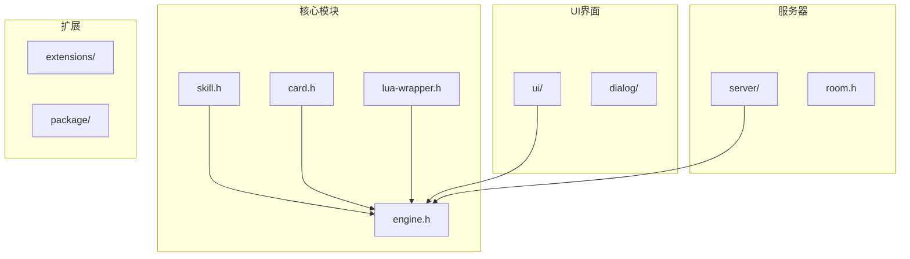
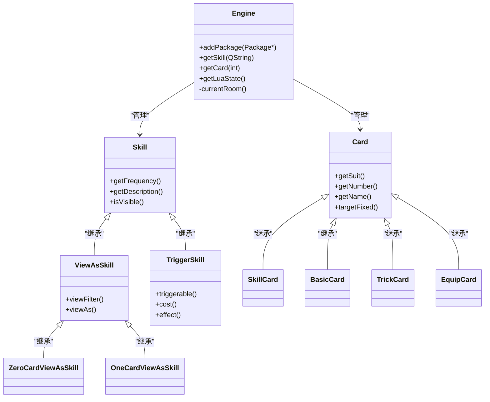
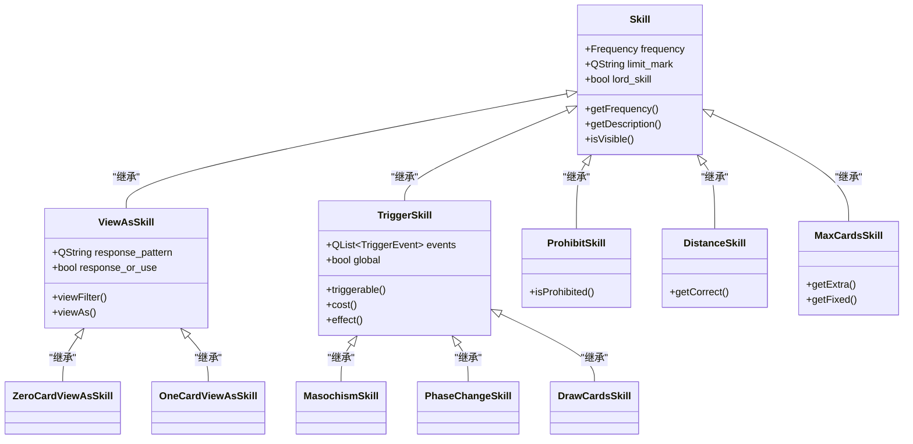
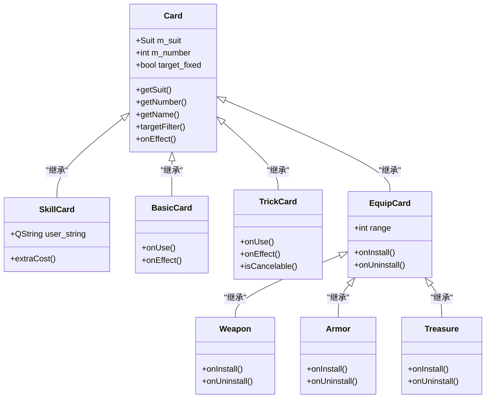
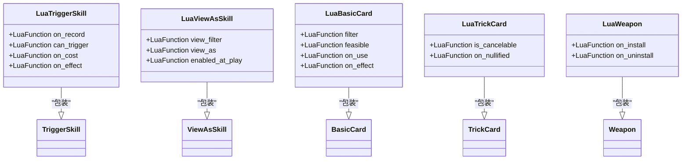

# API参考

<cite>
**本文档中引用的文件**   
- [skill.h](file://src/core/skill.h)
- [card.h](file://src/core/card.h)
- [engine.h](file://src/core/engine.h)
- [lua-wrapper.h](file://src/core/lua-wrapper.h)
</cite>

## 目录
1. [简介](#简介)
2. [项目结构](#项目结构)
3. [核心组件](#核心组件)
4. [架构概述](#架构概述)
5. [详细组件分析](#详细组件分析)
6. [依赖分析](#依赖分析)
7. [性能考虑](#性能考虑)
8. [故障排除指南](#故障排除指南)
9. [结论](#结论)

## 简介
本文档旨在为《三国杀：霸业》游戏引擎提供全面的API参考文档。文档系统化整理了核心模块的公开接口，包括技能系统、卡牌系统、引擎服务和Lua交互机制。通过详细记录各API的函数签名、调用时机、重载规范和性能特征，为开发者提供清晰的技术指导。

## 项目结构
项目采用分层架构设计，主要分为核心模块、UI界面、服务器逻辑和扩展包等部分。核心模块位于`src/core`目录下，包含游戏运行所需的基础类和系统服务。



**图示来源**
- [skill.h](file://src/core/skill.h)
- [card.h](file://src/core/card.h)
- [engine.h](file://src/core/engine.h)
- [lua-wrapper.h](file://src/core/lua-wrapper.h)

**章节来源**
- [skill.h](file://src/core/skill.h)
- [card.h](file://src/core/card.h)
- [engine.h](file://src/core/engine.h)

## 核心组件

本文档重点分析四个核心组件：技能系统（Skill）、卡牌系统（Card）、引擎服务（Engine）和Lua交互（Lua-wrapper）。这些组件构成了游戏逻辑的核心骨架，通过精心设计的继承体系和接口契约实现复杂的游戏机制。

**章节来源**
- [skill.h](file://src/core/skill.h#L35-L103)
- [card.h](file://src/core/card.h#L39-L246)
- [engine.h](file://src/core/engine.h#L52-L274)

## 架构概述

系统采用面向对象设计模式，以Engine类作为全局单例协调各组件工作。技能和卡牌通过继承体系实现多态行为，Lua脚本提供灵活的扩展机制。



**图示来源**
- [skill.h](file://src/core/skill.h)
- [card.h](file://src/core/card.h)
- [engine.h](file://src/core/engine.h)

## 详细组件分析

### 技能系统分析

技能系统采用多层继承架构，基类Skill定义了技能的基本属性和行为，派生类实现特定类型的技能逻辑。

#### 技能类继承体系


**图示来源**
- [skill.h](file://src/core/skill.h#L35-L103)

**章节来源**
- [skill.h](file://src/core/skill.h#L35-L103)

#### 技能接口调用规范
- **triggerable**: 触发时机检查，在特定事件发生时调用，用于判断技能是否可以触发
- **cost**: 技能消耗检查，在技能触发前调用，用于验证技能发动条件
- **effect**: 技能效果执行，在技能成功触发后调用，实现技能的具体效果
- **getPriority**: 获取技能优先级，用于解决多个技能同时触发时的执行顺序

### 卡牌系统分析

卡牌系统采用抽象基类设计，Card类定义了卡牌的通用属性和行为，各类具体卡牌通过继承实现特定功能。

#### 卡牌类继承体系


**图示来源**
- [card.h](file://src/core/card.h#L39-L246)

**章节来源**
- [card.h](file://src/core/card.h#L39-L246)

#### 卡牌方法契约
- **targetFixed**: 判断卡牌目标是否固定，返回true表示无需选择目标
- **targetsFeasible**: 验证目标组合是否可行，检查目标数量和选择规则
- **targetFilter**: 过滤可选目标，决定哪些玩家可以被选为目标
- **isAvailable**: 检查卡牌是否可用，验证使用条件和限制
- **onUse**: 卡牌使用时的预处理，执行使用前的特殊效果
- **onEffect**: 卡牌效果执行，处理卡牌对目标产生的影响

### 引擎服务分析

Engine类作为全局单例，提供游戏运行所需的各种服务和资源管理功能。

#### 引擎服务接口
```mermaid
classDiagram
class Engine {
+getSkill(QString)
+getCard(int)
+getGeneral(QString)
+getScenario(QString)
+addPackage(Package*)
+playAudioEffect()
+registerRoom()
+currentRoom()
}
class Room {
+getPlayers()
+getCurrent()
+getMode()
}
class General {
+getKingdom()
+getMaxHp()
+getSkills()
}
class Scenario {
+getPlayerCount()
+getRoles()
+assign()
}
Engine --> Room : "注册"
Engine --> General : "获取"
Engine --> Scenario : "管理"
Engine --> "Lua脚本" : "交互"
```

**图示来源**
- [engine.h](file://src/core/engine.h#L52-L274)

**章节来源**
- [engine.h](file://src/core/engine.h#L52-L274)

#### 服务获取方式
- **单例模式**: Sanguosha全局指针指向唯一的Engine实例
- **资源注册**: 通过addPackage、addScenario等方法注册游戏资源
- **查询接口**: 提供getSkill、getCard、getGeneral等方法按名称查询资源
- **状态管理**: 通过currentRoom、currentRoomState等方法获取当前游戏状态

### Lua交互机制分析

Lua-wrapper.h提供了C++与Lua脚本的双向交互机制，通过包装类将C++对象暴露给Lua环境。

#### Lua绑定函数


**图示来源**
- [lua-wrapper.h](file://src/core/lua-wrapper.h)

**章节来源**
- [lua-wrapper.h](file://src/core/lua-wrapper.h)

#### 绑定参数约束
- **函数指针**: LuaFunction类型用于存储Lua函数引用
- **回调机制**: C++方法调用对应的Lua函数实现扩展逻辑
- **异常处理**: Lua脚本异常不会导致C++程序崩溃，通过错误码返回
- **线程安全**: Lua状态机访问通过互斥锁保护，确保线程安全

## 依赖分析

系统各组件之间存在明确的依赖关系，通过接口隔离和依赖注入实现松耦合设计。

```mermaid
graph TD
Engine --> Skill : "管理"
Engine --> Card : "管理"
Engine --> General : "管理"
Engine --> Scenario : "管理"
Skill --> Card : "使用"
Card --> Player : "目标"
TriggerSkill --> Room : "事件"
ViewAsSkill --> Player : "使用者"
Engine --> LuaState : "脚本执行"
LuaTriggerSkill --> TriggerSkill : "包装"
LuaViewAsSkill --> ViewAsSkill : "包装"
```

**图示来源**
- [skill.h](file://src/core/skill.h)
- [card.h](file://src/core/card.h)
- [engine.h](file://src/core/engine.h)
- [lua-wrapper.h](file://src/core/lua-wrapper.h)

**章节来源**
- [skill.h](file://src/core/skill.h)
- [card.h](file://src/core/card.h)
- [engine.h](file://src/core/engine.h)

## 性能考虑

系统设计时充分考虑了性能因素，通过多种优化策略确保游戏流畅运行。

- **对象池**: 卡牌对象重复使用，减少内存分配开销
- **哈希查找**: 技能、卡牌等资源通过哈希表存储，实现O(1)查找
- **事件驱动**: 采用事件触发机制，避免轮询带来的性能损耗
- **脚本缓存**: Lua脚本编译结果缓存，减少重复编译开销
- **批量处理**: 卡牌移动等操作批量处理，减少UI更新次数

## 故障排除指南

### 常见问题及解决方案
- **技能不触发**: 检查triggerable条件是否满足，确认事件类型是否正确注册
- **卡牌无法使用**: 验证targetFilter和isAvailable返回值，检查目标选择逻辑
- **Lua脚本错误**: 查看控制台输出的Lua错误信息，检查函数参数和返回值
- **性能下降**: 使用性能分析工具定位热点代码，优化频繁调用的方法
- **资源加载失败**: 确认资源路径正确，检查文件是否存在和可读

**章节来源**
- [skill.h](file://src/core/skill.h#L35-L103)
- [card.h](file://src/core/card.h#L39-L246)
- [engine.h](file://src/core/engine.h#L52-L274)

## 结论

本文档系统化地分析了《三国杀：霸业》的核心API设计，涵盖了技能、卡牌、引擎服务和Lua交互等关键组件。通过详细的接口说明和架构图示，为开发者提供了全面的技术参考。建议在开发过程中遵循既定的接口契约和设计模式，确保代码的可维护性和扩展性。