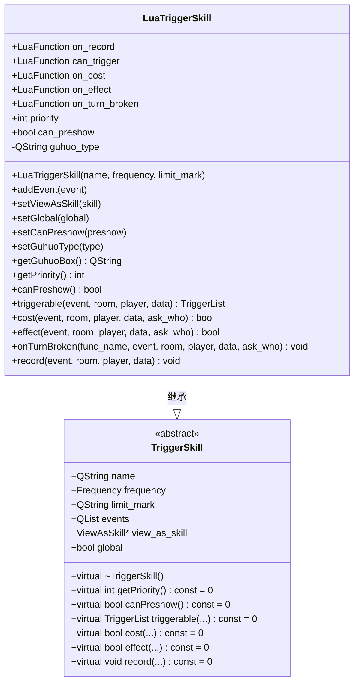
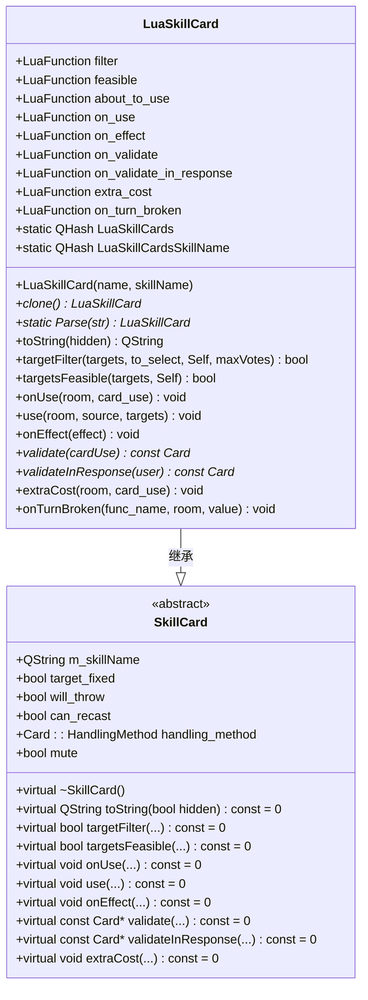
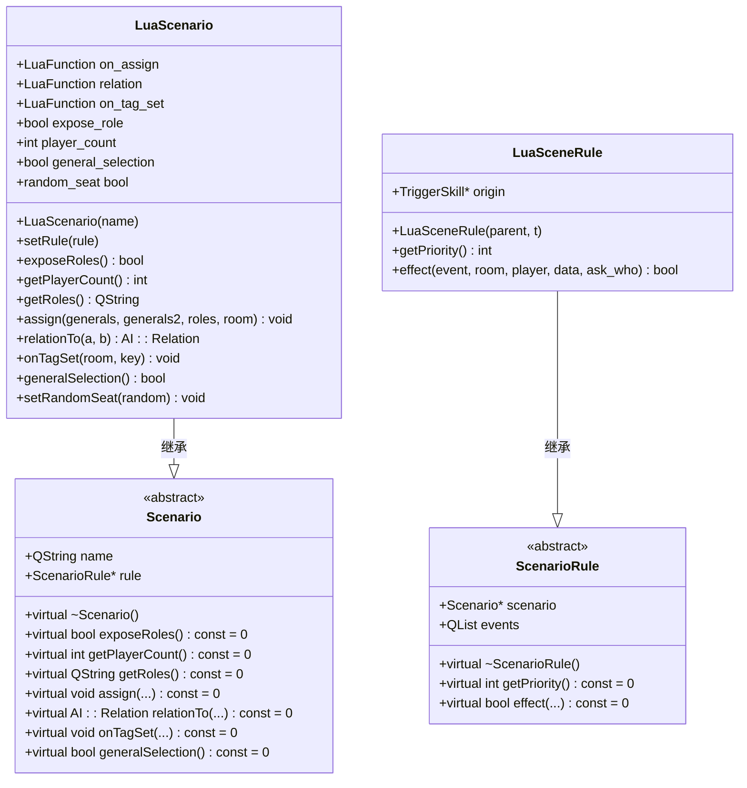
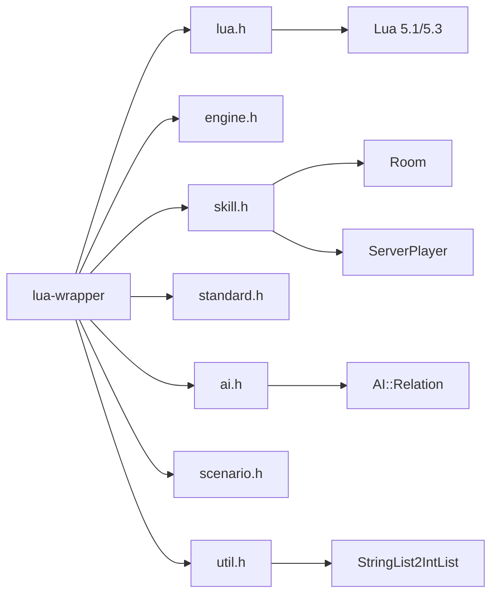

# Lua交互API

<cite>
**本文档中引用的文件**   
- [lua-wrapper.h](file://src/core/lua-wrapper.h#L1-L625)
- [lua-wrapper.cpp](file://src/core/lua-wrapper.cpp#L1-L399)
- [lua.h](file://src/lua/lua.h#L53)
- [engine.h](file://src/core/engine.h#L48)
</cite>

## 目录
1. [简介](#简介)
2. [项目结构](#项目结构)
3. [核心组件](#核心组件)
4. [架构概述](#架构概述)
5. [详细组件分析](#详细组件分析)
6. [依赖分析](#依赖分析)
7. [性能考量](#性能考量)
8. [故障排除指南](#故障排除指南)
9. [结论](#结论)

## 简介
本文档旨在为《三国杀：霸业》项目中的Lua交互API提供权威参考，重点分析`lua-wrapper.h`和`lua-wrapper.cpp`文件中定义的C++与Lua双向通信接口。该系统允许使用Lua脚本语言扩展游戏逻辑，如技能、卡牌和场景规则，同时通过C++核心提供高性能和类型安全。文档将详细说明关键类和函数的参数约束、异常处理机制及性能特征，并解释Lua栈管理规则和类型转换契约。

## 项目结构
项目采用分层模块化设计，核心逻辑与脚本扩展分离。Lua相关代码主要分布在`src/core`和`src/lua`目录下。`src/core`包含`lua-wrapper.h`和`lua-wrapper.cpp`，它们是C++与Lua交互的桥梁，定义了`LuaTriggerSkill`、`LuaSkillCard`等可由Lua脚本配置的类。`src/lua`目录包含嵌入的Lua 5.1和Lua 5.3解释器源码，为脚本执行提供运行时环境。游戏逻辑脚本（`.lua`文件）则位于`extension-doc`、`lua`和`lang/zh_CN`等目录，通过`lua-wrapper`接口与C++核心通信。

**Section sources**
- [lua-wrapper.h](file://src/core/lua-wrapper.h#L1-L625)
- [lua-wrapper.cpp](file://src/core/lua-wrapper.cpp#L1-L399)

## 核心组件
核心组件是`lua-wrapper.h`中定义的一系列继承自游戏引擎基类的“Lua包装类”。这些类（如`LuaTriggerSkill`、`LuaViewAsSkill`）在C++中定义接口，并通过`LuaFunction`类型的成员变量存储指向Lua函数的指针。当游戏事件触发时，C++代码会调用这些存储的Lua函数，从而实现用脚本控制游戏逻辑。

**Section sources**
- [lua-wrapper.h](file://src/core/lua-wrapper.h#L1-L625)

## 架构概述
该架构实现了C++核心与Lua脚本的安全、高效交互。C++层提供稳定的API和类型安全，而Lua层提供灵活的逻辑扩展。交互通过一个共享的`lua_State`栈进行，C++代码将参数压入栈，调用Lua函数，然后从栈中获取返回值。`lua-wrapper`中的类负责管理这种交互，确保类型转换正确并处理潜在的运行时错误。

```mermaid
graph TB
subgraph "C++ Core"
A[LuaTriggerSkill]
B[LuaSkillCard]
C[LuaViewAsSkill]
D[LuaScenario]
end
subgraph "Lua State"
E[lua_State]
end
subgraph "Lua Scripts"
F[Extension Skills]
G[Custom Cards]
H[Scenario Rules]
end
A --> E : 调用Lua函数
B --> E : 调用Lua函数
C --> E : 调用Lua函数
D --> E : 调用Lua函数
E --> F : 执行脚本
E --> G : 执行脚本
E --> H : 执行脚本
```

**Diagram sources **
- [lua-wrapper.h](file://src/core/lua-wrapper.h#L1-L625)
- [lua-wrapper.cpp](file://src/core/lua-wrapper.cpp#L1-L399)

## 详细组件分析
本节深入分析`lua-wrapper`中的关键类，揭示其设计模式和实现细节。

### Lua触发技能分析
`LuaTriggerSkill`类是可由Lua脚本定义的触发式技能的核心实现。它继承自`TriggerSkill`，并为Lua提供了多个回调函数的接口。



**Diagram sources **
- [lua-wrapper.h](file://src/core/lua-wrapper.h#L30-L85)

**Section sources**
- [lua-wrapper.h](file://src/core/lua-wrapper.h#L30-L85)
- [lua-wrapper.cpp](file://src/core/lua-wrapper.cpp#L10-L20)

#### 关键属性与方法
- **LuaFunction 回调**: `can_trigger`, `on_cost`, `on_effect`等成员变量是`int`类型（定义为`typedef int LuaFunction`），它们存储Lua虚拟机中函数的引用。当C++游戏逻辑需要决策时，会通过`lua_State`调用这些引用的Lua函数。
- **事件注册**: `addEvent()`方法允许Lua脚本注册该技能监听的游戏事件（如`Damaged`、`CardUsed`）。
- **优先级**: `priority`成员变量（默认为3）决定了当多个技能同时触发时的执行顺序。
- **虚方法实现**: `triggerable`, `cost`, `effect`等虚方法在C++中被重写，其内部逻辑是调用对应的`LuaFunction`。例如，`effect`方法会调用`on_effect`这个Lua函数。

### Lua技能卡牌分析
`LuaSkillCard`类允许通过Lua脚本定义全新的技能卡牌，是游戏扩展性的关键。



**Diagram sources **
- [lua-wrapper.h](file://src/core/lua-wrapper.h#L310-L395)
- [lua-wrapper.cpp](file://src/core/lua-wrapper.cpp#L100-L150)

**Section sources**
- [lua-wrapper.h](file://src/core/lua-wrapper.h#L310-L395)
- [lua-wrapper.cpp](file://src/core/lua-wrapper.cpp#L100-L150)

#### 关键属性与方法
- **静态注册表**: `LuaSkillCards`哈希表在构造函数中注册所有`LuaSkillCard`实例，使得`Parse`方法能根据字符串描述创建卡牌实例。
- **克隆与解析**: `clone()`方法创建卡牌的深拷贝，`Parse()`方法解析形如`#FireAttack:.:FireAttack&FireAttack`的字符串，从注册表中查找并配置卡牌，是卡牌序列化/反序列化的关键。
- **Lua回调**: 与`LuaTriggerSkill`类似，`filter`和`feasible`等回调函数将卡牌的逻辑判断权交给Lua脚本。

### Lua场景规则分析
`LuaScenario`和`LuaSceneRule`类共同实现了可由Lua脚本定义的自定义游戏场景。



**Diagram sources **
- [lua-wrapper.h](file://src/core/lua-wrapper.h#L515-L585)
- [lua-wrapper.cpp](file://src/core/lua-wrapper.cpp#L250-L280)

**Section sources**
- [lua-wrapper.h](file://src/core/lua-wrapper.h#L515-L585)
- [lua-wrapper.cpp](file://src/core/lua-wrapper.cpp#L250-L280)

#### 关键属性与方法
- **规则委托**: `LuaScenario`通过`setRule()`方法设置一个`LuaTriggerSkill`作为其规则。`LuaSceneRule`则包装这个`LuaTriggerSkill`，将其`effect`方法暴露给场景系统，实现了规则逻辑的脚本化。
- **Lua回调**: `on_assign`、`relation`等回调函数允许Lua脚本完全控制武将分配、AI关系判断等核心场景逻辑。

## 依赖分析
`lua-wrapper`组件依赖于多个核心模块，形成了清晰的依赖链。



**Diagram sources **
- [lua-wrapper.h](file://src/core/lua-wrapper.h#L1-L625)
- [lua-wrapper.cpp](file://src/core/lua-wrapper.cpp#L1-L399)

**Section sources**
- [lua-wrapper.h](file://src/core/lua-wrapper.h#L1-L625)
- [lua-wrapper.cpp](file://src/core/lua-wrapper.cpp#L1-L399)

## 性能考量
使用Lua脚本扩展游戏逻辑会带来一定的性能开销，主要体现在：
1.  **函数调用开销**: 每次C++与Lua之间的函数调用都需要操作`lua_State`栈，进行参数压栈和出栈，这比纯C++函数调用慢。
2.  **类型转换开销**: 在C++对象（如`ServerPlayer*`）和Lua值之间转换需要额外的处理。
3.  **垃圾回收**: Lua的自动内存管理可能在关键时刻触发垃圾回收，导致短暂的卡顿。

**最佳实践**:
- **避免频繁调用**: 对于每帧都执行的逻辑，应尽量使用C++实现，避免在Lua中处理。
- **批量数据处理**: 避免通过Lua栈传递大量数据（如整个玩家列表），应设计更高效的接口。
- **缓存Lua函数引用**: 重复调用同一Lua函数时，应缓存其`LuaFunction`引用，避免重复查找。

## 故障排除指南
调试Lua脚本错误是开发中的常见任务。常见问题及诊断方法如下：

**常见Lua运行时错误**:
- **栈溢出 (Stack Overflow)**: 通常由无限递归的Lua函数或C++代码未正确清理栈导致。检查`lua_gettop()`的值，确保在函数调用前后栈的大小一致。
- **类型不匹配 (Type Mismatch)**: 当C++代码期望从栈中获取某种类型（如整数），但Lua函数压入了其他类型（如字符串）时发生。使用`luaL_checktype()`等辅助函数在C++侧进行类型检查。
- **无效的函数引用**: 调用一个未正确注册或已被释放的`LuaFunction`。确保在调用前检查`LuaFunction`是否为0。

**调试方法**:
1.  在`lua-wrapper.cpp`的虚方法实现中添加日志，打印调用的Lua函数名和参数。
2.  使用`luaL_error()`在Lua脚本中抛出带有详细信息的错误。
3.  利用`luaL_where()`获取错误发生时的调用栈信息。

**Section sources**
- [lua-wrapper.h](file://src/core/lua-wrapper.h#L1-L625)
- [lua-wrapper.cpp](file://src/core/lua-wrapper.cpp#L1-L399)
- [lauxlib.h](file://src/lua/lauxlib.h#L40-L66)

## 结论
`lua-wrapper`系统为《三国杀：霸业》提供了一个强大而灵活的脚本扩展框架。通过精心设计的包装类，它成功地将C++的性能与Lua的灵活性结合起来。开发者可以利用本文档中描述的API，通过Lua脚本安全地扩展游戏技能、卡牌和场景，极大地丰富了游戏内容。遵循性能最佳实践和调试指南，可以有效管理脚本带来的复杂性，确保游戏的稳定和流畅运行。