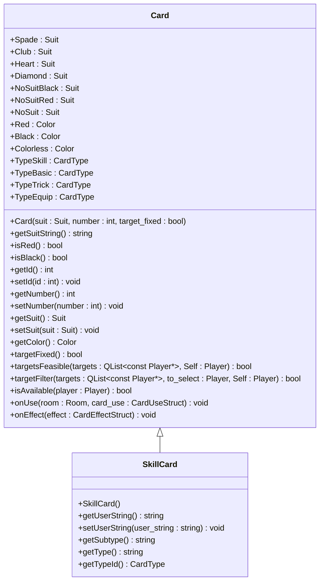
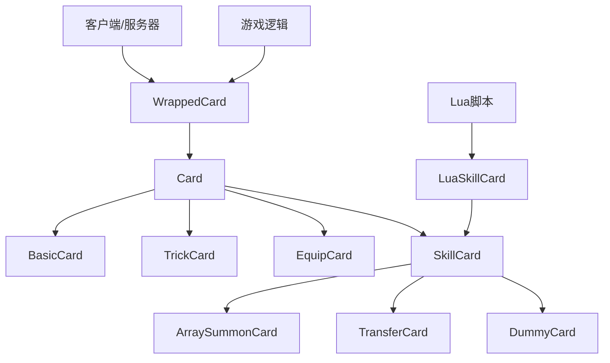
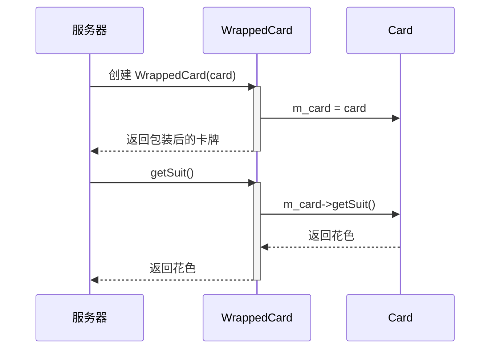
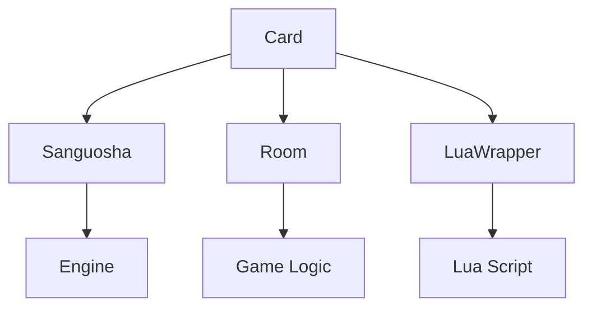

# 卡牌系统API

<cite>
**本文档引用文件**   
- [card.h](file://src/core/card.h)
- [card.cpp](file://src/core/card.cpp)
- [wrappedcard.h](file://src/core/wrappedcard.h)
- [wrappedcard.cpp](file://src/core/wrappedcard.cpp)
- [lua-wrapper.h](file://src/core/lua-wrapper.h)
- [engine.h](file://src/core/engine.h)
- [extension-doc/5-SkillCard.lua](file://extension-doc/5-SkillCard.lua)
</cite>

## 目录
1. [简介](#简介)
2. [项目结构](#项目结构)
3. [核心组件](#核心组件)
4. [架构概述](#架构概述)
5. [详细组件分析](#详细组件分析)
6. [依赖分析](#依赖分析)
7. [性能考虑](#性能考虑)
8. [故障排除指南](#故障排除指南)
9. [结论](#结论)

## 简介
本文档系统化说明了《三国杀》扩展版中的卡牌系统API，重点阐述了Card基类及其子类（BasicCard、TrickCard、EquipCard）的方法契约与状态管理机制。详细描述了卡牌构造、属性设置（花色、点数、目标固定等）、使用逻辑（可用性判断、目标过滤）的实现规范。解释了WrappedCard包装机制在序列化和网络同步中的核心作用。提供了自定义卡牌开发的完整流程示例，涵盖Lua脚本绑定和C++扩展两种方式。记录了卡牌堆叠、重铸、转化等高级特性的接口调用约束和性能开销评估。

## 项目结构
卡牌系统的核心代码位于`src/core`目录下，主要由`card.h`、`card.cpp`、`wrappedcard.h`和`wrappedcard.cpp`四个文件构成。`card.h`定义了卡牌的基类`Card`及其继承体系，包括`SkillCard`等子类。`wrappedcard.h`定义了`WrappedCard`类，用于在游戏房间中对卡牌进行包装和同步。Lua脚本扩展能力通过`extension-doc`目录下的文档和`lua-wrapper.h`提供的接口实现。

```mermaid
graph TB
subgraph "核心模块"
Card[card.h<br/>卡牌基类]
WrappedCard[wrappedcard.h<br/>卡牌包装器]
LuaWrapper[lua-wrapper.h<br/>Lua绑定]
end
subgraph "扩展与配置"
ExtensionDoc[extension-doc<br/>Lua扩展文档]
SkillCardLua[5-SkillCard.lua<br/>技能卡示例]
end
Card --> WrappedCard : "被包装"
LuaWrapper --> Card : "提供扩展接口"
ExtensionDoc --> LuaWrapper : "提供脚本示例"
```

**图示来源**
- [card.h](file://src/core/card.h)
- [wrappedcard.h](file://src/core/wrappedcard.h)
- [lua-wrapper.h](file://src/core/lua-wrapper.h)
- [extension-doc/5-SkillCard.lua](file://extension-doc/5-SkillCard.lua)

**本节来源**
- [card.h](file://src/core/card.h)
- [wrappedcard.h](file://src/core/wrappedcard.h)

## 核心组件
卡牌系统的核心是`Card`类，它是一个继承自`QObject`的基类，定义了所有卡牌共有的属性和行为。`Card`类通过枚举`Suit`（花色）、`Color`（颜色）和`CardType`（卡牌类型）来管理卡牌的基本属性。其构造函数接受花色、点数和是否目标固定作为参数。`Card`类提供了丰富的属性访问器，如`getSuitString()`、`getNumber()`、`isRed()`等，并定义了卡牌使用逻辑的核心方法，如`targetFixed()`、`targetFilter()`和`isAvailable()`。



**图示来源**
- [card.h](file://src/core/card.h#L1-L307)

**本节来源**
- [card.h](file://src/core/card.h#L1-L307)

## 架构概述
卡牌系统的架构采用面向对象设计，以`Card`类为基类，通过继承实现不同类型的卡牌。`WrappedCard`类作为包装器，确保卡牌在服务器和客户端之间的一致性。Lua脚本通过`LuaSkillCard`等类与C++核心进行交互，实现了高度的可扩展性。



**图示来源**
- [card.h](file://src/core/card.h)
- [wrappedcard.h](file://src/core/wrappedcard.h)

## 详细组件分析

### Card基类分析
`Card`类是整个卡牌系统的基础，封装了卡牌的所有核心属性和行为。

#### 属性管理
`Card`类通过私有成员变量`m_suit`、`m_number`、`m_id`等存储卡牌的花色、点数和ID。这些属性通过公共的getter和setter方法进行访问和修改。例如，`getNumber()`方法会根据卡牌是否为虚拟卡牌来决定返回的点数。

**本节来源**
- [card.h](file://src/core/card.h#L1-L307)
- [card.cpp](file://src/core/card.cpp#L1-L799)

#### 使用逻辑
卡牌的使用逻辑由一系列方法控制。`targetFixed()`方法判断卡牌是否目标固定。`targetFilter()`方法用于筛选合法的目标，其默认实现是目标不能是使用者自己且目标列表为空。`isAvailable()`方法判断卡牌对特定玩家是否可用。

**本节来源**
- [card.h](file://src/core/card.h#L1-L307)
- [card.cpp](file://src/core/card.cpp#L1-L799)

### WrappedCard包装机制分析
`WrappedCard`类是卡牌系统在游戏房间中的实际表示，它包装了一个`Card`对象，并负责在服务器和客户端之间同步卡牌状态。

#### 包装与同步
`WrappedCard`通过`takeOver()`方法接管一个`Card`对象，并将其作为内部成员`m_card`。所有对`WrappedCard`的属性访问（如`getSuit()`、`getNumber()`）都会被转发到内部的`m_card`对象。这确保了无论在服务器还是客户端，对同一张卡牌的读取都是一致的。



**图示来源**
- [wrappedcard.h](file://src/core/wrappedcard.h#L1-L313)
- [wrappedcard.cpp](file://src/core/wrappedcard.cpp)

**本节来源**
- [wrappedcard.h](file://src/core/wrappedcard.h#L1-L313)
- [wrappedcard.cpp](file://src/core/wrappedcard.cpp)

#### 状态管理
`WrappedCard`自身也维护一些状态，如`m_isModified`标志，用于标记卡牌是否被修改过。`setModified()`方法可以设置此标志。`isModified()`方法则用于查询该状态。

**本节来源**
- [wrappedcard.h](file://src/core/wrappedcard.h#L1-L313)

### 自定义卡牌开发流程

#### Lua脚本绑定
通过编写Lua脚本，可以定义新的技能卡。`extension-doc/5-SkillCard.lua`文件提供了详细的示例。脚本中定义的卡牌类会被`LuaSkillCard::Parse()`方法解析，并通过`Sanguosha->cloneSkillCard()`在C++层实例化。

**本节来源**
- [extension-doc/5-SkillCard.lua](file://extension-doc/5-SkillCard.lua)
- [card.cpp](file://src/core/card.cpp#L1-L799)

#### C++扩展
开发者可以直接在C++中继承`Card`或`SkillCard`类来创建新卡牌。需要重写`getType()`、`getSubtype()`等纯虚函数，并实现`onUse()`、`onEffect()`等方法来定义卡牌行为。

**本节来源**
- [card.h](file://src/core/card.h#L1-L307)

## 依赖分析
卡牌系统依赖于`engine.h`中的`Sanguosha`单例来获取卡牌实例和技能信息，依赖于`room.h`中的`Room`类来执行游戏逻辑和发送日志。`lua-wrapper.h`提供了与Lua脚本交互的桥梁。



**图示来源**
- [card.h](file://src/core/card.h)
- [engine.h](file://src/core/engine.h)
- [lua-wrapper.h](file://src/core/lua-wrapper.h)

**本节来源**
- [card.h](file://src/core/card.h)
- [engine.h](file://src/core/engine.h)
- [lua-wrapper.h](file://src/core/lua-wrapper.h)

## 性能考虑
`Card::Clone()`方法通过Qt的元对象系统动态创建卡牌实例，虽然灵活但有一定性能开销。`WrappedCard`的设计避免了在同步时频繁序列化整个卡牌对象，提高了网络效率。卡牌的比较函数（如`CompareByNumber`）应谨慎使用，避免在性能敏感的循环中调用。

## 故障排除指南
- **卡牌无法使用**：检查`isAvailable()`方法的实现，确保返回`true`。
- **目标选择异常**：检查`targetFilter()`方法的逻辑，确保符合游戏规则。
- **Lua脚本卡牌不生效**：确认脚本文件路径正确，并在`extension-doc`中正确注册。
- **网络同步问题**：检查`WrappedCard`的`takeOver()`方法是否被正确调用。

**本节来源**
- [card.h](file://src/core/card.h#L1-L307)
- [card.cpp](file://src/core/card.cpp#L1-L799)
- [wrappedcard.h](file://src/core/wrappedcard.h#L1-L313)

## 结论
本文档全面解析了《三国杀》扩展版的卡牌系统API，从`Card`基类的设计到`WrappedCard`的同步机制，再到自定义卡牌的开发流程。该系统设计精良，通过面向对象和包装器模式，实现了功能的灵活性和网络同步的可靠性，为开发者提供了强大的扩展能力。