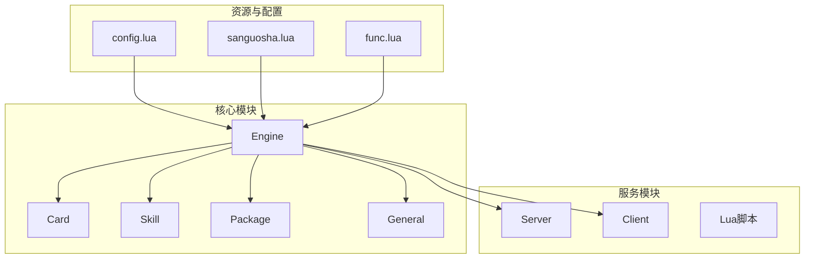
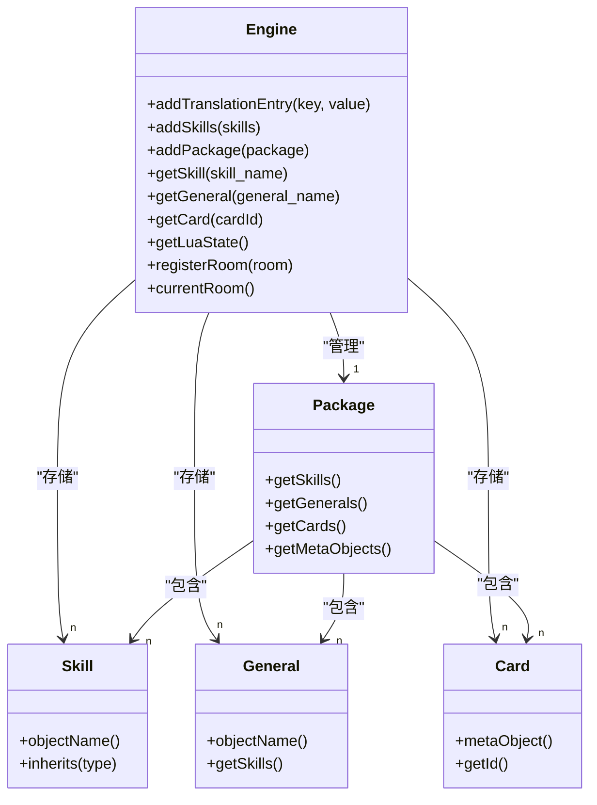
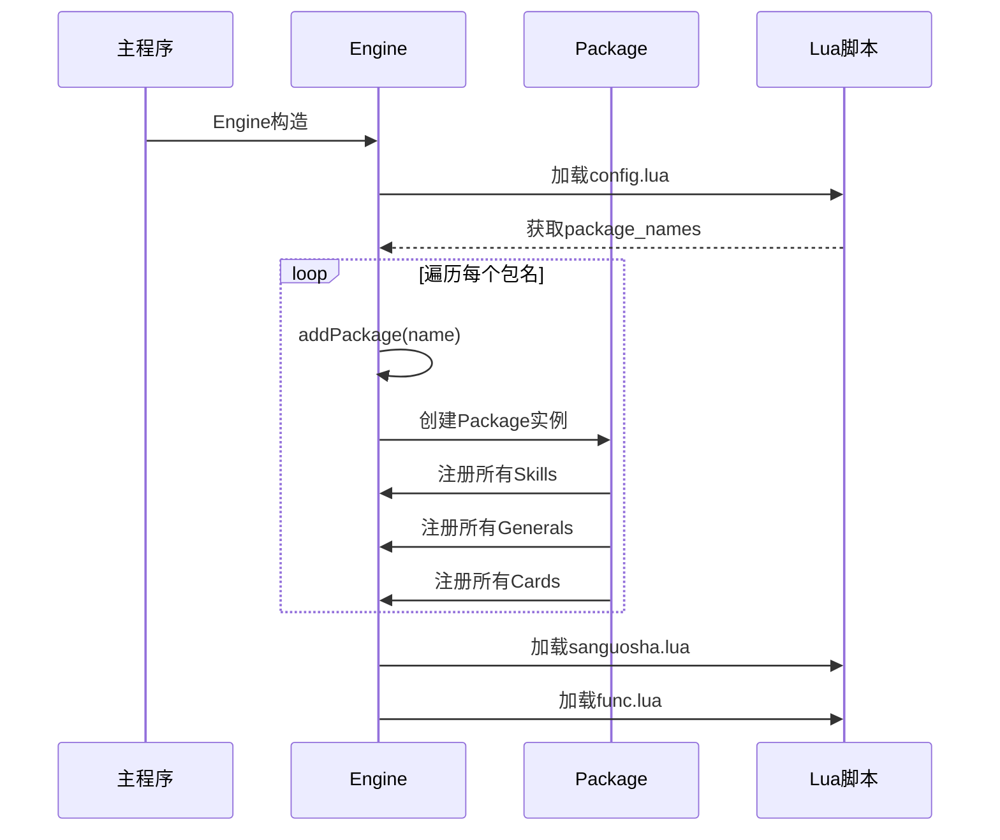
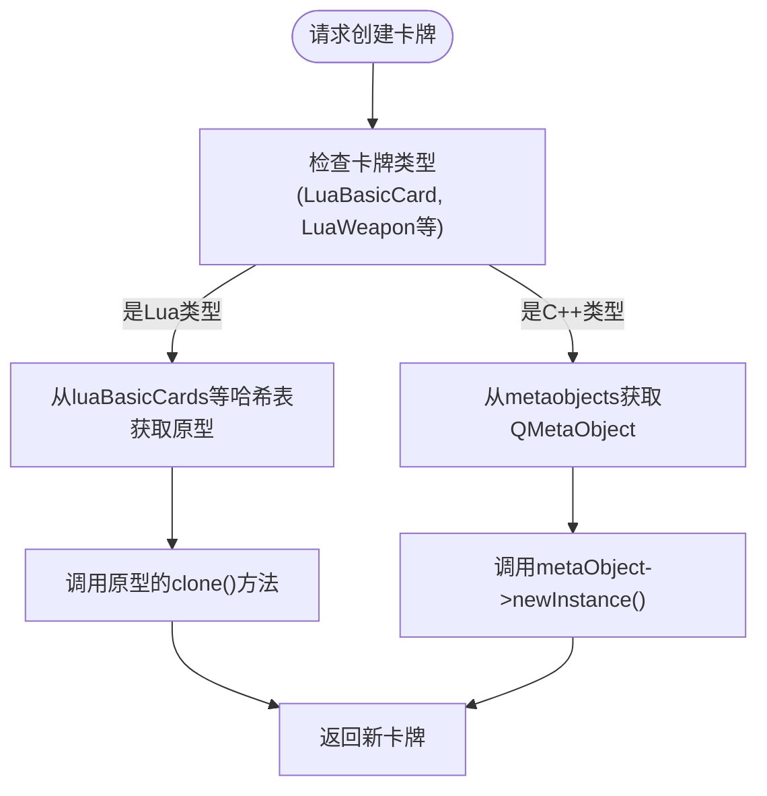
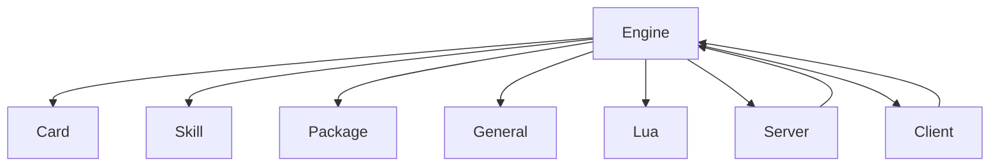

# 引擎核心API

<cite>
**本文档引用的文件**   
- [engine.h](file://src/core/engine.h#L52-L274)
- [engine.cpp](file://src/core/engine.cpp#L81-L130)
</cite>

## 目录
1. [引言](#引言)
2. [项目结构](#项目结构)
3. [核心组件](#核心组件)
4. [架构概述](#架构概述)
5. [详细组件分析](#详细组件分析)
6. [依赖分析](#依赖分析)
7. [性能考虑](#性能考虑)
8. [故障排除指南](#故障排除指南)
9. [结论](#结论)

## 引言
本技术文档旨在深入剖析《三国杀》游戏引擎的核心API，重点阐述Engine单例类的服务注册与发现机制。文档详细说明了addTranslationEntry、addSkills、addObject等注册方法的调用时序与生命周期管理，系统化地文档化了类型元信息管理（TypeCollection）和对象工厂模式（newCard、newPlayer）的实现原理。同时，本文档解释了全局事件总线（getThreadEventBus）的发布订阅模式及其线程安全保证，并通过实战案例展示如何通过Engine接口集成新扩展包，分析其对启动性能的影响。

## 项目结构
该项目采用模块化分层架构，核心逻辑位于`src/core`目录下，UI组件位于`src/ui`，服务器逻辑位于`src/server`，客户端逻辑位于`src/client`。引擎核心`Engine`类作为全局单例，负责协调所有模块。Lua脚本（`lua/`目录）用于定义可扩展的游戏内容，而`extensions`目录则存放独立的扩展包。这种结构实现了核心逻辑与可变内容的分离，支持高度的插件化扩展。

**图示来源**
- [engine.h](file://src/core/engine.h#L52-L274)
- [engine.cpp](file://src/core/engine.cpp#L81-L130)

**本节来源**
- [engine.h](file://src/core/engine.h#L52-L274)

## 核心组件
`Engine`类是整个游戏系统的中枢，它是一个继承自`QObject`的单例类，通过全局指针`Sanguosha`进行访问。该类负责管理所有游戏对象的生命周期，包括武将（General）、技能（Skill）、卡牌（Card）和扩展包（Package）。其核心功能包括对象注册与发现、类型元信息管理、对象工厂、全局事件总线和国际化支持。

**本节来源**
- [engine.h](file://src/core/engine.h#L52-L274)

## 架构概述
`Engine`类的架构围绕服务注册与发现模式构建。在初始化时，它会从Lua配置文件中加载扩展包列表，并通过`addPackage`方法将这些包注册到系统中。每个扩展包会将其包含的武将、技能和卡牌注入到`Engine`的全局哈希表中。`Engine`通过`QHash`和`QList`等容器来管理这些对象，确保高效的查找和遍历。全局事件总线通过`registerRoom`和`currentRoom`方法实现，保证了线程安全。

**图示来源**
- [engine.h](file://src/core/engine.h#L52-L274)
- [engine.cpp](file://src/core/engine.cpp#L81-L130)

## 详细组件分析

### 服务注册与发现机制
`Engine`类提供了`addTranslationEntry`、`addSkills`和`addPackage`等方法，用于将各种服务注册到全局容器中。`addTranslationEntry`将键值对存入`translations`哈希表，实现国际化。`addSkills`方法遍历传入的技能列表，根据技能类型（如`ProhibitSkill`、`DistanceSkill`）将其分类存入不同的`QList`中，实现高效的按类型查询。`addPackage`是核心注册方法，它不仅将包本身加入`packages`列表，还会递归地将包内的所有技能、武将和卡牌注册到`Engine`的全局管理容器中。

**图示来源**
- [engine.cpp](file://src/core/engine.cpp#L81-L130)

**本节来源**
- [engine.h](file://src/core/engine.h#L52-L274)
- [engine.cpp](file://src/core/engine.cpp#L81-L130)

### 类型元信息管理与对象工厂
`Engine`通过`metaobjects`哈希表管理所有可创建对象的元信息（`QMetaObject`）。当一个`Package`被注册时，它会将其包含的每种卡牌的`QMetaObject`（如`LuaBasicCard`、`LuaWeapon`）插入到`metaobjects`中。对象工厂方法`cloneCard`和`cloneSkillCard`利用这些元信息，通过`QMetaObject::newInstance`动态创建对象实例，实现了类型安全的对象创建。

**图示来源**
- [engine.cpp](file://src/core/engine.cpp#L81-L130)

**本节来源**
- [engine.h](file://src/core/engine.h#L52-L274)
- [engine.cpp](file://src/core/engine.cpp#L81-L130)

### 全局事件总线
`Engine`通过`m_rooms`哈希表（`QHash<QThread *, QObject *>`）实现了一个线程安全的全局事件总线。`registerRoom`和`unregisterRoom`方法用于在当前线程注册和注销一个`Room`对象（服务器或客户端）。`currentRoom`和`currentRoomState`方法则通过`QThread::currentThread()`获取当前线程的`Room`，实现了线程局部存储（Thread-Local Storage），确保了多线程环境下对当前游戏状态访问的线程安全。

**本节来源**
- [engine.h](file://src/core/engine.h#L52-L274)
- [engine.cpp](file://src/core/engine.cpp#L81-L130)

## 依赖分析
`Engine`类是整个系统的核心，与几乎所有模块都存在强依赖关系。它直接依赖于`Card`、`Skill`、`Package`、`General`等核心数据模型，并通过`lua_State`与Lua脚本系统深度集成。`Server`和`Client`模块依赖`Engine`来获取游戏规则和对象。这种中心化的架构简化了系统设计，但也使得`Engine`成为关键的性能瓶颈和单点故障。

**图示来源**
- [engine.h](file://src/core/engine.h#L52-L274)

**本节来源**
- [engine.h](file://src/core/engine.h#L52-L274)

## 性能考虑
`Engine`的初始化性能至关重要，因为它在游戏启动时执行。`addPackage`方法的效率直接影响启动速度。建议将不常用的扩展包延迟加载，或合并小包以减少`addPackage`的调用次数。`getCard`和`getGeneral`等查询方法的时间复杂度为O(1)，性能优异。然而，`getRandomGenerals`等涉及随机筛选的方法在武将数量庞大时可能成为性能瓶颈，应考虑优化其算法。

## 故障排除指南
- **问题：注册技能时出现重复警告**
  - **原因**：`addSkills`方法检测到同名技能。
  - **解决方案**：检查扩展包代码，确保技能`objectName`的唯一性。
- **问题：无法通过`getCard`获取卡牌**
  - **原因**：目标卡牌未被正确注册到`Engine`的`cards`列表中。
  - **解决方案**：确认包含该卡牌的`Package`已通过`addPackage`成功注册。
- **问题：多线程环境下`currentRoom`返回空指针**
  - **原因**：当前线程未调用`registerRoom`进行注册。
  - **解决方案**：确保在使用`currentRoom`前，已在该线程调用了`registerRoom`。

**本节来源**
- [engine.h](file://src/core/engine.h#L52-L274)
- [engine.cpp](file://src/core/engine.cpp#L81-L130)

## 结论
`Engine`单例类是《三国杀》游戏引擎的基石，它通过精巧的服务注册与发现机制、类型元信息管理和线程安全的事件总线，构建了一个高度可扩展且稳定的核心框架。理解其内部工作原理对于进行深度插件开发和性能优化至关重要。未来的改进方向可以包括引入更复杂的依赖注入容器和优化启动时的资源加载策略。