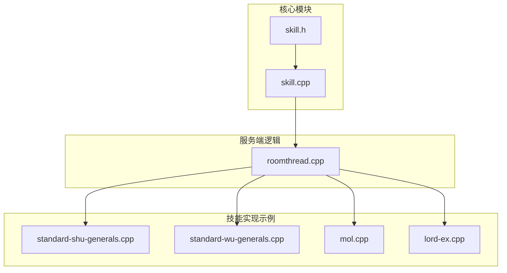
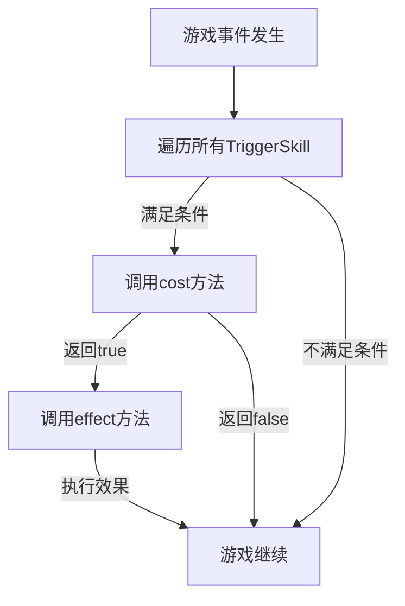
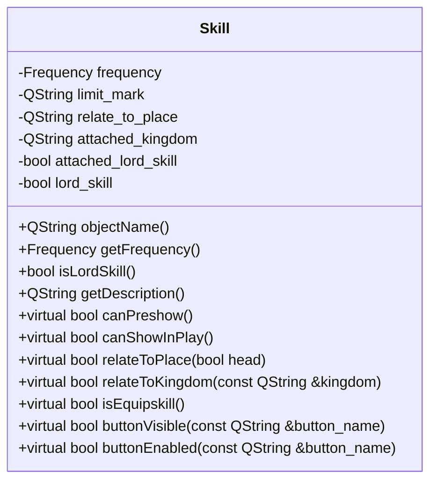
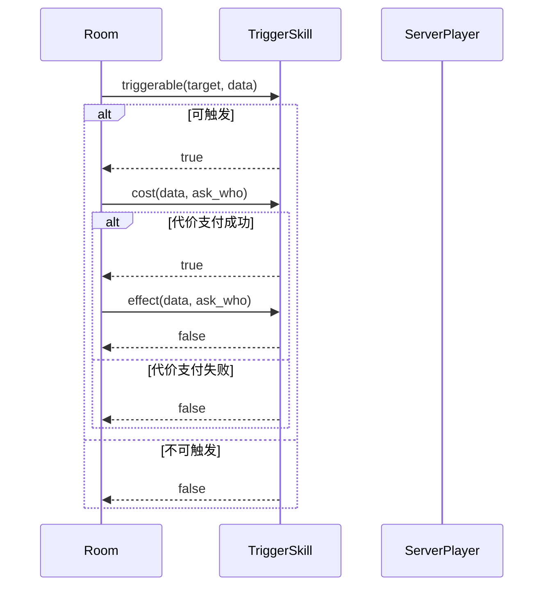
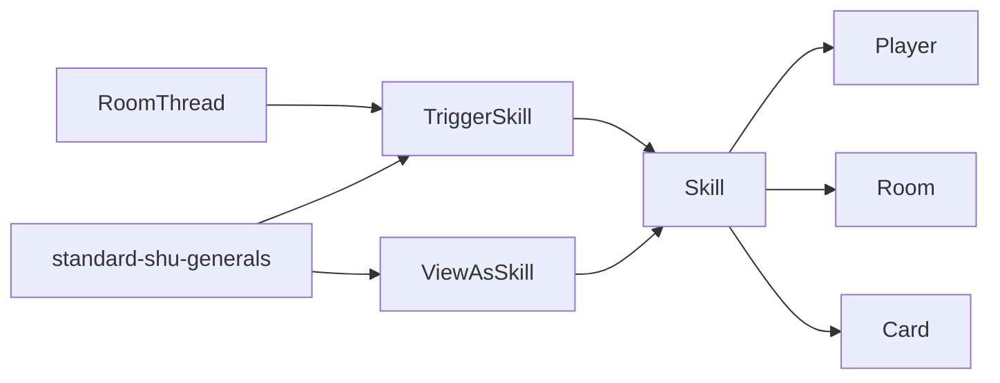

# 技能系统API

<cite>
**本文档中引用的文件**  
- [skill.h](file://src/core/skill.h#L1-L509)
- [skill.cpp](file://src/core/skill.cpp#L1-L1020)
- [roomthread.cpp](file://src/server/roomthread.cpp#L233-L613)
- [standard-shu-generals.cpp](file://src/package/standard-shu-generals.cpp#L1251-L1294)
- [standard-wu-generals.cpp](file://src/package/standard-wu-generals.cpp#L552-L586)
- [mol.cpp](file://src/package/mol.cpp#L1669-L1710)
- [lord-ex.cpp](file://src/package/lord-ex.cpp#L2409-L2430)
- [player.cpp](file://src/core/player.cpp#L1446-L1481)
</cite>

## 目录
1. [简介](#简介)
2. [项目结构](#项目结构)
3. [核心组件](#核心组件)
4. [架构概览](#架构概览)
5. [详细组件分析](#详细组件分析)
6. [依赖分析](#依赖分析)
7. [性能考量](#性能考量)
8. [故障排除指南](#故障排除指南)
9. [结论](#结论)

## 简介
本技术文档全面解析《三国杀》扩展版中的技能系统API，重点围绕`skill.h`头文件中定义的`Skill`基类及其派生类（如`TriggerSkill`、`ViewAsSkill`等）的接口设计。文档详细阐述了技能触发机制、事件绑定模式、注册流程以及C++与Lua两种扩展方式的实现差异。通过分析核心代码逻辑与调用流程，为开发者提供完整的技能系统参考，涵盖线程安全约束、典型调用堆栈及常见错误解决方案。

## 项目结构
技能系统的核心代码位于`src/core`目录下，主要由`skill.h`和`skill.cpp`构成。`skill.h`定义了技能类的继承体系，`skill.cpp`实现了具体逻辑。技能的触发与执行流程由`src/server/roomthread.cpp`中的游戏主循环驱动。此外，`src/package`目录下的各武将包文件（如`standard-shu-generals.cpp`）提供了大量技能实现的实例。



**图示来源**
- [skill.h](file://src/core/skill.h#L1-L509)
- [skill.cpp](file://src/core/skill.cpp#L1-L1020)
- [roomthread.cpp](file://src/server/roomthread.cpp#L233-L613)

**章节来源**
- [skill.h](file://src/core/skill.h#L1-L509)
- [skill.cpp](file://src/core/skill.cpp#L1-L1020)

## 核心组件
技能系统的核心是`Skill`类及其丰富的派生类族。`Skill`作为所有技能的基类，定义了技能的通用属性和行为。`TriggerSkill`和`ViewAsSkill`是两个最重要的抽象派生类，分别代表被动触发技能和卡牌转化技能。`Player`类通过`getTriggerSkills()`方法获取其拥有的所有触发技能，而`Sanguosha`全局对象负责技能的注册与管理。

**章节来源**
- [skill.h](file://src/core/skill.h#L1-L509)
- [player.cpp](file://src/core/player.cpp#L1446-L1481)

## 架构概览
技能系统采用基于事件的观察者模式。当游戏内发生特定事件（如出牌、受伤、阶段变更）时，`RoomThread`会遍历所有注册的`TriggerSkill`，调用其`triggerable`方法进行条件判断。若条件满足，则进入`cost`和`effect`方法执行技能效果。`ViewAsSkill`则在卡牌使用阶段被调用，通过`viewFilter`和`viewAs`方法实现卡牌的虚拟转化。



**图示来源**
- [skill.h](file://src/core/skill.h#L1-L509)
- [skill.cpp](file://src/core/skill.cpp#L1-L1020)
- [roomthread.cpp](file://src/server/roomthread.cpp#L233-L613)

## 详细组件分析
### Skill基类分析
`Skill`类是所有技能的抽象基类，通过`QObject`实现元对象系统，支持信号与槽机制。它定义了技能名称、频率、是否为主公技等基本属性。



**图示来源**
- [skill.h](file://src/core/skill.h#L1-L509)

**章节来源**
- [skill.h](file://src/core/skill.h#L1-L509)

### TriggerSkill派生类分析
`TriggerSkill`是处理被动触发技能的核心类。它通过`events`成员变量绑定一个或多个`TriggerEvent`，并在事件发生时被激活。

#### 调用时机与参数规范
- **triggerable**: 事件发生时立即调用，用于判断技能是否可以触发。参数`target`是事件的直接目标玩家。返回`true`表示技能可触发。
- **cost**: 在`triggerable`返回`true`后调用，用于执行技能发动的代价（如询问玩家是否发动）。参数`data`包含事件相关的数据（如`DamageStruct`）。返回`true`表示代价已支付，技能将进入`effect`阶段。
- **effect**: 在`cost`返回`true`后调用，用于执行技能的实际效果。参数与`cost`相同。返回`true`表示技能效果已完全执行，通常用于需要中断后续流程的技能。



**图示来源**
- [skill.h](file://src/core/skill.h#L1-L509)
- [skill.cpp](file://src/core/skill.cpp#L568-L603)

**章节来源**
- [skill.h](file://src/core/skill.h#L1-L509)
- [skill.cpp](file://src/core/skill.cpp#L568-L603)

### ViewAsSkill派生类分析
`ViewAsSkill`用于实现“视为”类技能，允许玩家将手牌组合视为另一张牌使用或打出。

#### 调用时机与参数规范
- **viewFilter**: 在玩家选择卡牌时被调用，判断某张卡牌是否可以被选中参与转化。参数`selected`是已选中的卡牌列表，`to_select`是当前尝试选择的卡牌。
- **viewAs**: 在玩家完成卡牌选择后被调用，根据选中的卡牌列表生成一张新的虚拟卡牌。返回的`Card`指针指向新创建的卡牌。

```cpp
// 示例：OneCardViewAsSkill的viewFilter实现
bool OneCardViewAsSkill::viewFilter(const QList<const Card *> &selected, const Card *to_select) const {
    return selected.isEmpty() && !to_select->hasFlag("using") && viewFilter(to_select);
}
```

**章节来源**
- [skill.h](file://src/core/skill.h#L1-L509)
- [skill.cpp](file://src/core/skill.cpp#L300-L320)

### 技能注册与事件绑定
技能通过`Sanguosha`全局对象进行注册。`TriggerSkill`的事件绑定通过在构造函数中向`events`列表添加`TriggerEvent`枚举值来完成。

```cpp
// 示例：PhaseChangeSkill的构造函数
PhaseChangeSkill::PhaseChangeSkill(const QString &name)
    : TriggerSkill(name)
{
    events << EventPhaseStart; // 绑定到阶段开始事件
}
```

**章节来源**
- [skill.h](file://src/core/skill.h#L1-L509)
- [skill.cpp](file://src/core/skill.cpp#L670-L675)

### C++与Lua扩展方式对比
- **C++扩展**: 性能最优，可直接访问底层API，适合复杂逻辑。需要重新编译。
- **Lua扩展**: 开发效率高，热更新方便，适合简单技能。性能略低，受限于Lua API暴露程度。

**章节来源**
- [skill.h](file://src/core/skill.h#L1-L509)
- [extension-doc](file://extension-doc)

### 线程安全性
技能系统的`triggerable`、`cost`、`effect`等核心方法**仅限主线程调用**。游戏逻辑运行在单线程的`RoomThread`中，确保了状态的一致性。任何在子线程中尝试修改游戏状态的行为都是不安全的。

**章节来源**
- [roomthread.cpp](file://src/server/roomthread.cpp#L233-L613)

### 典型调用堆栈
```
RoomThread::triggerEvent()
└── TriggerSkill::triggerable()
    └── (具体技能实现，如Zaiqi::triggerable())
└── TriggerSkill::cost()
    └── (具体技能实现，如Huoshou::cost())
└── TriggerSkill::effect()
    └── (具体技能实现，如Huoshou::effect())
```

**章节来源**
- [roomthread.cpp](file://src/server/roomthread.cpp#L233-L613)

## 依赖分析
技能系统高度依赖`Player`、`Room`和`Card`等核心类。`TriggerSkill`的执行流程由`RoomThread`驱动，`ViewAsSkill`的卡牌转化依赖于`Card`类的克隆机制。各武将包（如`standard-shu-generals`）依赖核心技能系统来定义具体技能。



**图示来源**
- [skill.h](file://src/core/skill.h#L1-L509)
- [roomthread.cpp](file://src/server/roomthread.cpp#L233-L613)

**章节来源**
- [skill.h](file://src/core/skill.h#L1-L509)
- [roomthread.cpp](file://src/server/roomthread.cpp#L233-L613)

## 性能考量
- **优先级机制**: `TriggerSkill`通过`getDynamicPriority()`方法支持动态优先级，避免了不必要的条件判断，优化了事件处理流程。
- **哈希缓存**: `Skill::getSources()`方法使用`skinSourceHash`缓存皮肤音效路径，减少重复的文件系统查询。
- **稳定排序**: `roomthread.cpp`中使用`qStableSort`对触发技能进行排序，保证了相同优先级技能的触发顺序一致性。

**章节来源**
- [skill.h](file://src/core/skill.h#L1-L509)
- [skill.cpp](file://src/core/skill.cpp#L1-L1020)
- [roomthread.cpp](file://src/server/roomthread.cpp#L233-L613)

## 故障排除指南
### 事件响应顺序错乱
**问题**: 多个技能应按特定顺序触发，但实际顺序不符。
**解决方案**: 使用`insertPriority()`方法为`TriggerEvent`设置不同的优先级值。优先级数值越大，触发越早。

```cpp
// 示例：为技能设置高优先级
void MySkill::onInstall(ServerPlayer *player) {
    insertPriority(Damaged, 5.0); // 高于默认的3.0
}
```

**章节来源**
- [skill.h](file://src/core/skill.h#L1-L509)
- [skill.cpp](file://src/core/skill.cpp#L600-L602)

### cost回调未处理
**问题**: `cost`方法中未正确处理玩家的响应，导致技能无法正常发动。
**解决方案**: 确保`cost`方法中调用`askForSkillInvoke()`并根据返回值决定是否继续。对于主公技等强制技能，可直接返回`true`。

```cpp
// 示例：正确的cost实现
bool Huoshou::cost(TriggerEvent, Room *room, ServerPlayer *, QVariant &, ServerPlayer *ask_who) const {
    bool invoke = ask_who->hasShownSkill(this) ? true : ask_who->askForSkillInvoke(this);
    if (invoke) {
        room->broadcastSkillInvoke(objectName(), 2, ask_who);
        return true; // 代价支付成功
    }
    return false; // 代价支付失败，技能终止
}
```

**章节来源**
- [standard-shu-generals.cpp](file://src/package/standard-shu-generals.cpp#L1251-L1294)
- [standard-wu-generals.cpp](file://src/package/standard-wu-generals.cpp#L552-L586)

## 结论
本技能系统API设计精巧，通过`Skill`基类和`TriggerSkill`、`ViewAsSkill`等派生类构建了一个灵活且可扩展的技能框架。事件驱动的架构确保了技能逻辑的解耦，而C++与Lua的双支持模式兼顾了性能与开发效率。开发者应严格遵守线程安全约束，并善用优先级机制和`cost`/`effect`分离的设计模式来实现复杂技能。通过分析提供的代码实例，可以快速掌握技能开发的核心要点。