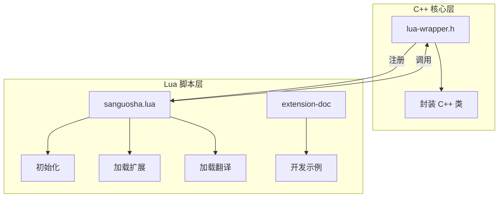
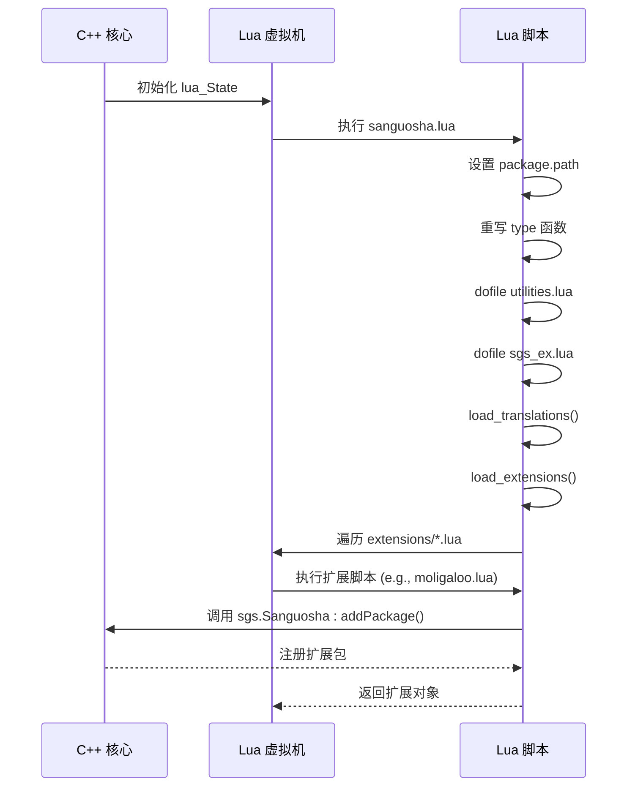
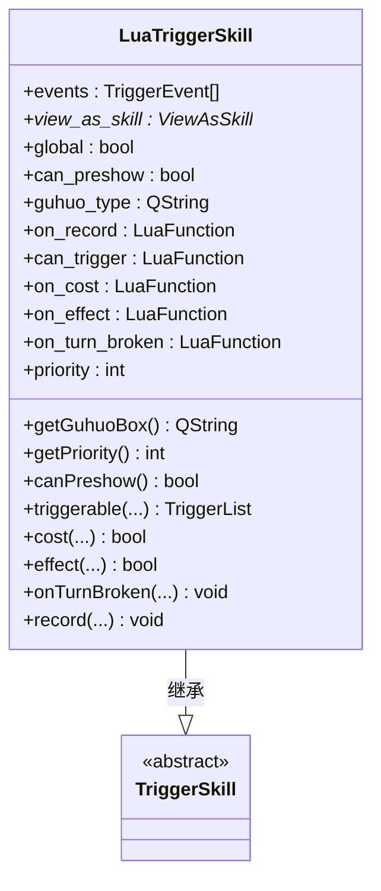
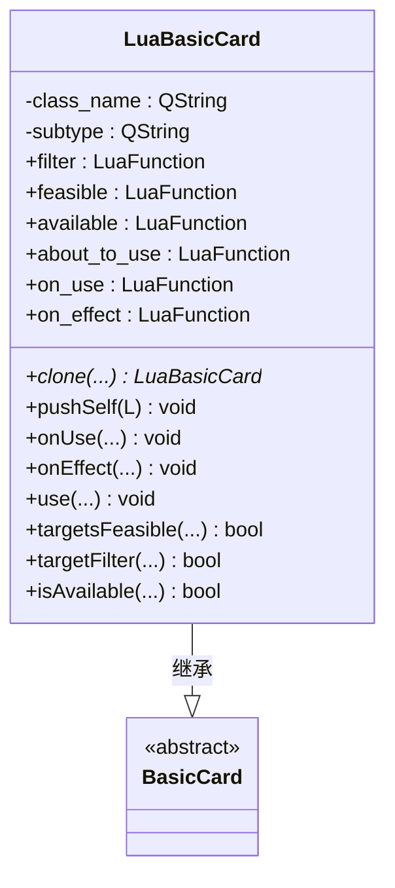
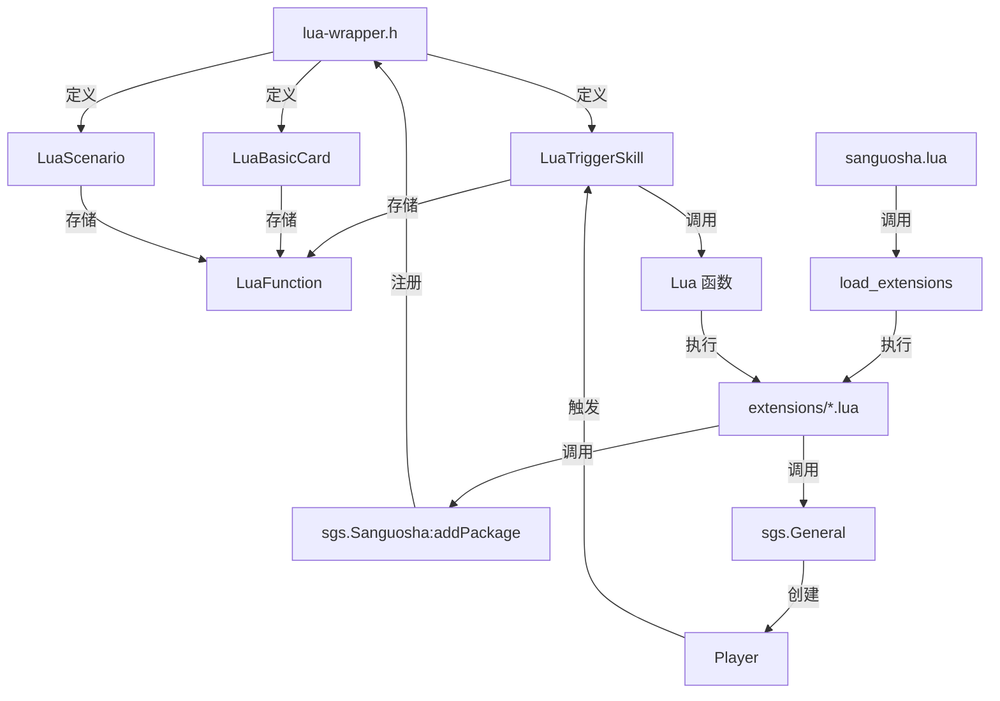

# Lua互操作性

<cite>
**本文档引用的文件**
- [lua-wrapper.h](file://src/core/lua-wrapper.h#L1-L625)
- [sanguosha.lua](file://lua/sanguosha.lua#L1-L126)
- [1-Start.lua](file://extension-doc/1-Start.lua#L1-L53)
</cite>

## 目录
1. [简介](#简介)
2. [项目结构](#项目结构)
3. [核心组件](#核心组件)
4. [架构概览](#架构概览)
5. [详细组件分析](#详细组件分析)
6. [依赖分析](#依赖分析)
7. [性能考量](#性能考量)
8. [故障排除指南](#故障排除指南)
9. [结论](#结论)

## 简介
本文档旨在构建《三国杀》项目中Lua与C++互操作机制的权威指南。重点分析`lua-wrapper.h`中定义的C++类如何通过Lua包装器暴露给脚本层，以及`sanguosha.lua`中如何初始化和加载扩展包。通过`extension-doc`中的示例，展示Lua脚本如何定义和注册自定义武将、技能和卡牌。文档涵盖类型转换、生命周期管理、异常处理等关键议题，为开发者提供完整的Lua扩展开发参考。

## 项目结构
项目采用分层架构，将C++核心逻辑与Lua脚本层分离。C++代码位于`src`目录下，其中`src/core`包含核心游戏逻辑和Lua包装器。Lua脚本位于`lua`目录，负责游戏初始化、翻译加载和扩展包管理。`extension-doc`目录提供了详细的Lua扩展开发示例。



**图示来源**
- [lua-wrapper.h](file://src/core/lua-wrapper.h#L1-L625)
- [sanguosha.lua](file://lua/sanguosha.lua#L1-L126)

**本节来源**
- [lua-wrapper.h](file://src/core/lua-wrapper.h#L1-L625)
- [sanguosha.lua](file://lua/sanguosha.lua#L1-L126)

## 核心组件
核心组件是`lua-wrapper.h`中定义的一系列以`Lua`为前缀的C++类，它们继承自游戏引擎的基类（如`TriggerSkill`, `ViewAsSkill`, `Card`等），并为Lua脚本提供回调接口。这些类通过`LuaFunction`类型的成员变量存储Lua函数引用，从而在特定游戏事件触发时调用Lua脚本中的逻辑。

例如，`LuaTriggerSkill`类允许在C++中定义一个触发技能，并将`on_record`, `can_trigger`, `on_cost`, `on_effect`等事件的处理逻辑委托给Lua函数。这实现了游戏核心逻辑与扩展逻辑的解耦。

**本节来源**
- [lua-wrapper.h](file://src/core/lua-wrapper.h#L1-L625)

## 架构概览
系统的互操作架构基于C++的Lua包装器模式。C++层通过`lua_State`指针与Lua虚拟机交互。`lua-wrapper.h`中的每个`LuaXXX`类都包含一个`pushSelf`方法，用于将C++对象以`userdata`的形式压入Lua栈，并设置其元表，从而允许Lua脚本调用C++对象的方法。

Lua层通过`sanguosha.lua`进行初始化，该脚本设置`package.path`以加载辅助库，并重写`type`函数以支持C++对象的类型识别。随后，它加载翻译文件并调用`load_extensions`函数，该函数遍历`extensions`目录下的Lua文件，执行它们并注册返回的扩展包。



**图示来源**
- [lua-wrapper.h](file://src/core/lua-wrapper.h#L1-L625)
- [sanguosha.lua](file://lua/sanguosha.lua#L1-L126)

## 详细组件分析
### Lua包装类分析
`lua-wrapper.h`中定义的类为C++对象提供了标准化的Lua接口。这些类通常包含一个或多个`LuaFunction`成员变量，用于存储Lua回调函数的引用。

#### Lua触发技能类
`LuaTriggerSkill`是触发技能的包装类，它将C++的`TriggerSkill`接口暴露给Lua。



**图示来源**
- [lua-wrapper.h](file://src/core/lua-wrapper.h#L1-L625)

**本节来源**
- [lua-wrapper.h](file://src/core/lua-wrapper.h#L1-L625)

#### Lua卡牌类
`LuaBasicCard`, `LuaTrickCard`, `LuaWeapon`等类为不同类型的卡牌提供了Lua接口。它们通过`clone`方法和`pushSelf`方法实现对象的复制和向Lua栈的推送。



**图示来源**
- [lua-wrapper.h](file://src/core/lua-wrapper.h#L1-L625)

**本节来源**
- [lua-wrapper.h](file://src/core/lua-wrapper.h#L1-L625)

### Lua脚本初始化分析
`sanguosha.lua`是Lua脚本的入口点，负责初始化环境和加载资源。

#### 类型重写机制
脚本重写了`type`函数，使其能够识别C++对象的类型。当`type`函数接收到一个`userdata`时，它会检查其元表中的`.type`字段，如果存在则返回该类型名，否则返回`userdata`。

```lua
local old_type = type

type = function(object)
    local t = old_type(object)
    if t == "userdata" then
        local meta = getmetatable(object)
        if meta and meta[".type"] then
            return meta[".type"]
        else
            return t
        end
    else
        return t
    end
end
```

此机制允许Lua脚本使用`type(obj)`来判断一个对象是`Player`、`Card`还是其他C++类型。

#### 扩展包加载流程
`load_extensions`函数负责加载`extensions`目录下的所有Lua文件。它使用`dofile`执行每个脚本文件，期望脚本返回一个或多个扩展对象（如`Package`或`LuaScenario`），然后通过`sgs.Sanguosha:addPackage()`或`addScenario()`方法将其注册到游戏核心。

```lua
function load_extensions()
    local scripts = sgs.GetFileNames("extensions")
    for _, script in ipairs(scripts) do
        if script:match(".+%.lua$") then
            local extensions = dofile("./extensions/" .. script)
            -- ... 处理返回的扩展对象
        end
    end
end
```

**本节来源**
- [sanguosha.lua](file://lua/sanguosha.lua#L1-L126)

### 扩展开发示例分析
`extension-doc/1-Start.lua`提供了一个创建自定义武将和技能的完整示例。

#### 创建扩展包
首先，创建一个`Package`对象，指定其名称和类型。

```lua
extension = sgs.Package("moligaloo", sgs.Package_GeneralPack)
```

#### 创建武将
使用`sgs.General`构造函数创建一个武将对象，指定其所属扩展包、姓名和势力。

```lua
shiqian = sgs.General(extension, "shiqian", "qun") 
```

#### 创建技能
使用`sgs.CreateOneCardViewAsSkill`创建一个“观星”类技能，它允许玩家将一张梅花手牌当作【顺手牵羊】使用。

```lua
shentou = sgs.CreateOneCardViewAsSkill{ 
    name = "shentou",
    filter_pattern = ".|club|.|hand" ,
    view_as = function(self, card)
        local new_card = sgs.Sanguosha:cloneCard("snatch", sgs.Card_SuitToBeDecided, -1)
        new_card:addSubcard(card:getId())
        new_card:setSkillName(self:objectName())
        return new_card
    end
}
```

#### 注册技能
将创建的技能添加到武将对象上。

```lua
shiqian:addSkill(shentou) 
```

#### 添加翻译
使用`sgs.LoadTranslationTable`函数为包名、技能名和技能描述提供中文翻译。

```lua
sgs.LoadTranslationTable{
    ["moligaloo"] = "太阳神上" ,
    ["shentou"] = "神偷",
    [":shentou"] = "你可以将一张梅花手牌当做【顺手牵羊】使用。",
}
```

**本节来源**
- [extension-doc/1-Start.lua](file://extension-doc/1-Start.lua#L1-L53)

## 依赖分析
系统的主要依赖关系体现在C++核心与Lua脚本层之间的双向调用。



**图示来源**
- [lua-wrapper.h](file://src/core/lua-wrapper.h#L1-L625)
- [sanguosha.lua](file://lua/sanguosha.lua#L1-L126)

**本节来源**
- [lua-wrapper.h](file://src/core/lua-wrapper.h#L1-L625)
- [sanguosha.lua](file://lua/sanguosha.lua#L1-L126)

## 性能考量
*   **函数调用开销**：C++与Lua之间的函数调用存在一定的性能开销。应避免在性能敏感的循环中频繁进行跨语言调用。
*   **对象生命周期**：Lua脚本创建的C++对象（如`Package`, `General`）由C++核心管理其生命周期。确保在Lua中正确引用这些对象，防止过早被Lua垃圾回收器回收。
*   **内存管理**：`LuaFunction`本质上是Lua虚拟机中函数的引用。确保在C++对象销毁时正确清理这些引用，防止内存泄漏。

## 故障排除指南
*   **脚本无法加载**：检查`extensions`目录下的Lua文件语法是否正确，`dofile`是否会抛出异常。确保返回的对象是有效的`Package`或`LuaScenario`实例。
*   **技能不触发**：确认`LuaTriggerSkill`的`addEvent`是否正确添加了触发事件。检查Lua回调函数（如`can_trigger`）的返回值是否符合预期。
*   **类型识别失败**：如果`type(obj)`返回`userdata`而非预期的类型名，请检查该C++类的元表是否正确设置了`.type`字段。
*   **翻译未生效**：确保`sgs.LoadTranslationTable`调用在`load_translations`之后执行，或者确保翻译键值对的格式正确。

## 结论
`lua-wrapper.h`和`sanguosha.lua`共同构成了一个强大且灵活的Lua扩展系统。通过精心设计的包装类，C++核心逻辑能够安全地将控制权交给Lua脚本，实现了游戏功能的高度可扩展性。开发者可以遵循`extension-doc`中的示例，轻松创建自定义的武将、技能和卡牌，极大地丰富了游戏内容。理解这一互操作机制是进行深度二次开发的关键。