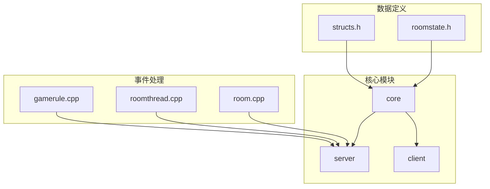
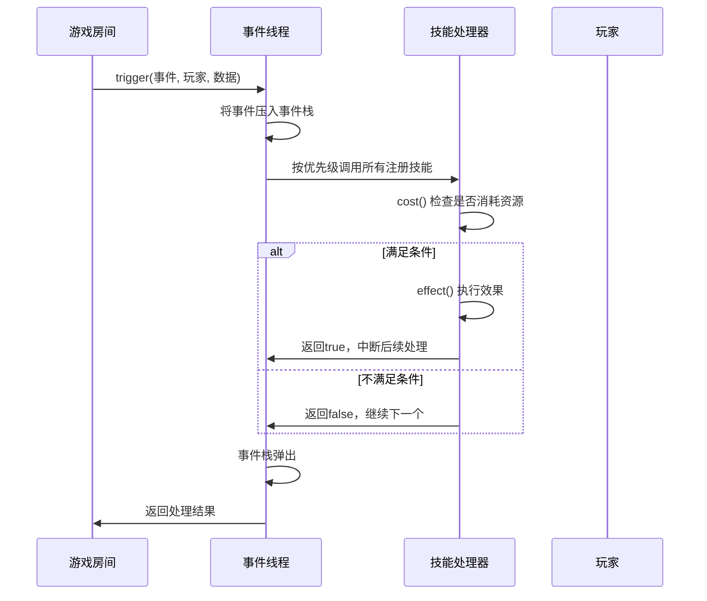
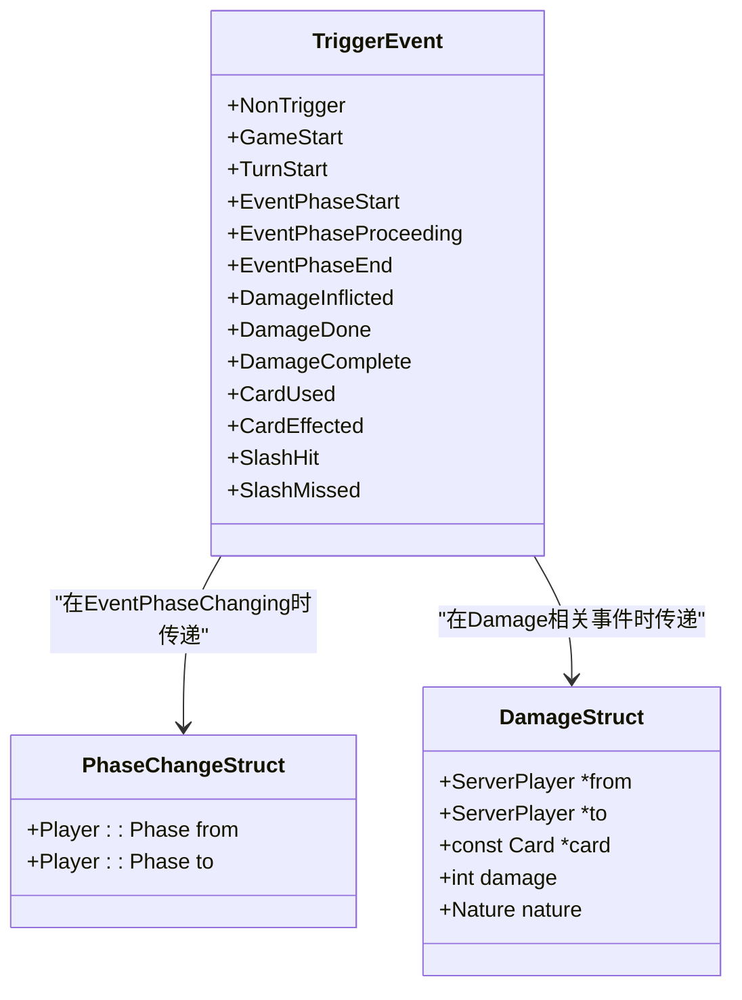
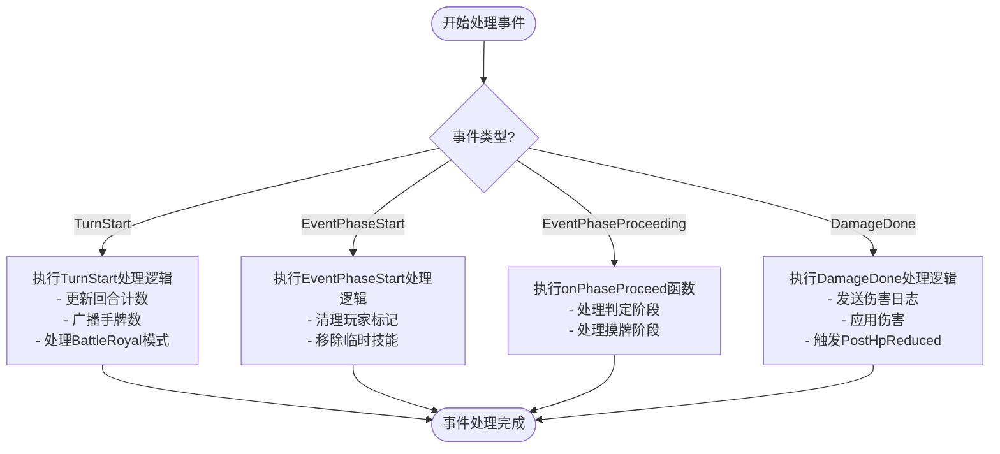
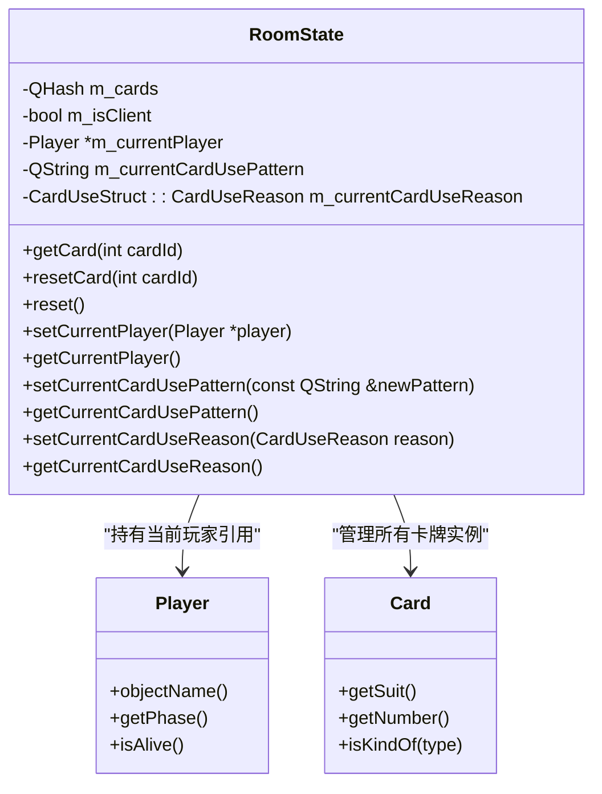
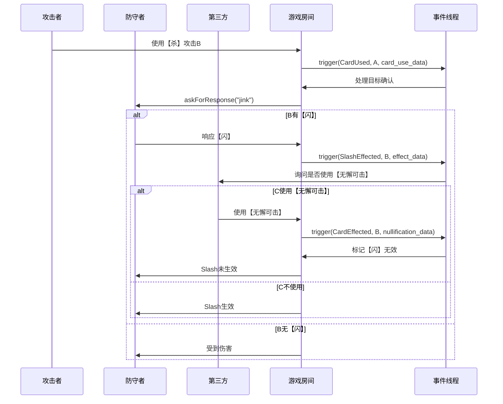
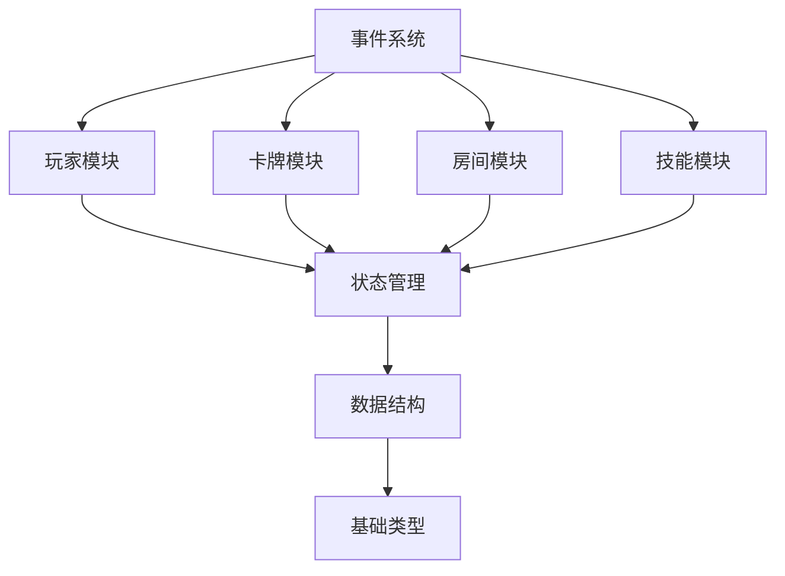

# 事件系统

<cite>
**本文档中引用的文件**   
- [structs.h](file://src/core/structs.h#L530-L569)
- [gamerule.cpp](file://src/server/gamerule.cpp#L423-L460)
- [roomstate.h](file://src/core/roomstate.h#L0-L101)
- [roomstate.cpp](file://src/core/roomstate.cpp#L0-L65)
- [roomthread.cpp](file://src/server/roomthread.cpp#L637-L683)
- [room.cpp](file://src/server/room.cpp#L1060-L1157)
</cite>

## 目录
1. [引言](#引言)
2. [项目结构](#项目结构)
3. [核心组件](#核心组件)
4. [架构概述](#架构概述)
5. [详细组件分析](#详细组件分析)
6. [依赖分析](#依赖分析)
7. [性能考虑](#性能考虑)
8. [故障排除指南](#故障排除指南)
9. [结论](#结论)

## 引言
本文档深入解析了《三国杀》游戏引擎中的事件驱动架构设计与实现。重点分析了事件系统的核心机制，包括事件的定义、触发、传播、处理优先级以及状态管理。文档详细说明了`Skill`类中事件枚举的触发时机、`gamerule.cpp`中的事件处理器注册与执行逻辑、`roomstate.h`中的游戏状态与事件的映射关系。同时，提供了事件监听、拦截和取消的编程范式，并通过典型事件链分析了系统的处理流程。

## 项目结构
项目采用分层模块化设计，核心逻辑集中在`src`目录下。`core`模块定义了基础数据结构和通用功能，`server`模块负责游戏逻辑和事件处理，`client`模块处理用户交互。事件系统的核心文件分布在`src/core`和`src/server`目录中，通过C++和Lua脚本协同工作。



**图示来源**
- [structs.h](file://src/core/structs.h#L0-L686)
- [roomstate.h](file://src/core/roomstate.h#L0-L101)
- [gamerule.cpp](file://src/server/gamerule.cpp#L0-L799)

## 核心组件
事件系统的核心由三个部分构成：事件定义、事件处理器和状态管理器。`structs.h`中的`TriggerEvent`枚举定义了所有可能的游戏事件，`gamerule.cpp`实现了全局游戏规则的事件处理器，`roomstate.h`则负责维护游戏房间的当前状态。

**组件来源**
- [structs.h](file://src/core/structs.h#L530-L569)
- [gamerule.cpp](file://src/server/gamerule.cpp#L423-L460)
- [roomstate.h](file://src/core/roomstate.h#L0-L101)

## 架构概述
事件系统采用观察者模式和责任链模式相结合的设计。当游戏状态发生变化时，会触发相应的事件。系统会遍历所有注册了该事件的技能（`TriggerSkill`），并根据其优先级进行排序，然后依次调用其处理逻辑。



**图示来源**
- [roomthread.cpp](file://src/server/roomthread.cpp#L637-L683)
- [gamerule.cpp](file://src/server/gamerule.cpp#L423-L460)

## 详细组件分析

### 事件定义与枚举
`TriggerEvent`枚举在`structs.h`中定义，涵盖了游戏生命周期的各个阶段。每个事件都有明确的触发时机，确保了游戏逻辑的精确控制。



**图示来源**
- [structs.h](file://src/core/structs.h#L530-L569)

**组件来源**
- [structs.h](file://src/core/structs.h#L530-L569)

### 事件处理器注册与优先级
`gamerule.cpp`中的`GameRule`类注册了多个核心事件处理器。每个处理器通过`events`列表声明其监听的事件类型，并通过`getPriority()`方法定义其执行优先级。



**图示来源**
- [gamerule.cpp](file://src/server/gamerule.cpp#L423-L460)

**组件来源**
- [gamerule.cpp](file://src/server/gamerule.cpp#L423-L460)

### 游戏状态与事件映射
`roomstate.h`中的`RoomState`类是游戏状态的单例管理器，它维护了当前玩家、当前卡牌使用模式等关键信息，为事件处理提供了上下文环境。



**图示来源**
- [roomstate.h](file://src/core/roomstate.h#L0-L101)
- [roomstate.cpp](file://src/core/roomstate.cpp#L0-L65)

**组件来源**
- [roomstate.h](file://src/core/roomstate.h#L0-L101)
- [roomstate.cpp](file://src/core/roomstate.cpp#L0-L65)

### 事件监听与拦截编程范式
事件系统提供了灵活的监听和拦截机制。技能通过继承`TriggerSkill`并重写`triggerable`、`cost`和`effect`方法来实现事件响应。

```cpp
// 示例：一个典型的触发技能实现
class MySkill : public TriggerSkill {
public:
    MySkill() : TriggerSkill("my_skill") {
        events << DamageInflicted << SlashMissed; // 监听两个事件
    }

    virtual QStringList triggerable(TriggerEvent event, Room *room, ServerPlayer *player, QVariant &data, ServerPlayer* &) const {
        if (player == NULL || !player->isAlive()) return QStringList();
        
        // 根据不同事件类型进行判断
        if (event == DamageInflicted) {
            DamageStruct damage = data.value<DamageStruct>();
            if (damage.from && damage.from->getHp() > damage.to->getHp()) {
                return QStringList(objectName());
            }
        } else if (event == SlashMissed) {
            SlashEffectStruct effect = data.value<SlashEffectStruct>();
            if (effect.from && effect.from->hasSkill("another_skill")) {
                return QStringList(objectName());
            }
        }
        return QStringList();
    }

    virtual bool cost(TriggerEvent, Room *room, ServerPlayer *player, QVariant &data, ServerPlayer *) const {
        return room->askForSkillInvoke(player, objectName(), data);
    }

    virtual bool effect(TriggerEvent event, Room *room, ServerPlayer *player, QVariant &data, ServerPlayer *) const {
        if (event == DamageInflicted) {
            DamageStruct &damage = data.value<DamageStruct>();
            damage.damage--; // 拦截并修改伤害值
            room->sendLog("#MySkillReduceDamage", player, QString::number(damage.damage));
        } else if (event == SlashMissed) {
            // 执行其他效果
            room->doAnimation("effect", player);
        }
        return false; // 继续传播事件
    }
};
```

**组件来源**
- [gamerule.cpp](file://src/server/gamerule.cpp#L423-L460)

### 典型事件链处理流程
以【杀】→【闪】→【无懈可击】这一经典事件链为例，分析系统的处理流程。



**图示来源**
- [room.cpp](file://src/server/room.cpp#L1060-L1157)
- [gamerule.cpp](file://src/server/gamerule.cpp#L423-L460)

**组件来源**
- [room.cpp](file://src/server/room.cpp#L1060-L1157)

## 依赖分析
事件系统依赖于多个核心模块，形成了紧密的耦合关系。



**图示来源**
- [structs.h](file://src/core/structs.h#L530-L569)
- [roomstate.h](file://src/core/roomstate.h#L0-L101)

## 性能考虑
事件系统在设计时充分考虑了性能因素。通过事件栈管理避免了递归调用导致的栈溢出，通过优先级排序确保了关键规则的优先执行。同时，系统提供了`tryPause()`机制来处理异步操作，保证了游戏的流畅性。

## 故障排除指南
当事件系统出现异常时，可按以下步骤进行排查：
1. 检查事件是否被正确注册到`events`列表中。
2. 验证`triggerable`方法的条件判断逻辑是否正确。
3. 确认`cost`和`effect`方法的返回值是否符合预期。
4. 查看事件栈是否出现异常增长，防止死循环。
5. 检查技能优先级设置是否合理，避免关键事件被低优先级事件阻塞。

**组件来源**
- [roomthread.cpp](file://src/server/roomthread.cpp#L637-L683)
- [gamerule.cpp](file://src/server/gamerule.cpp#L423-L460)

## 结论
本文档全面解析了《三国杀》游戏引擎的事件系统，展示了其精巧的设计和强大的功能。该系统通过清晰的事件定义、灵活的处理器注册机制和高效的状态管理，为复杂的游戏逻辑提供了坚实的基础。理解这一系统对于开发新技能和扩展游戏功能至关重要。