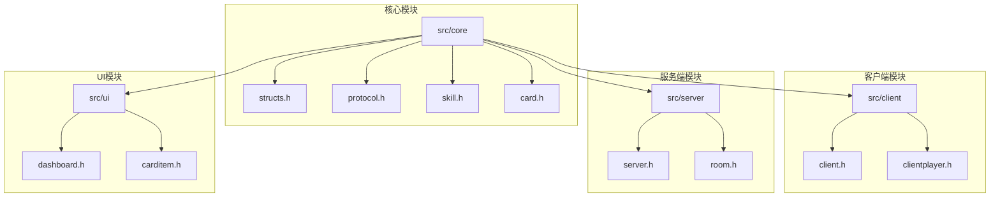
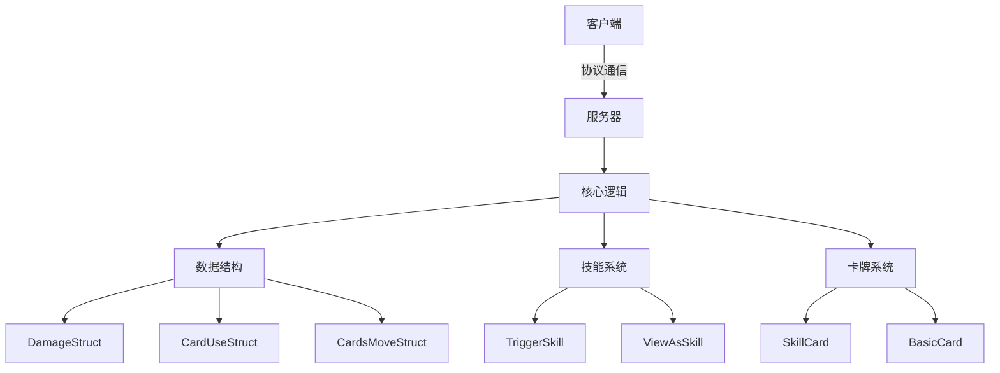
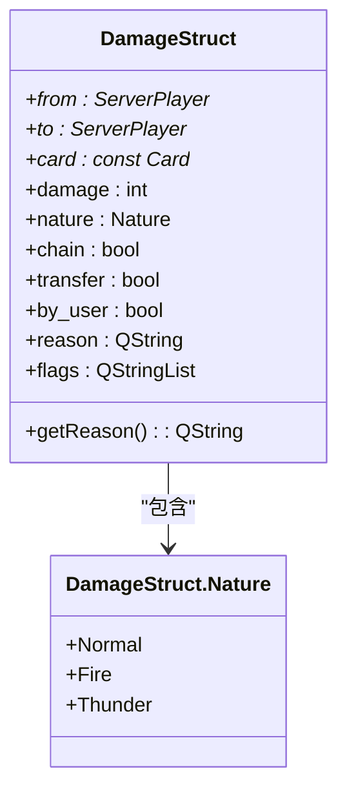
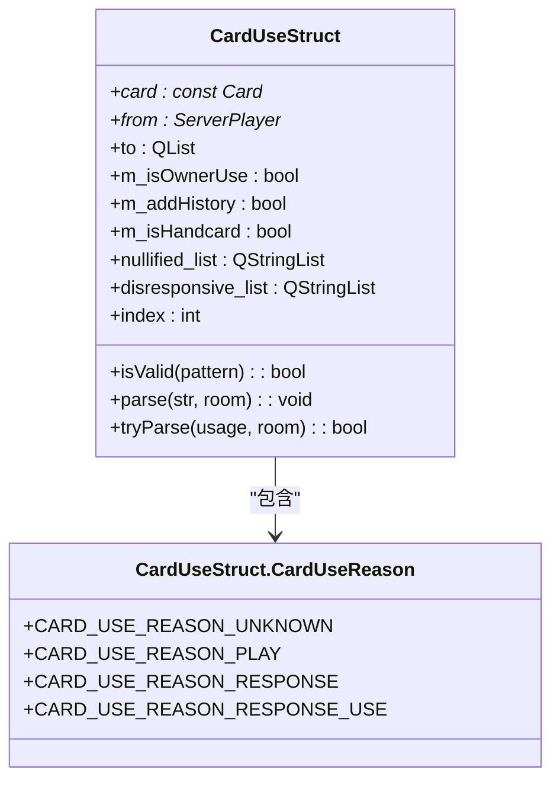
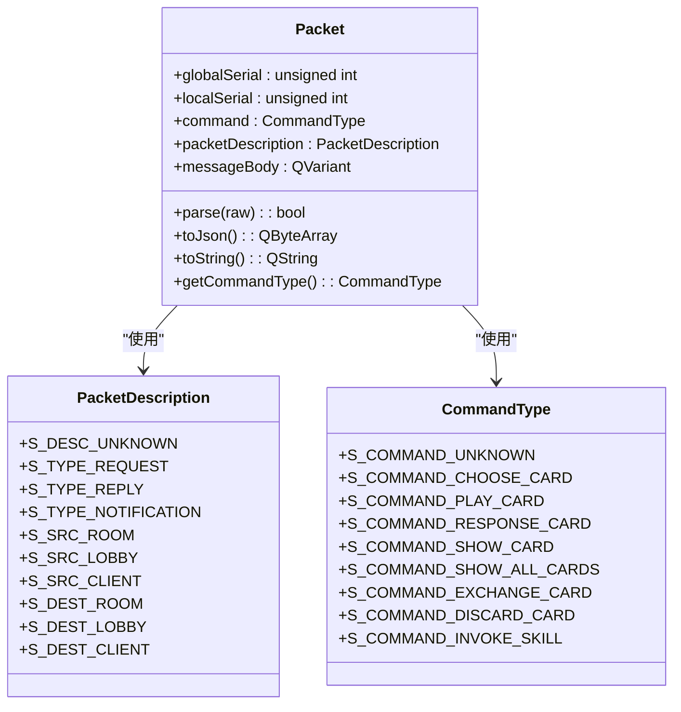
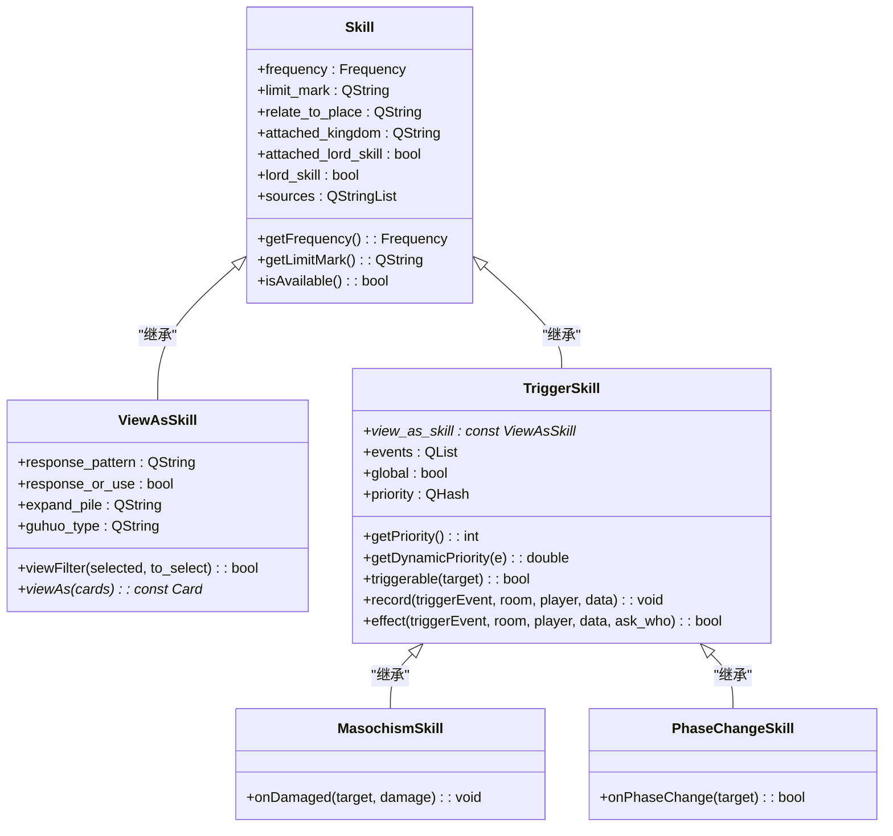
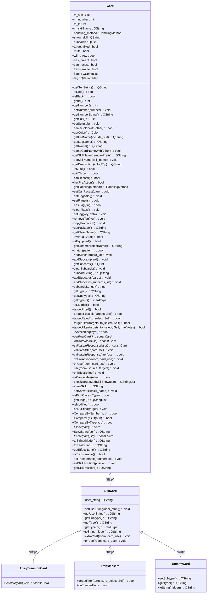
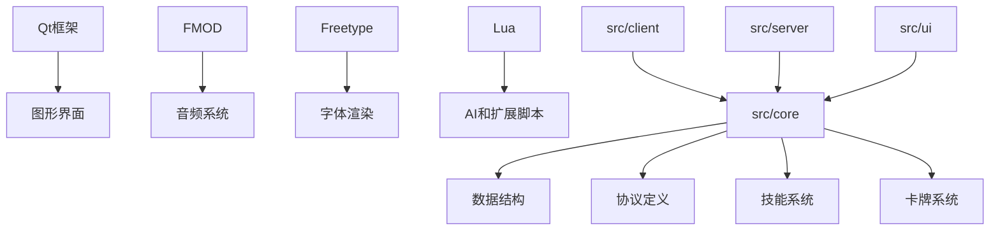

# 技术参考

<cite>
**本文档中引用的文件**   
- [structs.h](file://src/core/structs.h)
- [protocol.h](file://src/core/protocol.h)
- [skill.h](file://src/core/skill.h)
- [card.h](file://src/core/card.h)
- [main.cpp](file://src/main.cpp)
</cite>

## 目录
1. [简介](#简介)
2. [项目结构](#项目结构)
3. [核心组件](#核心组件)
4. [架构概览](#架构概览)
5. [详细组件分析](#详细组件分析)
6. [依赖分析](#依赖分析)
7. [性能考虑](#性能考虑)
8. [故障排除指南](#故障排除指南)
9. [结论](#结论)

## 简介
《三国杀》是一款流行的桌面和在线游戏，该项目旨在克隆《三国杀》的在线版本。整个项目使用C++编写，采用Qt的图形视图框架作为游戏引擎。该项目支持多种扩展包，并使用Lua作为AI和扩展脚本语言。游戏具备完整的功能包、键盘快捷键、双击使用卡牌、卡牌排序等操作体验特性，并具有良好的可扩展性。

## 项目结构
项目采用分层架构设计，主要分为客户端、服务端、核心逻辑、UI界面、资源文件等模块。核心逻辑位于src/core目录下，包含游戏的核心数据结构、协议定义、技能系统和卡牌系统。

**图示来源**
- [structs.h](file://src/core/structs.h)
- [protocol.h](file://src/core/protocol.h)
- [skill.h](file://src/core/skill.h)
- [card.h](file://src/core/card.h)

**本节来源**
- [README.md](file://README.md)

## 核心组件
核心组件主要包括数据结构定义、网络协议、技能系统和卡牌系统。这些组件构成了游戏的基础框架，负责处理游戏状态、玩家交互、技能触发和卡牌效果等核心功能。

**本节来源**
- [structs.h](file://src/core/structs.h)
- [protocol.h](file://src/core/protocol.h)

## 架构概览
系统采用客户端-服务器架构，通过自定义协议进行通信。核心数据结构定义了游戏中的各种事件和状态，技能系统采用面向对象的设计模式，卡牌系统则通过继承机制实现不同类型卡牌的功能。

**图示来源**
- [structs.h](file://src/core/structs.h)
- [skill.h](file://src/core/skill.h)
- [card.h](file://src/core/card.h)

## 详细组件分析

### 数据结构分析
核心数据结构定义了游戏中的各种事件和状态，包括伤害结构、卡牌使用结构、卡牌移动结构等。

#### DamageStruct 分析

**图示来源**
- [structs.h](file://src/core/structs.h#L10-L50)

**本节来源**
- [structs.h](file://src/core/structs.h#L10-L100)

#### CardUseStruct 分析

**图示来源**
- [structs.h](file://src/core/structs.h#L150-L200)

**本节来源**
- [structs.h](file://src/core/structs.h#L150-L250)

### 协议分析
网络协议定义了客户端与服务器之间的通信格式和命令类型。

#### 协议结构分析

**图示来源**
- [protocol.h](file://src/core/protocol.h#L50-L100)

**本节来源**
- [protocol.h](file://src/core/protocol.h#L50-L150)

### 技能系统分析
技能系统采用面向对象的设计模式，通过继承实现不同类型的技能。

#### 技能类继承体系

**图示来源**
- [skill.h](file://src/core/skill.h#L50-L100)

**本节来源**
- [skill.h](file://src/core/skill.h#L50-L200)

### 卡牌系统分析
卡牌系统通过继承机制实现不同类型卡牌的功能。

#### 卡牌类继承体系

**图示来源**
- [card.h](file://src/core/card.h#L50-L100)

**本节来源**
- [card.h](file://src/core/card.h#L50-L200)

## 依赖分析
项目依赖于Qt框架、FMOD音频引擎、Freetype字体渲染库和Lua脚本语言。核心模块之间存在明确的依赖关系，客户端和服务端通过核心逻辑模块进行交互。

**图示来源**
- [README.md](file://README.md)
- [src/core/structs.h](file://src/core/structs.h)

**本节来源**
- [README.md](file://README.md)

## 性能考虑
项目在设计时考虑了性能优化，采用轻量级的数据结构和高效的算法。卡牌移动和技能触发等频繁操作都经过优化，确保游戏运行流畅。

## 故障排除指南
常见问题包括编译错误、运行时崩溃和网络连接问题。建议检查依赖库版本、配置文件路径和网络设置。

**本节来源**
- [README.md](file://README.md)

## 结论
该项目是一个功能完整的《三国杀》在线游戏实现，采用模块化设计，具有良好的可扩展性和维护性。核心组件设计合理，代码结构清晰，适合进一步开发和定制。